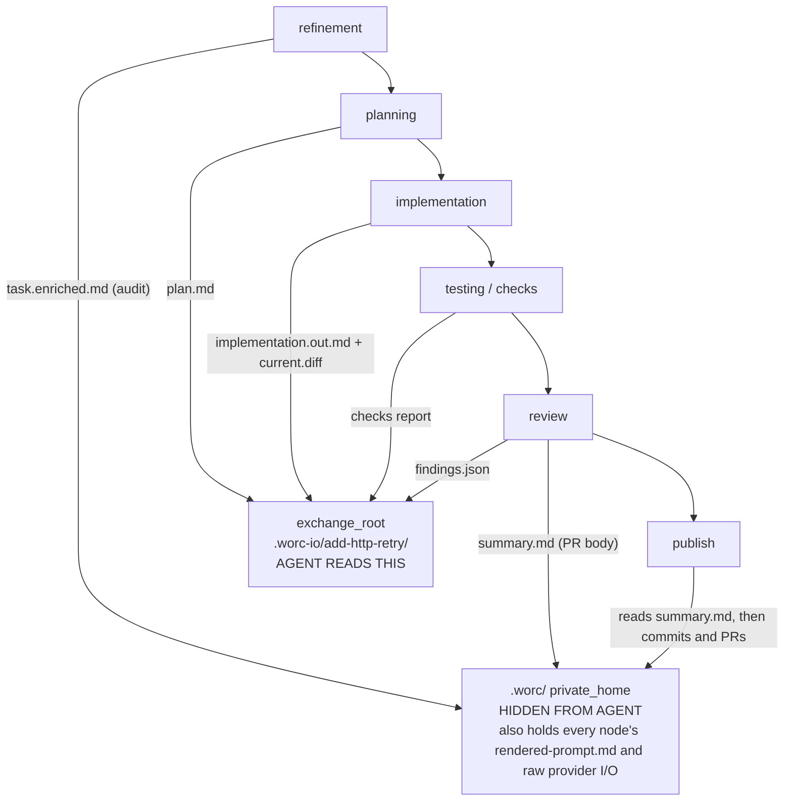
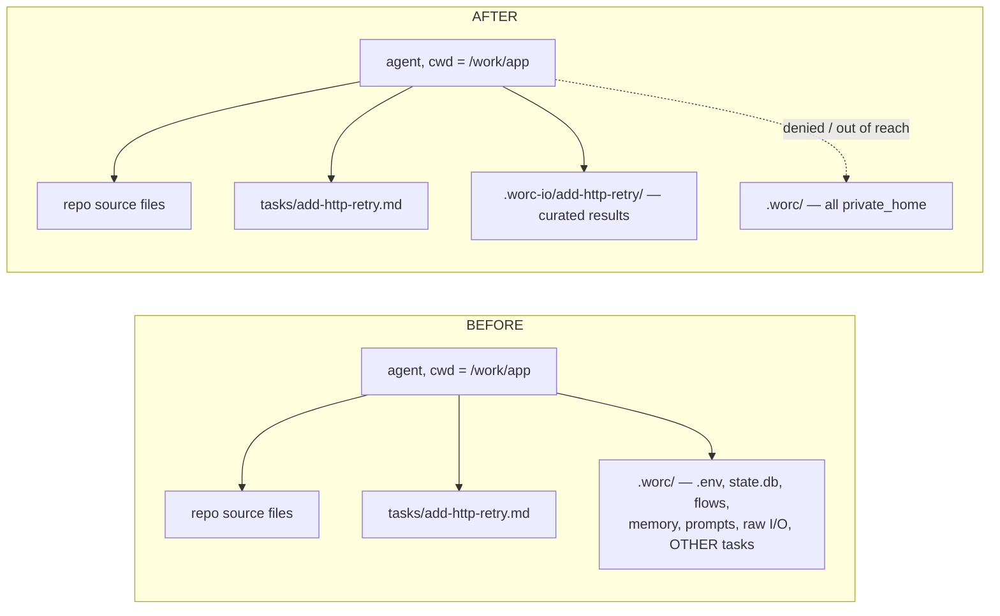
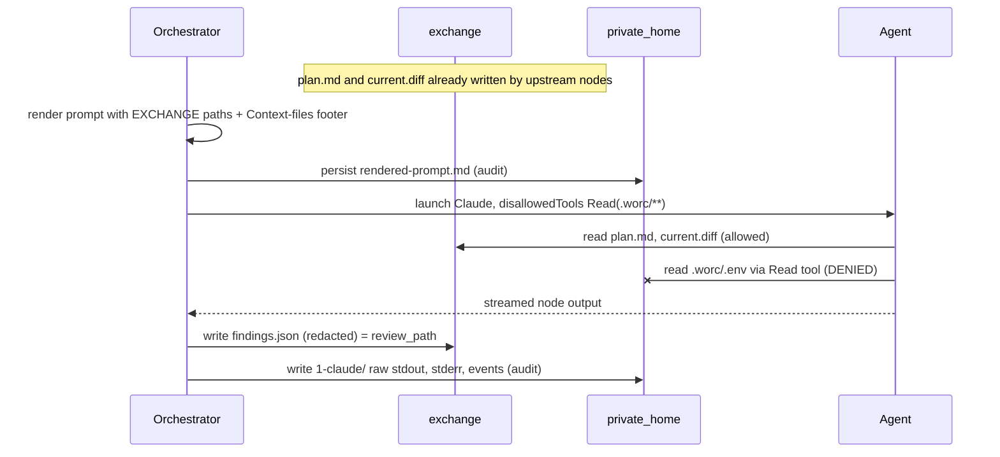

# Happy path — worked example (before / after)

Companion to the [decision record](README.md). This traces **one** task run end to end under the two-root design so every concrete change is visible, and verifies that the agent still receives every input it needs while the private home becomes unreachable. All paths, node ids and file names below are concrete.

## Example setup

| Thing | Value |
| --- | --- |
| Repo working tree (agent `cwd`) | `/work/app` |
| Task id | `add-http-retry` |
| Task branch | `worc/add-http-retry` |
| Task file (tracked, outside both homes) | `/work/app/tasks/add-http-retry.md` |
| Flow | packaged `implementation`: refinement → planning → implementation → testing → review → fixing → publish |
| `implementation` provider | `codex` (`workspace-write`) |
| `review` provider | `claude` (read-only profile) |
| **`private_home`** (today) | `/work/app/.worc/` |
| **`exchange_root`** (new) | `/work/app/.worc-io/add-http-retry/` |

Happy path = no rework: `review` passes, so `fixing` is skipped and `publish` runs.

## The node sequence and where each output goes

| Node | Reads (path variables) | Produces | Agent-facing copy → `exchange` | Audit/secret copy → `private_home` |
| --- | --- | --- | --- | --- |
| refinement | `{task_path}` | `task.enriched.md` (audit-only slot, no variable) | — | `task.enriched.md` |
| planning | `{task_path}` | `plan.md` (`output_artifact: plan`) | `plan.md` | rendered prompt + raw provider I/O |
| implementation | `{task_path}`, `{plan_path}`, `{memory_path}` | edits + `implementation.out.md` + `current.diff` | `implementation.out.md`, `current.diff` | rendered prompt + raw provider I/O |
| testing / checks | `{diff_path}` | checks report | `checks/…` report | check logs, raw I/O |
| review | `{task_path}`, `{plan_path}`, `{diff_path}`, `{memory_path}` | `findings.json` + evaluator `summary.md` | `findings.json` (`{review_path}`) | rendered prompt + raw provider I/O |
| publish | (orchestrator-only; no agent) | commit / push / PR from `summary.md` | — | `summary.md`, `summary.json` (PR body) |

Rule of thumb: **only the artifacts a downstream node is pointed at by a `{…_path}` variable go to `exchange`; everything else — rendered prompts, prompt-audit, raw provider streams, the PR-body summary, and all the standing stores — stays in `private_home`.**



## Before / after — the on-disk artifact tree for this run

**BEFORE** — one tree; the agent (its `cwd` is `/work/app`) can read all of it:

```
/work/app/
├── tasks/add-http-retry.md                       # tracked, {task_path}
└── .worc/                                         # gitignored — but fully readable by the agent
    ├── .env                                       # real tokens
    ├── state.db                                   # state + raw session ids + unredacted findings
    ├── flows/implementation/roles/*.md            # system prompts (own + other nodes')
    ├── memory/…                                   # cross-task memory store
    └── logs/add-http-retry/
        ├── task.enriched.md
        ├── plan.md                                # {plan_path}
        ├── summary.md  summary.json               # PR body
        ├── checks/run-000004.log                  # {checks_path}
        ├── prompt-audit/…                         # full prompts
        └── stages/
            ├── planning/run-000002/{rendered-prompt.md, 1-codex/…}
            ├── implementation/run-000003/
            │   ├── implementation.out.md          # {implementation_path}
            │   ├── current.diff                   # {diff_path}
            │   ├── rendered-prompt.md
            │   └── 1-codex/{request.json,stdout.log,stderr.log,events.jsonl,result.json}
            └── review/run-000005/
                ├── findings.json                  # {review_path}
                ├── summary.md
                ├── rendered-prompt.md
                └── 1-claude/…
```

**AFTER** — the same run, split across two roots. The agent-facing files move to `.worc-io/`; the audit/secret files stay in `.worc/`. Note that `run-000003/` now exists in **both** trees:

```
/work/app/
├── tasks/add-http-retry.md                       # tracked, {task_path} — UNCHANGED
│
├── .worc-io/add-http-retry/                       # NEW gitignored root — the ONLY ".worc*" the agent reads
│   ├── plan.md                                    # {plan_path}
│   ├── checks/run-000004.log                      # {checks_path}
│   ├── memory/implementation.md                   # {memory_path} — retrieval packet only (redacted)
│   └── stages/
│       ├── implementation/run-000003/
│       │   ├── implementation.out.md              # {implementation_path}
│       │   └── current.diff                       # {diff_path}
│       └── review/run-000005/
│           └── findings.json                      # {review_path}
│
└── .worc/                                         # private_home — DENIED / unreachable to the agent
    ├── .env  state.db  flows/  memory/  security-reports/
    └── logs/add-http-retry/
        ├── task.enriched.md
        ├── summary.md  summary.json               # PR body (orchestrator reads it, not the agent)
        ├── prompt-audit/…
        └── stages/
            ├── planning/run-000002/{rendered-prompt.md, 1-codex/…}
            ├── implementation/run-000003/{rendered-prompt.md, 1-codex/…}
            └── review/run-000005/{rendered-prompt.md, 1-claude/…}
```

The audit trail is **not weakened**: `rendered-prompt.md`, `prompt-audit/`, the `1-codex/` / `1-claude/` raw streams, `state.db` and the PR-body `summary.md` are all still written — they just stop being agent-readable.

## Before / after — the paths handed to the agent

Nothing about _how_ context is delivered changes: the orchestrator still injects **paths**, never inlined content (the path-only prompt invariant holds). Only the destination flips from `.worc/logs/` to `.worc-io/`.

| Variable | BEFORE | AFTER |
| --- | --- | --- |
| `{task_path}` | `/work/app/tasks/add-http-retry.md` | _unchanged_ |
| `{plan_path}` | `.worc/logs/add-http-retry/plan.md` | `.worc-io/add-http-retry/plan.md` |
| `{diff_path}` | `.worc/logs/add-http-retry/stages/implementation/run-000003/current.diff` | `.worc-io/add-http-retry/stages/implementation/run-000003/current.diff` |
| `{checks_path}` | `.worc/logs/add-http-retry/checks/run-000004.log` | `.worc-io/add-http-retry/checks/run-000004.log` |
| `{implementation_path}` | `.worc/logs/add-http-retry/stages/implementation/run-000003/implementation.out.md` | `.worc-io/add-http-retry/stages/implementation/run-000003/implementation.out.md` |
| `{review_path}` | `.worc/logs/add-http-retry/stages/review/run-000005/findings.json` | `.worc-io/add-http-retry/stages/review/run-000005/findings.json` |
| `{memory_path}` | packet under `.worc/…` | `.worc-io/add-http-retry/memory/<node>.md` (packet only; the `memory/` **store** stays private) |

Concrete "Context files" footer the `review` node's prompt ends with:

```diff
  Context files (read them as needed; do not assume their contents):
  - task: /work/app/tasks/add-http-retry.md
- - plan: /work/app/.worc/logs/add-http-retry/plan.md
- - diff: /work/app/.worc/logs/add-http-retry/stages/implementation/run-000003/current.diff
+ - plan: /work/app/.worc-io/add-http-retry/plan.md
+ - diff: /work/app/.worc-io/add-http-retry/stages/implementation/run-000003/current.diff
```

## Before / after — the provider invocation

**`review` on Claude.** A dedicated internal deny of the private home is appended to `--disallowedTools` (it is _not_ routed through the overloaded `security.denied_read_paths`). The exchange lives at `.worc-io/`, a sibling path, so the `.worc` deny glob does not touch it.

```diff
  claude -p --output-format stream-json --verbose \
    --permission-mode default \
    --allowedTools Read,Glob,Grep \
-   --disallowedTools "Read(.env),Read(secrets/**),Read(~/.claude/**),Write(~/.claude/**),Edit(~/.claude/**)"
+   --disallowedTools "Read(.env),Read(secrets/**),Read(.worc),Read(.worc/**),Read(~/.claude/**),Write(~/.claude/**),Edit(~/.claude/**)"
```

**`implementation` on Codex.** Phase 1 cannot enforce a per-path read deny (Codex's OS sandbox governs writes/network, not reads), so the argv is **unchanged** — the isolation in Phase 1 is only that the agent is handed `.worc-io/` paths and a role-prompt hygiene note. Real enforcement arrives in Phase 2.

```text
# Phase 1 argv — identical before and after (obscurity only, no read enforcement):
codex --ask-for-approval never exec --cd /work/app --sandbox workspace-write --json \
      --output-last-message /work/app/.worc/logs/add-http-retry/stages/implementation/run-000003/1-codex/last-message.txt -

# Phase 2 — a generated OS-sandbox profile denies reads of the (now out-of-tree) private home:
#   macOS Seatbelt : (deny file-read* (subpath "<private_home>"))
#   Linux Landlock : no read handle granted for "<private_home>"
#   Windows        : no OS sandbox -> fail preflight under strict_isolation
```

## The read-access boundary



How strong the "denied" arrow is, honestly, by phase:

| Provider | Phase 1 (hygiene) | Phase 2 (hard isolation) |
| --- | --- | --- |
| Claude | `Read(.worc/**)` deny is real; residual hole: `Bash(cat .worc/.env)` still works under `workspace-write` | private home moved out of the tree → `Bash` can't reach it either |
| Codex | not handed `.worc` paths + role-prompt note — **obscurity, not enforcement** | generated OS-sandbox read-deny (macOS/Linux); Windows fails preflight under `strict_isolation` |

## One node run in detail (`review`, after)



## Correctness checklist

Verifying the happy path is complete and sound:

- [x] **Every path variable the flow uses resolves into `exchange`** (`{plan_path}`, `{diff_path}`, `{checks_path}`, `{implementation_path}`, `{review_path}`, `{memory_path}`); `{task_path}` is unchanged and already outside both homes.
- [x] **Each node's inputs exist in `exchange` before it runs** — planning's `plan.md` is there for implementation and review; implementation's `current.diff` is there for testing and review; review's `findings.json` is there for a would-be `fixing` node.
- [x] **Nothing the agent needs is left only in `private_home`** — `task.enriched.md` (audit-only, no variable) and `summary.md` (read by the orchestrator at publish, not by an agent) are the only agent-untouched outputs.
- [x] **Audit completeness is unchanged** — rendered prompts, prompt-audit, raw provider streams, `state.db` and the PR-body summary are all still written, to `private_home`.
- [x] **Neither home is ever committed** — `exchange_root` is gitignored and added to scoped-staging exclusions alongside `.worc/`.
- [x] **The deny is non-weakenable** — it is an internal rule, not `denied_read_paths`, and cannot be removed by the task, `extra_args`, or a flow node.
- [x] **Path-only prompt invariant preserved** — still paths, only the destination changed.
- [~] **Cross-platform** — Phase-1 Claude deny holds on all OSes; Codex enforcement is Phase 2, fail-closed on Windows under `strict_isolation`.

Two items to confirm during implementation (also tracked in the ADR's Open questions):

- Verify the on-disk `findings.json` and the `{memory_path}` packet are already redacted before they land in the agent-readable `exchange` (expected yes — the agent reads them today — but confirm).
- Verify no packaged/custom flow points a node at `task.enriched.md`; if one does, that slot must move to `exchange` too.
