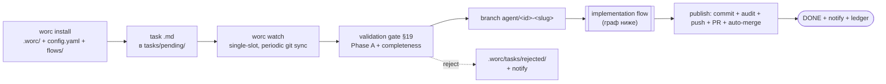
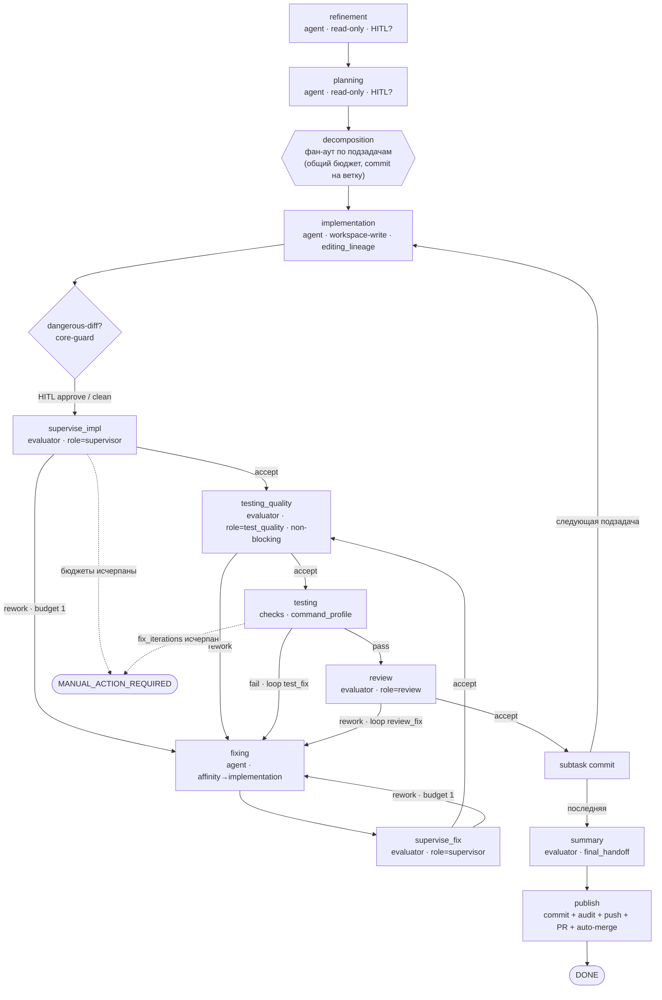

# Happy-path: `implementation` flow от установки до публикации

Статус: **backlog / иллюстрация target-состояния (не запланировано)** Дата: 2026-06-17 Владелец: Vladimir Makarevich

Сквозной прогон целевой v1-системы на примере `implementation`-flow, задействующий **максимум** возможностей (конфигов и функций) в одном happy-path — от `worc install` до влитого PR. Это витрина того, как складываются вместе ядро ([index.md](index.md)), контракт ([flow-contract.md](flow-contract.md) §7) и потолок ([security-ceiling.md](security-ceiling.md)); служит ещё и нарративной co-design-проверкой (всё ли стыкуется).

Иллюстрируется **target**-состояние v1 (с supervisor / durable sessions / hybrid testing из [index.md](index.md) §8) — не текущий код. Метки `[задействует: …]` отмечают покрытую возможность/конфиг; сводный чеклист — в §6.

## 0. Диаграммы

Жизненный цикл (установка → задача → исполнение → публикация):



Граф `implementation`-flow (узлы/рёбра/циклы; см. [flow-contract.md](flow-contract.md) §7):



## 1. Установка и настройка

```bash
worc install . \
  --provider both \           # детект claude + codex на PATH
  --create-pr \               # публикация через PR
  --auto-mode \               # watch подхватывает следующую pending-задачу
  --check "pytest -q" --check "ruff check ." --check "mypy src"
```

`install` детектит провайдеров, прогоняет checks-discovery, создаёт gitignored home и пишет конфиг, затем авто-`preflight`.

Раскладка `<repo>/.worc/` (gitignored одной строкой `.worc/` в трекаемом `.gitignore`; `tasks/` остаётся трекаемой):

```text
.worc/
  config.yaml          # инфраструктура + дефолты провайдера (шринкнутый)
  flows/               # операторские flow (built-in implementation/research/audit — запакованы)
  state.db             # SQLite-чекпоинт (транзакционно, forward-only schema)
  templates/ checks/ logs/ tasks/rejected/ orchestrator.pid
```

`config.yaml` (новая граница config↔flow: только инфраструктура + дефолты провайдера; маршрут/per-stage model/skip живут во flow):

```yaml
schema_version: 8
orchestrator: { auto_mode: { enabled: true }, poll_interval_seconds: 300 }
repo:
  {
    url: "git@github.com:acme/app.git",
    local_path: "./workspace/repo",
    base_branch: "main",
    branch_prefix: "agent",
  }
agents:
  allowed: ["claude", "codex"]
  max_stage_attempts: 3
  max_fix_cycles: 15
  max_total_fix_iterations: 30
  providers:
    claude:
      {
        command: "claude",
        model: "",
        reasoning: null,
        timeout_seconds: 7200,
        permission_profile: "workspace-write",
        max_turns: 50,
        max_budget_usd: null,
        extra_args: [],
      }
    codex:
      {
        command: "codex",
        model: "",
        reasoning: null,
        timeout_seconds: 7200,
        permission_profile: "workspace-write",
        sandbox: "workspace-write",
        extra_args: [],
      }
security:
  strict_isolation: true
  allowed_environment: ["PATH", "HOME", "CODEX_HOME", "CLAUDE_CONFIG_DIR"]
  denied_read_paths: [".env", "secrets/**"]
  denied_commands: ["git commit", "git push", "gh pr create", "gh pr merge"]
validation:
  {
    max_task_bytes: 262144,
    max_task_lines: 5000,
    reject_unknown_fields: true,
    quarantine_folder: "./.worc/tasks/rejected",
  }
checks:
  discovery:
    {
      mode: auto,
      agent_fallback: true,
      approve_command_changes: true,
      run_at_task_start: true,
    }
  timeout_seconds: 7200
git:
  create_pull_request: true
  pr_base: "main"
  footprint:
    {
      audit_on_branch: "task",
      audit_commit_message: "chore(orchestrator): audit trail for {task_id}",
    }
  auto_merge: true
  auto_merge_strategy: "squash"
  auto_merge_wait_for_checks: true # GitHub-native --auto: мёрж после зелёных required-checks
telegram:
  {
    enabled: true,
    bot_token_env: "TELEGRAM_BOT_TOKEN",
    chat_id_env: "TELEGRAM_CHAT_ID",
    ask_timeout_s: 28800,
  }
skills: { scan_root: "", exclude: ["run-checks", "test", "sync-docs"] }
prompt_audit: true # писать рендеренный промпт + метаданные per agent-run
```

Маршрут провайдеров, per-node `model`/`reasoning`/`permission_profile`/`session_scope`, точки HITL, бюджеты, output/publishing/network-политики — **во flow** (`.worc/flows/implementation.yaml`, см. [flow-contract.md](flow-contract.md) §7). Промпты ролей — MD рядом с flow (`roles/*.md`), кастомизируются их правкой.

`worc preflight`: health провайдеров (`claude`/`codex` найдены, версии ок), `strict_isolation` (sandbox/permission-mode включаемы), Telegram-доступность, checks-preflight, **фатальная валидация всех flow-файлов** (граф + потолок, до любого запуска).

`[задействует: install (provider auto-detect, --check, --create-pr, --auto-mode), .worc/ home + gitignore, config schema_version, providers (model/reasoning/timeout/permission_profile/sandbox/max_turns/max_budget_usd/extra_args), security (allowed_environment, denied_read_paths, denied_commands, strict_isolation), validation limits + quarantine, checks.discovery (mode/agent_fallback/approve_command_changes/run_at_task_start), git (create_pull_request/pr_base/footprint.audit_on_branch/auto_merge/strategy/wait_for_checks), telegram, skills, prompt_audit, preflight + isolation-preflight + flow-валидатор]`

## 2. Авторство задачи

`tasks/pending/feature-rate-limit.md` — task-файл несёт только идентичность, диспетчеризацию и операционные входы (никаких графовых оверрайдов):

```markdown
---
id: feature-rate-limit
title: Add per-IP rate limiting to the public API
task_type: implementation
contacts: ["@alice", "@bob"]
prompt_audit: true
---

## Description

Add a configurable per-IP rate limiter to the public API gateway...

## Acceptance criteria

- requests over the configured limit return 429 with Retry-After
- limit and window are configurable; sane defaults
- unit + integration tests cover the limiter
```

`[задействует: task frontmatter (id, title, task_type → implementation flow, contacts → Telegram-меншены, prompt_audit per-task tri-state — побеждает глобальный), body description + acceptance criteria → completeness-классификация]`

## 3. Запуск и интейк

`worc watch` уже крутится (демон, PID-guard); на тике делает periodic git sync (`fetch` + `pull --ff-only` base) и подхватывает pending-задачу, т.к. слот свободен (single-slot).

- **Валидационный гейт §19** — Phase A hard-reject (размер, строгий UTF-8, control-chars, обязательный frontmatter, unknown-keys fail-closed, id-regex, injection-scan значений фронтматтера); duplicate-id из двух источников (state.db + ledger). Phase B completeness: есть description + acceptance criteria → **COMPLETE** (refinement можно пропустить детерминированно). Здесь оставим refinement включённым для полноты.
- **Single-slot** захвачен; `new → validated`.
- **Резолюция flow**: `task_type: implementation` → запакованный `implementation.yaml`; снапшот графа + `flow_fingerprint` персистятся.
- **Branch prep**: `git fetch` → `checkout main` → `pull --ff-only` → `checkout -b agent/feature-rate-limit-add-per-ip-rate-limiting`.

`[задействует: watch-демон + auto_mode + periodic git sync, single-slot, validation gate Phase A/B + injection-scan + dup-id 2-source, quarantine (негатив-ветка), flow-резолюция + снапшот + fingerprint, branch prep + base protection (ff-only)]`

## 4. Исполнение `implementation`-flow

Движок исполняет граф из снапшота, сам применяя переходы по объявленным рёбрам. Узлы возвращают факты/вердикты — не прыгают по графу. Каждый agent-run пишет immutable-артефакты (request/stdout/stderr/events/result, после redaction) + (т.к. `prompt_audit: true`) рендеренный промпт и метаданные; долгие вызовы шлют heartbeat в лог.

### 4.1. refinement (agent · read-only · fresh_disposable)

Агент уточняет задачу. Структурный вывод содержит HITL-вопрос (`kind=question`): «Лимит — глобальный per-IP или per-route?». **Durable HITL** через Telegram (меншены `@alice @bob`): интеракция персистится (`waiting`), оператор отвечает «per-route», ответ редактируется и сохраняется, стадия перезапускается с контекстом. `[задействует: agent-узел read-only, fresh_disposable, HITL question (durable, redaction, contacts), prompt_audit-запись]`

### 4.2. planning (agent · read-only · HITL approval)

Планировщик предлагает план и **decomposition** на 2 подзадачи (`limiter-core`, `gateway-wiring`, линейная зависимость). Запрашивает HITL-`approval` плана → оператор жмёт «Approve». Гейт decomposition: `2 ≤ n ≤ max_subtasks`, linear `depends_on` → **принято**; immutable spec-файлы подзадач записаны; снапшот subtasks в state.db. `[задействует: planning agent, HITL approval, decomposition (gate, max_subtasks, linear deps, per-subtask immutable specs), skills (planner получает repo skill-references)]`

### 4.3. Подзадача 1 — `limiter-core` (happy)

- **implementation** (agent · workspace-write · `editing_lineage`): пишет код лимитера + тесты. Сессия фиксируется в durable lineage.
- **dangerous-diff guard** (core): diff трогает `pyproject.toml` (новая зависимость) → классифицирован `dependency` → не покрыт planning-одобрением → HITL-`approval` опасного diff → «Approve».
- **supervise_impl** (evaluator · `role=supervisor` · fresh_disposable): читает diff read-only → `accept`.
- **testing_quality** (evaluator · `role=test_quality` · non-blocking): оценивает качество тестов, написанных implementation-агентом → `accept`.
- **testing** (checks · `command_profile`): checks-discovery резолвит профиль; набор команд изменился относительно одобренного → **HITL-approval смены набора** → «Approve»; запуск `pytest -q`, `ruff check .`, `mypy src` → **pass** (exit 0). Always-on commit-candidate mutation guard: чек ничего не намусорил.
- **review** (evaluator · `role=review`): блокирующих findings нет → `accept`.
- **subtask commit**: scoped staging (только пути кода, `:(exclude)tasks/`, никогда `git add .`), commit подзадачи на ветке; SHA в state.db; per-subtask счётчики циклов сброшены (глобальный `fix_iterations` — нет).

`[задействует: implementation agent workspace-write + editing_lineage (durable session), dangerous-diff (dependency) + HITL approval, supervisor evaluator accept, hybrid test_quality non-blocking accept, checks discovery + approve_command_changes HITL + exit-коды + mutation-guard, review evaluator accept, scoped staging + per-subtask commit, loop counters reset]`

### 4.4. Подзадача 2 — `gateway-wiring` (с rework-петлями)

Здесь срабатывают петли — показываем все три триггера fixing через единый учёт.

- **implementation** → diff.
- **supervise_impl** → `rework` (нашёл, что не покрыт edge-case 429 Retry-After; severity high). Ребро `rework · budget 1` → **fixing**. `record_rework` инкрементит **единый** `fix_iterations` (только этот путь, без двойного счёта).
- **fixing** (agent · `lineage_affinity → implementation`): **продолжает сессию** implementation (durable resume того же провайдера/сессии), доправляет.
- **supervise_fix** (evaluator · supervisor) → `accept` → возврат на **testing_quality** (повторная оценка тестов после правки) → `accept` → **testing**.
- **testing** (checks): один тест красный (exit≠0) → quality-fail → ребро `fail · loop test_fix` → **fixing** (test_fix_cycle++ , fix_iterations++) → supervise_fix `accept` → testing → **pass**.
- **review** (evaluator) → `accept`.
- **subtask commit** (последняя подзадача).

Если бы петли упёрлись в `max_fix_cycles` или `max_total_fix_iterations` — детерминированный `MANUAL_ACTION_REQUIRED` + `failure_report.json`/`stuck.md` (не бесконечный цикл).

`[задействует: supervisor rework → fixing (budget 1), fixing affinity (durable session resume), session_unavailable-путь (ретрай без resume не тратит fix-итерацию — на случай потери транскрипта), test-driven fix loop, единый fix_iterations (record_rework без двойного инкремента), терминальность бюджетов → manual]`

### 4.5. summary (evaluator · final_handoff · fresh_disposable)

После принятой последней подзадачи — один свежий read-only проход `final_handoff`: синтезирует принятый итог (`what`/`how`/`integration`/`why`); ядро валидирует и пишет `summary.md`/`summary.json`. Не может выдать rework/переоткрыть задачу. (Если `summary` выключен политикой — пропуск без артефактов; здесь включён.) `[задействует: final_handoff заменяет summary-провайдер, ядро пишет summary, неблокирующий]`

### 4.6. publish (core-owned)

- **code commit** (scoped staging) — финальный код-коммит ветки.
- **task-scoped audit commit** — переносит `tasks/pending/feature-rate-limit.md` → `tasks/done/` + sidecar `feature-rate-limit.summary.md`, отдельный коммит (`audit_on_branch: task`); никогда `git add -- tasks/` целиком.
- **push** — `push --set-upstream` (отказался бы пушить в base).
- **PR** — `gh pr create`, body из `summary.md`.
- **auto-merge** — `auto_merge: true` + `wait_for_checks: true` → `gh pr merge --squash --auto`: GitHub вольёт после зелёных required-checks.
- Всё идемпотентно через `publish_operations` (фингерпринты + проверка remote; already-merged → idempotent success).

`[задействует: scoped code commit, task-scoped audit commit (footprint.audit_on_branch), push + base-protection, PR (gh, body из summary), auto_merge (strategy squash, wait_for_checks --auto, per-task gate), publish_operations идемпотентность]`

### 4.7. Терминал

`CREATING_PR → DONE`; terminal cleanup (checkout base, когда provably safe); ledger-запись в `completed.jsonl` (id/status/branch/pr_url/auto_merged/fix_iterations/decomposed/attempt/…); Telegram-уведомление об успехе с PR-URL и меншенами; артефакты остаются в `logs/<task-id>/` (включая `prompt-audit/`). `[задействует: terminal cleanup, ledger append, terminal notification (success + pr_url + contacts), артефакт-реестр + prompt-audit, exit-код 0]`

## 5. Покрытие (чеклист задействованного)

| Область | Возможности/конфиги, задействованные в прогоне |
| --- | --- |
| Установка | install (флаги/детект), `.worc/` home + gitignore, schema_version, preflight + isolation + flow-валидатор |
| Конфиг | repo, orchestrator (auto_mode/poll), agents (allowed, лимиты, providers со всеми полями), security (4 ключа), validation, checks.discovery, git (PR/footprint/auto_merge\*), telegram, skills, prompt_audit |
| Flow-данные | граф узлов, рёбра accept/rework/fail, бюджеты, decomposition, session_scope, lineage_affinity, output/publishing/network/permission_ceiling, role-MD |
| Интейк | watch + periodic git sync, single-slot, validation §19 (Phase A/B), injection-scan, dup-id 2-source, quarantine, flow-резолюция + fingerprint, branch prep |
| Узлы | agent (read-only/workspace-write), evaluator (supervisor/test_quality/review/final_handoff), checks (command_profile + discovery + approval + mutation-guard), hitl (question/approval), publish |
| Петли | supervisor rework, test-driven fix, единый fix_iterations + локальные циклы, терминальность → manual |
| Сессии | durable editing_lineage, fixing-affinity (resume), session_unavailable-путь, fresh_disposable для evaluator |
| HITL | refinement question, planning approval, dangerous-diff approval, check-set-change approval — все durable |
| Git/publish | scoped staging, code-commit, task-scoped audit-commit, push + base-protection, PR, auto-merge (wait_for_checks), идемпотентность |
| Безопасность | потолок прав, forbidden-args, env-allowlist, denied read/commands, isolation, redaction (артефакты/логи/HITL), dangerous-diff |
| Наблюдаемость | prompt_audit, structured logging + redaction-filter, heartbeat, ledger, immutable-артефакты |

Не задействовано в этом happy-path (требует своих сценариев): провайдер-fallback (инфра-ошибка), `--continue`/fresh `rerun`, `finalize`, completeness-skip refinement, manual-исходы, `deep_research`/`security_audit` flow.

## 6. Если бы упал (resume — кратко)

Краш на любом узле: на рестарте recovery-reconciler читает state.db (single active → RESUME), сверяет commit-SHA подзадач на ветке, и движок продолжает с **текущего узла** (завершённые узлы не переисполняются). Побочные эффекты (commit/push/PR) не дублируются — `publish_operations` фингерпринты. HITL-интеракция в `waiting` возобновляется. Durable lineage регидратируется до вызова провайдера. Снапшот графа recovery **не переразрешает** из живого конфига (только проверяет fingerprint/потолок). Подробности — [index.md](index.md) §6.
