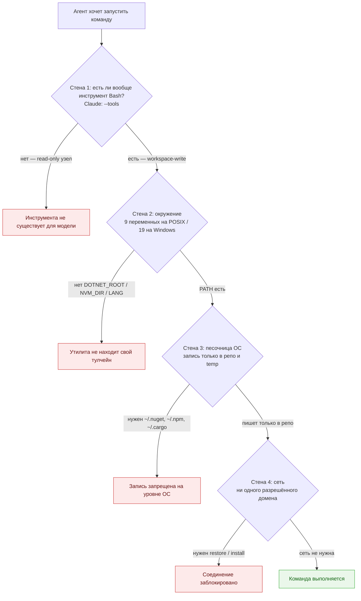
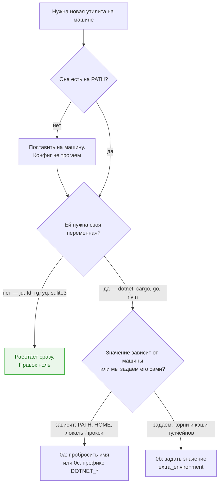
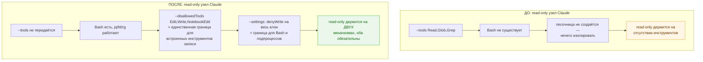
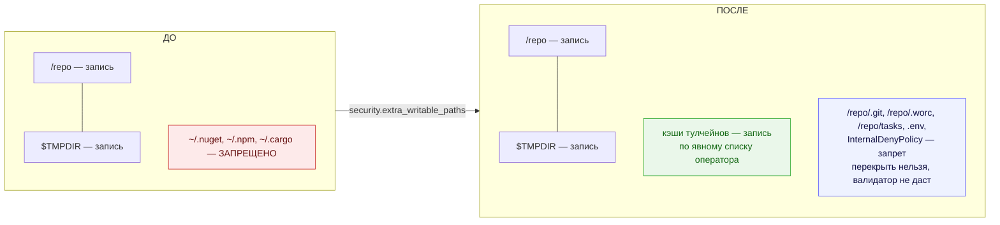
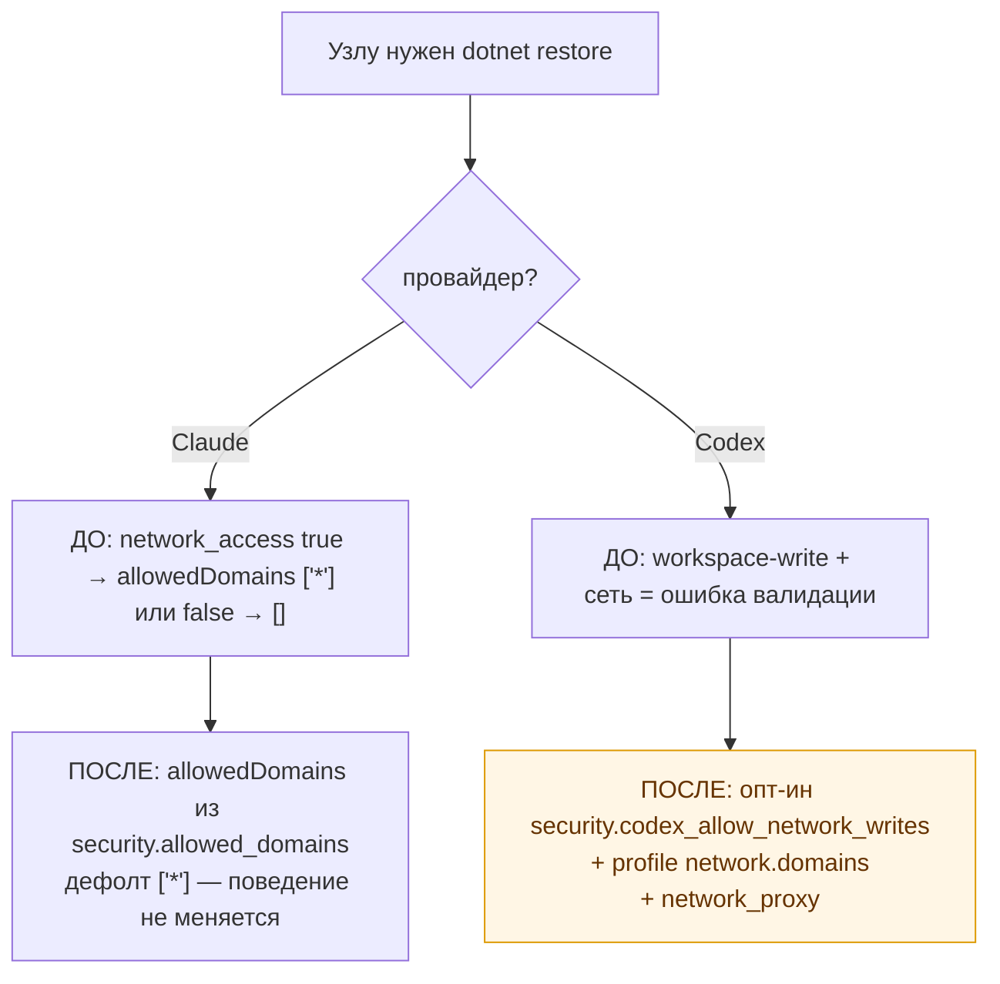
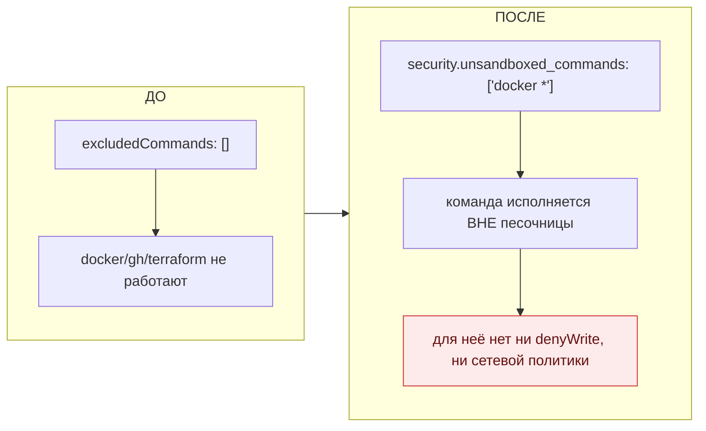
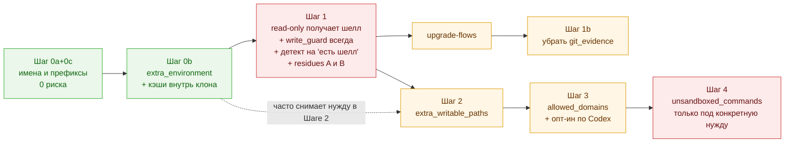

# Полный доступ агентов к утилитам машины (deny-only вместо allow-list)

Status: **proposed** Date: 2026-08-05 Owner: Vladimir Makarevich Revised: 2026-08-05 (ревью: исправлены четыре ошибки в описании механизмов, добавлены платформенные ветки, закрыты два открытых решения, добавлен реестр принятых ослаблений) Аудит: 2026-08-05 — сплошная перепроверка по коду и живым пробам `codex-cli 0.144.4` / `claude 2.1.222`; исправлены неверные грамматика `network.domains`, премиса Шага 4 про Go-CLI, механизм снятия `--tools`, все числовые оценки и две ссылки на строки; добавлены находки «unknown key парсится молча», «клон под глобальным `/tmp` снимает deny-вырезы» и «инвентарь инструментов CLI не перечислим»; по итогам аудита владелец закрыл все шесть решений (см. одноимённый раздел)

## Цель

Хотим, чтобы агент, запущенный оркестратором, мог пользоваться **любыми вспомогательными утилитами, которые есть на машине** — `jq`, `fd`, `rg`, `yq`, `ast-grep`, `dotnet`, `npm`, `cargo`, `go`, `python`, `bash`, `powershell` и так далее — а не заранее утверждённым коротким списком. То есть перейти от логики «разрешено только перечисленное» к логике «разрешено всё по умолчанию».

Единственное, что остаётся запрещённым — **публикация**: `git commit`, `git push`, `gh pr create`, `gh pr merge` (текущий `security.denied_commands`) и запись в служебные области (`.git`, `.worc`, `tasks/`, exchange, `.env`, `secrets/**`). Инвариант «коммитит/пушит/открывает PR только оркестратор» не двигается — двигается только доступ к инструментам работы.

**Решение владельца (2026-08-05): цель приоритетна.** Там, где механизм изоляции стоит на пути цели, он ослабляется осознанно — но не молча: каждое ослабление получает отдельный ключ конфига, громкую строку в `worc preflight` и запись в разделе [«Принятые ослабления»](#принятые-ослабления-реестр) с указанием, что именно перестаёт удерживать границу. Не ослабляется ровно одно: коммит / пуш / PR делает только оркестратор.

Чего эта задача **не** делает: не включает `sandbox: danger-full-access` у Codex и не включает `--permission-mode bypassPermissions` у Claude. Оба режима не добавляют ни одной новой утилиты, зато снимают запрет записи в `.git` — то есть ломают ровно тот инвариант, который мы хотим сохранить. Подробно — в разделе «Что осознанно не делаем».

## Что мешает сегодня: четыре стены у агента

Команда агента проходит четыре независимых барьера, и «список инструментов» — только первый из них. Именно поэтому `jq` и `dotnet build` ломаются в разных местах и лечатся разными шагами.



Как это выглядит на конкретных утилитах. Колонка платформы обязательна: на нативной Windows у Claude нет Bash-песочницы, и `resolve_claude_tools` при `strict_isolation: true` выкидывает `Bash` **из любого профиля**, включая `workspace-write` ([`claude.py:246`](../../src/wastech_orchestrator/providers/claude.py)) — то есть там сегодня недоступны даже `jq` и `rg`.

| Что нужно агенту | macOS / Linux (есть песочница) | Нативная Windows | Стена |
| --- | --- | --- | --- |
| `jq`, `fd`, `rg`, `yq`, `tokei`, `ast-grep` | да на `workspace-write`; **нет** на `read-only` у Claude; да на `read-only` у Codex | **нет ни на одном профиле Claude** (Bash снят целиком); у Codex — только на хосте, где live-canary доказала профиль (по нашему коду для restricted read нативной Windows нужен elevated backend — но это утверждение из [`codex_canary.py:66`](../../src/wastech_orchestrator/providers/codex_canary.py), а не свойство установленного CLI: на 0.144.4 `codex features list` показывает `elevated_windows_sandbox` и `experimental_windows_sandbox` в статусе `removed`, поэтому требование обязано быть перепроверено на реальном Windows-хосте) | 1 |
| `python script.py`, `make`, `pytest`, `ruff` — пишут внутри репо | да | нет у Claude (нет шелла); у Codex — при доказанном Windows sandbox backend | 1 |
| `dotnet build`, `npm ci`, `cargo build`, `pip install`, `go build` | нет | нет | 3 (кэши в `$HOME`) + 4 (restore) |
| `mise` / `asdf` / `nvm` / `pyenv` шимы, `dotnet` с кастомным рутом | частично | частично, там же где шелл | 2 |
| `docker`; кросс-аппные Apple Events (`osascript ... tell application`) | нет | нет | несовместимы с песочницей → Шаг 4 |
| `gh`, `gcloud`, `terraform`, `osascript -e` без Apple Events | **работают в песочнице** — проверено живой пробой, см. Шаг 4 | не проверено | ни одной стены: правок не требуют |

Важная асимметрия, которую надо держать в голове: **у адаптера Codex нет hard allow-list имён локальных команд** — локальные команды существуют, а их эффекты ограничивает permission profile по файловой системе и сети ([`codex_profile.py:105`](../../src/wastech_orchestrator/providers/codex_profile.py)); остальные поверхности (`web_search`, hooks, MCP, apps/plugins, browser/computer use, multi-agent) управляются отдельно. Поэтому `read-only` узел на Codex уже сегодня может запускать `jq` и `git log`, а тот же узел на Claude не может запустить команду без `Bash` ([`claude.py:104`](../../src/wastech_orchestrator/providers/claude.py)). При этом `:read-only` — глобальная read-only база, а не только «workspace смонтирован read»: более специфичный внешний `write` из Шага 2 сознательно открывает исключение.

**Windows — отдельная ветка, а не «деградация».** На нативной Windows у Claude нет Bash-песочницы, и при `strict_isolation: true` шелл снимается с **любого** профиля — то есть утилит там нет и у `workspace-write`, а не только у `read-only`. У Codex нативная Windows поддерживается, а дефект «throwaway `CODEX_HOME` отключает sandbox» починен в #46: канарейка сохраняет реальный home, потому что там лежит setup/grant substrate ([`codex_canary.py:302`](../../src/wastech_orchestrator/providers/codex_canary.py)). Текущий real-host smoke при этом классифицирует unelevated backend с restricted reads как `CAPABILITY_UNAVAILABLE` — по строке, зашитой у нас в [`codex_canary.py:66`](../../src/wastech_orchestrator/providers/codex_canary.py) (`Restricted read-only access requires the elevated Windows sandbox backend`), а не по свойству установленного CLI: на 0.144.4 соответствующие feature-флаги уже `removed`, так что поведение надо перепроверить на живом Windows-хосте. Поэтому прямой маршрут на Codex доказывается host-canary, а на неэлевированном хосте цель закрывает `security.allow_unsandboxed_shell` из Шага 1. Вариант Codex предпочтителен там, где канарейка прошла; вариант Claude не блокируется, а включается явным опт-ином с предупреждением о паттерновой границе.

### Пятая дверь, которая уже открыта: Check Runner

Помимо агента команды в целевом репо запускает сам оркестратор — `checks.command_sets`, и запускает их **без песочницы, без write-guard и с полной сетью**, argv-списком и с тем же `build_child_env(security.allowed_environment)` ([`check_runner.py:140`](../../src/wastech_orchestrator/check_runner.py)). Отсюда два практических вывода:

- строка «`dotnet build` / `npm ci` — не работает» верна **только внутри агента**: `dotnet test` и `npm ci`, вынесенные в `command_sets`, работают уже сегодня, как только у них есть переменные из Шага 0. Значит Шаги 2–3 нужны не «чтобы собрать проект», а строго чтобы **агент мог собирать и прогонять тесты внутри своего турна** (итерация «поправил → собрал → увидел ошибку» без выхода из узла). Это другая, более дорогая потребность, и обосновывать шаги надо ею;
- `security.extra_environment` из Шага 0b обязан попадать именно в `build_child_env`, а не только в адаптеры: иначе агент кэш видит, а checks-узел — нет, и задача падает на гейте качества после успешной работы агента. Тот же `build_child_env` кормит Git Manager ([`git_manager.py:583`](../../src/wastech_orchestrator/git_manager.py)), так что скоуп ключа — «все дочерние процессы оркестратора», и так его и надо описать.

## Что на самом деле даёт снятие `--tools` (и что не даёт)

Это место надо понимать точно, иначе Шаг 1 выглядит как «то, что даёт утилиты», а он не про это.

`--tools` гейтит **встроенные инструменты Claude** — `Read`, `Glob`, `Grep`, `Edit`, `Write`, `Bash` ([`claude.py:104`](../../src/wastech_orchestrator/providers/claude.py)). `jq` и `dotnet` — не инструменты Claude, они живут внутри `Bash`. А внутри `Bash` ограничений по командам сегодня нет: `--allowedTools` содержит голое имя `Bash`, а голое имя автоаппрувит **каждый** вызов инструмента ([`ClaudeToolPlan.allowed_tools`](../../src/wastech_orchestrator/providers/claude.py)); урезают только паттерны `denied_commands` → `Bash(git commit:*)`.

Значит:

- на `workspace-write` логика «разрешено всё, кроме перечисленного» **для команд уже действует** — это и написано в таблице выше;
- инверсия гейта существования **инструментов Claude** — это то, что требует цель («разрешено всё по умолчанию»), и её мы делаем: `--tools` не эмитится вовсе. У механизма был альтернативный вариант, и его надо назвать, потому что выбор стоил денег: у `claude 2.1.222` сам `--tools` принимает значение `default` («Use `""` to disable all tools, `"default"` to use all tools», `claude --help`), то есть `--tools default` дал бы ту же инверсию, **сохранив** флаг в `_REQUIRED_CLAUDE_FLAGS` и preflight-пробу на дрейф его имени. **Решение владельца (2026-08-05): флаг не эмитится**, простота argv важнее пробы. Цена — потеря этой пробы, она в реестре;
- но ни одной новой **утилиты машины** снятие `--tools` само по себе не приносит. Утилиты приносит одно: наличие `Bash` у профиля, у которого его нет. То есть содержательная часть Шага 1 — «`read-only` узел получает неограниченный шелл», а инверсия списка — требуемая целью посадка этого на deny-модель, и у неё своя цена (см. «Чем платим»).

Держать это разделение важно ещё и потому, что дальше в документе граница «кто кого удерживает» устроена по-разному для команд и для встроенных инструментов.

## Границы: что чем удерживается

Здесь была главная ошибка первой редакции. Утверждение «`read-only` держится на песочнице ОС — как у Codex» **неверно для Claude**: песочница ОС оборачивает только подпроцессы `Bash`, а собственные инструменты CLI `Write`/`Edit`/`NotebookEdit` через неё **не проходят** — это уже выученный урок, записанный в коде: «the CLI's own Write/Edit tools never go through that sandbox — hence only Bash was blocked» ([`claude.py:749`](../../src/wastech_orchestrator/providers/claude.py)). У Codex аналогия работает, потому что у него нет своих инструментов записи и всё идёт через ФС; у Claude — нет.

| Что надо удержать | Против `Bash` и подпроцессов | Против встроенных `Write`/`Edit`/`NotebookEdit` |
| --- | --- | --- |
| Запись в `.git`, `.worc`, `tasks/`, exchange | песочница ОС (`denyWrite`) — macOS/Linux | **только** паттерны `--disallowedTools Write(...)/Edit(...)` |
| Нередактируемость клона у `read-only` узла | песочница ОС (`deny_write_root` на весь клон) | **только** голые имена `Edit`, `Write`, `NotebookEdit` в запретах |
| Запись в `.git` на нативной Windows | нечем (песочницы нет) — только паттерны команд | только паттерны инструментов |

Отсюда три следствия, которые определяют реализацию:

1. Формулировка «паттерны — ремень, боундари — запрет записи» верна **только для Bash на POSIX**. Для встроенных инструментов и для всей Windows паттерн **и есть** граница. Поэтому deny-список инструментов — не «ремень», а несущая конструкция, и его полнота — вопрос корректности, а не гигиены. Паттерны можно обойти через wrapper, второй shell или подпроцесс; это не блокирует шаг, а фиксируется как принятое ослабление гарантии.
2. Инвариант «в `.git` писать нельзя всегда» после Шага 1 сохраняется на macOS/Linux (песочница + паттерны) и **деградирует до паттернов** на Windows. Это принятое ослабление, оно в реестре и в preflight.
3. Нужна страховка от «новый edit-инструмент в новом релизе = молчаливая потеря read-only». Первая редакция называла её «тест-канарейка, которая сверяет наши два списка с фактическим набором инструментов CLI» — **у этой формулировки нет механизма**, и это выяснилось живой пробой: у `claude 2.1.222` нет подкоманды, перечисляющей встроенные инструменты (`claude --help` их не печатает, в `Commands:` такой команды нет), а имена в списках **вообще не валидируются** — `claude -p --tools BogusToolXYZ` даёт ровно тот же вывод, что и `--tools Read` (обе пробы упали на подставном `--model`, ни одна не пожаловалась на инструмент). Следствие асимметрично: опечатка в `--tools` фейлится **закрыто** (инструмент просто не существует), опечатка в `--disallowedTools` фейлится **открыто и молча** (запрета нет, диагностики нет). **Решение владельца (2026-08-05): fail-open принимается без страховки.** Инвариант «каждое имя лежит ровно в одном из двух списков» остаётся требованием к нашему коду и тестам, но ничто не заметит инструмент, появившийся в новом релизе CLI: read-only перестанет быть read-only молча, до первого ручного разбора. Это самое дорогое из принятых ослаблений, и оно записано в реестр отдельной строкой, а не спрятано в «цене шага».
4. **Ещё одна граница, которая уже сегодня не держится там, где мы думали (Codex, macOS).** Модель «более специфичный путь побеждает широкий» верна для наших явных правил, но **не** для унаследованных из `extends`: если клон лежит под глобальным `/private/tmp`, встроенный temp-грант профиля `:workspace` перебивает наши явные `deny`-вырезы целиком. Проверено парными контролями на `codex-cli 0.144.4` с одним и тем же профилем (`"<repo>"="write"`, `"<repo>/protected"="deny"`): клон под `$HOME` — запись и чтение `protected` запрещены; клон под `$TMPDIR` (`/var/folders/…`) — запрещены; клон под `/private/tmp` — **и запись, и чтение разрешены**, при живом положительном контроле (запись в сам репо) во всех трёх случаях. Сегодня это не тихая утечка: per-attempt канарейка гоняет пробы по реальному `working_directory` ([`codex_canary.py:320`](../../src/wastech_orchestrator/providers/codex_canary.py)), поэтому такой клон даёт leak → `CONFIGURATION_ERROR` и задача умирает. Но `repo.local_path` под temp **ничем не запрещён** — ни в [`config/validation.py`](../../src/wastech_orchestrator/config/validation.py), ни в `runtime_layout`. Для этой задачи важны два вывода: правило 3 валидации Шага 2 нельзя строить на runtime-приоритете вообще (не только на «deny применяется последним»), и в тесты Шага 2 обязан войти кейс «клон под системным temp». **Решение владельца (2026-08-05): валидатор `repo.local_path` не запрещает — вместо запрета громкая строка в `worc preflight`** («клон под системным temp: deny-вырезы Codex не гарантированы»), плюс запись в реестре. Опора на то, что per-attempt канарейка ловит фактическую утечку; эффект перепроверяется на Windows и Linux отдельно.

## Инварианты, которые не двигаются ни на одном шаге

- **Коммит / пуш / PR — только оркестратор.** Ни один шаг не даёт агенту публиковать; `denied_commands` остаётся полом под всем остальным.
- **`write_guard` считается для каждой попытки, а не только для `workspace-write`.** Сейчас он резолвится только для пишущих узлов ([`agent.py:481`](../../src/wastech_orchestrator/core/flow/nodes/agent.py)), потому что у `read-only` узла нет инструментов записи. После Шага 1 это перестаёт быть правдой — и это единственное место, где порядок шагов является требованием корректности.
- **Никакой новый ключ не может перекрыть служебные пути.** Список из Шага 2 обязан валидироваться: запись в `.git`, `.worc`, `tasks/`, exchange, env-файл, `denied_read_paths` **и во весь набор `InternalDenyPolicy`** (приватный/контрольный home, провайдерские auth-home `CODEX_HOME` / `CLAUDE_CONFIG_DIR`, замороженные бандлы) — не разрешаема, даже если оператор напишет `~/` или `/`. Пропуск `InternalDenyPolicy` в первой редакции означал бы, что `extra_writable_paths: ["~"]` открывает запись в креденшелы провайдеров.
- **Никаких секретов в окружении дочерних процессов** — механизм остаётся allow-list по именам, инверсии для переменных не делаем (обоснование в конце Шага 0).

## Шаг 0 — окружение: три механизма

**Проблема.** Дочерний процесс получает только имена из `security.allowed_environment`, и этот список **заменяет** дефолт, а не дополняет его ([`loader.py:571`](../../src/wastech_orchestrator/config/loader.py)). Дефолт при этом OS-зависимый: кросс-платформенная база из 6 имён плюс OS-launch essentials — на POSIX это 9 имён, на Windows 19 ([`env.py:78`](../../src/wastech_orchestrator/security/env.py)). `PATH` есть, поэтому `jq` и `fd` находятся; а `dotnet` без `DOTNET_ROOT`/`NUGET_PACKAGES`, `nvm`/`mise` без своих переменных и часть CLI без `LANG` работают не так или не работают.

### Сначала главное: это имена переменных, а не пути к утилитам

`allowed_environment` — это список **имён переменных окружения**. Это не список разрешённых программ и не пути к ним. Утилиты агент находит через `PATH`, который пробрасывается целиком и без изменений, поэтому **для новой утилиты, которая просто лежит на `PATH`, в конфиг добавлять ничего не нужно**: поставили на машину `jq`, `fd`, `yq`, `ast-grep`, `hyperfine`, `sqlite3` — агент видит их сразу, без правки конфига и без перезапуска чего-либо.

Правка нужна только в одном случае: утилита читает **свою собственную** переменную (корень тулчейна, путь кэша, шим версии). Отличать по симптому в логе узла:

| Симптом | Причина | Что делать |
| --- | --- | --- |
| `command not found` | утилиты нет на `PATH` машины | поставить утилиту — конфиг тут не при чём |
| `SDK not found`, `no such toolchain`, `cannot find module`, пишет кэш не туда | утилита есть, но не видит свой корень/кэш | добавить её переменную (0a / 0b / 0c) |
| `Permission denied` / `Read-only file system` при записи вне репо | песочница ОС | Шаг 2 |
| `Connection refused` / таймаут на `restore`/`install` | сеть | Шаг 3 |
| работает вне оркестратора, но не под ним, и ни один пункт выше не подходит | разница в окружении | сравнить `env` внутри и снаружи |

Практическая диагностика на будущее: дать узлу выполнить `env | sort` и сравнить с выводом на машине оператора. Разница — это ровно то, чего оркестратор не пробрасывает, и она же ответ на вопрос «что добавить».



### 0a — пробросить из окружения оператора (сегодня, без кода)

Ключ **заменяет** дефолт целиком, а дефолт OS-зависимый — поэтому редактировать надо тот список, который уже лежит в сгенерированном `config.yaml`, и он содержит **полный кросс-платформенный союз** из 22 имён, а не 9 ([`config.example.yaml:139`](../../src/wastech_orchestrator/packaged/config.example.yaml) — там же объяснено, почему). Числа проверены вызовом самого кода: `default_allowed_environment("Linux")` → 9, `("Windows")` → 19, их union → 22, и в шипнутом шаблоне ровно 22 записи. «19» — это Windows-дефолт, а не размер союза; не перепутать при правке. Ниже — правильная база; POSIX-only список из первой редакции на Windows выбрасывал `SystemRoot`, а без него Node-овый `claude.exe` падает с `0xC0000409` до вывода чего-либо, и preflight сообщает «CLI did not succeed».

```yaml
security:
  allowed_environment:
    # ВАЖНО: список заменяет дефолт целиком. Имя, отсутствующее на этой ОС, просто пропускается,
    # поэтому кросс-платформенный союз безопасно держать целиком на любой машине.
    # --- кросс-платформенная база
    - "PATH"
    - "HOME"
    - "USER"
    - "USERPROFILE"
    - "CODEX_HOME"
    - "CLAUDE_CONFIG_DIR"
    # --- POSIX essentials
    - "TMPDIR"
    - "LD_LIBRARY_PATH"
    - "DYLD_LIBRARY_PATH"
    # --- Windows essentials (SystemRoot несущий: без него claude.exe падает 0xC0000409)
    - "SystemRoot"
    - "SystemDrive"
    - "windir"
    - "ComSpec"
    - "PATHEXT"
    - "TEMP"
    - "TMP"
    - "APPDATA"
    - "LOCALAPPDATA"
    - "HOMEDRIVE"
    - "HOMEPATH"
    - "NUMBER_OF_PROCESSORS"
    - "PROCESSOR_ARCHITECTURE"
    # --- затем новое, под цель
    - "LANG"
    - "DOTNET_ROOT"
    - "JAVA_HOME"
```

Годится для того, что **по своей природе зависит от машины**: `PATH`, `HOME`, локаль, прокси, корень уже установленного SDK. Ограничение механизма: в конфиге видно только **имя**, значение приходит из окружения оператора. Значит на другой машине тот же конфиг даёт другое поведение, а переменную, которую оператор забыл экспортировать, механизм молча пропускает (`build_child_env` отбрасывает имена, отсутствующие у родителя — [`env.py:89`](../../src/wastech_orchestrator/security/env.py)).

Раз главный риск ключа — «оператор случайно снёс нужное имя», `worc preflight` обязан ругаться, если из `allowed_environment` исчез `PATH` или (на Windows) `SystemRoot`: сейчас такой проверки нет, а симптом выглядит как «CLI сломался».

### 0b — задать значение явно (новый ключ `security.extra_environment`)

Форвардинг плохо масштабируется именно на тулчейны: надо знать, что переменная у оператора выставлена, и её значение нигде не зафиксировано. Поэтому второй механизм — не «пробросить», а «присвоить»:

```yaml
security:
  extra_environment: # значения задаются явно, а не наследуются из окружения
    DOTNET_CLI_TELEMETRY_OPTOUT: "1"
    DOTNET_NOLOGO: "1"
    NUGET_PACKAGES: "/Users/u/repos/target/.toolcache/nuget"
    CARGO_HOME: "/Users/u/repos/target/.toolcache/cargo"
    npm_config_cache: "/Users/u/repos/target/.toolcache/npm"
    GOMODCACHE: "/Users/u/repos/target/.toolcache/go"
    LANG: "C.UTF-8"
```

Что это даёт против 0a: значение видно в конфиге и в аудите прогона, поведение одинаково на любой машине, забытый `export` больше ничего не ломает. Правило разрешения конфликтов: `extra_environment` применяется **после** `allowed_environment` и перекрывает одноимённое проброшенное значение; `PATH` из этого правила исключён (перезапись `PATH` целиком — это способ подменить любую утилиту, её должен делать только адаптер, как Codex делает для своего Windows-хелпера).

Код: `SecurityConfig` + loader + валидация + правка `build_child_env`, который сегодня умеет только «взять из родителя». Хук `_augment_child_env` для этого не годится — по контракту он меняет только значения уже разрешённых имён и не добавляет новых ([`_adapter_base.py:275`](../../src/wastech_orchestrator/providers/_adapter_base.py)). Скоуп ключа — **каждый** дочерний процесс оркестратора. Полный список call-site'ов `build_child_env`, снятый грепом, — их семь, и пропустить нельзя ни один, иначе кэш будет виден одному пути и не виден другому: [`check_runner.py:140`](../../src/wastech_orchestrator/check_runner.py), [`git_manager.py:583`](../../src/wastech_orchestrator/git_manager.py), [`orchestrator.py:2289`](../../src/wastech_orchestrator/core/orchestrator.py) (сканеры `dependency_scan` — этот в первой редакции не назван вовсе), [`codex.py:711`](../../src/wastech_orchestrator/providers/codex.py) и два в [`_adapter_base.py`](../../src/wastech_orchestrator/providers/_adapter_base.py) (строки 330 и 450 — preflight/probe и run). Все семь сегодня передают ровно `security.allowed_environment`, так что правка одна: либо `build_child_env` начинает принимать и extra-маппинг, либо ему передаётся целиком `SecurityConfig`. Формат-добавка → `schema_version` 35. Отдельное маленькое решение: разрешать ли в значениях подстановку `{repo}` вместо абсолютного пути (удобнее, но добавляет рендеринг в конфиг-слой) — по умолчанию нет, оператор пишет абсолютный путь, он и так знает его из `repo.local_path`.

### 0c — префиксные шаблоны в `allowed_environment` (то, что делает цель долговечной)

0a и 0b лечат сегодняшний список, но не убирают саму причину обращений: **каждый новый тулчейн — это новая правка конфига**, а цель прямо говорит «и так далее», то есть про заранее неизвестный набор. Поэтому `allowed_environment` учится принимать префикс:

```yaml
security:
  allowed_environment:
    - "DOTNET_*"
    - "NUGET_*"
    - "CARGO_*"
    - "RUSTUP_*"
    - "GO*"
    - "npm_config_*"
    - "PYENV_*"
    - "JAVA_*"
```

Это по-прежнему **allow-list по именам** — инвариант «в процессы передаются только allowlisted переменные» не двигается, просто элемент списка стал шаблоном. Обязательные условия реализации: (1) поддерживается только суффиксная `*` (никаких `*` в середине и никакого одинокого `*`); (2) каждое **раскрытое** имя прогоняется через `is_sensitive_key` ([`redaction.py:117`](../../src/wastech_orchestrator/providers/redaction.py)) и отбрасывается, если похоже на кредл — так `NPM_*` не протащит `NPM_TOKEN`, а `AWS_*` не протащит ничего; (3) отброшенные имена печатаются в лог узла на уровне `warning`, иначе оператор будет искать, почему шаблон «не сработал»; (4) валидатор отклоняет шаблон, который раскрывается в `PATH` (см. правило про `PATH` выше).

Одинокий `*` запрещён намеренно, и это не косметика — см. следующий абзац.

### Побочный эффект: Шаг 2 может не понадобиться

Если через 0b перенаправить кэши тулчейнов **внутрь клона** (`NUGET_PACKAGES`, `CARGO_HOME`, `npm_config_cache`, `GOMODCACHE` → `<клон>/.toolcache/...`), то `dotnet build`, `cargo build` и `npm ci` перестают писать в `$HOME` — и запись за пределами репо становится не нужна вовсе. Клон и так писабелен для `workspace-write` узла, `git clean` оркестратор не запускает (проверено: ни одного вызова в `src/`), так что кэш переживает задачи.

Три условия, без которых это выстрелит в ногу:

- путь **не** под `.worc` — этот каталог целиком в deny-наборе (`control_home` и `private_home` оба указывают на `.worc`, [`runtime_layout.py:38`](../../src/wastech_orchestrator/runtime_layout.py));
- `.toolcache/` обязан быть в `.gitignore` целевого репо, иначе десятки тысяч файлов кэша попадут в diff и упрутся в staging-гейт и dangerous-diff. Это **не** самоочевидное условие: `.gitignore` — файл целевого репо, оркестратор его не контролирует, а агент с `workspace-write` может его изменить. Поэтому нужна дешёвая проверка на стороне оркестратора: если `extra_environment` направляет кэш внутрь клона, а путь не игнорируется (`git check-ignore -q`), preflight ругается. Без неё условие ничем не обеспечено;
- на `read-only` узле это всё равно не заработает (после Шага 1 весь клон write-denied) — и не должно: собирать проект — не задача read-only узла.

### Правило безопасности для всех трёх ключей

Никаких секретов ни в именах, ни в значениях, и валидатор обязан это отклонять **одной и той же** политикой, что уже живёт в коде — `is_sensitive_key` ([`redaction.py:117`](../../src/wastech_orchestrator/providers/redaction.py)), сегментная проверка имени. Свой список масок (`*_TOKEN`, `AWS_*`, …) не заводим: два расходящихся определения «секретного имени» разъедутся при первом же изменении.

Дополнительно — то, что первая редакция пропустила и что важнее самого валидатора. Редактор секретов собирает литералы для вычистки по правилу «имя выглядит секретным **и** его нет в `allowed_environment`» ([`redaction.py:126`](../../src/wastech_orchestrator/providers/redaction.py)). То есть **расширение `allowed_environment` сужает набор редактируемых значений**: имя, добавленное в allow-list, перестаёт вычищаться из логов, артефактов и памяти. Поэтому: (1) запрет секретных имён в `allowed_environment` — не гигиена, а условие сохранения «no secrets in logs»; (2) в `extra_environment` значения оператор пишет сам, и они попадают в конфиг и в аудит прогона — то есть утверждение первой редакции «случайно пробросить секрет невозможно» неверно ровно наоборот: секрет там будет **напечатан**. Валидатор режет секретные имена в обоих ключах, а гайд говорит прямым текстом: креденшелы в оркестратор не заносятся, ни одним из трёх механизмов.

**Почему для переменных мы НЕ делаем ту же инверсию, что для инструментов.** Соблазн есть: «пробрасывать всё окружение минус чёрный список». Не делаем, и это единственное место, где мы не идём за целью: цель — про **утилиты**, а инверсия окружения ни одной утилиты не добавляет (`PATH` уже пробрасывается целиком). Зато риск не теоретический: на машине разработчика и в CI родительское окружение почти всегда содержит `ANTHROPIC_API_KEY`, `GH_TOKEN`, `AWS_*`, `NPM_TOKEN`, а утечка здесь случается от самого факта наличия значения в окружении — без всякого действия агента, и её нечем ни задетектить, ни откатить. 0c закрывает практическую потребность («следующий тулчейн без правки кода») тем же allow-list.

## Шаг 1 — `read-only` узлы получают шелл (deny-only вместо `--tools`)

**Проблема.** У Claude слово «read-only» держится **только** на отсутствии `Edit`/`Write`/`Bash` в `--tools`. Никакого ОС-механизма там нет: файл настроек песочницы пишется лишь тогда, когда в наборе есть `Bash` ([`claude.py:1038`](../../src/wastech_orchestrator/providers/claude.py)). Из-за этого ревью, аудит и research-узлы (почти все узлы в `deep_research` и `security_audit`) не могут запустить ни `rg`, ни `jq`, ни `git log`.



**ДО (argv `read-only` узла, дефолтный конфиг — read-isolation ON):**

```
claude -p --output-format stream-json --verbose
  --setting-sources "" --strict-mcp-config
  --permission-mode dontAsk
  --tools Read,Glob,Grep
  --allowedTools Read,Glob,Grep
  --disallowedTools "Bash(git commit:*),Bash(git push:*),Bash(gh pr create:*),Bash(gh pr merge:*),Read(.env),Read(secrets/**),Write(//home/u/.claude/**),Edit(//home/u/.claude/**),Write(//repo/.worc),..."
  --model claude-sonnet-5 --effort high
```

Файла `--settings` нет вообще — песочницы у этого узла не существует. (`--setting-sources project` появляется только при `read_isolation_off`, это операторская хатч, а не дефолт — [`claude.py:716`](../../src/wastech_orchestrator/providers/claude.py).) В самом `--disallowedTools` при дефолтной read-изоляции у `~/.claude` денаятся **три** вида, а не два: `("Write", "Edit", "Read")` ([`claude.py:750`](../../src/wastech_orchestrator/providers/claude.py)), поэтому в argv выше рядом с `Write(...)`/`Edit(...)` стоит и `Read(//home/u/.claude/**)`.

**ПОСЛЕ (тот же узел):**

```
claude -p --output-format stream-json --verbose
  --setting-sources "" --strict-mcp-config
  --permission-mode acceptEdits
  --allowedTools Read,Glob,Grep,Bash,PowerShell,TodoWrite,BashOutput,KillShell
  --disallowedTools "Edit,Write,NotebookEdit,WebFetch,WebSearch,Agent,Workflow,AskUserQuestion,CronCreate,EnterWorktree,Bash(git commit:*),Bash(git push:*),Bash(gh pr create:*),Bash(gh pr merge:*),Read(.env),Read(secrets/**),Write(//repo/.worc),..."
  --settings /repo/.worc/runs/<task>/attempt-1/claude-sandbox-settings.json
  --model claude-sonnet-5 --effort high
```

Три вещи изменились: `--tools` (жёсткий гейт существования) пропал, `--allowedTools` перестал быть копией гейта и стал просто «не спрашивать разрешения», а всё запрещённое перечислено явно.

**Оговорка к именам инструментов выше.** Список составлен не по перечислению из CLI (его нет — см. следствие 3 в «Границах»), поэтому имена проверены статически по бинарю `claude 2.1.222`: `PowerShell`, `NotebookEdit`, `TodoWrite`, `BashOutput`, `KillShell`, `WebFetch`, `AskUserQuestion`, `Agent`, `Workflow`, `CronCreate`, `EnterWorktree`, `Artifact`, `SendMessage`, `PushNotification` в бинаре есть, а **`ShareOnboardingGuide` — нет** (ноль точных вхождений), то есть в первой редакции он попал в запреты из чужого окружения. Из этого следует правило реализации: любое имя в обоих списках привязывается к версии CLI и проверяется при её смене; писать в deny-список имя «на всякий случай» бесполезно (оно ничего не запрещает) и вредно (создаёт ложное чувство полноты).

**Два списка обязаны быть исчерпывающими — это не гигиена, а условие работоспособности.** Снятие `--tools` создаёт третье состояние, которого раньше не было: инструмент **существует**, но не назван ни в разрешениях, ни в запретах. Такой инструмент требует разрешения, а в headless-режиме отвечать некому — узел жжёт турны на том, чем не может воспользоваться. Поэтому инвариант реализации: **каждое имя встроенного инструмента лежит ровно в одном из двух списков**. Сторожить это «сверкой с фактическим набором инструментов CLI» нельзя — набор не перечислим, а незнакомое имя CLI молча принимает (следствие 3 в «Границах»). По решению владельца страховки не будет: инвариант проверяется тестом против **нашего** списка имён, и это ловит только наши собственные упущения, но не новый инструмент в новом релизе CLI.

**`PowerShell` разрешён, а не запрещён** — цель называет `powershell` прямым текстом, поэтому первая редакция противоречила сама себе, запрещая его «как второй шелл». Цена принимается и записывается: паттерны `denied_commands` сегодня рендерятся только как `Bash(...)`, значит на PowerShell они не действуют. На POSIX его удерживает песочница, а на Windows — ничего, см. реестр. При реализации проверить на актуальном Claude CLI, принимает ли он scoped-синтаксис `PowerShell(...)` и проходит ли сам инструмент через ту же OS sandbox boundary; если scoped-синтаксис работает — проецировать `denied_commands` и туда.

**Режим и автоаппрув команд.** `acceptEdits` достаточен, `auto`/`bypassPermissions` не нужны. Но полагаться на вендорский дефолт `autoAllowBashIfSandboxed` нельзя: если он в какой-то версии окажется `false`, каждая sandboxed-команда начнёт спрашивать разрешение, а спросить не у кого. Ставим его **явно** в нашем же `--settings`-файле, рядом с блоком `sandbox`. Имя ключа существует в бинаре 2.1.222 — как и `allowWrite`, `allowRead`, `allowedDomains`, `deniedDomains`, `excludedCommands`, `failIfUnavailable`, `tlsTerminate`, — так что все ключи в JSON ниже не выдуманы; чего статическая проба **не** доказывает, так это семантики и приоритетов, и именно они остаются в списке живых проб. Отдельно принять к сведению: смена `dontAsk` → `acceptEdits` меняет поведение для неизвестного инструмента с «авто-отказ» на «авто-аппрув правок», то есть fail-open усиливается ровно на оси записи — это ещё один аргумент за исчерпывающий deny-список и канарейку.

Файл песочницы для такого узла уже умеет write-денаить весь клон — этот код существует ради `git_evidence` ([`claude.py:1047`](../../src/wastech_orchestrator/providers/claude.py)):

```json
{
  "sandbox": {
    "enabled": true,
    "failIfUnavailable": true,
    "allowUnsandboxedCommands": false,
    "excludedCommands": [],
    "autoAllowBashIfSandboxed": true,
    "filesystem": {
      "denyRead": [],
      "denyWrite": ["/repo/.worc", "/repo/.git", "/repo/tasks", "/repo"]
    },
    "network": { "allowedDomains": [] }
  }
}
```

**Хосты без песочницы — новый ключ `security.allow_unsandboxed_shell` (default `false`).** Сегодня на нативной Windows `Bash` выкидывается из набора, а на Linux без `bwrap`/`socat` попытка падает `CAPABILITY_UNAVAILABLE` ([`claude.py:246`](../../src/wastech_orchestrator/providers/claude.py)). Первое работает **исключительно** потому, что `--tools` — гейт существования: без `--tools` строка `tools = tuple(t for t in tools if t != "Bash")` не значит ничего, и на Windows появился бы несендбоксенный шелл сам собой, молча. Поэтому:

- при `allow_unsandboxed_shell: false` (дефолт) на таком хосте `Bash` и `PowerShell` уходят в `--disallowedTools` **голыми именами** — то есть механизм снятия шелла переносится с `--tools` на запреты, и без этой правки Шаг 1 является дырой, а не фичей;
- при `allow_unsandboxed_shell: true` шелл остаётся, и оператор получает цель на Windows. Что при этом удерживает `.git` — только паттерны инструментов и `denied_commands`, обходимые через `bash -c` / wrapper / подпроцесс. `worc preflight` печатает это отдельной громкой строкой, а не сноской;
- ключ намеренно **уже**, чем `strict_isolation: false`: тот отключает изоляцию на весь прогон и разблокирует `bypassPermissions`, а этот трогает ровно один вопрос — «оставить ли шелл там, где его нельзя изолировать».

Порядок этой ветки является частью контракта. Сначала `resolve_claude_tools` определяет, доступна ли песочница, затем при `allow_unsandboxed_shell: false` переносит оба shell-инструмента в bare `--disallowedTools` **без** `CAPABILITY_UNAVAILABLE`, а при `true` оставляет shell без sandbox и тоже не бросает этот error. Нельзя сначала добавить `Bash` всему `read-only`, попасть в нынешнюю ветку `LINUX_MISSING_DEPS` и лишь потом строить deny-list: такой порядок превратит каждый read-only узел на хосте без `bwrap`/`socat` в infra failure и запустит непредусмотренный fallback.

**Что менять в коде.**

- [`providers/claude.py`](../../src/wastech_orchestrator/providers/claude.py): `_PROFILE_MAP` → «режим + набор запретов» вместо «режим + набор разрешений»; `ClaudeToolPlan`/`resolve_claude_tools` перестают собирать список существования и начинают собирать список запретов (включая платформенную ветку выше); `build_claude_argv` не эмитит `--tools`.
- `_REQUIRED_CLAUDE_FLAGS`: **убрать** `--tools` (по решению владельца флаг не эмитится, а preflight не должен требовать флаг, которого нет в argv) и **добавить** `--disallowedTools` ([`claude.py:479`](../../src/wastech_orchestrator/providers/claude.py)). После инверсии вся изоляция висит на `--disallowedTools`: CLI, который его переименовал, обязан ловиться до платного вызова модели, а не давать прогон без единого запрета. В `_RESERVED_CLAUDE_FLAGS` `--tools` уже лежит (там же `--allowedTools`/`--disallowedTools`/`--settings`, проверено) — оператор не должен возвращать себе гейт через `extra_args`, и это менять не надо.
- Обязательный список запретов для `read-only`: `Edit`, `Write`, `NotebookEdit` голыми именами + `denyWrite` на весь клон. Для узла без сети — `WebFetch`, `WebSearch` (сегодня они выключены тем, что их нет в `--tools`, [`claude.py:111`](../../src/wastech_orchestrator/providers/claude.py); сетевая политика песочницы на встроенный `WebFetch` не действует, она про Bash).
- Запреты «не для этого сценария» (все имена сверены с бинарём 2.1.222): `Agent`/`Workflow` (порождение субагентов — деньги и неаудируемые действия), `CronCreate`/`RemoteTrigger` (переживают таск), `SendMessage`/`Artifact`/`PushNotification` (каналы наружу), `AskUserQuestion` (в headless некому ответить), `EnterWorktree` (создаёт worktree со своим gitdir — обход write-guard). `ShareOnboardingGuide` из этого списка убран — такого инструмента у CLI нет.
- [`nodes/agent.py`](../../src/wastech_orchestrator/core/flow/nodes/agent.py): `write_guard` резолвится для каждой попытки, не только для `workspace-write` ([`agent.py:481`](../../src/wastech_orchestrator/core/flow/nodes/agent.py)).
- **Перекейить детект нарушений на «у узла есть шелл».** Бракет, который снимает отпечаток git-control-state и рабочего дерева до попытки, сейчас включается только при гранте `git_evidence`: `if git is None or self._is_workspace_write(...) or not self._has_git_evidence(node)` ([`agent.py:393`](../../src/wastech_orchestrator/core/flow/nodes/agent.py)). После Шага 1 шелл есть у всех `read-only` узлов, а бракет по-прежнему смотрит на грант — то есть весь новый класс узлов остаётся **без** сигнала «песочница не удержала». Условие меняется на «узел получил шелл»; иначе Шаг 1 не просто расширяет доступ, а гасит единственную обратную связь о нарушении.
- Новый ключ конфига `security.tool_policy: allowlist | denylist` (дефолт `allowlist` на время эксперимента) — чтобы откат был одной строкой. Формат-добавка → `schema_version` 35, старые конфиги грузятся fail-open, `upgrade-config` добавляет ключ из шаблона. На Codex ключ не влияет: у него нет hard allow-list имён локальных команд. Это provider-specific rollback поведения Claude, а не общий переключатель двух провайдеров; это явно пишется в схеме, гайде и preflight. Тот же прецедент уже есть у `denied_commands`, чья Codex-проекция descoped ([`analysis/strict-isolation-map.md`](analysis/strict-isolation-map.md)); расхождение гарантий не замалчивается, но и не блокирует цель.

**Стык с router/fallback.** Правильная реализация ветки выше не создаёт `CAPABILITY_UNAVAILABLE` ни при `allow_unsandboxed_shell: false`, ни при `true`, поэтому утверждение «после Шага 1 все read-only узлы уйдут на Codex» не является ожидаемым поведением. Если такой error всё же возник, Router условно разрешит переход на Codex только при same-or-stricter профиле и положительном host isolation check ([`routing/router.py:67`](../../src/wastech_orchestrator/routing/router.py)); при этом текущий gate сравнивает **сконфигурированные provider profiles**, а не эффективный `request.permission_profile` узла ([`routing/router.py:621`](../../src/wastech_orchestrator/routing/router.py)). Это надо исправить вместе с Шагом 1: fallback сравнивает фактический профиль попытки, иначе read-only узел может получить неверное решение из-за `workspace-write` defaults. Учесть и preflight: сегодня Claude default `workspace-write` на Linux без зависимостей может остановить весь run до узлов, а не дойти до fallback.

Fallback сохраняет portable request — prompt, paths, schema, permission и network flag, — но сбрасывает provider-specific model, часть reasoning, `extra_args` и session ([`routing/router.py:584`](../../src/wastech_orchestrator/routing/router.py)); одинаковой семантики инструментов у Claude и Codex тоже нет. Поэтому это security-equivalent замена исполнителя, а не гарантия сравнимого результата. Каждый переход на Codex дополнительно запускает его per-attempt canary до платного model call; рост числа fallback надо считать отдельно по subprocess, latency, model usage и качеству результата.

**Что становится обязательным вместе с Шагом 1 (не «потом»).** Шаг 1 переводит `read-only`-узел-с-шеллом из редкого опт-ин класса в дефолт для всего парка, и этим обнуляет обоснования, по которым отложены оба пункта [read-only-shell-residues.md](read-only-shell-residues.md):

- **A (перепроверка push-адреса).** Отложено словами «слой ниже держит… сделать до того, как `deep_research` начнёт ходить без присмотра». После Шага 1 узлов с шеллом становится много, а решение 2026-07-27 «такой узел не паркует задачу, а предупреждает» распространяется на них всех — то есть непрочитанное предупреждение становится штатным сценарием. ~20 строк + два теста, делаем в этом же изменении.
- **B (evaluator-узлы).** Отложено как «мёртвое покрытие, ни один packaged-флоу не даёт грант evaluator'у». После Шага 1 шелл у read-only evaluator'ов появляется без всякого гранта, и они не отчитываются ни о записи, ни о дрейфе. Поднять бракет в общее место обоих раннеров.
- Решение «warn, а не park» **подтверждено владельцем для новой области действия (2026-08-05): только `warn`, на весь парк, ничего не блокируем** — ни лишний файл в рабочем каталоге (`read_only_write`), ни дрейф control-state (`read_only_git_drift`). Вариант «паркует, как `workspace-write`» отклонён. Из этого следует одна вещь, которую надо сделать в коде, а не просто принять: раз предупреждение **и есть** мера защиты (так и написано в [`engine.py:142`](../../src/wastech_orchestrator/core/flow/engine.py)), оно обязано доходить до человека. Сегодня оно доходит двумя путями: строка `warning` в логе ([`orchestrator.py:3359`](../../src/wastech_orchestrator/core/orchestrator.py)) и ⚠️ `TRACE_READ_ONLY_GIT_DRIFT` в Telegram — но второй включается только при `telegram.trace: true`, а дефолт `false` ([`schema.py:531`](../../src/wastech_orchestrator/config/schema.py)), и без Telegram нотификатор — `NullNotifier`, то есть no-op. Значит на шипнутом дефолте единственный след реального нарушения изоляции — строчка в лог-файле. Это надо назвать в гайде прямым текстом и, вероятно, поднять `telegram.trace` в разряд «включите, если гоняете без присмотра»: после Шага 1 это не косметика фидбэка, а единственный канал, по которому вы узнаете, что песочница не удержала.

**Чем платим.** Allow-list фейлится **закрыто**: вышла новая версия CLI с новым инструментом — он просто не появится у агента. Deny-list фейлится **открыто**: новый инструмент автоматически разрешён, пока кто-то не добавит его в список. Для инструментов записи это, как показано в «Границах», означает не «лишнюю возможность», а потерю read-only, потому что песочница их не покрывает. Это постоянная работа «догонять релизы Claude Code», и это цена шага, а не мелочь. И платить приходится больше, чем предполагала первая редакция: страховки «спросить у CLI» не существует (набор не перечислим, незнакомые имена не валидируются), а решением владельца от 2026-08-05 fail-open принят **без замены**. Значит «догонять релизы» — не поддержка списка при наличии сигнала, а обязанность заметить релиз самому: единственный момент, когда потеря read-only станет видна, — это чей-то ручной разбор. Практический минимум, который стоит держать в голове при реализации: список имён и версия CLI, под которую он составлен, лежат рядом в коде, чтобы при разборе было видно, насколько список отстал.

Вторая, неочевидная цена — **токены**. Шелл у всех аналитических узлов `deep_research` означает больше турнов и больше вызовов: узел, который раньше не мог запустить `rg`, теперь будет запускать его вместо чтения файлов. При прогоне 2 стоимостью $197 это не косметика; ожидаемый рост надо измерить на первом же прогоне и сопоставить с [archive/token_optimization.md](archive/token_optimization.md).

**Шаг 1b (уборка `git_evidence`, после 1 — и не раньше, чем `upgrade-flows`).** Вся механика гранта становится ненужной: `read-only` узел просто имеет шелл. Это тристейт на узлах, `security.allow_git_evidence`, список из 12 разрешённых git-глаголов ([`claude.py:119`](../../src/wastech_orchestrator/providers/claude.py) — ровно 12, проверено), ветка в `resolve_claude_tools` и связанные проверки — 61 упоминание в 26 файлах `src/` плюс 11 файлов тестов (первая редакция читала эти же цифры как «37 файлов с тестами» — это сумма 26 + 11, а не число тестовых файлов).

Но **удалять ключ из схемы флоу нельзя, пока нет `worc upgrade-flows`**: флоу-документы парсятся fail-closed, неизвестный ключ — это `FlowLoadError` ([`snapshot.py:200`](../../src/wastech_orchestrator/core/flow/snapshot.py)), а `git_evidence: true` объявлен в [`deep_research.yaml`](../../src/wastech_orchestrator/packaged/flows/deep_research.yaml) трижды и лежит у операторов в `.worc/flows/`. Удаление ключа = все установленные `deep_research` перестают загружаться, а единственный путь обновления (`install --reconfigure`) заодно перегенерирует `config.yaml`. Порядок: сначала [upgrade-flows.md](upgrade-flows.md), затем 1b; либо 1b оставляет ключ принимаемым и инертным (deprecated no-op) и удаляет только внутреннюю механику.

## Шаг 2 — запись за пределами репо (это и есть блокер для `dotnet`/`npm`/`cargo`)

Прежде чем делать этот шаг — проверить, не закрывается ли потребность Шагом 0b: перенаправление кэшей внутрь клона снимает нужду в записи за пределами репо для `dotnet`, `cargo`, `npm` и `go`. Шаг 2 нужен для того, что перенаправить нельзя (утилита с зашитым путём) или чего оператор не хочет держать в клоне.

**Проблема.** Песочница по умолчанию разрешает запись **только в рабочую папку и сессионный temp**, на уровне ОС, для всех подпроцессов. Чтение — почти вся машина. То есть `dotnet build` падает не потому, что `dotnet` запрещён, а потому что ему нужен `~/.nuget/packages`. У Claude для этого есть штатный ключ `sandbox.filesystem.allowWrite`, и мы его никогда не выставляем ([`claude.py:537`](../../src/wastech_orchestrator/providers/claude.py)); у Codex то же самое делается грантом в профиле.



**ПОСЛЕ (config.yaml).** В примере — только оркестраторо-специфичные каталоги, и это правило, а не вкус:

```yaml
security:
  extra_writable_paths: # провайдеро-нейтральный список; каждый адаптер проецирует в свой синтаксис
    - "~/.worc-caches/nuget"
    - "~/.worc-caches/npm"
    - "~/.worc-caches/cargo"
```

Общий пользовательский кэш (`~/.nuget/packages`) — допустимо, но хуже: агент может подложить пакет, которым потом пользуется вся машина. А `~/.dotnet`, `~/.cargo` (целиком) и `~/.npm` в примерах первой редакции были прямо опасны и убраны: `dotnet-install.sh` по умолчанию ставит SDK именно в `~/.dotnet`, а `~/.cargo/bin` лежит на `PATH` — право записи туда это право **подменить исполняемый файл**, который позже запустится вне песочницы. Гайд обязан сказать это одной фразой: не выдавать запись в каталог, содержащий исполняемые файлы.

**ДО/ПОСЛЕ в проекции Claude** (`claude-sandbox-settings.json`):

```json
// ДО
"filesystem": { "denyRead": [], "denyWrite": ["/repo/.worc", "/repo/.git", "/repo/tasks"] }

// ПОСЛЕ
"filesystem": {
  "denyRead": [],
  "denyWrite": ["/repo/.worc", "/repo/.git", "/repo/tasks"],
  "allowWrite": ["/home/u/.worc-caches/nuget", "/home/u/.worc-caches/npm"]
}
```

**ДО/ПОСЛЕ в проекции Codex** (инлайн-таблица `-c permissions.worc=…`):

```toml
# ДО
{ extends=":workspace", filesystem={ ":minimal"="read", "/repo"="write", "/repo/.git"="read", "/repo/tasks"="read", "/repo/.worc"="deny" }, network={ enabled=false } }

# ПОСЛЕ
{ extends=":workspace", filesystem={ ":minimal"="read", "/repo"="write", "/repo/.git"="read", "/repo/tasks"="read", "/repo/.worc"="deny", "/home/u/.worc-caches/nuget"="write" }, network={ enabled=false } }
```

Такой прямой абсолютный `write` вне workspace поддерживается permission-profile grammar и способен расширить даже профиль, который `extends=":read-only"`. Перепроверено на `codex sandbox` 0.144.4 парными контролями: с профилем `extends=":read-only"` + `"<outside>"="write"` запись в `<outside>` прошла, а запись в сам репо была отклонена (`Operation not permitted`) — то есть грант сработал именно как расширение, а не как «профиль не применился». `extends` наследует всю встроенную базу (`:read-only` или `:workspace`), после чего более специфичные правила могут её как сузить, так и расширить. `:workspace` среди прочего наследует запись в system temp и встроенные read-only carve-outs — и, как показано в «Границах» (следствие 4), **этот унаследованный temp-грант способен перебить наши явные `deny`**, если клон лежит под глобальным `/private/tmp`. `:minimal` означает платформо- и runtime-зависимый набор путей, нужных common tools, а не стабильный перечислимый allow-list. Задача и тесты не должны зависеть от точного состава `:minimal`.

**Что менять в коде.** Ключ в [`config/schema.py`](../../src/wastech_orchestrator/config/schema.py) + [`loader.py`](../../src/wastech_orchestrator/config/loader.py); проекция в `build_sandbox_settings` ([`claude.py:537`](../../src/wastech_orchestrator/providers/claude.py)) и в `build_codex_permission_profile` ([`codex_profile.py:105`](../../src/wastech_orchestrator/providers/codex_profile.py)); ядро синтаксиса не узнаёт — только список путей, как уже устроены `InternalDenyPolicy`/`ProviderWriteGuardPolicy`.

Валидация в [`config/validation.py`](../../src/wastech_orchestrator/config/validation.py) — три правила, и второе первая редакция пропустила:

1. путь абсолютный или `~`-относительный, без `..`; одинокие `~` и `/` отклоняются;
2. после `expanduser` и разрешения реальной filesystem identity путь **не пересекается ни в одну сторону** с `.git`, `.worc`, `tasks/`, exchange, env-файлом, `denied_read_paths` и любым путём из `InternalDenyPolicy` — приватным/контрольным home, `CODEX_HOME`, `CLAUDE_CONFIG_DIR`, замороженными бандлами. Нельзя ни выдать `write` родителю защищённого пути, ни открыть дочерний каталог внутри него. Сравнение учитывает symlink/junction/reparse, case-insensitive Windows paths, drive-letter и UNC aliases;
3. runtime precedence проверяется отдельно для каждого провайдера, но валидатор не полагается на него как на security boundary. У Codex более специфичный путь побеждает широкий — **проверено живой пробой**: с профилем `"<repo>"="write"`, `"<repo>/protected"="deny"`, `"<repo>/protected/child"="write"` запись в `protected` отклонена, а запись в `protected/child` **прошла**, то есть `deny ~/Documents` + `write ~/Documents/codex` действительно открывает дочерний каталог. Только при одинаковой специфичности действует `deny > write > read`, так что нынешняя идея «deny применяется последним» защищает лишь точное совпадение словарного ключа. Ограничение сильнее, чем предполагала первая редакция: на приоритет нельзя опираться **и снизу** — унаследованный из `extends` широкий грант может побить наш узкий `deny` (клон под `/private/tmp`, следствие 4 в «Границах»). Вывод для реализации не меняется, а усиливается: единственная надёжная защита — отказ конфигурации до запуска. У Claude приоритет `allowWrite`/`denyWrite` остаётся live-probe до реализации. Тест `allowWrite`/`write` подкаталога внутри `deny_write_root` должен проверять отказ конфигурации до запуска, а не ожидать, что широкий runtime-deny обязательно победит.

**К каким попыткам применяется.** Ключ действует на попытки, у которых есть шелл — то есть после Шага 1 и на `read-only` тоже. Клон при этом остаётся write-denied, но **вне** клона такой узел получит запись. Это осознанное ослабление смысла слова «read-only» (запись за пределы репо у узла, который не должен писать) — оно в реестре. **Решение владельца (2026-08-05): именно так — ключ действует на все попытки с шеллом**; рассмотренная альтернатива «применять только к `workspace-write`» отклонена.

Codex-канарейка ([`codex_canary.py`](../../src/wastech_orchestrator/providers/codex_canary.py)) продолжает доказывать существующие private/exchange запреты только при условии, что валидатор уже исключил пересечения. Для каждого настроенного внешнего пути обязательна positive probe «создать и удалить уникальный sentinel внутри разрешённого каталога»; одна проба первого элемента не доказывает остальные. Реальный список путей передаётся и в per-attempt canary, и в `run_codex_capability_smoke`, иначе preflight проверяет не ту policy. На read-isolation ON текущая попытка уже запускает четыре отдельных `codex sandbox` subprocess; каждый внешний путь добавляет ещё минимум один, поэтому стоимость по latency/process load фиксируется в preflight и observability.

## Шаг 3 — сеть: список доменов вместо «всё или ничего»

**Проблема.** Сейчас адаптер Claude выдаёт command network бинарно: узел с `network_access: true` получает `allowedDomains: ["*"]`, без гранта — `[]` ([`claude.py:581`](../../src/wastech_orchestrator/providers/claude.py)). Для `dotnet restore` нужен `api.nuget.org`, а не весь интернет. У Codex `workspace-write` + сеть запрещены валидатором как класс ([`validator.py:534`](../../src/wastech_orchestrator/core/flow/validator.py)), хотя актуальный permission profile умеет ту же доменную политику; текущий адаптер просто всегда эмитит `network = { enabled = false }`.



**ПОСЛЕ (config.yaml):**

```yaml
security:
  allowed_domains: ["*"] # дефолт: как сегодня. Сузить — по желанию оператора:
  # allowed_domains:
  #   - "api.nuget.org"
  #   - "registry.npmjs.org"
  #   - "crates.io"
  #   - "static.crates.io"
  #   - "proxy.golang.org"
```

**Дефолт `["*"]` обязателен, и это не лень.** Ключ применяется к узлам, у которых уже есть `network_access: true`, то есть сеть им выдана осознанно на уровне флоу. Любой другой дефолт (пустой список, короткий список пакетных реестров) — это молчаливое сужение существующего поведения: research-узлы `deep_research`, которые сегодня ходят в интернет, начнут падать после обновления. Пустой список означает «сети нет» и остаётся способом выключить её точечно.

Общая переносимая грамматика **нашего** ключа — exact host, `*.example.com`, `**.example.com` и глобальный allow `*`; пустой список означает «command network нет». Все четыре формы принимаются Codex при парсинге, но **принятие ≠ enforcement** (см. про молчаливый парсинг ниже), и живыми пробами подтверждено enforcement только для exact host и `*`. Сетевой `deny` побеждает `allow` — проверено: при `{ "*"="allow", "www.iana.org"="deny" }` `example.com` отдал 200, а `www.iana.org` был отклонён. Это отдельная семантика, и её нельзя переносить на filesystem rules, где сначала побеждает более специфичный путь.

Важное ограничение, которое надо написать в гайде: `allowed_domains` ограничивает **локальные команды в песочнице**, а не всю сетевую поверхность узла. У Claude встроенные `WebFetch`/`WebSearch` через Bash policy не проходят. У Codex встроенный backend-side `web_search` тоже находится вне permission-profile network proxy; сейчас адаптер отдельно отключает его только при `network_access: false` ([`codex.py:466`](../../src/wastech_orchestrator/providers/codex.py)). Значит при ограниченном списке доменов либо эти native web tools надо отдельно запретить, либо preflight/гайд обязаны честно говорить, что domain list не является границей всего узла.

**Codex — реальный контракт CLI (перепроверен живыми пробами на 0.144.4, первая редакция описывала его неверно).**

`network.domains` — **не список, а таблица `домен → вердикт`**, ровно как `filesystem`. Форма из первой редакции не парсится вообще:

```toml
# НЕ РАБОТАЕТ: Error: invalid type: sequence, expected struct NetworkDomainPermissionsToml
network = { enabled = true, domains = ["example.com"] }

# РАБОТАЕТ
network = { enabled = true, domains = { "example.com" = "allow", "www.iana.org" = "deny" } }
```

`network.enabled = true` меняет sandbox policy и **не запускает фильтрующий proxy сам по себе**. На той же версии `codex features list` показывает `network_proxy experimental false`, и пробы это подтверждают: с `domains = { "example.com" = "allow" }` без feature и `example.com`, и незаявленный `www.iana.org` отдали **200**; с `-c features.network_proxy.enabled=true` (или эквивалентным `--enable network_proxy`) `example.com` отдал 200, а `www.iana.org` был отклонён proxy. Наблюдаемая форма отказа важна для канарейки: это не HTTP-статус у вызывающего, а обрыв туннеля — `curl: (56) CONNECT tunnel failed, response 403`, `%{http_code}` при этом `000`; Go-клиент (`gh`) видит `Forbidden`. Ассертить надо на код возврата/stderr, а не на статус.

Две ловушки, которых первая редакция не знала и которые меняют требования к реализации:

- **неизвестный ключ в профиле парсится молча.** `network = { enabled = true, totally_bogus_key = 42 }` принимается без ошибки; `allowed_domains = [...]` внутри `network` — тоже (и просто игнорируется). То есть опечатка или дрейф имени ключа не дают диагностики — они дают **отсутствие политики**. Поэтому paired-control канарейка здесь не «хорошая практика», а единственный способ отличить работающую проекцию от молча проигнорированной;
- **включение proxy инвертирует смысл «доменов не задано».** С выключенным feature отсутствие `domains` = «всё доступно»; с включённым — `enabled = true` без `domains` и `domains = {}` оба дают **deny-all** (проба: 403 на `example.com` в обоих случаях). Значит риск не только в «молчаливом сужении коротким списком», как написано выше: если проекция дефолта `["*"]` отвалится или ключ переименуют, узлы с `network_access: true` останутся **вообще без сети** при включённом proxy. Дефолт обязан проецироваться в явное `domains = { "*" = "allow" }`, и на это нужен тест.

Поэтому реализация:

1. проецирует `security.allowed_domains` в `permissions.worc.network.domains` **как таблицу** `{ "<host>" = "allow" }` (и `"deny"`, если ключ когда-нибудь получит deny-форму), а не как массив;
2. при command-network гранте включает provider-owned `features.network_proxy.enabled=true` и продолжает запрещать оператору подменять `--enable`/`-c` через `extra_args` — последнее уже работает: `--enable`/`--disable` лежат в `_RESERVED_CODEX_FLAGS` ([`codex.py:136`](../../src/wastech_orchestrator/providers/codex.py)), менять там нечего;
3. capability/preflight проверяет наличие и фактическую работу experimental feature на установленной версии CLI, а не только парсинг TOML — тем более что парсинг молчит и на мусорных ключах;
4. canary использует paired controls: доступ к разрешённой цели успешен, к незаявленной — отклонён; одна отрицательная внешняя проба без positive control может принять отсутствие бинарника/DNS/интернета за рабочую изоляцию. Для стабильной cross-platform проверки предпочтителен orchestrator-owned локальный test endpoint с явным local allow, а не публичный сайт.

У Claude сторона другая по форме: там `network.allowedDomains` — именно **массив** ([`claude.py:581`](../../src/wastech_orchestrator/providers/claude.py)), плюс в бинаре есть парный `deniedDomains`, который мы не эмитим. То есть один провайдеро-нейтральный ключ проецируется в массив у Claude и в таблицу у Codex; общий у них только наш собственный синтаксис.

**Опт-ин включает этот режим, а не ставит его в очередь за новым gate.** При `security.codex_allow_network_writes: true` классовый validator-запрет `workspace-write + network` снимается сразу. `git commit` по-прежнему удерживает write-deny `.git`, но `security.denied_commands` в Codex не проецируется, а domain allow-list не различает restore и `git push`/вызов API на том же host. Это реальное расхождение гарантий Claude и Codex и принятая цена опт-ина: она печатается в preflight и записывается в реестр, но не блокирует цель.

**Маршрутизация тоже входит в validator.** Сейчас проверяется только непосредственно resolved Codex provider узла. Но Router сохраняет `permission_profile` и `network_access` при cross-provider fallback, поэтому Claude-primary `workspace-write + network` способен попасть на Codex с тем же грантом. Новый validator проверяет `codex_allow_network_writes` для любого маршрута, где Codex может быть primary **или fallback**; тест покрывает обе стороны пары.

## Шаг 4 — команды вне песочницы (`docker` и то, что реально несовместимо)

Цель говорит «любыми утилитами, которые есть на машине… и так далее», поэтому этот шаг **входит** в цель, а не приложен «для полноты карты», как было в первой редакции. Делать его всё равно стоит под названную потребность, а не заранее.

**Проблема — но список несовместимых утилит в первой редакции был неверен.** Утверждение «Go-CLI (`gh`, `gcloud`, `terraform`) валятся на проверке TLS под macOS Seatbelt» **опровергнуто живой пробой**: `gh` 2.94.0 внутри `codex sandbox` (тот же Seatbelt) успешно выполнил реальный TLS-запрос к `api.github.com` — и без фильтрующего proxy, и с включённым `network_proxy`, где незаявленный host честно вернул `Forbidden`. То есть `gh` не нужно выпускать из песочницы: он в ней работает и подчиняется доменной политике. То же и с `osascript`: `osascript -e 'return 1'` под песочницей работает, падает только кросс-аппный Apple Event (`tell application "Finder"` → XPC `Connection invalid`) — несовместим не интерпретатор, а межпроцессное обращение к другому приложению. Из первоначального списка на этом хосте подтверждённо остаётся `docker` (по документации). **`gcloud` и `terraform` остаются в документе как непроверенные кандидаты** — решение владельца 2026-08-05: пусть задача помнит, что они не проверены, вместо того чтобы забыть о них совсем. Но статус у них ровно один: на хосте аудита они не установлены, данных **нет**, и до собственной пробы в песочнице ни одно из этих имён не попадает в `unsandboxed_commands`.

Принятая цена этого варианта, и её надо назвать: имя, оставленное в документе, рано или поздно переносят в конфиг «раз в задаче написано» — именно так туда попал `gh`. Поэтому оговорка не может быть сноской. Правило: **пока для утилиты нет пробы, её имя в этом документе означает «не проверено», а не «несовместимо»**; выписать её в ключ без пробы = заплатить полную цену снятия изоляции за возможность, которая, может быть, и так работала в песочнице. Гайд повторяет это той же фразой, а не пересказывает.

У этой поправки есть прямое следствие для безопасности: `gh` — это `gh pr create` / `gh pr merge`, то есть путь публикации. Внести его в `unsandboxed_commands` означало бы бесплатно отдать публикацию наружу (у Codex `denied_commands` не проецируется вовсе), причём **без всякой технической нужды**, поскольку сандбоксенный `gh` работает. Правило шага: в ключ попадает только то, для чего доказана несовместимость, а не то, что попало в список по аналогии.

Единственный путь для реально несовместимого — `sandbox.excludedCommands`, который мы жёстко держим пустым ([`claude.py:579`](../../src/wastech_orchestrator/providers/claude.py)).



**Чем платим.** Это уже не «дать инструмент», а «выпустить команду из изоляции целиком»: `docker` внутри = root на хосте, и запреты `.git`/`.worc` для такой команды не действуют. Это к тому же прямое снятие зафиксированного инварианта песочницы — «never a non-empty `excludedCommands`» записано и в докстринге [`claude.py:554`](../../src/wastech_orchestrator/providers/claude.py), и в тестах ([`test_claude_command.py:647`](../../tests/providers/test_claude_command.py)), так что изменение обязано переписать и то, и другое, а не добавить ключ рядом. Поэтому: отдельный ключ, отдельная громкая строка в `worc preflight` и запрет прямого/префиксного пересечения с `denied_commands`. Wrapper/вложенный shell остаётся обходом этой проверки и явно попадает в реестр, но не откладывает Шаг 4. У Codex аналога нет — единственный его «эквивалент» это `danger-full-access`, который мы не используем, значит ключ на Codex не поддерживается и должен явно ругаться, а не молча игнорировать.

## Порядок выполнения



Шаги 0a и 0c закрывают заявленную цель для утилит поиска и анализа на `workspace-write` узлах и обратимы правкой конфига. Шаг 0b — механизм, чтобы **следующая** утилита не требовала новой правки кода. Шаги 2–3 нужны только для того, что не закрылось на 0b, и уже расширяют границу наружу от репо.

Шаг 1 покрашен красным намеренно: у него самый широкий радиус (инверсия модели изоляции + платформенные ветки + 44 обращения к трём tool-флагам в 4 тестовых файлах + четыре роль-промпта + переписанный контракт в шипнутом гайде), и он единственный, у которого порядок является требованием корректности:

- без «`write_guard` всегда» Шаг 1 открывает `read-only` узлу запись в `.git` и `tasks/` — это не «менее строго», это потеря главного инварианта;
- без перекейивания детекта на «есть шелл» Шаг 1 гасит единственный сигнал о том, что изоляция не удержала;
- без платформенной ветки (`allow_unsandboxed_shell`) Шаг 1 молча выдаёт несендбоксенный шелл на Windows;
- без effective-profile fallback gate Шаг 1 принимает решение по provider defaults, а не по реальному `read-only` запросу;
- 1b без `upgrade-flows` ломает установленные флоу.

## Принятые ослабления (реестр)

Решение владельца от 2026-08-05: цель приоритетна, ослабления допустимы. Здесь они собраны в одном месте, чтобы ни одно не оказалось случайным. Каждое — отдельный ключ, дефолт «как сегодня», громкая строка в preflight.

| Что ослабляется | Шаг / ключ | Чем удерживалось до | Чем удерживается после |
| --- | --- | --- | --- |
| Гейт существования инструментов Claude: было «существует только перечисленное» | 1, `tool_policy: denylist` | `--tools` (fail-closed) | `--disallowedTools` (fail-open) — и **ничем больше**. Решение владельца 2026-08-05: fail-open принят без страховки. Сверки с CLI не существует (набор не перечислим, незнакомое имя принимается без диагностики), поэтому новый edit-инструмент в новом релизе Claude Code = молчаливая потеря read-only до чьего-то ручного разбора |
| Preflight-проба на дрейф имени флага `--tools` | 1 | `--tools` в `_REQUIRED_CLAUDE_FLAGS` — переименование/пропажа флага ловились до платного вызова модели | ничем: флаг не эмитится и уходит из required. Вариант `--tools default` сохранял бы пробу и был отклонён в пользу простоты argv |
| Нередактируемость `read-only` узла против встроенных `Write`/`Edit` | 1 | инструментов не существовало | только паттерны запретов — песочница ОС их не покрывает |
| Реакция на дрейф control-state у `read-only` узла | 1 | класс узлов был опт-ин и выключен по умолчанию | ничем не блокируется: решение владельца 2026-08-05 — только `warn`, на весь парк. Задача идёт дальше и может закончиться коммитом/PR; удерживает только то, что предупреждение кто-то прочитает. На шипнутом дефолте (`telegram.trace: false`) это строчка в лог-файле и больше ничего |
| `git commit` через второй шелл | 1, `PowerShell` разрешён | `PowerShell` не существовал | песочница (POSIX); на Windows — ничем, паттерны `Bash(...)` на него не действуют |
| Шелл на хосте без песочницы (нативная Windows, Linux без `bwrap`) | 1, `allow_unsandboxed_shell: true` | `Bash` выкидывался из набора / попытка падала | только паттерны инструментов и `denied_commands`, обходимые через wrapper/вложенный shell |
| Запись за пределами клона | 2, `extra_writable_paths` | песочница: запись только в клон и temp | явный список путей оператора; валидатор запрещает любое пересечение с protected paths, потому что дочерний Codex `write` способен переоткрыть широкий `deny` |
| Смысл слова `read-only` (запись вне репо у нечитающего узла) | 2 | профиль не писал никуда | клон остаётся write-denied, вне клона — по списку |
| Классовый запрет «Codex `workspace-write` + сеть» | 3, `codex_allow_network_writes: true` | запрет на уровне валидатора флоу | permission-profile domain allow-list через experimental `network_proxy` + paired canary; `denied_commands` на Codex не действует, поэтому `push`/вызов API на разрешённый host не удерживается эквивалентно Claude |
| Инвариант «`excludedCommands` всегда пуст» | 4, `unsandboxed_commands` | докстринг + тест | ничем для перечисленных команд: они вне изоляции целиком. Список сузился по сравнению с первой редакцией: `gh`/`osascript -e` в песочнице работают, поэтому в ключ они не попадают — и `gh` тем более, иначе опт-ин отдаёт готовый путь публикации |
| Целостность deny-вырезов при клоне под глобальным `/tmp` (Codex) | не шаг — **текущий дефект**, всплыл при аудите | считалось, что явный `deny` всегда побеждает | громкая строка `worc preflight` + per-attempt канарейка (leak → `CONFIGURATION_ERROR`, задача умирает вместо утечки). Решение владельца 2026-08-05: валидатор `repo.local_path` под temp **не** запрещает; сам вырез там не держится ничем |

Не ослабляется на намеренном пути: коммит / пуш / PR делает только оркестратор; секреты не попадают в окружение, логи, SQLite и артефакты; `.git` остаётся write-denied там, где песочница существует. Известные обходы на опт-инах выше остаются зафиксированной ценой, а не скрытыми stop-gate.

## Решения владельца по итогам аудита (2026-08-05)

Аудит поставил шесть вопросов, которые не решаются «по механизму». **Все шесть закрыты.** Ни один не блокировал цель; каждый менял то, **как** цель достигается.

1. **Гейт `--tools` — флаг не эмитится вовсе.** Вариант `--tools default` (та же инверсия, но флаг остаётся в `_REQUIRED_CLAUDE_FLAGS` вместе с пробой на дрейф его имени) рассмотрен и отклонён в пользу простоты argv. Потеря пробы — отдельная строка реестра.
2. **Страховка для fail-open deny-модели не вводится.** Ни свой версионно-привязанный инвентарь с гейтом на смену версии CLI, ни отказ от инверсии имён. Fail-open принят как есть: новый edit-инструмент в новом релизе = молчаливая потеря read-only до чьего-то ручного разбора. Отдельная строка реестра, и это самое дорогое ослабление в документе.
3. **`extra_writable_paths` действует на все попытки с шеллом**, включая `read-only` после Шага 1. Вариант «только `workspace-write`» отклонён.
4. **Клон под системным temp — громкая строка `worc preflight`, без запрета в валидаторе.** Опора на per-attempt канарейку, которая ловит фактическую утечку как `CONFIGURATION_ERROR`.

5. **Дрейф control-state у `read-only` узла — только `warn`, для всего парка, ничего не блокируем.** Решение 2026-07-27 подтверждено для новой области действия: после Шага 1 шелл есть у всех `read-only` узлов, и ни один из них не паркует задачу — ни за лишний файл в рабочем каталоге, ни за дрейф `.git/config`/хуков. Переход на `park` (как у `workspace-write`) рассмотрен и отклонён. Что из этого следует практически — в Шаге 1 и в реестре.
6. **`gcloud` / `terraform` остаются в Шаге 4 как непроверенные кандидаты** — с явной оговоркой «каждый требует своей пробы перед включением в ключ». Вариант «убрать до появления реальной потребности» отклонён: пусть документ помнит, что они не проверены. Принятая цена этого варианта названа в Шаге 4.

## Живые пробы: что именно доказано

Всё в этой таблице получено на `codex-cli 0.144.4` и `claude 2.1.222`, без вызова модели, с парными контролями там, где отрицательный результат сам по себе ничего не значит. Пробы **не** переносимы на Windows и Linux — там свой backend, и то, что нужно повторить, перечислено в разделе «Что нельзя закрыть fake-CLI и unit-тестом».

| Проба | Результат |
| --- | --- |
| `extends=":read-only"` + `"<outside>"="write"` | запись вне workspace прошла; запись в репо — `Operation not permitted` (контроль) |
| `"<repo>"="write"`, `"protected"="deny"`, `"protected/child"="write"` | в `protected` отказ, в `protected/child` **запись прошла** — дочерний `write` открывает подкаталог внутри `deny` |
| тот же профиль, клон под `$HOME` / `$TMPDIR` / `/private/tmp` | deny держится / держится / **не держится** (чтение и запись прошли), положительный контроль во всех трёх |
| `network = { domains = ["example.com"] }` | `Error: invalid type: sequence, expected struct NetworkDomainPermissionsToml` — форма из первой редакции не парсится |
| `network = { domains = { "example.com" = "allow" } }`, proxy OFF | `example.com` 200, `www.iana.org` **200** — доменная политика не действует без feature |
| то же, proxy ON (`-c features.network_proxy.enabled=true` ≡ `--enable network_proxy`) | `example.com` 200, `www.iana.org` — `curl: (56) CONNECT tunnel failed, response 403` |
| proxy ON, `domains = {}` и `enabled = true` без `domains` | оба — 403 на `example.com`: включение proxy превращает «доменов нет» в deny-all |
| proxy ON, `{ "*"="allow", "www.iana.org"="deny" }` | `example.com` 200, `www.iana.org` отклонён — deny побеждает allow |
| `network = { enabled = true, totally_bogus_key = 42 }` | принято без ошибки — неизвестный ключ не даёт политики и не даёт диагностики |
| `gh` 2.94.0 внутри `codex sandbox` | `gh --version` и `gh api rate_limit` успешны; с proxy ON незаявленный host → `Forbidden` |
| `osascript` внутри `codex sandbox` | `-e 'return 1'` → `1`; `tell application "Finder"` → XPC `Connection invalid` |
| `codex features list` | `network_proxy experimental false`; `elevated_windows_sandbox` и `experimental_windows_sandbox` — `removed` |
| `claude --help` | `--tools` принимает `""` / `default` / список имён; подкоманды для перечисления инструментов нет |
| `claude -p --tools BogusToolXYZ` | вывод идентичен `--tools Read` — имена инструментов не валидируются |
| `strings` по бинарю 2.1.222 | есть `PowerShell`, `NotebookEdit`, `TodoWrite`, `BashOutput`, `KillShell`, `WebSearch`, `RemoteTrigger`, `autoAllowBashIfSandboxed`, `allowWrite`, `deniedDomains`; **нет** `ShareOnboardingGuide` |

## Что придётся синхронизировать в том же изменении

- **Тесты.** Основной удар — [`tests/providers/test_claude_command.py`](../../tests/providers/test_claude_command.py) (37 обращений к `--tools`/`--allowedTools`/`--disallowedTools`; ассерты вида `argv[argv.index("--tools") + 1] == "Read,Glob,Grep"` переписываются на «в запретах есть `Edit`/`Write`»). Всего по дереву тестов таких обращений 44 в четырёх файлах: `test_claude_command.py` (37), `test_claude_run.py` (3), `test_provider_integration.py` (3), `test_redaction_sinks.py` (1) — это точный список того, что придётся тронуть, а не оценка. Плюс, без обращений к самим флагам, задеваются `test_flow_node_runners.py`, `test_prompt_argv_isolation.py`, `tests/security/test_isolation.py`. Новые обязательные тесты: набор инструментов на `NATIVE_WINDOWS` и `LINUX_MISSING_DEPS` при `allow_unsandboxed_shell` в обоих положениях и правильный порядок без ложного `CAPABILITY_UNAVAILABLE`; «каждое имя инструмента ровно в одном из двух списков» — против **нашего** версионно-привязанного инвентаря, потому что у CLI спросить нельзя; Claude `allowWrite`/`denyWrite` live-precedence; Codex parent-deny/child-write и двунаправленный canonical overlap; **клон под системным temp** (`/private/tmp` против `$TMPDIR` против `$HOME`) — иначе deny-вырезы проверяются только там, где они и так держатся; positive write/delete по каждому extra path; `network.domains` как таблица, а не массив, плюс «мусорный ключ не даёт политики»; дефолт `["*"]` проецируется в явное `{ "*" = "allow" }` при включённом proxy; `network_proxy` allow/unlisted paired canary с ассертом на код возврата, а не на HTTP-статус; native `web_search` как отдельная поверхность; publication attempts на разрешённом домене; validator для Codex как primary и fallback; fallback same-or-stricter по effective request profile. Для Шагов 2–4 — по одному fake-CLI интеграционному сценарию на провайдера плюс обязательные real-host no-model пробы там, где fake доказывает только wiring (скилл `/fake-cli`).
- **Промпты ролей.** 55 файлов в `packaged/flows/*/`. Цифра «18 упоминают возможности узла» из первой редакции ничем не подтверждается: слово `shell` встречается ровно в **6** файлах, любое из `shell`/`tool` — в 10. Из этих шести: **4 прямо описывают отсутствие шелла** и после Шага 1 становятся ложью (`deep_research/analysis_core.md`, `analysis_docs_tests.md`, `analysis_surfaces.md`, `architecture_design.md`) — например [`deep_research/analysis_core.md`](../../src/wastech_orchestrator/packaged/flows/deep_research/analysis_core.md): «`git log` / `git show` need a shell… With no shell, say so and drop the claim»; `deep_research/synthesis.md` наоборот утверждает «you have a shell» и остаётся верным; `security_audit/scope.md` — ложное срабатывание (там про shell interpolation в аудируемом коде). Отдельно к сведению: у `security_audit` **шесть** read-only узлов и ни одного `workspace-write`, и ни один его промпт про шелл не говорит — после Шага 1 этим узлам шелл появится, и им надо об этом сказать, иначе новая возможность просто не будет использована. Формулировки «с теми инструментами, которые вам реально выданы» остаются верными и на Windows.
- **Шипнутый гайд — там переписывается контракт, а не абзац.** [`guide/config/reference.md`](../../src/wastech_orchestrator/packaged/guide/config/reference.md) обещает прямым текстом: грант «hands a shell only to the nodes that asked, **never to every read-only node in the run**» — Шаг 1 делает ровно обратное. Там же живут абзац «master switch — это grant switch, не kill switch» и объяснение провайдерской асимметрии Claude/Codex, которая после Шага 1 исчезает. Ровно то же обещание («never to every read-only node in the run») стоит **вторым экземпляром** в [`guide/flows/reference.md:58`](../../src/wastech_orchestrator/packaged/guide/flows/reference.md), так что править надо оба файла — грепа по одной фразе достаточно, чтобы не пропустить второй. Плюс там же таблицы полей узла и раздел про git-evidence, [`guide/flows/README.md`](../../src/wastech_orchestrator/packaged/guide/flows/README.md), [`guide/flows/roles.md`](../../src/wastech_orchestrator/packaged/guide/flows/roles.md), скиллы `worc-flow`, `worc-flow-tune`, `worc-config`.
- **Шаблоны.** [`packaged/config.example.yaml`](../../src/wastech_orchestrator/packaged/config.example.yaml), [`install/config_writer.py`](../../src/wastech_orchestrator/install/config_writer.py), `upgrade-config`.
- **Текст preflight.** Строка про «repository stays unwritable (sandbox) and commit/push/PR stay the orchestrator's» живёт **внутри** ветки `allow_git_evidence: ON` ([`cli.py:2864`](../../src/wastech_orchestrator/cli.py)) — то есть расширять надо не её: нужна безусловная сводка «что этому прогону разрешено», куда попадают `tool_policy`, `allow_unsandboxed_shell`, `extra_writable_paths`, `allowed_domains`, состояние Codex `network_proxy`, Windows sandbox backend, возможный fallback и `unsandboxed_commands`. По решениям аудита туда же обязаны попасть две строки, которых иначе не будет нигде: **«клон под системным temp — deny-вырезы Codex не гарантированы»** (единственное, что удерживает этот случай) и **«deny-список инструментов проверен под версию CLI X»** — при принятом fail-open это единственный сигнал оператору, что список может отставать от установленного CLI. Шаг 1b удаляет git-evidence-строку целиком.
- **`schema_version`.** Сейчас 34 ([`schema.py:189`](../../src/wastech_orchestrator/config/schema.py)). 35 — только если 0b и Шаг 1 едут одним изменением; иначе каждый шаг несёт свою версию (0b → 35, 1 → 36, 2 → 37, 3 → 38, 4 → 39). Все — формат-добавки, fail-open, `upgrade-config` подсевает ключи из шаблона.
- **Производные документы `main`.** Затронуты `configuration.md` (новые ключи), `operations.md` (вывод preflight), `flow-authoring.md` (что теперь может `read-only` узел), `worc_architecture.md` (граница «песочница vs паттерны» описана там неверно так же, как была здесь). На `dev` эти файлы не существуют — оставить строку в [`main-docs-reconstruction-notes.md`](main-docs-reconstruction-notes.md).

## Что осознанно не делаем

- **Codex `sandbox: danger-full-access`.** Один `return` ([`codex.py:371`](../../src/wastech_orchestrator/providers/codex.py)) выбрасывает не только filesystem/network profile и канарейку, но и соседнюю config/tool-surface изоляцию, которую нормальная ветка добавляет вместе с ним: `default_permissions`, `--ignore-user-config`, project `trust_level="untrusted"`, отключение hooks/multi-agent/computer/browser/apps/plugins. Сохраняются `--ask-for-approval never`, allowlisted child env, stdin/prompt isolation, redaction, process-quiescence и отдельный `web_search="disabled"` при `network_access: false`, поэтому это не «отключить вообще всю безопасность». Режим действительно может сделать работоспособными операции, которым мешали filesystem/network restrictions, но цена — снятие почти всей provider boundary, включая `.git`; не используем его из-за несоразмерной ширины, а не потому, что он якобы не даёт utility.
- **Claude `--permission-mode bypassPermissions`.** Тоже не добавляет инструментов. Плюс отказывается стартовать под root/sudo на Linux/macOS — то есть оркестратор в контейнере под root просто не запустит узел. Отдельно к сведению: сегодня этот операторский override переживает `--tools` (инструментов всё равно нет), а после Шага 1 не переживает ничего — он обнуляет и запреты, так что предупреждение в гайде надо усилить.
- **Claude `--permission-mode auto`.** Выглядит подходящим, но для headless плохо: каждое действие проверяет отдельная модель-классификатор (токены и задержка на каждую команду), при входе в режим выбрасываются широкие allow-правила (`Bash(*)`, wildcard-интерпретаторы, `Agent`), а в режиме `-p` повторные блокировки классификатора обрывают сессию. Для «разрешено всё, кроме запрещённого» он не нужен: `acceptEdits` + явный `autoAllowBashIfSandboxed` уже дают запуск команд без вопросов. (Цифры лимитов классификатора — вендорская деталь; перед реализацией перепроверить на актуальной версии CLI, решение от них не зависит.)
- **Инверсия окружения** («всё минус чёрный список»). Единственное место, где мы не идём за целью, и обоснование — в конце Шага 0: ни одной утилиты это не добавляет, а утечка происходит от самого наличия значения в окружении.
- **Ослабление `strict_isolation` целиком.** Ни один шаг этого не требует: там, где нужен опт-ин, вводится узкий ключ (`allow_unsandboxed_shell`, `codex_allow_network_writes`), а не выключение изоляции на весь прогон.

## Что нельзя закрыть fake-CLI и unit-тестом

- **Native Windows elevated/unelevated.** На обоих backend с реальным `CODEX_HOME` прогнать текущие private/exchange probes, direct external write, parent-deny/child-write, domain allow/unlisted и publication canary. Ожидаемый текущий результат restricted read на unelevated — `CAPABILITY_UNAVAILABLE`, но это ожидание теперь под вопросом и **обязано** быть перепроверено, а не унаследовано: на 0.144.4 оба флага (`elevated_windows_sandbox`, `experimental_windows_sandbox`) в статусе `removed`, так что версия и backend записываются в evidence, а не предполагаются ни по имени ОС, ни по нашей строке в `codex_canary.py`.
- **Клон под системным temp на Windows и Linux.** Найденный на macOS эффект (унаследованный temp-грант перебивает `deny`) проверить на обеих других платформах: там свой sandbox backend, и результат может быть любым. От этого зависит, нужен ли запрет `repo.local_path` под temp глобально или только на macOS.
- **`:minimal`.** Точный platform/runtime набор не является стабильным контрактом и не фиксируется в задаче. Если для диагностики нужен inventory, он снимается black-box отдельно на macOS, Linux/WSL и Windows с версией Codex, но ни один security assert не зависит от полного списка.
- **Claude PowerShell и filesystem precedence.** На актуальном Claude CLI доказать, принимает ли он scoped `PowerShell(...)`, проходит ли инструмент через ту же OS sandbox boundary и кто побеждает при `allowWrite` внутри `denyWrite`. Это probe на точную проекцию и описание гарантии, а не блокер доступа к PowerShell.
- **Пути публикации на опт-инах.** На безопасном test remote/API endpoint проверить direct и косвенные `commit`/`push`/PR пути через Bash, PowerShell, absolute executable, wrapper, subprocess, `docker` и Codex shell при разрешённом домене. Аудит уже показал, что путь не гипотетический: сандбоксенный `gh` успешно ходит в `api.github.com` и подчиняется доменной политике — значит при `api.github.com` в allow-list `gh pr create` технически достижим, а `denied_commands` на Codex не проецируется. Результат фиксирует фактическую цену ослабления и текст preflight, но не блокирует опт-ин.
- **`gcloud` / `terraform`.** На хосте аудита не установлены, поэтому утверждений о них у задачи нет. Перед включением в Шаг 4 каждая утилита проверяется отдельной пробой в песочнице — по аналогии с `gh` нельзя предполагать ни совместимость, ни несовместимость.
- **Fallback после Шага 1.** End-to-end матрица доказывает: `allow_unsandboxed_shell: false` не создаёт ложный `CAPABILITY_UNAVAILABLE`; при настоящем infra fallback сравнивается effective request profile; Codex canary запускается ровно перед fallback model call; provider-specific model/session/tool semantics и гарантии фиксируются как несравнимые автоматически.

## Проверено в коде (навигация для реализации)

| Место | Что там |
| --- | --- |
| [`providers/claude.py:104`](../../src/wastech_orchestrator/providers/claude.py) | `_PROFILE_MAP` — тот самый allow-list и режимы `dontAsk`/`acceptEdits` |
| [`providers/claude.py:111`](../../src/wastech_orchestrator/providers/claude.py) | `WebFetch`/`WebSearch` включаются только при гранте сети |
| [`providers/claude.py:199`](../../src/wastech_orchestrator/providers/claude.py) | `allowed_tools`: голое имя инструмента автоаппрувит **каждый** его вызов (196 — это `allow_patterns`, поле строкой выше) |
| [`providers/claude.py:246`](../../src/wastech_orchestrator/providers/claude.py) | нативная Windows: `Bash` выкидывается **из любого профиля**; Linux без `bwrap` → `CAPABILITY_UNAVAILABLE`. Держится на `--tools` |
| [`providers/claude.py:479`](../../src/wastech_orchestrator/providers/claude.py) | `_REQUIRED_CLAUDE_FLAGS` — сюда добавляется `--disallowedTools`, отсюда уходит `--tools` |
| [`providers/claude.py:537`](../../src/wastech_orchestrator/providers/claude.py) | `build_sandbox_settings` — `excludedCommands: []`, `allowWrite` не эмитится |
| [`providers/claude.py:734`](../../src/wastech_orchestrator/providers/claude.py) | сборка `--tools` / `--allowedTools` / `--disallowedTools` |
| [`providers/claude.py:749`](../../src/wastech_orchestrator/providers/claude.py) | «the CLI's own Write/Edit tools never go through that sandbox» — почему песочница не является границей для встроенных инструментов |
| [`providers/claude.py:1038`](../../src/wastech_orchestrator/providers/claude.py) | песочница создаётся только при наличии `Bash`; `deny_write_root` на клон для `read-only` |
| [`providers/codex_profile.py:105`](../../src/wastech_orchestrator/providers/codex_profile.py) | профиль Codex: `extends` + direct absolute rules; текущий комментарий «deny last» нельзя трактовать как приоритет над более специфичным дочерним `write` |
| [`providers/codex_profile.py:166`](../../src/wastech_orchestrator/providers/codex_profile.py) | текущий адаптер всегда эмитит `network = { enabled = false }`; CLI при этом поддерживает `network.domains`, а их enforcement требует включённого `network_proxy` |
| [`providers/codex.py:371`](../../src/wastech_orchestrator/providers/codex.py) | `danger-full-access` выбрасывает profile и всю собранную в той же ветке config/tool-surface изоляцию |
| [`providers/codex.py:466`](../../src/wastech_orchestrator/providers/codex.py) | Codex `web_search` — backend-side поверхность вне profile network policy, отдельно отключаемая только для offline node |
| [`providers/codex_canary.py:189`](../../src/wastech_orchestrator/providers/codex_canary.py) | текущие per-attempt probes не знают про external writable paths и network; новые capabilities требуют собственных paired controls |
| [`providers/codex_canary.py:302`](../../src/wastech_orchestrator/providers/codex_canary.py) | на Windows канарейка сохраняет реальный `CODEX_HOME`; это необходимый setup/grant substrate, но не доказательство enforceability unelevated backend |
| [`tests/providers/test_codex_canary_smoke.py:110`](../../tests/providers/test_codex_canary_smoke.py) | restricted reads на unelevated native Windows классифицируются как host capability gap; elevated backend проверяется full smoke |
| [`core/flow/nodes/agent.py:393`](../../src/wastech_orchestrator/core/flow/nodes/agent.py) | детект нарушений кейится на гранте `git_evidence` — после Шага 1 перекейить на «есть шелл» |
| [`core/flow/nodes/agent.py:481`](../../src/wastech_orchestrator/core/flow/nodes/agent.py) | `write_guard` только для `workspace-write` |
| [`core/flow/validator.py:534`](../../src/wastech_orchestrator/core/flow/validator.py) | Codex: `workspace-write` + сеть запрещены как класс, но текущая проверка видит primary/resolved provider и не учитывает Codex как fallback |
| [`routing/router.py:584`](../../src/wastech_orchestrator/routing/router.py) | cross-provider fallback сохраняет permission/network, но сбрасывает provider-specific model/reasoning/args/session |
| [`routing/router.py:621`](../../src/wastech_orchestrator/routing/router.py) | fallback same-or-stricter сейчас сравнивает provider config profiles вместо effective request profile — исправить вместе с Шагом 1 |
| [`core/flow/snapshot.py:200`](../../src/wastech_orchestrator/core/flow/snapshot.py) | флоу парсятся fail-closed: неизвестный ключ = `FlowLoadError` (почему 1b ждёт `upgrade-flows`) |
| [`security/env.py:78`](../../src/wastech_orchestrator/security/env.py) | дефолт `allowed_environment` OS-зависимый: 9 имён на POSIX, 19 на Windows |
| [`security/env.py:89`](../../src/wastech_orchestrator/security/env.py) | `build_child_env` умеет только «взять из родителя» — сюда правка для 0b/0c |
| [`providers/redaction.py:117`](../../src/wastech_orchestrator/providers/redaction.py) | `is_sensitive_key` — единственная политика «секретного имени», её и переиспользуем |
| [`providers/redaction.py:126`](../../src/wastech_orchestrator/providers/redaction.py) | литералы для вычистки берутся у имён, которых **нет** в `allowed_environment` — расширение allow-list сужает редакцию |
| [`check_runner.py:140`](../../src/wastech_orchestrator/check_runner.py) | Check Runner: команды оператора без песочницы, с тем же `build_child_env` |
| [`config/loader.py:571`](../../src/wastech_orchestrator/config/loader.py) | `denied_commands` и `allowed_environment` заменяют дефолт, а не дополняют |
| [`config/schema.py:189`](../../src/wastech_orchestrator/config/schema.py) | `CONFIG_SCHEMA_VERSION = 34` |
| [`packaged/config.example.yaml:139`](../../src/wastech_orchestrator/packaged/config.example.yaml) | шипнутый список из 22 имён (union 9 POSIX + 19 Windows) и объяснение, почему он кросс-платформенный |
| [`providers/claude.py:716`](../../src/wastech_orchestrator/providers/claude.py) | `--setting-sources project` — только при `read_isolation_off` (в первой редакции ошибочно указана строка 706) |
| [`providers/claude.py:750`](../../src/wastech_orchestrator/providers/claude.py) | деним `~/.claude` по трём видам (`Write`/`Edit`/`Read`) при read-изоляции ON |
| [`providers/codex.py:136`](../../src/wastech_orchestrator/providers/codex.py) | `--enable`/`--disable` уже в `_RESERVED_CODEX_FLAGS` — опт-ин на `network_proxy` остаётся provider-owned без новых правок |
| [`config/validation.py`](../../src/wastech_orchestrator/config/validation.py) | `repo.local_path` ничем не ограничен — клон под системным temp допустим, а под `/private/tmp` он снимает Codex deny-вырезы |
| [`packaged/guide/config/reference.md`](../../src/wastech_orchestrator/packaged/guide/config/reference.md) | обещание «never to every read-only node in the run», которое Шаг 1 переворачивает |
| [`analysis/strict-isolation-map.md`](analysis/strict-isolation-map.md) | карта того, что даёт/снимает `strict_isolation`; Codex-проекция `denied_commands` descoped, поэтому сетевой опт-ин имеет иную гарантию, чем Claude |
