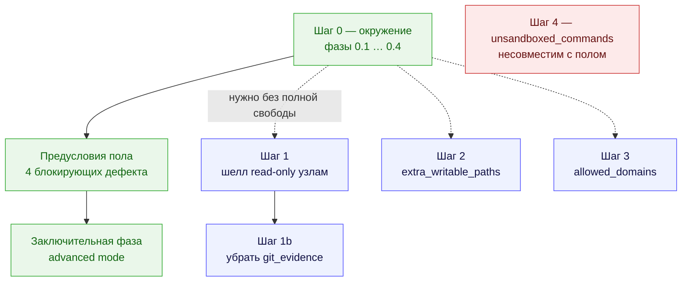
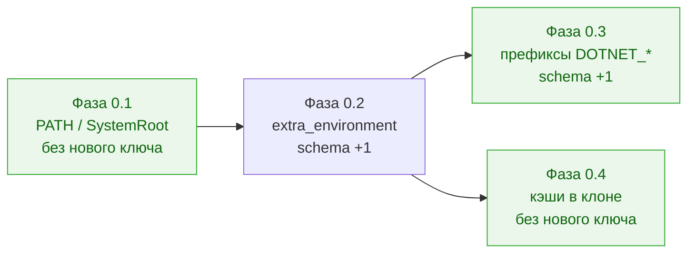

# Полный доступ агентов к утилитам машины — кампания

Status: **Шаг 0 — accepted, в работе по фазам; предусловия пола — четыре блокирующих дефекта, приняты в объём и не начаты; advanced mode — требования согласованы, все 12 вопросов закрыты 2026-08-17; Шаги 1, 1b, 2, 3 — остаются предложением для конфигураций без режима; Шаг 4 — требует отдельного решения, он несовместим с полом** Date: 2026-08-13 Owner: Vladimir Makarevich Revised: 2026-08-17 (очередь пересобрана после решений по advanced mode)

Папка держит одну цель — «агент пользуется любой утилитой, которая есть на машине, а публикацию по-прежнему делает только оркестратор» — и разбивает её на шаги, которые принимаются в работу **по одному**.

Решениями владельца 2026-08-17 форма кампании изменилась. Advanced mode перестал быть «одним из шагов после Шага 0» и стал её завершением: он снимает все четыре стены сразу, поэтому Шаги 1–3 поглощает **по эффекту** — они остаются в очереди только для операторов, которым нужна одна конкретная возможность без полной свободы. Отдельного ключа у режима нет: режимом стал сам `strict_isolation: false`, а провайдерские `danger-full-access` / `bypassPermissions` из продукта удаляются. Полные формулировки — в [requirements-advanced-mode.md](requirements-advanced-mode.md).

## Что где лежит

| Документ | Роль |
| --- | --- |
| [full-tool-access-for-agents.md](full-tool-access-for-agents.md) | ADR: цель, четыре стены, механизмы, границы, реестр принятых ослаблений, решения владельца и таблица живых проб. **Дизайн-обоснование, а не контракт приёмки.** Раздел «Что осознанно не делаем» устарел в части full-access режимов — их решено удалить, а не «не использовать». |
| `full-tool-access-for-agents.codex.audit.md` | Записанный аудит Codex-стыка (13 пунктов + список того, что нельзя проверить офлайн). Файл исключён из Markdown-гейта: его ссылки — абсолютные пути хоста, который его произвёл, и переписывать их значит подделать запись. |
| [requirements-step-0.md](requirements-step-0.md) | **Контракт приёмки Шага 0**: инварианты, требования Т0.x с критериями приёмки, отрицательные требования и DoD. |
| [phase-0-1-allowed-environment.md](phase-0-1-allowed-environment.md) | Фаза 0.1 — сломанный `allowed_environment` виден до запуска (0a). |
| [phase-0-2-extra-environment.md](phase-0-2-extra-environment.md) | Фаза 0.2 — новый ключ `security.extra_environment` (0b). |
| [phase-0-3-prefix-patterns.md](phase-0-3-prefix-patterns.md) | Фаза 0.3 — префиксные шаблоны в `allowed_environment` (0c). |
| [phase-0-4-toolcache-in-clone.md](phase-0-4-toolcache-in-clone.md) | Фаза 0.4 — кэши тулчейнов внутрь клона и защита от разбухшего diff. |
| [open-question-advanced-mode.md](open-question-advanced-mode.md) | **Запись идеи** advanced mode и её мотива, с шестью исходными вопросами. Историческая ценность: показывает, с чего начинали и что разбор перевернул. |
| [preconditions-floor.md](preconditions-floor.md) | **Предусловия пола** — контракт приёмки этапа между Шагом 0 и режимом: четыре места, где гарантия «коммит / пуш / PR только оркестратор» сегодня не проверяется или не удерживается, с решениями владельца и AC, плюс снятое с объёма пятое. Плюс семь находок разбора, которые заводятся отдельными задачами. |
| [requirements-advanced-mode.md](requirements-advanced-mode.md) | **Заключительная фаза кампании:** решения владельца по всем 12 вопросам с отклонёнными вариантами, определение пола через свойства, требования ТA.1–ТA.9, отрицательные требования, тесты и живые пробы. Предусловия вынесены в соседний документ. |

## Порядок

Сплошные стрелки — обязательная последовательность, пунктир — «берётся отдельным решением под конкретную потребность».

**Шаг 0 идёт первым** — не только потому, что дешёвый, а потому что даёт данные: первый же реальный прогон после него показывает, сколько конфигурирования реально остаётся. Порядок внутри него обязателен в одном месте: 0.3 и 0.4 стоят на механизме, который вводит 0.2.

**Предусловия пола идут вторыми и обязательны.** Это не «улучшения», а четыре места, где заявленная гарантия сегодня не проверяется или не удерживается: пол не доказан ни одной пробой; `push` и PR агента не детектируются вообще; чужая публикация **усыновляется** и записывается как успех оркестратора; самокоммит обнуляет гейт опасного диффа. Три из четырёх — дефекты и без всякого режима, поэтому часть работы окупается сразу. Пятое кандидатное предусловие — недосягаемость учётных данных — разобрано и **снято с объёма**: пол при этом честно сужается, и требования это фиксируют, а не замалчивают. Контракт приёмки этапа — [preconditions-floor.md](preconditions-floor.md).

**Advanced mode идёт последним** — по той же причине, по которой Шаг 0 идёт первым, и потому что без предусловий его включение нечем проверить.

Правило по живым пробам (решение владельца 2026-08-13): **проба — часть DoD своей фазы**. Unit- и fake-CLI-тесты доказывают проводку, живая проба доказывает эффект; то, что не удалось доказать на доступном хосте (в первую очередь Windows), закрывается фазой как **«не доказано»** — строкой в разделе поправок этого README и громкой строкой `worc preflight`, а не молчанием.

## Что остаётся предложением и при каком условии берётся

Все три шага ниже режим поглощает **по эффекту**: включивший его оператор получает и шелл везде, и запись наружу, и сеть. Смысл они сохраняют ровно один — дать одну возможность тому, кто не хочет остальных.

| Шаг | Что даёт без режима | Условие, при котором имеет смысл открывать |
| --- | --- | --- |
| 1 — `read-only` узлы получают шелл | шелл аналитическим узлам при `strict_isolation: true`, то есть без полной свободы | нужен по факту: узел `deep_research` / `security_audit` не может привести доказательство без `rg`/`git log`, а включать ради этого режим — несоразмерно. Самый дорогой шаг: fail-open принят без страховки, и цена «догонять релизы Claude Code» — постоянная |
| 1b — убрать `git_evidence` | уборка 61 упоминания механики гранта | только после [upgrade-flows](../upgrade-flows.md): флоу парсятся fail-closed, удаление ключа ломает все установленные `deep_research`. Режим механику не убирает — он её обходит, поэтому 1b от него не зависит |
| 2 — `extra_writable_paths` | точечная запись за пределами клона | только для того, что **не закрылось Фазой 0.4** и не стоит включения режима: утилита с зашитым путём или кэш, который оператор не хочет держать в клоне |
| 3 — `allowed_domains` + Codex-опт-ин | доменная сеть вместо «всё или ничего» | **частично потребляется режимом**: эмиссия сети у Codex и снятие классового запрета «`workspace-write` + сеть» нужны режиму и делаются в нём. Отдельно остаётся сама доменная грамматика — для тех, кому нужен `restore` с одного реестра, а не весь интернет; её enforcement на Codex стоит на experimental `network_proxy`, который на проверенной версии CLI выключен |

**Шаг 4 (`unsandboxed_commands`) выведен из очереди и требует отдельного решения.** Режим его **не** даёт и дать не может: команда вне песочницы — это команда, для которой не действует вырез `.git`, то есть ровно то, за что из продукта удаляются `danger-full-access` и `bypassPermissions`. `docker run -v <клон>:/repo` пишет в `.git` мимо любой нашей политики. Поэтому Шаг 4 несовместим с полом по построению, и открывать его означает принять, что для перечисленных команд гарантии нет. Отдельно к сведению: из первоначального списка кандидатов `gh` и `osascript -e` в песочнице **работают** и в ключ не попадают ни при каком решении.

## Решения владельца по advanced mode (2026-08-17)

Двенадцать вопросов закрыты за один разбор; полные формулировки, отклонённые варианты и их цена — в [requirements-advanced-mode.md](requirements-advanced-mode.md). Здесь только то, что меняет форму кампании:

- **режим включает всё, в том числе сеть** — поэтому Шаги 1–3 поглощаются по эффекту, а пол переопределён: `.git` неписабелен, `.worc` недосягаем для записи, у агента нет учётных данных ни в окружении, ни на диске;
- **отдельного ключа нет** — режимом стал `strict_isolation: false`, и вместе с этим `danger-full-access` / `bypassPermissions` удаляются из продукта вместе со слоем, который их гейтил (`find_full_access_args`, `isolation_reasons`, `ISOLATION_CHECKS`, поле `sandbox`);
- **на хосте без песочницы — WARN, а не отказ**: пола там нет ни в одной из двух половин, и он заменяется усиленной advisory-преамбулой и детектом постфактум;
- **шелл без ограничений** у каждого узла, включая `read-only`.

## Решения владельца при разборе фаз (2026-08-13)

Все четыре фазы разобраны, открытых вопросов по ним не осталось. Полные формулировки — в [requirements-step-0.md](requirements-step-0.md) и в файлах фаз; здесь одна строка на решение, чтобы их не искать по четырём документам.

| Фаза | Решение | Коротко о причине |
| --- | --- | --- |
| 0.2 | построитель дочернего env принимает `SecurityConfig` целиком | пропуск доставки ловит тип, а не ревьюер; вариант с обязательным параметром всё ещё позволял бы передать пустой маппинг |
| 0.2 | Git Manager пиннит `LC_ALL=C` для `git` и `gh` | он классифицирует результаты по английским строкам вывода; `LANG` из конфига иначе превращал бы временный сбой сети в отказ задачи, молча |
| 0.2 | preflight печатает только **имена** заданных переменных | значения и так лежат в конфиге оператора; печать даёт секрету, попавшему туда вопреки гайду, лишнюю поверхность |
| 0.2 | окружение **не** пишется в артефакты попытки | сегодня его там нет вовсе; воспроизводимость прогона — отдельная фича, не часть Шага 0 |
| 0.2 | грамматика имени, пустое значение разрешено, дубликаты по регистру отвергаются | опечатки ловятся до запуска; на Windows окружение регистронезависимо |
| 0.3 | раскрытие шаблонов — чистая функция, печатают preflight и старт прогона | иначе логгер и глобальное состояние переезжают в модуль без зависимостей, а предупреждение дублируется на каждый дочерний процесс |
| 0.3 | шаблон с секретным префиксом (`SECRET_*`) отвергается | он может раскрыться только в отбрасываемое — то есть вводит оператора в заблуждение |
| 0.3 | preflight печатает, что дал каждый шаблон | шаблон, давший ноль имён, — почти всегда опечатка, и сегодня это не видно ничем; ширину шаблона при этом не ограничиваем |
| 0.4 | проверка путей в два уровня: лексическая в валидаторе, канонизирующая в preflight | резолв symlink обязан трогать диск, а вердикт по конфигу должен быть одинаков на любой машине |
| 0.4 | значение разбивается по `os.pathsep` перед проверкой | иначе `PYTHONPATH="/repo/.worc:/x"` проходит мимо запрета целиком |
| 0.4 | игнор кэша обеспечивает **оркестратор** через `.git/info/exclude` | `.gitignore` агент с `workspace-write` может переписать, а `.git` ему запрещён; обёртка над `check-ignore` и прецедент правки ignore-правил в коде уже есть |
| 0.4 | путь вне клона — WARN, не FAIL | без Шага 2 туда писать нельзя, и сборка упадёт с ошибкой прав, похожей на «сломался dotnet» |

## Поправки к ADR, найденные при формировании требований (2026-08-13)

Сверка ADR с кодом перед приёмкой Шага 0. Все четыре внесены в сам ADR, чтобы из него нельзя было реализовать с неверной посылки.

1. **`schema_version` уже 35**, а не 34 ([`schema.py:198`](../../../src/wastech_orchestrator/config/schema.py)) — версию подняли под другую задачу. Вся нумерация в ADR сдвинута на единицу: первый шаг, который поедет, берёт 36.
2. **Call-site'ов `build_child_env` шесть, а не семь** — перечень в ADR был верный, ошибка была в счёте; номера строк актуализированы.
3. **Союз из 22 имён лежит в шаблоне, а не в сгенерированном конфиге.** `install` пишет только дефолт хост-ОС (9 имён на POSIX) через `list(default_allowed_environment())` ([`config_writer.py:143`](../../../src/wastech_orchestrator/install/config_writer.py)); 22 имени — это [`config.example.yaml`](../../../src/wastech_orchestrator/packaged/config.example.yaml), из которого мержит `upgrade-config`.
4. **Переезд документа в подпапку (`7dda128`) сломал все его относительные ссылки** — 106 на `src/`, 3 на `tests/` и 4 на соседние документы очереди, плюс входящая ссылка из [../README.md](../README.md). Гейт этого не заметил, потому что `wastech-mdlint` локальный и `WASTECH_MDLINT_HOME` на машине не выставлен. Ссылки починены; **сам факт стоит запомнить**: перемещение документа в этом корпусе не проверяется ничем, кроме установленного гейта.
