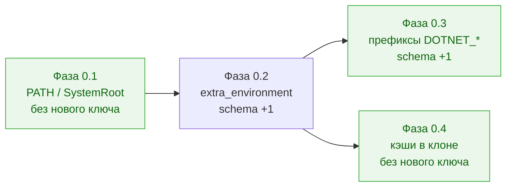

# Полный доступ агентов к утилитам машины — кампания

Status: **Шаг 0 — accepted, в работе по фазам; Шаги 1, 1b, 2, 3, 4 — proposed** Date: 2026-08-13 Owner: Vladimir Makarevich

Папка держит одну цель — «агент пользуется любой утилитой, которая есть на машине, а публикацию по-прежнему делает только оркестратор» — и разбивает её на шаги, которые принимаются в работу **по одному**. Решение владельца 2026-08-13: сначала целиком Шаг 0, остальные шаги остаются предложением и берутся отдельным решением.

## Что где лежит

| Документ | Роль |
| --- | --- |
| [full-tool-access-for-agents.md](full-tool-access-for-agents.md) | ADR: цель, четыре стены, механизмы, границы, реестр принятых ослаблений, решения владельца и таблица живых проб. **Дизайн-обоснование, а не контракт приёмки** — из него нельзя реализовывать напрямую, потому что он описывает все пять шагов сразу. |
| `full-tool-access-for-agents.codex.audit.md` | Записанный аудит Codex-стыка (13 пунктов + список того, что нельзя проверить офлайн). Файл исключён из Markdown-гейта: его ссылки — абсолютные пути хоста, который его произвёл, и переписывать их значит подделать запись. |
| [requirements-step-0.md](requirements-step-0.md) | **Контракт приёмки Шага 0**: инварианты, нумерованные требования Т0.x с критериями приёмки, отрицательные требования и DoD. Это то, по чему принимается работа. |
| [phase-0-1-allowed-environment.md](phase-0-1-allowed-environment.md) | Фаза 0.1 — сломанный `allowed_environment` виден до запуска (0a). |
| [phase-0-2-extra-environment.md](phase-0-2-extra-environment.md) | Фаза 0.2 — новый ключ `security.extra_environment` (0b). |
| [phase-0-3-prefix-patterns.md](phase-0-3-prefix-patterns.md) | Фаза 0.3 — префиксные шаблоны в `allowed_environment` (0c). |
| [phase-0-4-toolcache-in-clone.md](phase-0-4-toolcache-in-clone.md) | Фаза 0.4 — кэши тулчейнов внутрь клона и защита от разбухшего diff. |

## Порядок Шага 0

Каждая фаза — отдельный PR и отдельное «готово». Порядок обязателен только в одном месте: 0.3 и 0.4 стоят на механизме, который вводит 0.2. Фаза 0.1 ни от чего не зависит и идёт первой, потому что чинит диагностику, которой сейчас нет вовсе.

Правило по живым пробам (решение владельца 2026-08-13): **проба — часть DoD своей фазы**. Unit- и fake-CLI-тесты доказывают проводку, живая проба доказывает эффект; то, что не удалось доказать на доступном хосте (в первую очередь Windows), закрывается фазой как **«не доказано»** — строкой в разделе поправок этого README и громкой строкой `worc preflight`, а не молчанием.

## Что остаётся предложением и при каком условии берётся

| Шаг | Что даёт | Условие, при котором имеет смысл открывать |
| --- | --- | --- |
| 1 — `read-only` узлы получают шелл | инверсия tool-гейта Claude, `allow_unsandboxed_shell` | нужен по факту: аналитический узел `deep_research` / `security_audit` не может привести доказательство без `rg`/`git log`. Самый дорогой шаг: fail-open принят без страховки, и цена «догонять релизы Claude Code» — постоянная |
| 1b — убрать `git_evidence` | уборка 61 упоминания механики гранта | только после [upgrade-flows](../upgrade-flows.md): флоу парсятся fail-closed, удаление ключа ломает все установленные `deep_research` |
| 2 — `extra_writable_paths` | запись за пределами клона | только для того, что **не закрылось Фазой 0.4**: утилита с зашитым путём или кэш, который оператор не хочет держать в клоне |
| 3 — `allowed_domains` + Codex-опт-ин | доменная сеть вместо «всё или ничего» | когда агенту нужен `restore`/`install` внутри своего турна на Codex; enforcement стоит на experimental `network_proxy`, который на проверенной версии CLI `experimental false` |
| 4 — `unsandboxed_commands` | команда вне песочницы | только под названную утилиту с **доказанной** несовместимостью. `gh` и `osascript -e` в песочнице работают — вносить их в ключ значит бесплатно отдать путь публикации |

Требования для этих шагов пишутся тогда, когда шаг берётся, — по образцу [requirements-step-0.md](requirements-step-0.md), одним файлом на шаг.

## Поправки к ADR, найденные при формировании требований (2026-08-13)

Сверка ADR с кодом перед приёмкой Шага 0. Все четыре внесены в сам ADR, чтобы из него нельзя было реализовать с неверной посылки.

1. **`schema_version` уже 35**, а не 34 ([`schema.py:198`](../../../src/wastech_orchestrator/config/schema.py)) — версию подняли под другую задачу. Вся нумерация в ADR сдвинута на единицу: первый шаг, который поедет, берёт 36.
2. **Call-site'ов `build_child_env` шесть, а не семь** — перечень в ADR был верный, ошибка была в счёте; номера строк актуализированы.
3. **Союз из 22 имён лежит в шаблоне, а не в сгенерированном конфиге.** `install` пишет только дефолт хост-ОС (9 имён на POSIX) через `list(default_allowed_environment())` ([`config_writer.py:143`](../../../src/wastech_orchestrator/install/config_writer.py)); 22 имени — это [`config.example.yaml`](../../../src/wastech_orchestrator/packaged/config.example.yaml), из которого мержит `upgrade-config`.
4. **Переезд документа в подпапку (`7dda128`) сломал все его относительные ссылки** — 106 на `src/`, 3 на `tests/` и 4 на соседние документы очереди, плюс входящая ссылка из [../README.md](../README.md). Гейт этого не заметил, потому что `wastech-mdlint` локальный и `WASTECH_MDLINT_HOME` на машине не выставлен. Ссылки починены; **сам факт стоит запомнить**: перемещение документа в этом корпусе не проверяется ничем, кроме установленного гейта.
