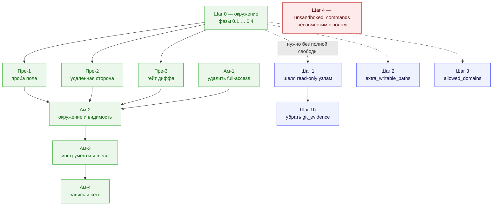
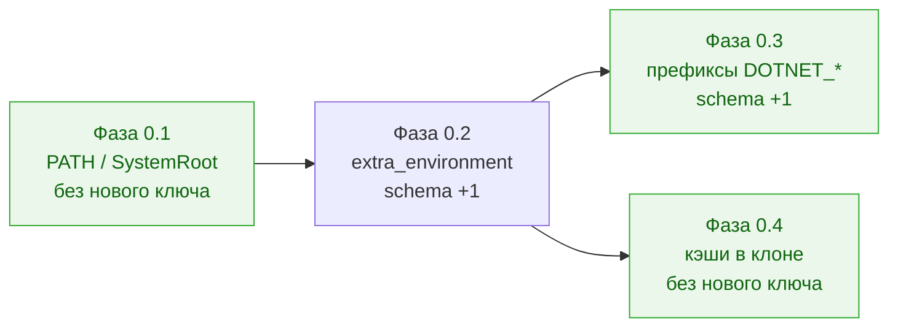

# Полный доступ агентов к утилитам машины — кампания

Status: **Шаг 0 — реализован полностью (фазы 0.1–0.4, 2026-08-18); предусловия пола — четыре блокирующих дефекта плюс закрытие `Read`, приняты в объём и не начаты; advanced mode — все 17 вопросов закрыты (1–12 разбором, 13–17 независимым ревью того же дня), после Codex-ревью 2026-08-17 открыты два точечных решения по реализации; Шаги 1, 1b, 2, 3 — остаются предложением для конфигураций без режима; Шаг 4 — требует отдельного решения, он несовместим с полом** Date: 2026-08-13 Owner: Vladimir Makarevich Revised: 2026-08-17 (очередь пересобрана после решений по advanced mode; затем — поправки независимого ревью, см. раздел поправок)

Папка держит одну цель — «агент пользуется любой утилитой, которая есть на машине, а публикацию по-прежнему делает только оркестратор» — и разбивает её на шаги, которые принимаются в работу **по одному**.

Решениями владельца 2026-08-17 форма кампании изменилась. Advanced mode перестал быть «одним из шагов после Шага 0» и стал её завершением: он снимает все четыре стены сразу, поэтому Шаги 1–3 поглощает **по эффекту** — они остаются в очереди только для операторов, которым нужна одна конкретная возможность без полной свободы. Отдельного ключа у режима нет: режимом стал сам `strict_isolation: false`, а провайдерские `danger-full-access` / `bypassPermissions` из продукта удаляются. Полные формулировки — в [requirements-advanced-mode.md](requirements-advanced-mode.md).

## Что где лежит

| Документ | Роль |
| --- | --- |
| [full-tool-access-for-agents.md](full-tool-access-for-agents.md) | ADR: цель, четыре стены, механизмы, границы, реестр принятых ослаблений, решения владельца и таблица живых проб. **Дизайн-обоснование, а не контракт приёмки.** Актуализирован после advanced-mode ревью: full-access селекторы описаны как удаляемые, `denied_commands` больше не назван полом, а публикация разделена на продуктовый мандат и механические гарантии. Контракт приёмки advanced mode всё равно живёт в [requirements-advanced-mode.md](requirements-advanced-mode.md), а не здесь. |
| `full-tool-access-for-agents.codex.audit.md` | Записанный аудит Codex-стыка: исходные 13 пунктов от 2026-08-05 плюс актуализация 2026-08-17 под advanced mode и `codex-cli 0.144.4`. Файл исключён из Markdown-гейта: старая часть содержит абсолютные пути хоста, который её произвёл; новая часть добавлена как отдельная запись, а не переписана поверх истории. |
| [requirements-step-0.md](requirements-step-0.md) | **Контракт приёмки Шага 0**: инварианты, требования Т0.x с критериями приёмки, отрицательные требования и DoD. |
| [phase-0-1-allowed-environment.md](phase-0-1-allowed-environment.md) | Фаза 0.1 — сломанный `allowed_environment` виден до запуска (0a). **Реализована 2026-08-18**, кроме живой пробы на Windows. |
| [phase-0-2-extra-environment.md](phase-0-2-extra-environment.md) | Фаза 0.2 — новый ключ `security.extra_environment` (0b). **Реализована 2026-08-18** (`schema_version` 36), кроме живой пробы. |
| [phase-0-3-prefix-patterns.md](phase-0-3-prefix-patterns.md) | Фаза 0.3 — префиксные шаблоны в `allowed_environment` (0c). **Реализована 2026-08-18** (`schema_version` 37), живая проба выполнена. |
| [phase-0-4-toolcache-in-clone.md](phase-0-4-toolcache-in-clone.md) | Фаза 0.4 — кэши тулчейнов внутрь клона и защита от разбухшего diff. **Реализована 2026-08-18**, живая проба выполнена; в документе — список того, что после неё остаётся за Шагом 2. |
| [open-question-advanced-mode.md](open-question-advanced-mode.md) | **Запись идеи** advanced mode и её мотива, с шестью исходными вопросами. Историческая ценность: показывает, с чего начинали и что разбор перевернул. |
| [phase-pre-1-floor-probe.md](phase-pre-1-floor-probe.md) | Фаза Пре-1 — пол доказывается пробой: две пробы в канарейку Codex, платный смоук по опт-ину у Claude. |
| [phase-pre-2-remote-side.md](phase-pre-2-remote-side.md) | Фаза Пре-2 — удалённая сторона: отпечаток `ls-remote` / push-URL / PR по каждой попытке и восстановление вместо усыновления (четыре случая). |
| [phase-pre-3-diff-gate.md](phase-pre-3-diff-gate.md) | Фаза Пре-3 — гейт опасного диффа считается от одобренного состояния, а не от `HEAD`; брекет детекта перекейен на «у попытки есть шелл». |
| [phase-am-1-drop-full-access.md](phase-am-1-drop-full-access.md) | Фаза Ам-1 — `danger-full-access` и `bypassPermissions` удаляются вместе со слоем их гейтинга. Единственная фаза, которая уменьшает кодовую базу. |
| [phase-am-2-environment-and-visibility.md](phase-am-2-environment-and-visibility.md) | Фаза Ам-2 — окружение целиком, инверсия редакции, вся видимость режима. После неё `strict_isolation: false` начинает означать advanced mode. |
| [phase-am-3-tools-and-shell.md](phase-am-3-tools-and-shell.md) | Фаза Ам-3 — снятие гейта существования инструментов, шелл у каждого узла, `write_guard` на каждой попытке. |
| [phase-am-4-write-and-network.md](phase-am-4-write-and-network.md) | Фаза Ам-4 — запись за пределы клона и полная сеть; пол принимает окончательную форму. |
| [preconditions-floor.md](preconditions-floor.md) | **Предусловия пола** — контракт приёмки этапа между Шагом 0 и режимом: четыре места, где гарантия «коммит / пуш / PR только оркестратор» сегодня не проверяется или не удерживается, с решениями владельца и AC, плюс снятое с объёма пятое. Плюс семь находок разбора, которые заводятся отдельными задачами. |
| [requirements-advanced-mode.md](requirements-advanced-mode.md) | **Заключительная фаза кампании:** решения владельца по всем 12 вопросам с отклонёнными вариантами, определение пола через свойства, требования ТA.1–ТA.9, отрицательные требования, тесты и живые пробы. Предусловия вынесены в соседний документ. |

## Порядок

Сплошные стрелки — обязательная последовательность, пунктир — «берётся отдельным решением под конкретную потребность». Три фазы предусловий друг от друга не зависят и могут идти параллельно. **Ам-1 не зависит ни от чего и может идти первой** — но только потому, что решением владельца по вопросу 17 WARN-вердикт хостовой проверки введён в ней же. Вынести проверку, оставив её вердикт фатальным (`raise PipelineFailed`), нельзя: между Ам-1 и Ам-3 `strict_isolation: false` на Linux без `bwrap`/`socat` перестал бы запускаться, хотя сегодня работает. Цена принята: Ам-1 перестаёт быть фазой, которая только удаляет код — она ещё и дописывает случай нативной Windows, который сегодня не флагуется вовсе.

Внутри блока режима порядок является требованием корректности, а не удобства: Ам-3 без Пре-3 выдаёт `read-only` узлу шелл при том, что `.git` у него в профиле не описан вовсе, а Ам-4 без Пре-1 вводит `allowWrite` и делает вырез `.git` недоказанным.

**Шаг 0 идёт первым** — не только потому, что дешёвый, а потому что даёт данные: первый же реальный прогон после него показывает, сколько конфигурирования реально остаётся. Порядок внутри него обязателен в одном месте: 0.3 и 0.4 стоят на механизме, который вводит 0.2.

**Предусловия пола идут вторыми и обязательны.** Это не «улучшения», а четыре места, где заявленная гарантия сегодня не проверяется или не удерживается: пол не доказан ни одной пробой; `push` и PR агента не детектируются вообще; чужая публикация **усыновляется** и записывается как успех оркестратора; самокоммит обнуляет гейт опасного диффа. Три из четырёх — дефекты и без всякого режима, поэтому часть работы окупается сразу. Пятое кандидатное предусловие — недосягаемость учётных данных — разобрано и **снято с объёма**: пол при этом честно сужается, и требования это фиксируют, а не замалчивают. Контракт приёмки этапа — [preconditions-floor.md](preconditions-floor.md).

**Advanced mode идёт последним** — по той же причине, по которой Шаг 0 идёт первым, и потому что без предусловий его включение нечем проверить.

Правило по живым пробам (решение владельца 2026-08-13): **проба — часть DoD своей фазы**. Unit- и fake-CLI-тесты доказывают проводку, живая проба доказывает эффект; то, что не удалось доказать на доступном хосте (в первую очередь Windows), закрывается фазой как **«не доказано»** — строкой в разделе поправок этого README и громкой строкой `worc preflight`, а не молчанием.

## Живые пробы, закрытые как «не доказано»

Таблица растёт по одной строке на фазу и существует затем, чтобы «не проверяли» нельзя было спутать с «проверили и работает». Строка снимается, когда проба выполнена на подходящем хосте.

| Фаза | Проба | Почему не доказана | Что вместо неё держит |
| --- | --- | --- | --- |
| 0.1 | AC0.1.4 — на Windows-хосте конфиг без `SystemRoot` останавливается на `worc preflight`, а не на молчаливом падении CLI | у владельца нет Windows-хоста; фаза реализована на macOS | тест с подставленной платформой (`system="Windows"` / `"Linux"`) на чистой функции и на самом `worc preflight`, плюс сам FAIL печатает `0xC0000409` — то есть на живом Windows нечего доказывать, кроме того, что `platform.system()` там возвращает `"Windows"` |
| 0.2 | AC0.2.7 — реальный прогон с непустым `extra_environment`: узел печатает своё окружение, набор checks печатает своё, значения совпадают | не хост, а цена: нужен целевой репозиторий и платный прогон живого CLI. Проба **выполнима оператором**, в отличие от строки выше | паритет Т0.5 закреплён как **равенство** (`env` набора checks `==` `build_child_env(config.security)`), а не как пересечение, и у каждого из шести мест построения окружения есть свой тест доставки. Живая проба добавила бы одно: что на реальном пути между ними не появился седьмой, необёрнутый запуск процесса |
| 0.4 | AC0.4.3, одна треть — канонизирующая проверка ловит **UNC- и drive-letter-алиас** одного пути | у владельца нет Windows-хоста; две другие трети той же AC доказаны здесь (symlink — живьём на реальной ФС, регистр — тестом с подставленной платформой) | сравнение идёт по `Path.resolve()`, который на Windows и раскрывает алиасы, и канонизирует регистр — то есть проверять на живом хосте пришлось бы не наш код, а поведение `_getfinalpathname`; плюс лексический уровень режет очевидные случаи независимо от ОС |

## Что остаётся предложением и при каком условии берётся

Все три шага ниже режим поглощает **по эффекту**: включивший его оператор получает и шелл везде, и запись наружу, и сеть. Смысл они сохраняют ровно один — дать одну возможность тому, кто не хочет остальных.

| Шаг | Что даёт без режима | Условие, при котором имеет смысл открывать |
| --- | --- | --- |
| 1 — `read-only` узлы получают шелл | шелл аналитическим узлам при `strict_isolation: true`, то есть без полной свободы | нужен по факту: узел `deep_research` / `security_audit` не может привести доказательство без `rg`/`git log`, а включать ради этого режим — несоразмерно. Самый дорогой шаг: fail-open принят без страховки, и цена «догонять релизы Claude Code» — постоянная |
| 1b — убрать `git_evidence` | уборка 134 строк с упоминанием механики гранта (163 вхождения в 45 файлах; в `src/` — 62 строки) | только после [upgrade-flows](../upgrade-flows.md): флоу парсятся fail-closed, удаление ключа ломает все установленные `deep_research`. Режим механику не убирает — он её обходит, поэтому 1b от него не зависит |
| 2 — `extra_writable_paths` | точечная запись за пределами клона | только для того, что **не закрылось Фазой 0.4** и не стоит включения режима: утилита с зашитым путём или кэш, который оператор не хочет держать в клоне |
| 3 — `allowed_domains` + Codex-опт-ин | доменная сеть вместо «всё или ничего» | **частично потребляется режимом**: эмиссия сети у Codex и снятие классового запрета «`workspace-write` + сеть» нужны режиму и делаются в нём. Отдельно остаётся сама доменная грамматика — для тех, кому нужен `restore` с одного реестра, а не весь интернет; её enforcement на Codex стоит на experimental `network_proxy`, который на проверенной версии CLI выключен |

**Шаг 4 (`unsandboxed_commands`) выведен из очереди и требует отдельного решения.** Режим его **не** даёт и дать не может: команда вне песочницы — это команда, для которой не действует вырез `.git`, то есть ровно то, за что из продукта удаляются `danger-full-access` и `bypassPermissions`. `docker run -v <клон>:/repo` пишет в `.git` мимо любой нашей политики. Поэтому Шаг 4 несовместим с полом по построению, и открывать его означает принять, что для перечисленных команд гарантии нет. Отдельно к сведению: из первоначального списка кандидатов `gh` и `osascript -e` в песочнице **работают** и в ключ не попадают ни при каком решении.

## Решения владельца по advanced mode (2026-08-17)

Двенадцать вопросов закрыты за один разбор; полные формулировки, отклонённые варианты и их цена — в [requirements-advanced-mode.md](requirements-advanced-mode.md). Здесь только то, что меняет форму кампании:

- **режим включает всё, в том числе сеть** — поэтому Шаги 1–3 поглощаются по эффекту, а пол переопределён: `.git` неписабелен, `.worc` недосягаем для записи, публикация в наш `origin` удерживается детектом, публикация куда-либо ещё не удерживается; креды из окружения и с диска не изымаются решением П5;
- **отдельного ключа нет** — режимом стал `strict_isolation: false`, и вместе с этим `danger-full-access` / `bypassPermissions` удаляются из продукта; удаляются `find_full_access_args`, full-access ветки проверок и поле `sandbox`, но `isolation_reasons` / `ISOLATION_CHECKS` остаются носителями host-capability и reserved-flag сигналов;
- **на хосте без песочницы — WARN, а не отказ**: пола там нет ни в одной из двух половин, и он заменяется усиленной advisory-преамбулой и детектом постфактум;
- **шелл без ограничений** у каждого узла, включая `read-only`.

## Решения владельца при разборе фаз (2026-08-13)

Все четыре фазы разобраны, открытых вопросов по ним не осталось. Полные формулировки — в [requirements-step-0.md](requirements-step-0.md) и в файлах фаз; здесь одна строка на решение, чтобы их не искать по четырём документам.

| Фаза | Решение | Коротко о причине |
| --- | --- | --- |
| 0.2 | построитель дочернего env принимает `SecurityConfig` целиком | пропуск доставки ловит тип, а не ревьюер; вариант с обязательным параметром всё ещё позволял бы передать пустой маппинг |
| 0.2 | Git Manager пиннит `LC_ALL=C` для `git` и `gh` | он классифицирует результаты по английским строкам вывода; `LANG` из конфига иначе превращал бы временный сбой сети в отказ задачи, молча |
| 0.2 | preflight печатает только **имена** заданных переменных | значения и так лежат в конфиге оператора; печать даёт секрету, попавшему туда вопреки гайду, лишнюю поверхность |
| 0.2 | окружение **не** пишется в артефакты попытки | сегодня его там нет вовсе; воспроизводимость прогона — отдельная фича, не часть Шага 0 |
| 0.2 | грамматика имени, пустое значение разрешено, дубликаты по регистру отвергаются | опечатки ловятся до запуска; на Windows окружение регистронезависимо |
| 0.3 | раскрытие шаблонов — чистая функция, печатают preflight и старт прогона | иначе логгер и глобальное состояние переезжают в модуль без зависимостей, а предупреждение дублируется на каждый дочерний процесс |
| 0.3 | шаблон с секретным префиксом (`SECRET_*`) отвергается | он может раскрыться только в отбрасываемое — то есть вводит оператора в заблуждение |
| 0.3 | preflight печатает, что дал каждый шаблон | шаблон, давший ноль имён, — почти всегда опечатка, и сегодня это не видно ничем; ширину шаблона при этом не ограничиваем |
| 0.4 | проверка путей в два уровня: лексическая в валидаторе, канонизирующая в preflight | резолв symlink обязан трогать диск, а вердикт по конфигу должен быть одинаков на любой машине |
| 0.4 | значение разбивается по `os.pathsep` перед проверкой | иначе `PYTHONPATH="/repo/.worc:/x"` проходит мимо запрета целиком |
| 0.4 | игнор кэша обеспечивает **оркестратор** через `.git/info/exclude` | `.gitignore` агент с `workspace-write` может переписать, а `.git` ему запрещён; обёртка над `check-ignore` и прецедент правки ignore-правил в коде уже есть |
| 0.4 | путь вне клона — WARN, не FAIL | без Шага 2 туда писать нельзя, и сборка упадёт с ошибкой прав, похожей на «сломался dotnet» |

## Поправки независимого ревью (2026-08-17)

Ревью «на свежую голову» перепроверило по коду около шестидесяти утверждений, на которых стоит дизайн. Тринадцать из пятнадцати несущих подтвердились; ниже — то, что не подтвердилось или подтвердилось не в той форме. Все поправки внесены в сами документы, чтобы из них нельзя было реализовать с неверной посылки.

1. **Пол описан не полностью: есть четвёртый уровень.** Публикация **от имени оркестратора** — через то, что оркестратор читает и запускает вне клона (`worc` на `PATH` и код пакета, `~/.gitconfig`, шимы `git`/`gh`/`ps`/`bwrap`, `~/.config/gh/hosts.yml`), плюс самовыдача исполнения кода через проектный конфиг CLI **внутри** клона (хуки и MCP, открытые на шипнутом дефолте намеренно). Отпечаток `origin` этого не ловит по построению. **Закрыто решением владельца 2026-08-17: удерживается детектом, а не запретом** — проектный конфиг CLI и `~/.gitconfig` уходят в отпечаток и `--repo` появляется на каждом `gh` (Пре-2), исполняемые файлы пиннятся абсолютными путями с проверкой в preflight (Ам-2). Расширение пола на `$HOME` и `PATH` отклонено: оно вернуло бы стену 3 и сломало легальные задачи. Описание — ТA.1, требование — ТA.1.7, поверхность CLI — ТA.3.6.
2. **П4 стоял на неверном описании сегодняшнего состояния — и дыра шире, а не уже.** У пишущего узла самокоммит гейт не ослепляет, а паркует задачу до гейта; у `read-only` узла отпечаток снимается только при объявленном `git_evidence` и включённом `allow_git_evidence`, то есть по умолчанию там нет даже предупреждения; у Codex `read-only` узел имеет шелл уже сегодня. Плюс три пути, где гейт не «ослеплён», а не запускается вовсе: `hitl` на пишущем узле, `tool`-узлы, `evaluator`. AC4.1 переформулирован, добавлены П4.4 и AC4.5. **Решение владельца 2026-08-17 (П-В1): все три узла в объём Пре-3** — гейт становится полным, и инвариант «удаления и правки манифеста требуют одобрения» начинает держаться на всех путях.
3. **Пре-2 неисполнима без записи пушнутого SHA:** `publish_operations` для `push` пишет имя ветки и в `fingerprint`, и в `result_ref`, SHA нет нигде. Ни правило сравнения П2.2, ни различение случаев 3/4 без него не строятся, а фаза не заявляла ни `DB_SCHEMA_VERSION`, ни носителя. **Решение владельца 2026-08-17 (П-В2): аддитивная колонка в `publish_operations` и `DB_SCHEMA_VERSION` +1**, миграция по образцу Пре-3; переиспользование `fingerprint` отклонено, потому что трогало бы ровно тот механизм идемпотентности, который П3 и чинит.
4. **Ам-1 в написанном виде ломает продукт для хостов из решения по вопросу 4** и стоит на четырёх неверных утверждениях: хостовая проверка не покрывает нативную Windows (в коде это сказано прямо), гейтится на сконфигурированном профиле провайдера, `ISOLATION_CHECKS` нельзя удалить (жив `check_isolation`, и есть третий консьюмер — `_can_isolate` в роутере), `isolation_reasons` несёт два эффекта, к full-access не относящихся. **Решение владельца 2026-08-17 (вопрос 17): WARN-вердикт вводится в самой Ам-1**, поэтому промежуточной поломки нет ни на одной границе фаз и право идти первой сохраняется; цена — Ам-1 перестаёт быть фазой, которая только удаляет код.
5. **`summary.md` — легальный канал агента в тело PR и в коммит, и write-deny его не закрывает:** содержимое пишет агент, а слот `summary` пишется **без редакции** (`redact_text` только у слота `report`). Заведено требованием ТA.7.4.
6. **Обоснование ТA.2.3 сегодня не работает:** «в обход собственного запрета» — а запрета нет, `Read` читает `.worc/.env` на шипнутом дефолте. При этом требование заставляет оператора переносить секрет из gitignored `.env` в `config.yaml` открытым текстом. **Решение владельца (вопрос 14): починить основание, а не снять требование** — `Read` для приватного набора закрывается независимо от read-изоляции, и это блокирующее внутри Ам-2. Находка переехала из «не входит в этап» в объём.
7. **Инверсия редакции стоит дороже, чем записано:** `"pwd"` — секретный сегмент, `PWD` не в allow-list, поэтому путь репозитория уже сегодня вычищается из артефактов, а инверсия забирает единственный выход. **Решение владельца (вопрос 15): exempt-список (`PWD`, `OLDPWD`) в обеих ветках правила** — чинит и сегодняшний дефект, и цену инверсии, не трогая ни `is_sensitive_key`, ни И-4.
8. **«Git Manager байт в байт как сегодня» — ловушка:** сегодня внутри Git Manager есть полный `os.environ` (`check-ignore`), и именно на нём стоит решение Фазы 0.4. Политик окружения шесть плюс четыре, а не шесть плюс одна, и три из четырёх — полный `os.environ`.
9. **Три «пола»-запрета инструментов — это трение, а не граница.** `CronCreate` / `RemoteTrigger` обоснованы барьером тишины процесса, который право писать вне клона отменяет; `EnterWorktree` обоснован обходом `write_guard`, который покрывает и common-dir, а `git worktree add` и так пишет в запрещённый gitdir. Запреты остаются, классификация исправлена.
10. **Остатки снятого П5** в трёх местах требований (ссылки на «набор кредов в ТA.8.4», «разрыв зависимости read-deny от read-изоляции», «обе половины пола» в ТA.9.3) убраны; в ТA.9.3 вместо кредов названо то, что там действительно теряется, — `.worc`, а с ним обнаружение подмены контрольного плана, карантин обменника и целостность `state.db`.
11. **Утверждение «публикует только оркестратор» живёт в 38 местах 30 файлов**, включая две runtime-строки (preflight и лог прогона), правила ветки, сам ADR и **четыре скилла, которые велят будущим агентам отвергать противоречащие находки как невалидные**. Перечень «схема, гайд, preflight, промпт» из ТA.1.4 заменён полным списком. Отдельно: **инвариант в [architecture.md](../../../.agents/rules/architecture.md) сужается решением владельца (вопрос 16)** — точная согласованная формулировка лежит в самом вопросе, а правка едет с Ам-4, не раньше; просьба «описать режим как не нарушающий инвариант» снята как подгонка текста под факт.
12. **Счётчики и указатели:** вызовов `gh` — восемь через обёртку плюс один прямой, а не десять; упоминаний `git_evidence` — 163 вхождения / 134 строки, а не 61; у `strict_isolation` в схеме комментария нет вовсе (писать, а не переписывать); `_REMOVED_KEYS` не даёт конфигу загрузиться — это список для вычистки, и вся эта совместимость здесь не нужна при нулевой базе установок; `--disallowedTools` сегодня не в required-наборе флагов; хостовая проверка — `claude.py:859-864`, а не `:731`; Codex эмитит `--disable` не безусловно (`hooks` уходит на шипнутом дефолте). Подтвердилось при этом главное: `denied_commands` в Codex не проецируется ни строкой, `network.enabled = false` эмитится безусловно на обоих профилях, канарейка не делает ни одной пробы по `.git` (и при этом сама собирает write-guard с `.git`), `push` в NEW записывает чужую ветку своей, `_find_open_pr` дописывает чужой PR (и переименовывает его), `request.json` удаляется на шипнутом дефолте.

Единственное утверждение из списка обязательных перепроверок, которое **не подтвердилось**: «`GitControlState` не содержит remote-ссылок». `config` в отпечатке — нефильтрованный `git config --local --worktree --list`, то есть `remote.origin.url`, `pushurl` и `branch.*` там уже есть, и подмена во время попытки уже ловится; нет только `ls-remote`, remote-tracking ссылок и состояния PR. Формулировка в [preconditions-floor.md](preconditions-floor.md) при этом была точной — сужена только П2.4.

## Поправки Codex-стыка по advanced mode (2026-08-17)

Повторное ревью Codex-адаптера после закрытия advanced-mode решений нашло не новую цель, а места, где задача всё ещё могла быть реализована по неверной модели Codex.

1. **Фраза «на Codex режим — только ось записи» сужена.** Это верно только для формы `permissions.<name>`: профиль действительно состоит из `extends`, `filesystem`, `network` и не имеет списка команд. Но сам Codex-адаптер управляет не только записью: `--ask-for-approval never`, `default_permissions`, `--ignore-user-config`, `trust_level`, `web_search`, `--disable` для feature-поверхностей, MCP-инвентарь и хуки остаются отдельными ручками. Требование ТA.3.3 переписано как «у permission profile нет оси инструментов», а не как «у Codex нет других осей».
2. **Ам-2 закрывает private read и для Codex.** Текущий профиль при `read_isolation_off` переводит весь `InternalDenyPolicy` в `read`, поэтому `.worc/.env` и `$CODEX_HOME` становятся читаемыми. Это ломает обоснование ТA.2.3 так же, как Claude `Read`: имена из `.worc/.env` нельзя не пробрасывать, пока тот же файл можно прочитать агентом. Задача Ам-2 теперь требует разделить private set: `.worc`, env-файл, контрольные и run-каталоги остаются `deny`; provider home читается только там, где это явно нужно для native config discovery.
3. **Пре-1 больше не говорит «двух `.git`-проб достаточно» без условий.** Две пробы нужны как минимум для `git_dir` и `git_common_dir`, но capability-smoke обязан создать настоящие `.git` / common-dir / hooks / `tasks` targets и пробовать существующие файлы внутри них. Иначе отсутствующий родитель даёт non-zero exit и выглядит как enforced deny. Для Codex canary правило теперь формулируется шире: каждый root из `write_guard.denied_write_paths`, который заявляется как floor/write-deny, либо пробуется, либо явно покрыт более широким пробованным родителем и это закреплено тестом.
4. **Ам-4 открывает Codex shell network и native `web_search` одним effective-флагом.** Снять `network = { enabled = false }` в профиле недостаточно, если `build_codex_argv` продолжит отключать `web_search` по исходному `request.network_access`. В режиме effective network равен `true` независимо от гранта узла; тот же флаг управляет profile network и backend-side `web_search`.
5. **Windows/Codex остаётся отдельным решением, а не следствием общего WARN.** У Codex свой sandbox backend; текущая канарейка классифицирует unelevated Windows / helper gap как `CAPABILITY_UNAVAILABLE`, а per-attempt pre-launch check сейчас поднимает любой `not ok`. Значит решение «хост без песочницы WARN, работаем» ещё надо приземлить на Codex: что именно downgrade-ится до WARN — только preflight smoke или и actual attempt canary. Это вынесено в вопросы ниже.

Живые no-model проверки на этом хосте: `codex-cli 0.144.4`; все шесть имён из `_DISABLED_FEATURES` принимаются `--disable`, неизвестное имя отвергается; `--full-auto` больше не принимается CLI, но остаётся корректно зарезервирован как historical authority selector; незнакомые ключи permission profile принимаются без ошибки; `network.domains` enforced только с `network_proxy`, который в `features list` сейчас `experimental false`; `codex mcp list` с реальным user config не пустой, то есть MCP — живая поверхность, а не гипотеза.

## Открытые решения после Codex-ревью (нужен владелец)

1. **Codex `CAPABILITY_UNAVAILABLE` в режиме.** Вариант А: downgrade до WARN только для preflight/capability-smoke, а per-attempt canary остаётся infra/fallback stop. Пример: на Windows без elevated backend preflight предупреждает, но если реальная попытка не может доказать профиль, узел уходит в fallback или `manual_action_required`. Это сохраняет локальный пол, но не полностью совпадает с «WARN, работаем» для единственного Codex-провайдера. Вариант Б: в advanced mode downgrade-ить и per-attempt `CAPABILITY_UNAVAILABLE`, запускать Codex дальше под advisory-контрактом. Это максимум функциональности, но `.git` / `.worc` становятся недоказанными именно в попытке. Вариант В: если есть другой провайдер, всегда fallback; если Codex единственный — `manual_action_required` с текстом, как включить elevated backend или сменить хост.
2. **Соседние Codex feature flags.** Проверенная версия имеет не только `browser_use`, `apps`, `plugins`, `multi_agent`, `computer_use`, `hooks`, но и соседние включённые/доступные флаги вроде `in_app_browser`, `browser_use_external`, `browser_use_full_cdp_access`, `enable_mcp_apps`, `standalone_web_search` в разных статусах. Вариант А: перед Ам-3 сделать отдельный live inventory и расширять deny только для поверхностей, которые реально дают agent/tool execution или доступ к данным, чтобы не резать функциональность вслепую. Вариант Б: добавить все соседние browser/app/MCP/search-флаги в disabled list заранее. Это строже, но может нарушить [security.md](../../../.agents/rules/security.md) как ненужное урезание. Вариант В: оставить текущие шесть и считать drift релизов постоянным операторским риском.

## Поправки к ADR, найденные при формировании требований (2026-08-13)

Сверка ADR с кодом перед приёмкой Шага 0. Все четыре внесены в сам ADR, чтобы из него нельзя было реализовать с неверной посылки.

1. **`schema_version` уже 35**, а не 34 ([`schema.py:198`](../../../src/wastech_orchestrator/config/schema.py)) — версию подняли под другую задачу. Вся нумерация в ADR сдвинута на единицу: первый шаг, который поедет, берёт 36.
2. **Call-site'ов `build_child_env` шесть, а не семь** — перечень в ADR был верный, ошибка была в счёте; номера строк актуализированы.
3. **Союз из 22 имён лежит в шаблоне, а не в сгенерированном конфиге.** `install` пишет только дефолт хост-ОС (9 имён на POSIX) через `list(default_allowed_environment())` ([`config_writer.py:143`](../../../src/wastech_orchestrator/install/config_writer.py)); 22 имени — это [`config.example.yaml`](../../../src/wastech_orchestrator/packaged/config.example.yaml), из которого мержит `upgrade-config`.
4. **Переезд документа в подпапку (`7dda128`) сломал все его относительные ссылки** — 106 на `src/`, 3 на `tests/` и 4 на соседние документы очереди, плюс входящая ссылка из [../README.md](../README.md). Гейт этого не заметил, потому что `wastech-mdlint` локальный и `WASTECH_MDLINT_HOME` на машине не выставлен. Ссылки починены; **сам факт стоит запомнить**: перемещение документа в этом корпусе не проверяется ничем, кроме установленного гейта.
