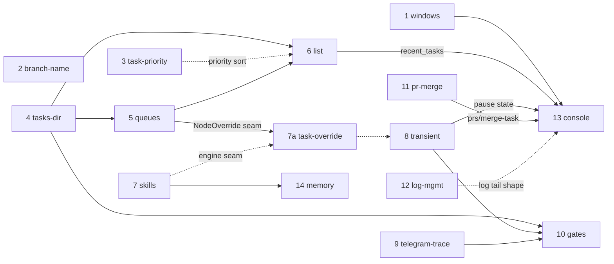

# ADR implementation roadmap (sequencing the 14 open backlog items)

Status: **proposed sequencing** — step 1 (windows) implemented 2026-06-26; steps 2–14 unbuilt. Date: 2026-06-26 Owner: Vladimir Makarevich

This document is a cross-ADR **implementation order**, not a new design. It takes the 14 open backlog ADRs the operator wants built and sequences them so that shared seams (config schema, the CLI, the task-scan path, the watch loop, provider error handling, the Telegram channel, the supervisor/prompt-variable layer) are each touched in one deliberate pass instead of being re-edited by every feature. The goal is to minimize rework and merge conflicts, and to let each feature land on foundations the previous ones already established.

Each ADR keeps its own design file (linked below); this file only governs **order and rationale**. It does not override the hard invariants in [../../CLAUDE.md](../../CLAUDE.md) or [../../.agents/rules/](../../.agents/rules/).

Step 1 (windows-cross-platform-support) is **implemented** (2026-06-26 — green dev loop on Windows + a cross-platform `worc watch`/`stop`/`restart` daemon; the Windows CI matrix is deferred, see its [outcome section](windows-cross-platform-support.md#implementation-outcome)). The other 13 are confirmed **unbuilt** as of this date: `CONFIG_SCHEMA_VERSION` is `16` and `DB_SCHEMA_VERSION` is `12` from prior unrelated work; none of `RetryConfig` / `PathsConfig` / `MemoryConfig` / `LoggingConfig` / `recent_tasks()` / `worc list` exist yet. (The commit titled "add `worc list`" only added the ADR docs.)

## Business priority vs. technical order

The operator's business priority (more `+` = higher) is the tie-breaker, not the driver. Technical correctness — building a seam before its consumers — wins when the two disagree. Notable inversions are called out inline:

| Business | ADR | Built at step |
| --- | --- | --- |
| `++++` | skills-selection-rework | **7** (top business, but it is a deep-core change; it lands after the low-risk operational foundation, under Windows CI guard) |
| `+++` | windows-cross-platform-support | 1 |
| `+++` | branch-name-epoch-and-slug-limit | 2 |
| `+++` | configurable-tasks-dir | 4 |
| `+++` | multi-instance-task-queues | 5 |
| `+++` | cli-task-list-and-completion | 6 |
| `++` | task-priority | **3** (small, self-contained; operator-placed before Wave B so the scan functions are touched in dependency order: priority sort → path → queue filter) |
| `++` | task-node-model-override | **7a** (after queues settles `NodeOverride`; after skills settles the engine seam; before transient re-edits the `AgentRunRequest` path) |
| `++` | transient-provider-failure-recovery | 8 |
| `++` | telegram-step-trace | 9 |
| `++` | operator-confirmation-gates | 10 |
| `++` | orchestrator-driven-pr-merge | 11 |
| `++` | log-management | 12 |
| `+` | cli-upgrade (interactive console) | 13 |
| `+` | orchestrator-memory | 14 |

## TL;DR — the queue

| # | ADR | Wave | Business | Size | Config bump | Why here (one line) |
| --- | --- | --- | --- | --- | --- | --- |
| 1 ✅ | [windows-cross-platform-support](windows-cross-platform-support.md) | A — Foundation | `+++` | M | — | **Done 2026-06-26.** Lands the cross-platform graceful-stop primitive (stop-file + PID-file-disappearance) the console (step 13) reuses. Two scope deltas vs. the plan: Windows CI matrix **deferred**, and `fake_cli` left unchanged (the `.cmd` launcher works on Windows — the Python-launcher rework was unnecessary). |
| 2 ✅ | [branch-name-epoch-and-slug-limit](branch-name-epoch-and-slug-limit.md) | A′ — Quick wins | `+++` | S | — | Fixes re-run branch collision (epoch prefix) + slug overflow (50-char cap); 4-file git-seam change, fully independent of all Wave B/C seams. |
| 3 ✅ | [task-priority](task-priority.md) | A′ — Quick wins | `++` | S | — | Adds optional `priority: low\|mid\|high` + priority-descending sort in `select_pending`; lands before Wave B so scan functions are touched in order (priority → path → queue). |
| 4 ✅ | [configurable-tasks-dir](configurable-tasks-dir.md) | B — Task scan | `+++` | M | 16→17 | Parameterizes the hardcoded `tasks/` path before three other features edit the same scan call-sites. |
| 5 ✅ | [multi-instance-task-queues](multi-instance-task-queues.md) | B — Task scan | `+++` | M | 17→18 | Adds the `queue` field + filter on top of the now-parameterized scan, same seam. |
| 6 ✅ | [cli-task-list-and-completion](cli-task-list-and-completion.md) | B — Task scan | `+++` | S | — | Reads the scan (dir + queue + priority aware); lands `recent_tasks()` that `worc top` later reuses. |
| 7 ✅ | [skills-selection-rework](skills-selection-rework.md) | C — Core seam | `++++` | M | 18→19 | Establishes per-node prompt-var injection + "supervisor proposes, Core decides" that memory reuses. |
| 7a ✅ | [task-node-model-override](task-node-model-override.md) | C′ — Task flexibility | `++` | M | — | Extends `NodeOverride` + adds overlay in `engine_driver`. After queues (`NodeOverride` seam) and skills (engine seam); before transient (`AgentRunRequest` path). No config bump. |
| 8 | [transient-provider-failure-recovery](transient-provider-failure-recovery.md) | D — Resilience | `++` | M | 19→20 | Establishes structured `error_class` on provider errors + the resumable-pause path. |
| 9 | [telegram-step-trace](telegram-step-trace.md) | D — Resilience | `++` | S | 20→21 | Establishes the per-step Telegram push channel + message-prefix discipline. |
| 10 | [operator-confirmation-gates](operator-confirmation-gates.md) | D — Resilience | `++` | S/M | 21→22 | Confluence: needs the scan (next-task gate), structured errors (max-turns gate), and the Telegram channel. |
| 11 | [orchestrator-driven-pr-merge](orchestrator-driven-pr-merge.md) | E — Merge/hygiene | `++` | M/L | — | Adds `worc prs` / `merge-task` so the console can include them; reuses the supervisor agent precedent. |
| 12 | [log-management](log-management.md) | E — Merge/hygiene | `++` | M | 22→23 | `worc logs clean` + `logging.*`; shapes the log tail the console later renders. |
| 13 | [cli-upgrade](cli-upgrade.md) | F — Capstone | `+` | L | — | Capstone console: consumes `recent_tasks`, `prs`/`merge-task`, the pause state, and the stop primitives. |
| 14 | [orchestrator-memory](orchestrator-memory.md) | F — Capstone | `+` | L | 23→24 | Reuses the skills prompt-var/supervisor seam; riskiest, most open questions, lowest business. |

## How this order was derived

Five principles, in priority order:

1. **Foundations and CI guard first.** Windows support is step 1 not because of business weight but because it adds the `windows-latest` CI runner and fixes test collection; every subsequent ADR then ships verified cross-platform for free instead of being retrofitted. It also lands the stop-file IPC and the Python-launcher `fake_cli` that later process/provider work builds on.
2. **Touch each shared seam once, in dependency order.** Where several ADRs edit the same files, cluster them so the seam is shaped deliberately (e.g. the task-scan path: priority sort → location → queue filter → readout) rather than separate features each re-editing `select_pending`/`watch_once`.
3. **Build a seam before its consumers.** `recent_tasks()` (step 6) before the console that reuses it (step 13); structured provider errors (step 8) before the max-turns gate that follows the same pattern (step 10); the per-node prompt-var seam (step 7) before memory reuses it (step 14).
4. **Put confluence features after all their inputs.** Confirmation gates (step 10) sit on three seams at once; the console (step 13) sits on four. They go late so they integrate finished pieces instead of being rebuilt as each input lands.
5. **Business priority breaks ties only.** Within a wave, higher `+` goes first; across waves, a hard technical dependency overrides priority (hence skills `++++` at step 7, and the `+++` operational foundation ahead of it).

## The shared seams (the conflict/dependency matrix)

This is the technical core of the ordering. Each row is a file/subsystem multiple ADRs touch; the **recommended single-pass order** column is the sequence that avoids re-editing it.

| Seam (files) | ADRs that touch it | Recommended single-pass order |
| --- | --- | --- |
| **Config schema + version counter** (`config/schema.py`, `loader.py`, `upgrade.py`, `config_writer.py`, `config.example.yaml`) | tasks-dir, queues, skills, transient, telegram-trace, gates, log-mgmt, memory | Serialize: each takes the next `CONFIG_SCHEMA_VERSION` in build order (17→24). See the version ledger below. |
| **CLI command registration** (`cli.py`, flat `argparse`) | list, completion, queues (`--queue`), tasks-dir (install prompt), pr-merge (`prs`/`merge-task`), log-mgmt (`logs clean`), memory (`memory …`), console (`top`/`shell`) | list/queues first, console last (it aggregates the command table). Settle the optional `cli/` package split (below) before the nested subparsers (`logs`, `memory`) land. |
| **Task-scan / selection** (`select_pending`, `watch_once`, front-matter scan in `cli.py`; `orchestrator.py`) | task-priority (sort), tasks-dir (location), queues (filter), list (readout), gates (next-task gate before claim) | task-priority → tasks-dir → queues → list → gates. |
| **state.db read helpers** (`state_store.py`) | list (`recent_tasks`), console (reuses `recent_tasks`), pr-merge (`find_open_pr_tasks`) | list lands `recent_tasks` first; console reuses it; pr-merge's helper is independent. |
| **watch loop** (`cli.py` `watch_loop`/`watch_once`) | windows (stop-file poll), task-priority (eligibility sort), queues (filter), transient (resumable-pause admit), gates (next-task gate), memory (autodream idle hook) | windows → task-priority → queues → transient → gates → memory. |
| **Process spawn / signals** (`process_control.py`, `providers/process.py`) | windows (stop-file IPC + file-based cross-process stop; POSIX `SIGTERM`/`SIGKILL`), console (3-rung stop ladder, process-group kill) | windows establishes the primitives; the console's stop ladder builds on them — but **on Windows the cross-process stop is file-based** (`os.kill`/signals/process-groups don't work cross-process there), so the ladder needs a platform split, not a POSIX-only signal escalation. |
| **Provider error structuring** (`providers/claude.py`, `errors.py`, `_adapter_base.py`, `NodeInfraError`) | transient (`error_class`, `TRANSIENT_RETRYABLE`), gates (`error_max_turns` as a structured field) | transient establishes structured `error_class`; the max-turns gate adds another field the same way. |
| **Telegram / Notifier** (`notify/interface.py`, `notify/telegram.py`, HITL `ask_human`) | telegram-trace (`send_trace`, push), gates (approve/deny + continue/stop via existing `ask_human`) | telegram-trace establishes push + prefix discipline; gates reuse the existing receive path. |
| **Task front-matter node overrides** (`task/model.py` `NodeOverride`, `task/validation_gate.py` `_build_node_overrides`, `task/parser.py`) | queues (adds `queue` field), task-node-model-override (adds `model`/`reasoning`/`provider` fields) | queues → task-node-model-override. Both are additive, but `_build_node_overrides` is a single function — edit in sequence, not parallel. |
| **Supervisor + prompt-vars + nodes** (`core/supervisor.py`, `core/prompts.py` `ALLOWED_PROMPT_VARS`, `flow/nodes/agent.py`+`evaluator.py`+`base.py`) | skills (`{skills_path}` per node + `propose_skill_map`), memory (`{memory_path}` + `finalize()` emit), pr-merge (reuses the orchestrator-level agent precedent only) | skills establishes per-node injection + the proposer pattern; memory reuses both; pr-merge only reads the precedent, no change here. |

## Dependency graph

Hard edges (`must precede`) are technical; soft edges (`should precede`) are integration convenience.

Reading the edges:

- **branch-name**: fully independent — pure git naming, no shared seam with any other ADR.
- **task-priority → list** (soft): `worc list` should surface priority from day one; both touch the scan functions, so task-priority lands first to avoid re-editing.
- **windows → console**: the stop ladder reuses the cross-platform stop-file IPC from windows; on POSIX it adds the signal/process-group escalation, on Windows it stays file-based (`os.kill` can't reach the daemon cross-process).
- **tasks-dir → queues / list / gates**: all read the task-scan path; parameterize it before they touch it.
- **queues → list**: `worc list` should surface/filter `queue` from day one rather than be re-edited.
- **list → console** (hard): the console's `worc top` reuses `recent_tasks()`; list is the down-payment.
- **transient → gates** (technical): the max-turns gate adds a structured error field following the `error_class` pattern transient introduces.
- **transient → console** (soft): the console wants to render the resumable-pause state clearly.
- **telegram-trace → gates** (integration): both share one Telegram chat; trace sets the message-prefix convention so gate prompts are not buried.
- **skills → memory** (technical): memory's `{memory_path}` reuses the per-node prompt-var seam, and its `finalize()` write reuses the supervisor seam, that skills establishes.
- **queues → task-override** (hard): both edit `_build_node_overrides()` in `task/validation_gate.py`; sequential edits avoid a conflict on that single function.
- **skills → task-override** (soft): skills may refactor how per-node values flow through `engine_driver`/orchestrator; landing the overlay step on the settled shape avoids a rework.
- **task-override → transient** (soft): our model/reasoning overlay writes into `AgentRunRequest`; transient adds retry wrapping around the provider call on the same path — cleaner to have the overlay in place first.
- **pr-merge → console** (soft): the console's command table includes `prs`/`merge-task`.

Everything else is independent and ordered only by wave/priority.

## The waves

### Wave A — Cross-platform & test baseline (step 1) — ✅ done 2026-06-26

**windows-cross-platform-support.** First, alone, because it is pure leverage: a green dev loop on Windows (`/run-checks` — ruff, mypy, full pytest) so steps 2–14 can be verified cross-platform as they land instead of being retrofitted, plus the cross-platform stop primitive later waves build on. **As implemented**, two premises proved wrong (validated on a real Windows 10 / Python 3.14 box — see the ADR's [implementation outcome](windows-cross-platform-support.md#implementation-outcome)):

- The `.cmd` `fake_cli` works on Windows and the integration tests pass, so the Python-launcher rework was **not needed** — `tests/conftest.py` is unchanged. Later provider/process tests reuse the existing fixture as-is.
- `os.kill` is **unusable cross-process on Windows** (`OpenProcess(PROCESS_ALL_ACCESS)` fails for a process the caller holds no handle to), so the daemon stop is a **platform split**: POSIX keeps `SIGTERM`→`SIGKILL`; Windows uses the `orchestrator.stop` sentinel + waits for the daemon to remove its own PID file (`process_control._can_signal`). This is the primitive the console's stop ladder (step 13) must build on — **not** a signal/process-group kill, which is POSIX-only.

The **Windows CI runner matrix is deferred** (tracked in [follow_ups.md](follow_ups.md)); steps 2–14 are therefore not auto-guarded in CI yet — verify them locally on Windows until the matrix lands. Files actually touched: `process_control.py`, `cli.py` (watch loop + stop/restart), `core/skills.py` (`as_posix`), `cli.py` `_install_atomic_write` (`newline=""`), and the affected tests. No schema bump.

### Wave A′ — Quick wins & operational fixes (steps 2–3)

Two focused, independent changes that carry no schema bump, no new config keys, and no dependency on the Wave B scan-seam edits. Both land immediately after Windows so every subsequent step builds on corrected git naming and a priority-aware scheduler.

- **branch-name-epoch-and-slug-limit** first: a 4-file git-seam change. Adds a unix-epoch prefix to auto-generated branch names (`{prefix}/{epoch}-{task_id}-{slug}`) to eliminate re-run collisions; caps the total auto-generated name at 50 characters with dynamic slug truncation; degrades oversized operator `branch_name` overrides to a warning + fallback instead of a hard error. No schema bump, no config key. Files: `task/parser.py` (add `slugify_bounded`), `git_manager.py` (`branch_name` accepts `epoch`), `core/orchestrator.py` (`_prepare_branch` captures `int(time.time())`), `task/validation_gate.py` (warn + fallback on length > 50). Fully independent of all other ADRs — no shared seam.
- **task-priority** second: adds an optional `priority: low | mid | high` field (default `mid`) to task front-matter and sorts eligible tasks priority-descending in `select_pending` / `watch_once` (ties broken by filename). `depends_on` resolution runs before sorting — only eligible tasks are ranked. Small, additive change; lands before Wave B so that `select_pending` is touched in dependency order (priority sort → path parameterization → queue filter) rather than re-edited after the fact. No schema bump, no state-db change. `worc list` (step 6) should surface priority alongside status from day one.

### Wave B — Task-scan & discovery foundation (steps 4–6)

The "where → what → readout" of the task inbox, settled in one pass over the scan seam.

- **configurable-tasks-dir** first: adds `paths.tasks_dir` (+ `PathsConfig`) and replaces the hardcoded `"tasks"` across `cli.py`, `orchestrator.py`, `git_manager.py`, `config_writer.py`. Doing it first means queues, list, and the next-task gate all read the configured path from the start. Config 16→17.
- **multi-instance-task-queues** second: adds the optional `queue` task field + the `orchestrator.queue` selector (+ `--queue` override) and filters `select_pending`/`watch_once` by string equality. Same scan seam as tasks-dir — done back-to-back. Config 17→18.
- **cli-task-list-and-completion** third: `worc list` (active + pending + recent, dir- and queue- and priority-aware) and `worc completion bash|zsh`. Lands `recent_tasks(limit)` in `state_store.py` — the exact read helper the console's `worc top` reuses. Read-only, no schema bump. Smallest, lowest-risk item; closes the wave with an immediately useful operator win.

All three are `+++` and cohesive — they justify leading the queue together.

### Wave C — Skills selection rework (step 7)

**skills-selection-rework** (`++++`, highest business). Placed first among the deep-core changes, right after the operational foundation. It is technically independent of Waves A/B (skill discovery is `git ls-files **/SKILL.md`; pins live in flow YAML), so it could move earlier; it sits at step 7 so the low-risk foundation and the Windows CI guard are in place before the first change to the flow graph / supervisor. It establishes two seams later work reuses: **per-node prompt-variable injection** (`{skills_path}` resolved per node in `flow/nodes/agent.py`+`evaluator.py`+`base.py`) and the generalized **"supervisor proposes, Core decides"** pattern in `supervisor.py`. Retires the `planning`-node skill branch and the `_validate_skills` HITL field. Config 18→19.

> Reorder note: if business wants the `++++` item sooner, skills can move to step 4 (right after the quick-wins) with no technical penalty — it shares no files with Wave B. The only constraint is skills **before** memory (step 14).

### Wave C′ — Task execution flexibility (step 7a)

**task-node-model-override** (`++`). A single, focused addition that closes the gap between task files and flow configuration. Placed immediately after skills for two technical reasons: (1) queues (step 5) has already extended `NodeOverride` and `_build_node_overrides()` — the two additions are now sequential, not conflicting; (2) if skills refactors how per-node values flow through `engine_driver`/`orchestrator.py`, the model/reasoning overlay step lands on the already-settled shape. Placed before transient (step 8) because both touch the `AgentRunRequest` construction path — having the overlay in place before the retry wrapper is added is cleaner than the reverse. **No config bump** — `NodeOverride` is task front-matter, not `config.yaml`. Three seams touched: `task/model.py` + `task/validation_gate.py` + `task/parser.py` (extend `NodeOverride`), `core/orchestrator.py` (apply overlay alongside the existing `disabled_nodes` extraction), and `core/flow/engine.py`/`engine_driver.py` (pass overlay through to the node runner). Invalid overrides (unrecognised provider, reasoning value outside ceiling) degrade gracefully: log a warning, fall back to the flow's declared value, never abort — required for watch-mode compat.

### Wave D — Resilience & remote operations (steps 8–10)

The "survive unattended + watch and intervene remotely" story. Order is forced by the seams.

- **transient-provider-failure-recovery** first: bounded same-provider retry + symmetric Claude↔Codex fallback in the Router, plus a resumable pause on sustained outage. Introduces structured `error_class` on `NodeInfraError` and the `TRANSIENT_RETRYABLE` set — the pattern the gate's max-turns detection follows next. Accepted/locked ADR. Config 19→20.
- **telegram-step-trace** second: one best-effort push per node finish (`send_trace` on the `Notifier`, hooked at `flow/observability.py`), toggled by `telegram.trace`. Establishes the per-step push channel and the message-prefix convention. Config 20→21.
- **operator-confirmation-gates** third — the confluence: the next-task gate hooks the watch-loop claim point (Wave B), the max-turns gate adds a structured `error_max_turns` field (the transient pattern), and both speak over Telegram (trace's channel, with a distinct prefix so prompts are not buried). Reuses the existing durable `ask_human` receive path — no new poll broker needed. Add the preflight rule: gate-on requires `telegram.enabled`. **Run the feasibility spike first** (below). Config 21→22.

### Wave E — Merge & hygiene (steps 11–12)

- **orchestrator-driven-pr-merge**: `worc prs` + `worc merge-task <id>` with an orchestrator-level merge routine (update branch with base → clean merge → bounded conflict-resolution agent → re-run checks → merge). Reuses the supervisor's orchestrator-level agent precedent, `merge_pr`, and publish-op idempotency. Adds `find_open_pr_tasks()` to `state_store.py`. No schema bump. Before the console so its command table can include the two verbs.
- **log-management**: `worc logs clean [--keep N]` and `logging.level` / `logging.artifacts` config gating per-node artifact writes. Mostly independent; placed here because the console's log-tail view then renders logs already shaped by `logging.*`. Config 22→23. This is the natural place to decide the `cli/` package split (below), since it proposes the first command module (`cli/logs.py`).

### Wave F — Capstone & advanced (steps 13–14)

- **cli-upgrade (interactive console)**: `worc top` (read-only monitor) + `worc shell` (`prompt_toolkit` REPL) + the 3-rung stop ladder. The aggregator — it consumes `recent_tasks` (step 6), the `prs`/`merge-task` verbs (step 11), the resumable-pause state (step 8), and the stop primitives (step 1). Built last so it integrates finished pieces. **Note the Windows constraint from step 1:** `os.kill`/signals/process-group kills do not work cross-process on Windows, so the stop ladder's escalation rungs are POSIX-only — on Windows the console must drive the file-based stop (sentinel + PID-file-disappearance), and a wedged daemon can't be force-killed without a `taskkill` backstop (a deferred follow-up). `prompt_toolkit` is an optional `[shell]` extra; the daemon never imports it. No schema bump.
- **orchestrator-memory**: three-tier `.worc/memory/`, supervisor `finalize()` emits a redacted memory-delta, `{memory_path}` prompt var, `worc memory …`, and the bounded `autodream` idle hook. Reuses the skills prompt-var seam (`memory_path` parallels `skills_path`) and the supervisor seam (`finalize()` emit parallels `propose_skill_map`). Last because it is the largest, the riskiest (autonomous self-edit, redaction-on-every-write, several open design questions), and the lowest business priority. Consider shipping only the **Lightweight project memory** slice (long-term tier) first to de-risk. Config 23→24.

## Config schema version ledger

`CONFIG_SCHEMA_VERSION` is a single global integer with a linear `upgrade.py` migration chain, so config-bumping ADRs **serialize** — each must take the next integer in build order. Build them on a single line of history (or rebase carefully); do not develop two config-bumping ADRs on parallel branches without agreeing the numbers up front.

| Version | ADR (build step)                        |
| ------- | --------------------------------------- |
| 16      | current (prior work)                    |
| 17      | configurable-tasks-dir (4)              |
| 18      | multi-instance-task-queues (5)          |
| 19      | skills-selection-rework (7)             |
| 20      | transient-provider-failure-recovery (8) |
| 21      | telegram-step-trace (9)                 |
| 22      | operator-confirmation-gates (10)        |
| 23      | log-management (12)                     |
| 24      | orchestrator-memory (14)                |

Steps 1 (windows), 2 (branch-name), 3 (task-priority), 6 (list), 11 (pr-merge), and 13 (console) add no config keys. `DB_SCHEMA_VERSION` (12) is **not** bumped by any of the 14 — the only state.db changes are new read-only query helpers (`recent_tasks`, `find_open_pr_tasks`), which need no migration.

## Cross-cutting execution guidance

- **Decide the `cli.py` package split early (latest by step 12).** `cli.py` is ~1500 lines and ~8 of these ADRs add commands; log-management already proposes `cli/logs.py` and memory adds the first nested subparser (`worc memory …`). Either commit to extracting a `cli/` package (one module per command group) **before** the nested subparsers land, or explicitly keep the single file. Run `/assess-refactor` on `cli.py` before step 11. Bounded by YAGNI — only split if the command growth in this roadmap justifies it (it likely does).
- **Per-ADR definition of done.** Each step: update/extend tests (use the `/fake-cli` scaffolding for any provider/router/pipeline behavior), run `/run-checks` (ruff + mypy + pytest) green, and `/sync-docs` in the **same** change (the Stop docs-sync gate enforces it). Record any deferred work in [follow_ups.md](follow_ups.md).
- **Run the gate feasibility spike before step 10.** The max-turns gate assumes provider `--resume` grants a fresh turn budget. Verify against the real Claude CLI first; if it does not, "continue" degrades to restarting the node (wasteful) and the ADR's premise (drop the default cap from 400 to ~50–100) weakens. Also bound per-continue grants (e.g. max 3 resumes/node) to prevent approve-loops.
- **Telegram poll broker is out of scope for these 14.** The "one bot token = one long-poll" constraint only bites the `worc listen` remote-control item (not in this list). Step-trace is push-only and step gates reuse the existing `ask_human` receive path, so neither needs a new broker. If `worc listen` is ever scheduled, sequence it after Wave D and build the daemon-owned poll broker first.
- **Redaction is non-negotiable for memory (step 14).** Every memory write goes through `providers/redaction.py`; audit each write into the existing `evaluations` table. Memory content reaches agents only by path (`{memory_path}`), never inlined into prompts.

## Risks & pitfalls

- **The watch loop is edited by six ADRs** (windows, task-priority, queues, transient, gates, memory). Following the wave order keeps these edits sequential and composable; doing them on parallel branches will conflict heavily. Treat `watch_loop`/`watch_once` as a serialization point.
- **Config-version collisions** if two bumping ADRs are built in parallel — see the ledger; assign numbers in merge order.
- **Provider-error structuring** (`NodeInfraError`, `errors.py`) is shared by transient and gates; building transient first means gates extends a settled shape rather than co-inventing it.
- **Console scope (step 13)** is the largest single item (live event loop, log tailing, spawn-or-attach daemon supervision, process-group hard-kill). Its two halves ship independently — `worc top` (read-only) is usable before `worc shell` — so it can be split across two changes if needed.
- **Memory (step 14)** has the most unresolved design questions (autodream cadence, entity-vs-codebase reconciliation, promotion boundary). Do not start it until skills (step 7) has proven the prompt-var/supervisor seam, and prefer the lightweight-slice-first path.

## Reorder levers (if priorities shift)

- **Want the `++++` skills item sooner?** Move it to step 4 (right after the quick-wins); it is technically independent of Wave B. Only constraint: before memory.
- **Need remote visibility urgently?** telegram-step-trace (step 9) is `S`, push-only, and depends on nothing — it can move up to right after windows.
- **Disk pressure now?** The `worc logs clean` half of log-management is independent of its `logging.*` half and can ship alone, early.
- **Console value early?** `worc top` (read-only half of step 13) only hard-needs `recent_tasks` (step 6) and the windows stop primitives (step 1); it could ship right after Wave B, with `worc shell` and the stop ladder following once pr-merge/transient land.

## Linked ADRs

| Step | ADR | Detail file |
| --- | --- | --- |
| 1 | Windows / cross-platform support | [windows-cross-platform-support.md](windows-cross-platform-support.md) |
| 2 | Branch name: epoch prefix + length cap | [branch-name-epoch-and-slug-limit.md](branch-name-epoch-and-slug-limit.md) |
| 3 | Task priority field | [task-priority.md](task-priority.md) |
| 4 | Configurable tasks directory | [configurable-tasks-dir.md](configurable-tasks-dir.md) |
| 5 | Task queue tags for multiple instances | [multi-instance-task-queues.md](multi-instance-task-queues.md) |
| 6 | Task discovery: `worc list` + completion | [cli-task-list-and-completion.md](cli-task-list-and-completion.md) |
| 7 | Skills selection rework | [skills-selection-rework.md](skills-selection-rework.md) |
| 7a | Per-node model/reasoning/provider in task front matter | [task-node-model-override.md](task-node-model-override.md) |
| 8 | Transient provider-failure recovery | [transient-provider-failure-recovery.md](transient-provider-failure-recovery.md) |
| 9 | Telegram step-trace | [telegram-step-trace.md](telegram-step-trace.md) |
| 10 | Operator confirmation gates | [operator-confirmation-gates.md](operator-confirmation-gates.md) |
| 11 | Orchestrator-driven PR merge | [orchestrator-driven-pr-merge.md](orchestrator-driven-pr-merge.md) |
| 12 | Log management | [log-management.md](log-management.md) |
| 13 | Interactive operator console | [cli-upgrade.md](cli-upgrade.md) |
| 14 | Orchestrator memory | [orchestrator-memory.md](orchestrator-memory.md) |
