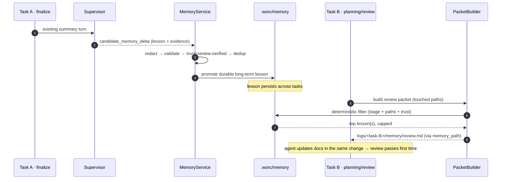
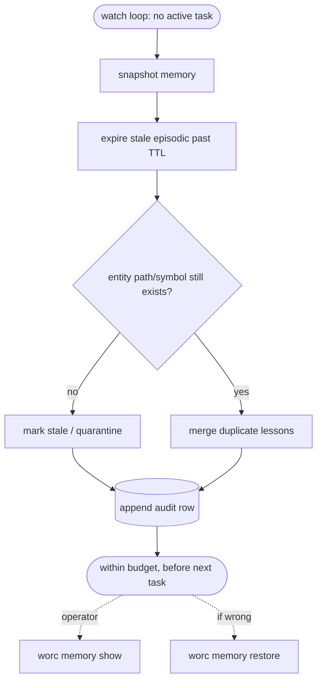

# Happy path — what the operator actually gets

Status: **draft** Date: 2026-06-28 — [task hub](index.md)

Two plain-language scenarios showing the end result and what the operator sees, with **Before / After**. These are illustrative, not a spec.

## Scenario 1 — a lesson stops being re-learned

**Setting:** the orchestrator runs two tasks, days apart, on the same repo. In Task A the reviewer flags that a config-schema change also needs the docs and packaged config example updated in the same change.

**Before (today):** Task A fixes it after the review round. Task B touches the same area weeks later, the agent doesn't know the rule, ships without the doc update, the reviewer flags it **again**, and Task B burns an extra fix loop. The lesson was paid for once and lost.

**After (with memory):** at Task A's finalization the supervisor distills the lesson; `MemoryService` validates it against the repo, marks it `review-verified`, and promotes it to long-term. When Task B reaches planning/review, its packet includes that one lesson, so the agent updates the docs in the same change and review passes first time.

## Scenario 2 — the operator can see and trust the memory

**Before (today):** there is nothing to inspect; "what does the orchestrator remember about this repo?" has no answer, and nothing can rot because nothing exists.

**After (with memory):** the operator runs `worc memory show` and sees a small, curated set of lessons and entity cards, each with provenance (which task/commit it came from) and a trust level. Between tasks, a bounded cleanup job quietly expires stale episodic notes and flags an entity whose file was renamed; it snapshots first, so if a cleanup was wrong, `worc memory restore` puts it back. Memory only ever advises the agents — it never routes or enforces.

**What the operator never sees:** secrets in memory (redacted before write), an unbounded dump (hard caps + cleanup), or memory silently changing what the orchestrator _does_ (it is advisory only).
