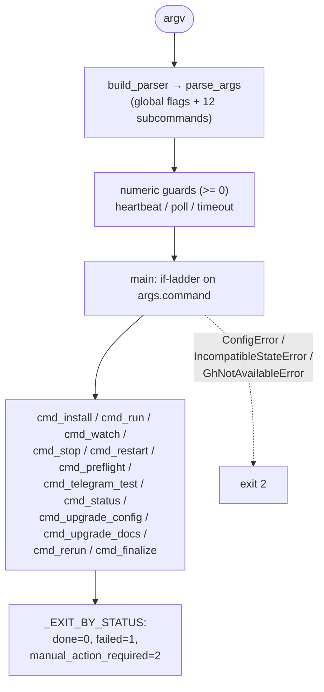

# B01 — CLI and Operator Commands

> Reconstructed from code (`cli.py`, `__main__.py`, `pyproject.toml`) and tests (`tests/test_cli_*.py`, `tests/core/test_cli_*.py`). The code is the only source of truth; this document was rebuilt from the implementation, not from prose or comments. Significant claims carry a `file:line` reference.

**Status:** documented · **Source modules:** `src/wastech_orchestrator/cli.py`, `src/wastech_orchestrator/__main__.py`, `pyproject.toml`

## Responsibility

The single operator-facing entry point. It builds the argparse parser, dispatches each subcommand to its driver, resolves and loads the config, configures runtime logging, computes the read-only preflight verdict, and maps a terminal task outcome to a process exit code. It owns no business logic — every command delegates to the orchestrator ([B06](B06-orchestrator-pipeline.md)), the installer ([B03](B03-installer-and-scaffolding.md)), the watch daemon mechanics ([B02](B02-watch-daemon-and-scheduling.md)), config load/upgrade ([B05](B05-configuration.md)), or diagnostics, and only translates intent into those calls.

It also fixes two repo-layout roots used pervasively downstream: the gitignored runtime home `<repo>/.worc/` ([cli.py:71](../../../src/wastech_orchestrator/cli.py#L71)) and the tracked, audit-committed lifecycle dirs that sit at the repo root, distinct from the `.worc/`-local runtime dirs. The lifecycle root name is `config.paths.tasks_dir` (default `tasks`); `install` scaffolds the default while the runtime resolves the configured value.

## Public surface

- `main(argv=None)` ([cli.py:1260](../../../src/wastech_orchestrator/cli.py#L1260)) — parse, validate numeric flags, dispatch by `args.command`, and translate the three versioning/availability errors to exit 2. The target of all three console entry points.
- `build_parser()` ([cli.py:87](../../../src/wastech_orchestrator/cli.py#L87)) — the authoritative parser: global flags plus a **required** subcommand ([cli.py:122](../../../src/wastech_orchestrator/cli.py#L122)).
- `resolve_config_path(args)` ([cli.py:353](../../../src/wastech_orchestrator/cli.py#L353)) — config discovery (priority order below).
- `load_config_for(args)` ([cli.py:491](../../../src/wastech_orchestrator/cli.py#L491)) — resolve + load, or print the install hint and return `None`.
- `run_preflight(config)` ([cli.py:821](../../../src/wastech_orchestrator/cli.py#L821)) — the shared read-only readiness verdict + report lines.
- `worc_home_for` / `tasks_root_for` / `pending_dir` ([cli.py:503](../../../src/wastech_orchestrator/cli.py#L503), [cli.py:513](../../../src/wastech_orchestrator/cli.py#L513), [cli.py:522](../../../src/wastech_orchestrator/cli.py#L522)) — the `.worc/`-vs-repo-root path split.
- `cmd_*` drivers, one per subcommand ([cli.py:613](../../../src/wastech_orchestrator/cli.py#L613) onward).
- `watch_once` / `watch_loop` ([cli.py:542](../../../src/wastech_orchestrator/cli.py#L542), [cli.py:571](../../../src/wastech_orchestrator/cli.py#L571)) — the watch tick and loop (daemon mechanics belong to [B02](B02-watch-daemon-and-scheduling.md)).

## Behavior

### Console entry points

`pyproject.toml` declares two console scripts that both target `cli:main`: `wastech-orchestrator` and its short alias `worc` ([pyproject.toml:32-35](../../../pyproject.toml#L32)). `python -m wastech_orchestrator` resolves to the same function via `__main__.py`, which imports `cli.main` and wraps it in `SystemExit` ([\_\_main\_\_.py:5-8](../../../src/wastech_orchestrator/__main__.py#L5)).

### The authoritative subcommand list

`build_parser` adds exactly twelve subcommands under a required subparser ([cli.py:122](../../../src/wastech_orchestrator/cli.py#L122)), plus the global `--version` action ([cli.py:92](../../../src/wastech_orchestrator/cli.py#L92)). Verified against the argparse construction (not the help strings):

- **install** ([cli.py:154](../../../src/wastech_orchestrator/cli.py#L154)) — set up the orchestrator in a repo under `.worc/` and write `config.yaml`; positional `repo_path` defaults to `.`, with `--provider`, `--create-pr`/`--auto-mode` (BooleanOptional), `--non-interactive`, `--reconfigure`, `--skip-preflight`, `--dry-run`. There is no `--check` flag — `init` writes an empty `command_sets` and the operator authors the gate. Driver delegates to the wizard ([B03](B03-installer-and-scaffolding.md)).
- **run** ([cli.py:170](../../../src/wastech_orchestrator/cli.py#L170)) — process one task file (`task_file`, `.md`/`.json`) end-to-end through the pipeline ([B06](B06-orchestrator-pipeline.md)).
- **watch** ([cli.py:173](../../../src/wastech_orchestrator/cli.py#L173)) — resume any in-flight task, then process pending tasks; `--poll-seconds` overrides `orchestrator.poll_interval_seconds` (`0` = single pass). Loop mechanics in [B02](B02-watch-daemon-and-scheduling.md).
- **stop** ([cli.py:183](../../../src/wastech_orchestrator/cli.py#L183)) — stop a running watch daemon (SIGTERM, then SIGKILL after `--timeout`, default 30s).
- **restart** ([cli.py:192](../../../src/wastech_orchestrator/cli.py#L192)) — stop the running watcher then start a fresh `watch` in-process; takes `--timeout` and `--poll-seconds`.
- **preflight** ([cli.py:210](../../../src/wastech_orchestrator/cli.py#L210)) — read-only health/isolation/flow check, no arguments.
- **telegram-test** ([cli.py:213](../../../src/wastech_orchestrator/cli.py#L213)) — send a correlated Telegram prompt and wait for a reply; `--timeout-seconds` default 60.
- **status** ([cli.py:224](../../../src/wastech_orchestrator/cli.py#L224)) — show the active or latest persisted task status; optional `task_id`.
- **upgrade-config** ([cli.py:227](../../../src/wastech_orchestrator/cli.py#L227)) — add config keys introduced by this version, preserving existing values; `--dry-run`.
- **upgrade-docs** ([cli.py:235](../../../src/wastech_orchestrator/cli.py#L235)) — overwrite the installed `.worc/guide/` authoring docs with the packaged version; `--dry-run`.
- **rerun** ([cli.py:243](../../../src/wastech_orchestrator/cli.py#L243)) — re-attempt a terminal task; `task_id`, `--continue` (reuse branch, re-enter the failed node), `--force-reset-remote`, `--dry-run`, `-y/--yes`.
- **finalize** ([cli.py:268](../../../src/wastech_orchestrator/cli.py#L268)) — record + tidy a task handled by hand; `task_id`, required `--as {done,failed,abandoned}`, `--pr-url`, `--note`, `--delete-branch` (keep is the default), `--no-verify-pr`, `--dry-run`, `-y/--yes`.

### Global flags

Defined on the top-level parser, so they precede the subcommand: `--config`, `--env-file`, `--log-level` ({debug,info,warning,error}, default info), `--log-format` ({logfmt,json}), `--log-file`, and `--heartbeat-seconds` (float, default 30, `0` disables) ([cli.py:93-130](../../../src/wastech_orchestrator/cli.py#L93)). `--version` prints `%(prog)s {__version__}` and exits 0 ([cli.py:92](../../../src/wastech_orchestrator/cli.py#L92); confirmed by `test_cli_version.py`).

### Dispatch and exit codes

`main` parses argv, then performs three post-parse numeric guards via `parser.error` (which exits 2): `--heartbeat-seconds`, `--poll-seconds`, and `--timeout` must each be `>= 0` ([cli.py:1263-1268](../../../src/wastech_orchestrator/cli.py#L1263)). The two latter are read defensively with `getattr(..., None)` because they exist only on some subparsers. It then dispatches on `args.command` through an `if`-ladder, wrapped in a single `try` that catches `ConfigError`, `IncompatibleStateError`, and `detect.GhNotAvailableError` and turns each into `error: <msg>` + **exit 2**. A command value not in the ladder raises `SystemExit`. The first statement inside that `try` is `_load_env_file_for(args)`, so the orchestrator's own `.env` is loaded before any command runs — and a missing **explicit** `--env-file` raises `ConfigError` → the same clean exit 2 (a missing auto-discovered `<repo>/.worc/.env` is a silent no-op). `resolve_env_file_path` mirrors `resolve_config_path`: explicit `--env-file` (required) → the `.env` beside the resolved config → `<git-root>/.worc/.env`; loading uses `env_file.load_env_file` with `override=False` (a real exported var wins) and logs only a secret-free count + path.

Terminal task outcomes map to exit codes through `_EXIT_BY_STATUS` ([cli.py:62-66](../../../src/wastech_orchestrator/cli.py#L62)): `DONE` → 0, `FAILED` → 1, `MANUAL_ACTION_REQUIRED` → 2 (the `Status` enum values are `"done"`/`"failed"`/`"manual_action_required"`, [state_machine.py:30-32](../../../src/wastech_orchestrator/core/state_machine.py#L30)). Every call site uses `.get(status, 1)`, so any non-terminal/unknown status defaults to **1**.

### Config resolution and loading

`resolve_config_path` ([cli.py:353](../../../src/wastech_orchestrator/cli.py#L353)) walks a strict priority order: (1) an explicit `--config PATH` wins unconditionally; (2) otherwise `detect.git_info(cwd)` ([detect.py:64](../../../src/wastech_orchestrator/install/detect.py#L64)) walks up to the Git root and the resolved `<root>/.worc/config.yaml` is used **iff it is a file**; (3) otherwise `None`. `load_config_for` ([cli.py:491](../../../src/wastech_orchestrator/cli.py#L491)) turns a `None` into the actionable hint "Run 'wastech-orchestrator install .' …, or pass --config PATH." and returns `None`, which every driver maps to **exit 2** (covered by `test_cli_config_discovery.py`). When a path is found, `_load_config` loads then `validate_config`s it fail-closed ([cli.py:346-350](../../../src/wastech_orchestrator/cli.py#L346)); a structurally broken or newer-than-supported config raises `ConfigError` → caught in `main` → exit 2 (confirmed by `test_cli_version.py::test_newer_config_schema_fails_loud_with_exit_2`).

### Runtime logging setup

Each driver begins with `_configure_runtime_logging(args)` ([cli.py:527](../../../src/wastech_orchestrator/cli.py#L527)), which maps `--log-level` through `_LOG_LEVELS` ([cli.py:54-59](../../../src/wastech_orchestrator/cli.py#L54)) and forwards `--log-format`/`--log-file` (both read with `getattr` defaults) to `configure_logging` ([logging.py:42](../../../src/wastech_orchestrator/observability/logging.py#L42), [B27](B27-observability.md)). That call is idempotent — the second call is a no-op, which matters because `watch` may re-enter — and the file sink rotates at 10 MB with 5 backups by default.

### run / rerun / finalize

`cmd_run` ([cli.py:613](../../../src/wastech_orchestrator/cli.py#L613)) loads config, calls `detect.require_gh()` to fail fast when `git.create_pull_request` is on, builds the orchestrator with `artifacts_root=worc_home_for(config)`, runs the task, prints `<id>: <status>[ → <pr>]`, and returns the mapped code. `cmd_rerun` ([cli.py:668](../../../src/wastech_orchestrator/cli.py#L668)) and `cmd_finalize` ([cli.py:762](../../../src/wastech_orchestrator/cli.py#L762)) share a shape: both refuse to run while a live watch daemon owns the shared clone (checked via the PID file, returning 1, [cli.py:677-683](../../../src/wastech_orchestrator/cli.py#L677), [cli.py:772-778](../../../src/wastech_orchestrator/cli.py#L772)); both require an existing `state.db` (else exit 2); both compute a `plan_*` first and print any `plan.refusals` then exit 1; both honor `--dry-run` by printing the plan and exiting 0; both prompt for confirmation unless `-y/--yes` (`_confirm` defaults to no on EOF, [cli.py:632](../../../src/wastech_orchestrator/cli.py#L632)). `finalize`'s `--as abandoned` maps to `MANUAL_ACTION_REQUIRED` with an `outcome="abandoned"` ledger record ([cli.py:736-740](../../../src/wastech_orchestrator/cli.py#L736)). Detailed plan/reconciliation semantics live in [B06](B06-orchestrator-pipeline.md) and [B10](B10-recovery-and-resume.md).

### status

`cmd_status` ([cli.py:1172](../../../src/wastech_orchestrator/cli.py#L1172)) is strictly read-only: it opens the DB with `StateStore.open_readonly` ([B07](B07-state-machine-and-store.md)), resolves either the named `task_id`, the active tasks, or the single latest task, and prints each task's id/title/status, the flow checkpoint `node=` (`get_flow_checkpoint`), branch, subtask progress, `fix_iterations`, `updated_at` + elapsed seconds, and any cleanup error — then a read-only summary of the configured `checks.command_sets` (`_summarize_command_sets`, [cli.py:1150](../../../src/wastech_orchestrator/cli.py#L1150)), without resolving or running anything. A missing DB prints a message and returns 0; a named-but-missing task returns 1, while an empty active/latest set returns 0.

### preflight (run_preflight)

`run_preflight` ([cli.py:931](../../../src/wastech_orchestrator/cli.py#L931)) is the shared read-only verdict used by both `cmd_preflight` and the installer's post-write auto-preflight. It aggregates an `ok` flag and `lines` over: each allowed provider's `preflight()` (`<cli> --version`; a missing adapter is a FAIL, [B18](B18-agent-providers.md)); the deterministic `check_isolation` policy ([B25](B25-security-policy.md)); a read-only summary of the configured `checks.command_sets` (`_summarize_command_sets`, [cli.py:965](../../../src/wastech_orchestrator/cli.py#L965), [B23](B23-check-discovery.md)) — no resolution, probing, or running; the flow registry's `validate_all()` over **every** packaged built-in and operator flow in `.worc/flows/`, so a broken or unsafe operator flow fails preflight before any task runs ([B29](B29-flow-definition-and-validation.md)); and `check_telegram_preflight` ([B26](B26-notifications-telegram.md)). `cmd_preflight` ([cli.py:987](../../../src/wastech_orchestrator/cli.py#L987)) prints the lines and returns `0` iff ready, else `1`. All lines are secret-free by contract.

### telegram-test

`cmd_telegram_test` ([cli.py:891](../../../src/wastech_orchestrator/cli.py#L891)) validates `--timeout-seconds > 0` (else exit 2 to stderr), refuses a config with `telegram.enabled` false (exit 1), runs `check_telegram_preflight`, then builds a notifier and performs a real `ask_human` round-trip with a fresh correlated `interaction_id`, returning 0 only on a correlated reply ([B26](B26-notifications-telegram.md)).

### watch / stop / restart (this block's slice)

`cmd_watch` ([cli.py:935](../../../src/wastech_orchestrator/cli.py#L935)) resolves the poll interval (flag overrides `orchestrator.poll_interval_seconds`), fails fast on missing `gh` when PRs are enabled, and either runs a single pass (no PID file, no signal handler) or — for `poll > 0` — refuses a second live watcher, writes the PID file, installs a `StopController`, and runs `watch_loop`. `cmd_stop`/`cmd_restart` ([cli.py:1002](../../../src/wastech_orchestrator/cli.py#L1002), [cli.py:1021](../../../src/wastech_orchestrator/cli.py#L1021)) drive `process_control.stop_process` against the PID file; `restart` then delegates to `cmd_watch`. `watch_once`/`watch_loop` ([cli.py:542](../../../src/wastech_orchestrator/cli.py#L542), [cli.py:571](../../../src/wastech_orchestrator/cli.py#L571)) implement the resume-then-pending tick and the periodic-discovery loop. The daemon/PID/SIGTERM mechanics are owned by [B02](B02-watch-daemon-and-scheduling.md).

## Invariants & guarantees

- A subcommand is mandatory (`required=True`, [cli.py:122](../../../src/wastech_orchestrator/cli.py#L122)); the parser rejects bare invocation.
- Exactly three exit codes carry semantic meaning: 0 = task done / read-only OK, 1 = task failed / not-ready / refusal, 2 = config or usage error ([cli.py:62-66](../../../src/wastech_orchestrator/cli.py#L62), [cli.py:1263-1299](../../../src/wastech_orchestrator/cli.py#L1263)).
- A config/DB written by a newer orchestrator never surfaces as a traceback — it is caught and reported with exit 2 ([cli.py:1297-1299](../../../src/wastech_orchestrator/cli.py#L1297)).
- `status` performs zero side effects: read-only DB open, no provider/check/git invocation ([cli.py:1052](../../../src/wastech_orchestrator/cli.py#L1052)).
- `rerun`/`finalize` never run concurrently with a live watch daemon — both gate on the PID file before touching the shared clone ([cli.py:677](../../../src/wastech_orchestrator/cli.py#L677), [cli.py:772](../../../src/wastech_orchestrator/cli.py#L772)).
- `run`/`watch`/`rerun` fail fast on a missing `gh` only when `create_pull_request` is enabled ([cli.py:619](../../../src/wastech_orchestrator/cli.py#L619), [cli.py:951](../../../src/wastech_orchestrator/cli.py#L951), [cli.py:710](../../../src/wastech_orchestrator/cli.py#L710); confirmed by `test_cli_watch.py`).
- Path split: the orchestrator's generated/installed state lives under the gitignored `<repo>/.worc/` (`worc_home_for`), while the `tasks/` lifecycle dirs stay at the repo root for the audit commit (`tasks_root_for`) ([cli.py:71-84](../../../src/wastech_orchestrator/cli.py#L71), [cli.py:503-524](../../../src/wastech_orchestrator/cli.py#L503)).

## Dependencies

- **Uses:** [B06](B06-orchestrator-pipeline.md) (`build_orchestrator`/`build_providers`, `run_task`, `plan_rerun`/`rerun_task`/`continue_task`, `plan_finalize`/`finalize_task`), [B02](B02-watch-daemon-and-scheduling.md) (`process_control`, the watch loop), [B03](B03-installer-and-scaffolding.md) (`wizard`, `config_writer`, `detect`), [B04](B04-install-registry-and-config-discovery.md) (`detect.git_info` for discovery), [B05](B05-configuration.md) (`load_config`/`validate_config`/`config.upgrade`), [B07](B07-state-machine-and-store.md) (`StateStore.open_readonly`, `Status`), [B18](B18-agent-providers.md) (`provider.preflight`), [B23](B23-check-discovery.md) (command-set summary), [B25](B25-security-policy.md) (`check_isolation`), [B26](B26-notifications-telegram.md) (`build_notifier`, `check_telegram_preflight`), [B27](B27-observability.md) (`configure_logging`), [B29](B29-flow-definition-and-validation.md) (`FlowRegistry.validate_all`). **Used by:** end operators (the entry point of the whole system) and the install auto-preflight (`run_preflight`).

## Tests

- `tests/test_cli_version.py` — `--version` prints and exits 0; a newer `schema_version` fails loud with exit 2 (no traceback).
- `tests/test_cli_config_discovery.py` — the explicit-`--config` > walk-up-`.worc/config.yaml` > install-hint priority, and that an unconfigured command exits 2.
- `tests/test_cli_preflight.py` — `cmd_preflight`/`run_preflight` readiness lines and exit code: provider health, isolation FAIL, flow `validate_all` (incl. a rogue operator flow failing fatally), and telegram OK/SKIP/FAIL; plus `telegram-test` success/timeout/disabled.
- `tests/test_cli_watch.py` — `pending_dir` location, `watch_loop` stop-event handling, stop/restart PID semantics, the watch single-watcher guard, and the `require_gh` fast-fail/skip matrix for `run`/`watch`.
- `tests/core/test_cli_pipeline.py`, `tests/core/test_cli_rerun.py`, `tests/core/test_cli_finalize.py` — the `run`/`rerun`/`finalize` drivers: dispatch, plan/dry-run/confirm flow, daemon-running refusal, and status→exit-code mapping.
- `tests/test_cli_install.py`, `tests/test_cli_upgrade_config.py`, `tests/test_cli_upgrade_docs.py` — the `install`/`upgrade-config`/`upgrade-docs` drivers (file-system effects detailed in [B03](B03-installer-and-scaffolding.md)/[B05](B05-configuration.md)).
