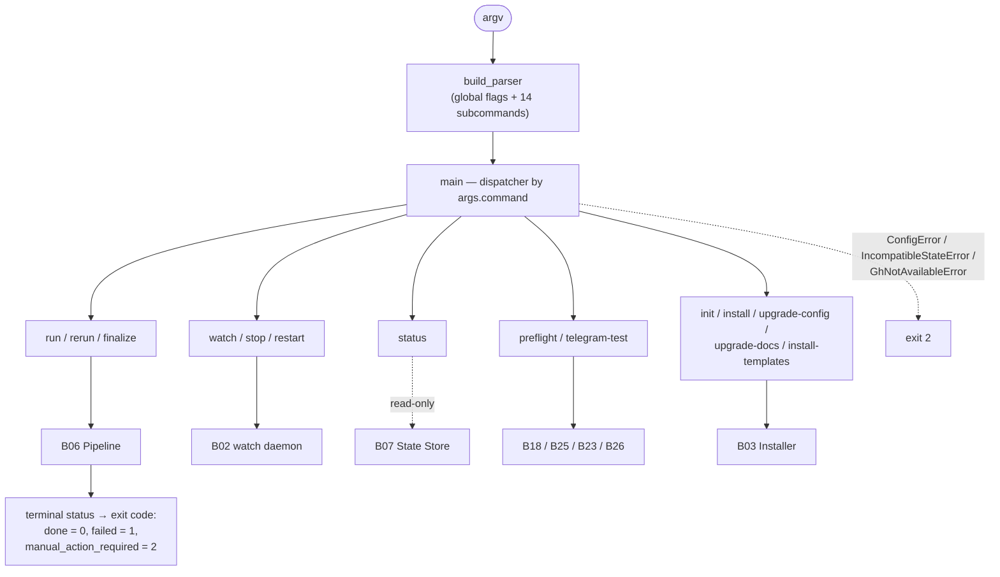

# B01 — CLI and Operator Commands

## Purpose

The sole user-facing interface of the system: parses arguments, dispatches subcommands, and returns exit codes. Implements thin drivers for the operator commands `run`, `status`, `preflight`, `telegram-test`, `rerun`, `finalize`, and shared infrastructure (configuration resolution/loading, logging setup). Install/upgrade commands and the `watch` daemon are dispatched here but implemented in [B03](./B03-installer-and-scaffolding.md)/[B02](./B02-watch-daemon-and-scheduling.md).

## Responsibilities

- Build the argument parser and all subcommands + global flags ([cli.py:114-376](../../../src/wastech_orchestrator/cli.py#L114)).
- Dispatch commands and map terminal status to exit code ([cli.py:1497-1541](../../../src/wastech_orchestrator/cli.py#L1497)).
- Drivers for `run`/`status`/`preflight`/`telegram-test`/`rerun`/`finalize` ([cli.py:849-1148](../../../src/wastech_orchestrator/cli.py#L849)).
- Resolve/load configuration and configure logging ([cli.py:542-565,734-768](../../../src/wastech_orchestrator/cli.py#L542)).

## Block Boundaries

### In scope

- Argument parsing, dispatching, exit codes, run/status/preflight/telegram-test/rerun/finalize drivers, configuration resolution helpers, logging setup.

### Out of scope

- **The pipeline itself** — [B06](./B06-orchestrator-pipeline.md); **watch daemon** — [B02](./B02-watch-daemon-and-scheduling.md); **install/scaffold** — [B03](./B03-installer-and-scaffolding.md).
- **Configuration model/validation** — [B05](./B05-configuration.md); **binding store** — [B04](./B04-install-registry-and-config-discovery.md).
- **Launching providers/checks/git** — respective blocks (CLI only orchestrates factory calls).

## Entry Points

- `main(argv=None)` ([cli.py:1497](../../../src/wastech_orchestrator/cli.py#L1497)) — console scripts `wastech-orchestrator`/`worc` ([pyproject.toml:29-32](../../../pyproject.toml#L29)) and `python -m wastech_orchestrator` ([\_\_main\_\_.py](../../../src/wastech_orchestrator/__main__.py)).
- `build_parser()` ([cli.py:114](../../../src/wastech_orchestrator/cli.py#L114)).
- `cmd_run`/`cmd_status`/`cmd_preflight`/`run_preflight`/`cmd_telegram_test`/`cmd_rerun`/`cmd_finalize` ([cli.py:849-1148](../../../src/wastech_orchestrator/cli.py#L849)).

## Inputs and State

Command-line arguments; resolved configuration; environment (for preflight/telegram). Holds no state — each command executes and returns an exit code.

## Main Scenario (dispatch)

1. `main` parses arguments, validates numeric flags.
2. The corresponding driver is called based on `args.command`.
3. `ConfigError`/`IncompatibleStateError`/`GhNotAvailableError` are caught → message + exit 2 ([cli.py:1538-1540](../../../src/wastech_orchestrator/cli.py#L1538)).
4. Terminal task status → exit code: `done`=0, `failed`=1, `manual_action_required`=2 ([cli.py:62-66](../../../src/wastech_orchestrator/cli.py#L62)).

Command routing and exit code mapping (CLI is a thin layer — all heavy work lives in the blocks):

## Alternative Scenarios

### `run`

Load config, (if PR) `require_gh`, `build_orchestrator`, `run_task`, print status + PR ([cli.py:849-865](../../../src/wastech_orchestrator/cli.py#L849)).

### `status`

Read-only `StateStore.open_readonly`: active/last task, stage, branch, subtask, counters, check profile — without launching anything ([cli.py:1266-1329](../../../src/wastech_orchestrator/cli.py#L1266)).

### `preflight`

`run_preflight`: `provider.preflight()` for resolved providers + `check_isolation` + check diagnostics + telegram-preflight → readiness + lines ([cli.py:1057-1113](../../../src/wastech_orchestrator/cli.py#L1057)).

### `rerun` / `finalize`

Plan (`plan_rerun`/`plan_finalize`) → if `--dry-run` print plan; otherwise confirm and `rerun_task`/`continue_task` / `finalize_task` ([cli.py:904-1054](../../../src/wastech_orchestrator/cli.py#L904)). Fails if the watch daemon is alive.

### `telegram-test`

`build_notifier` + `ask_human` — a real round-trip without task processing ([cli.py:1116-1147](../../../src/wastech_orchestrator/cli.py#L1116)).

## Checks and Constraints

- Subcommand is required; numeric flags (`--heartbeat-seconds`/`--poll-seconds`/`--timeout`) must be `>= 0` ([cli.py:1500-1505](../../../src/wastech_orchestrator/cli.py#L1500)).
- Config/DB version gates → clean exit 2 (no traceback) ([cli.py:1507-1540](../../../src/wastech_orchestrator/cli.py#L1507)).
- `rerun`/`finalize` fail when the watch daemon is alive (shared clone) ([cli.py:912-919,1006-1014](../../../src/wastech_orchestrator/cli.py#L912)).
- `run`/`watch`/`rerun` call `require_gh` (fast-fail) when `create_pull_request` is enabled.
- `status` is strictly read-only (open_readonly, no resolution/probing).

## Output

Print to stdout/stderr and process exit code. For tasks — status and (optionally) PR URL. For preflight — readiness lines.

## Side Effects

- Printing; exit code. All heavy work goes through delegated blocks (pipeline, providers, git, DB).
- Logging setup ([B27](./B27-observability.md)); for install/upgrade — file-system effects in [B03](./B03-installer-and-scaffolding.md).

## Errors and Edge Cases

- Configuration not found → hint about `install`/`--config` (exit 2) ([cli.py:734-743](../../../src/wastech_orchestrator/cli.py#L734)).
- Unknown command → `SystemExit` ([cli.py:1541](../../../src/wastech_orchestrator/cli.py#L1541)).
- `gh` absent when PRs are enabled → `GhNotAvailableError` → exit 2.

## Relationships

### Uses

- [B06 — Pipeline](./B06-orchestrator-pipeline.md) — `build_orchestrator`, `run_task`, `plan_rerun`/`rerun_task`/`continue_task`, `plan_finalize`/`finalize_task`.
- [B05](./B05-configuration.md)/[B04](./B04-install-registry-and-config-discovery.md) — configuration loading and resolution.
- [B07 — State Store](./B07-state-machine-and-store.md) — `open_readonly` for `status`.
- [B25](./B25-security-policy.md) (`check_isolation`), [B18](./B18-agent-providers.md) (`build_providers`/`preflight`), [B23](./B23-check-discovery.md) (check diagnostics), [B26](./B26-notifications-telegram.md) (`build_notifier`/preflight), [B27](./B27-observability.md) (`configure_logging`).
- [B03 — Installer](./B03-installer-and-scaffolding.md) and [B02 — watch](./B02-watch-daemon-and-scheduling.md) — dispatched commands.

### Used by

- End operators (entry point of the entire system).

## Place in the Overall System

This is the "face" of the orchestrator: every operator operation starts here and is delegated to the responsible block. The CLI owns the translation of operator intent into calls and the mapping of outcomes to exit codes, without implementing business logic itself.

## Code Evidence

- [cli.py:114-376](../../../src/wastech_orchestrator/cli.py#L114) — parser and subcommands.
- [cli.py:1497-1541](../../../src/wastech_orchestrator/cli.py#L1497) — dispatcher, error/code mapping.
- [cli.py:849-1148,1266-1329](../../../src/wastech_orchestrator/cli.py#L849) — run/preflight/telegram-test/rerun/finalize/status drivers.
- Tests: [tests/core/test_cli_pipeline.py](../../../tests/core/test_cli_pipeline.py), [test_cli_rerun.py](../../../tests/core/test_cli_rerun.py), [test_cli_finalize.py](../../../tests/core/test_cli_finalize.py), [tests/test_cli_preflight.py](../../../tests/test_cli_preflight.py), [tests/test_cli_version.py](../../../tests/test_cli_version.py), [tests/test_cli_watch.py](../../../tests/test_cli_watch.py).
