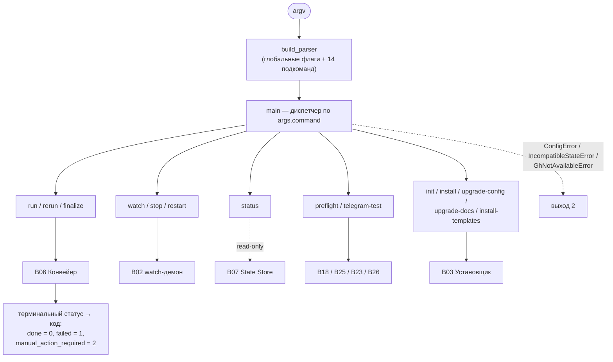

# B01 — CLI и операторские команды

## Назначение

Единственный пользовательский интерфейс системы: разбирает аргументы, диспетчеризует подкоманды и возвращает коды завершения. Реализует тонкие драйверы операторских команд `run`, `status`, `preflight`, `telegram-test`, `rerun`, `finalize` и общую инфраструктуру (разрешение/загрузка конфигурации, настройка логирования). Команды установки/апгрейда и `watch`-демон диспетчеризуются здесь, но реализуются в [B03](./B03-installer-and-scaffolding.md)/[B02](./B02-watch-daemon-and-scheduling.md).

## Ответственность

- Построить парсер аргументов и все подкоманды + глобальные флаги ([cli.py:114-376](../../../src/wastech_orchestrator/cli.py#L114)).
- Диспетчеризовать команду и отобразить терминальный статус в код возврата ([cli.py:1497-1541](../../../src/wastech_orchestrator/cli.py#L1497)).
- Драйверы `run`/`status`/`preflight`/`telegram-test`/`rerun`/`finalize` ([cli.py:849-1148](../../../src/wastech_orchestrator/cli.py#L849)).
- Разрешить/загрузить конфигурацию и настроить логирование ([cli.py:542-565,734-768](../../../src/wastech_orchestrator/cli.py#L542)).

## Границы блока

### Входит в ответственность блока

- Разбор аргументов, диспетчеризация, коды возврата, драйверы run/status/preflight/telegram-test/rerun/finalize, helpers разрешения конфигурации, настройка логирования.

### Не входит в ответственность блока

- **Сам конвейер** — [B06](./B06-orchestrator-pipeline.md); **демон watch** — [B02](./B02-watch-daemon-and-scheduling.md); **установка/скелет** — [B03](./B03-installer-and-scaffolding.md).
- **Модель/валидация конфигурации** — [B05](./B05-configuration.md); **стор привязок** — [B04](./B04-install-registry-and-config-discovery.md).
- **Запуск провайдеров/проверок/git** — соответствующие блоки (CLI лишь оркеструет вызовы фабрик).

## Точки входа

- `main(argv=None)` ([cli.py:1497](../../../src/wastech_orchestrator/cli.py#L1497)) — консольные скрипты `wastech-orchestrator`/`worc` ([pyproject.toml:29-32](../../../pyproject.toml#L29)) и `python -m wastech_orchestrator` ([\_\_main\_\_.py](../../../src/wastech_orchestrator/__main__.py)).
- `build_parser()` ([cli.py:114](../../../src/wastech_orchestrator/cli.py#L114)).
- `cmd_run`/`cmd_status`/`cmd_preflight`/`run_preflight`/`cmd_telegram_test`/`cmd_rerun`/`cmd_finalize` ([cli.py:849-1148](../../../src/wastech_orchestrator/cli.py#L849)).

## Входные данные и состояние

Аргументы командной строки; разрешённая конфигурация; окружение (для preflight/telegram). Состояния не хранит — каждая команда исполняется и возвращает код.

## Основной сценарий (диспетчеризация)

1. `main` парсит аргументы, валидирует числовые флаги.
2. По `args.command` вызывается соответствующий драйвер.
3. `ConfigError`/`IncompatibleStateError`/`GhNotAvailableError` ловятся → сообщение + выход 2 ([cli.py:1538-1540](../../../src/wastech_orchestrator/cli.py#L1538)).
4. Терминальный статус задачи → код: `done`=0, `failed`=1, `manual_action_required`=2 ([cli.py:62-66](../../../src/wastech_orchestrator/cli.py#L62)).

Маршрутизация команд и отображение в код возврата (CLI — тонкий слой: вся «тяжёлая» работа в блоках):

## Альтернативные сценарии

### `run`

Загрузить конфиг, (если PR) `require_gh`, `build_orchestrator`, `run_task`, печать статуса+PR ([cli.py:849-865](../../../src/wastech_orchestrator/cli.py#L849)).

### `status`

Read-only `StateStore.open_readonly`: активная/последняя задача, стадия, ветка, сабтаск, счётчики, профиль проверок — без запуска чего-либо ([cli.py:1266-1329](../../../src/wastech_orchestrator/cli.py#L1266)).

### `preflight`

`run_preflight`: `provider.preflight()` по разрешённым провайдерам + `check_isolation` + диагностика проверок + telegram-preflight → готовность + строки ([cli.py:1057-1113](../../../src/wastech_orchestrator/cli.py#L1057)).

### `rerun` / `finalize`

План (`plan_rerun`/`plan_finalize`) → при `--dry-run` печать плана; иначе подтверждение и `rerun_task`/`continue_task` / `finalize_task` ([cli.py:904-1054](../../../src/wastech_orchestrator/cli.py#L904)). Отказ при живом watch-демоне.

### `telegram-test`

`build_notifier` + `ask_human` — реальный round-trip без обработки задачи ([cli.py:1116-1147](../../../src/wastech_orchestrator/cli.py#L1116)).

## Проверки и ограничения

- Подкоманда обязательна; числовые флаги (`--heartbeat-seconds`/`--poll-seconds`/`--timeout`) — `>= 0` ([cli.py:1500-1505](../../../src/wastech_orchestrator/cli.py#L1500)).
- Версионные гейты конфига/БД → чистый выход 2 (не traceback) ([cli.py:1507-1540](../../../src/wastech_orchestrator/cli.py#L1507)).
- `rerun`/`finalize` отказывают при живом watch-демоне (общий клон) ([cli.py:912-919,1006-1014](../../../src/wastech_orchestrator/cli.py#L912)).
- `run`/`watch`/`rerun` при `create_pull_request` делают `require_gh` (быстрый отказ).
- `status` строго read-only (open_readonly, без резолва/проб).

## Результат

Печать в stdout/stderr и код возврата процесса. Для задач — статус и (опц.) URL PR. Для preflight — строки готовности.

## Побочные эффекты

- Печать; код возврата. Всё «тяжёлое» — через делегируемые блоки (конвейер, провайдеры, git, БД).
- Настройка логирования ([B27](./B27-observability.md)); для install/upgrade — файловые эффекты в [B03](./B03-installer-and-scaffolding.md).

## Ошибки и граничные случаи

- Конфигурация не найдена → подсказка про `install`/`--config` (выход 2) ([cli.py:734-743](../../../src/wastech_orchestrator/cli.py#L734)).
- Неизвестная команда → `SystemExit` ([cli.py:1541](../../../src/wastech_orchestrator/cli.py#L1541)).
- Отсутствует `gh` при включённых PR → `GhNotAvailableError` → выход 2.

## Связи

### Использует

- [B06 — Конвейер](./B06-orchestrator-pipeline.md) — `build_orchestrator`, `run_task`, `plan_rerun`/`rerun_task`/`continue_task`, `plan_finalize`/`finalize_task`.
- [B05](./B05-configuration.md)/[B04](./B04-install-registry-and-config-discovery.md) — загрузка и разрешение конфигурации.
- [B07 — State Store](./B07-state-machine-and-store.md) — `open_readonly` для `status`.
- [B25](./B25-security-policy.md) (`check_isolation`), [B18](./B18-agent-providers.md) (`build_providers`/`preflight`), [B23](./B23-check-discovery.md) (диагностика проверок), [B26](./B26-notifications-telegram.md) (`build_notifier`/preflight), [B27](./B27-observability.md) (`configure_logging`).
- [B03 — Установщик](./B03-installer-and-scaffolding.md) и [B02 — watch](./B02-watch-daemon-and-scheduling.md) — диспетчеризуемые команды.

### Используется в

- Конечными операторами (точка входа всей системы).

## Место в общей системе

Это «лицо» оркестратора: каждая операторская операция начинается здесь и делегируется профильному блоку. CLI владеет преобразованием намерения оператора в вызовы и отображением исхода в код возврата, не реализуя бизнес-логику сам.

## Подтверждение в коде

- [cli.py:114-376](../../../src/wastech_orchestrator/cli.py#L114) — парсер и подкоманды.
- [cli.py:1497-1541](../../../src/wastech_orchestrator/cli.py#L1497) — диспетчер, маппинг ошибок/кодов.
- [cli.py:849-1148,1266-1329](../../../src/wastech_orchestrator/cli.py#L849) — драйверы run/preflight/telegram-test/rerun/finalize/status.
- Тесты: [tests/core/test_cli_pipeline.py](../../../tests/core/test_cli_pipeline.py), [test_cli_rerun.py](../../../tests/core/test_cli_rerun.py), [test_cli_finalize.py](../../../tests/core/test_cli_finalize.py), [tests/test_cli_preflight.py](../../../tests/test_cli_preflight.py), [tests/test_cli_version.py](../../../tests/test_cli_version.py), [tests/test_cli_watch.py](../../../tests/test_cli_watch.py).
