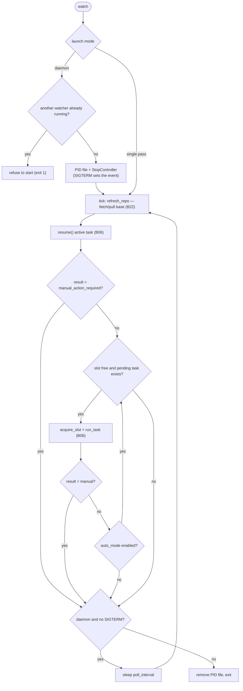

# B02 — Watch Daemon and Task Scheduling

## Purpose

Periodically discovers pending tasks and submits them to the orchestrator one at a time, operating as a stoppable daemon. Implements §8.2/§8.3: resume an interrupted task first, then pick up pending tasks only when a slot is free (one task when auto-mode is off; consecutive tasks when auto-mode is on), with periodic base-branch synchronization between ticks.

## Responsibilities

- Resume the active task, then select pending tasks according to the auto-mode rule (`watch_once`) ([cli.py:778-804](../../../src/wastech_orchestrator/cli.py#L778)).
- Run the loop with repository updates and sleep between ticks (`watch_loop`) ([cli.py:807-846](../../../src/wastech_orchestrator/cli.py#L807)).
- Daemonize: PID file, graceful stop on `SIGTERM`, refuse to start a second daemon (`cmd_watch`/`cmd_stop`/`cmd_restart`) ([cli.py:1160-1263](../../../src/wastech_orchestrator/cli.py#L1160)).
- Low-level PID/signal plumbing ([process_control.py](../../../src/wastech_orchestrator/process_control.py)).

## Block Boundaries

### Within this block's responsibility

- Periodic discovery/scheduling, submitting tasks one at a time, daemonization (PID, signals, stop/restart).

### Outside this block's responsibility

- **Task execution** and resumption as such — [B06](./B06-orchestrator-pipeline.md) (`run_task`/`resume`/`acquire_slot`/`refresh_repo`).
- **fetch/pull of the base branch** — implemented in [B22](./B22-git-manager.md) (via `B06.refresh_repo`).
- **Configuration loading** — [B05](./B05-configuration.md)/[B04](./B04-install-registry-and-config-discovery.md).

## Entry Points

- `cmd_watch`/`cmd_stop`/`cmd_restart` — dispatcher [B01](./B01-cli-and-operator-commands.md).
- `watch_once(orchestrator, config, folder)` / `watch_loop(...)` ([cli.py:778,807](../../../src/wastech_orchestrator/cli.py#L778)).
- `process_control`: `pid_file_path`, `write_pid_file`, `read_pid`, `is_running`, `stop_process`, `StopController` ([process_control.py:36-185](../../../src/wastech_orchestrator/process_control.py#L36)).

## Input Data and State

`OrchestratorConfig` (`poll_interval_seconds`, `auto_mode.enabled`); the `tasks/pending` folder; `--poll-seconds`/`--timeout` flags. Process state — PID file `<artifacts_root>/orchestrator.pid` and a `threading.Event` for stopping.

## Main Scenario (`watch_loop`)

1. On each tick: `orchestrator.refresh_repo()` (fetch/pull base via [B22](./B22-git-manager.md)), then `watch_once`, then sleep for `poll_interval` (or a single pass when `poll<=0`).
2. `watch_once`: `resume()` the active task; if `manual_action_required` — stop; then for pending tasks: take only when a slot is free (`acquire_slot`); `run_task`; `manual_action_required` blocks continuation; without auto-mode — exactly one task.

Logic of a single tick and stop conditions. `poll_interval > 0` — daemon (PID file, graceful stop on `SIGTERM`); `poll_interval <= 0` — single pass. A `manual_action_required` result interrupts queue processing in the current tick but does not terminate the daemon — it will continue from the next tick.

## Alternative Scenarios

### Daemon (poll > 0)

Writes the PID file, sets up `StopController` (SIGTERM→event), refuses to start if another watcher is already running; graceful stop between ticks ([cli.py:1186-1224](../../../src/wastech_orchestrator/cli.py#L1186)).

### Single pass (poll <= 0)

No PID file and no signal handler — a single `watch_loop` tick ([cli.py:1204-1205](../../../src/wastech_orchestrator/cli.py#L1204)).

### stop / restart

`cmd_stop`: `stop_process` (SIGTERM, then SIGKILL on timeout; idempotent; cleans up the PID file). `cmd_restart`: stop the previous instance, then `cmd_watch` ([cli.py:1227-1263](../../../src/wastech_orchestrator/cli.py#L1227)).

## Checks and Constraints

- The single slot is enforced via `acquire_slot` ([B06](./B06-orchestrator-pipeline.md)); `manual_action_required` blocks automatic continuation ([cli.py:791-803](../../../src/wastech_orchestrator/cli.py#L791)).
- Only one daemon per artifact-root (live PID check) ([cli.py:1188-1195](../../../src/wastech_orchestrator/cli.py#L1188)).
- `SIGTERM` **sets the event, it does not raise** — the current tick/stage completes; exit happens on the next check ([process_control.py:9-11,167-168](../../../src/wastech_orchestrator/process_control.py#L9)).
- PID file: atomic write, tolerant read, `signal(0)` probe; stale file is overwritten/cleaned up ([process_control.py:41-145](../../../src/wastech_orchestrator/process_control.py#L41)).
- `require_gh` on `create_pull_request` — fast failure before the loop starts ([cli.py:1176-1177](../../../src/wastech_orchestrator/cli.py#L1176)).

## Output

A list of `PipelineResult` for processed tasks (for final output/exit code in [B01](./B01-cli-and-operator-commands.md)); side effects — processed tasks and daemon state.

## Side Effects

- Writing/removing the PID file; sending `SIGTERM`/`SIGKILL`; periodic git fetch/pull (via [B06](./B06-orchestrator-pipeline.md)→[B22](./B22-git-manager.md)); launching tasks (via [B06](./B06-orchestrator-pipeline.md)).

## Errors and Edge Cases

- A second watcher on the same root → refuse to start (exit 1).
- `Ctrl-C` (`KeyboardInterrupt`) → clean exit; PID file is removed in `finally`.
- `stop` with no live watcher → idempotent message; stale PID is cleaned up.

## Relationships

### Uses

- [B06 — Pipeline](./B06-orchestrator-pipeline.md) — `resume`/`acquire_slot`/`run_task`/`refresh_repo`.
- [B05 — Configuration](./B05-configuration.md) — `poll_interval_seconds`, `auto_mode`.
- [B27 — Observability](./B27-observability.md) — logging.

### Used by

- [B01 — CLI](./B01-cli-and-operator-commands.md) — `watch`/`stop`/`restart` dispatcher.

## Role in the Overall System

Turns a one-shot `run` into a continuous service: discovers tasks added to `tasks/pending` (including those pushed via git) and feeds them into [B06](./B06-orchestrator-pipeline.md) strictly one at a time, surviving controlled stop/restart.

## Code Confirmation

- [cli.py:771-846](../../../src/wastech_orchestrator/cli.py#L771) — `select_pending`/`watch_once`/`watch_loop`.
- [cli.py:1160-1263](../../../src/wastech_orchestrator/cli.py#L1160) — `cmd_watch`/`cmd_stop`/`cmd_restart`.
- [process_control.py:36-185](../../../src/wastech_orchestrator/process_control.py#L36) — PID/signals/`StopController`.
- Tests: [tests/test_cli_watch.py](../../../tests/test_cli_watch.py), [tests/test_process_control.py](../../../tests/test_process_control.py).
