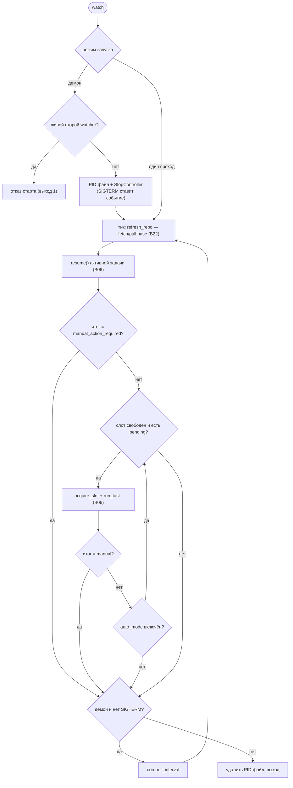

# B02 — Демон watch и планирование задач

## Назначение

Периодически обнаруживает pending-задачи и подаёт их в оркестратор по одной, работая как
останавливаемый демон. Реализует §8.2/§8.3: возобновить прерванную задачу, затем брать pending только
при свободном слоте (одну при выключенном auto-mode; подряд — при включённом), с периодической
синхронизацией базовой ветки между тиками.

## Ответственность

- Возобновить активную задачу, затем выбрать pending согласно правилу auto-mode (`watch_once`)
  ([cli.py:778-804](../../../src/wastech_orchestrator/cli.py#L778)).
- Гонять цикл с обновлением репозитория и сном между тиками (`watch_loop`) ([cli.py:807-846](../../../src/wastech_orchestrator/cli.py#L807)).
- Демонизировать: PID-файл, грейсфул-остановка по `SIGTERM`, отказ от второго демона (`cmd_watch`/`cmd_stop`/`cmd_restart`) ([cli.py:1160-1263](../../../src/wastech_orchestrator/cli.py#L1160)).
- Низкоуровневая PID/сигнальная плумбинг ([process_control.py](../../../src/wastech_orchestrator/process_control.py)).

## Границы блока

### Входит в ответственность блока

- Периодическое обнаружение/планирование, подача задач по одной, демонизация (PID, сигналы, stop/restart).

### Не входит в ответственность блока

- **Прогон задачи** и возобновление как таковые — [B06](./B06-orchestrator-pipeline.md) (`run_task`/`resume`/`acquire_slot`/`refresh_repo`).
- **fetch/pull базовой ветки** — реализация в [B22](./B22-git-manager.md) (через `B06.refresh_repo`).
- **Загрузка конфигурации** — [B05](./B05-configuration.md)/[B04](./B04-install-registry-and-config-discovery.md).

## Точки входа

- `cmd_watch`/`cmd_stop`/`cmd_restart` — диспетчер [B01](./B01-cli-and-operator-commands.md).
- `watch_once(orchestrator, config, folder)` / `watch_loop(...)` ([cli.py:778,807](../../../src/wastech_orchestrator/cli.py#L778)).
- `process_control`: `pid_file_path`, `write_pid_file`, `read_pid`, `is_running`, `stop_process`, `StopController` ([process_control.py:36-185](../../../src/wastech_orchestrator/process_control.py#L36)).

## Входные данные и состояние

`OrchestratorConfig` (`poll_interval_seconds`, `auto_mode.enabled`); папка `tasks/pending`; флаги
`--poll-seconds`/`--timeout`. Состояние процесса — PID-файл `<artifacts_root>/orchestrator.pid` и
`threading.Event` остановки.

## Основной сценарий (`watch_loop`)

1. На каждом тике: `orchestrator.refresh_repo()` (fetch/pull base через [B22](./B22-git-manager.md)),
   затем `watch_once`, затем сон `poll_interval` (или один проход при `poll<=0`).
2. `watch_once`: `resume()` активной задачи; если `manual_action_required` — стоп; затем по pending:
   брать только при свободном слоте (`acquire_slot`); `run_task`; `manual_action_required` блокирует
   продолжение; без auto-mode — ровно одна задача.

Логика одного тика и условия остановки. `poll_interval > 0` — демон (PID-файл, грейсфул-стоп по
`SIGTERM`); `poll_interval <= 0` — один проход. Результат `manual_action_required` прерывает обработку
очереди в текущем тике, но не завершает демон — он продолжит со следующего тика.

## Альтернативные сценарии

### Демон (poll > 0)

Пишет PID-файл, ставит `StopController` (SIGTERM→event), отказывается стартовать при живом втором
watcher; грейсфул-остановка между тиками ([cli.py:1186-1224](../../../src/wastech_orchestrator/cli.py#L1186)).

### Одиночный проход (poll <= 0)

Без PID-файла и обработчика сигнала — один `watch_loop`-тик ([cli.py:1204-1205](../../../src/wastech_orchestrator/cli.py#L1204)).

### stop / restart

`cmd_stop`: `stop_process` (SIGTERM, затем SIGKILL по таймауту; идемпотентно; чистит PID-файл).
`cmd_restart`: остановить предыдущего, затем `cmd_watch` ([cli.py:1227-1263](../../../src/wastech_orchestrator/cli.py#L1227)).

## Проверки и ограничения

- Единый слот соблюдается через `acquire_slot` ([B06](./B06-orchestrator-pipeline.md)); `manual_action_required` блокирует авто-продолжение ([cli.py:791-803](../../../src/wastech_orchestrator/cli.py#L791)).
- Только один демон на artifact-root (проверка живого PID) ([cli.py:1188-1195](../../../src/wastech_orchestrator/cli.py#L1188)).
- `SIGTERM` **ставит событие, а не бросает** — текущий тик/стадия завершаются, выход — на следующей
  проверке ([process_control.py:9-11,167-168](../../../src/wastech_orchestrator/process_control.py#L9)).
- PID-файл: атомарная запись, толерантное чтение, проба `signal(0)`; stale-файл перезаписывается/чистится ([process_control.py:41-145](../../../src/wastech_orchestrator/process_control.py#L41)).
- `require_gh` при `create_pull_request` — быстрый отказ до старта цикла ([cli.py:1176-1177](../../../src/wastech_orchestrator/cli.py#L1176)).

## Результат

Список `PipelineResult` по обработанным задачам (для итогового вывода/кода возврата [B01](./B01-cli-and-operator-commands.md)); побочно — обработанные задачи и состояние демона.

## Побочные эффекты

- Запись/удаление PID-файла; отправка `SIGTERM`/`SIGKILL`; периодический git fetch/pull (через
  [B06](./B06-orchestrator-pipeline.md)→[B22](./B22-git-manager.md)); запуск задач (через [B06](./B06-orchestrator-pipeline.md)).

## Ошибки и граничные случаи

- Второй watcher на тот же root → отказ старта (выход 1).
- `Ctrl-C` (`KeyboardInterrupt`) → чистый выход; PID-файл удаляется в `finally`.
- `stop` без живого watcher → идемпотентное сообщение; stale PID — чистится.

## Связи

### Использует

- [B06 — Конвейер](./B06-orchestrator-pipeline.md) — `resume`/`acquire_slot`/`run_task`/`refresh_repo`.
- [B05 — Конфигурация](./B05-configuration.md) — `poll_interval_seconds`, `auto_mode`.
- [B27 — Наблюдаемость](./B27-observability.md) — логирование.

### Используется в

- [B01 — CLI](./B01-cli-and-operator-commands.md) — диспетчер `watch`/`stop`/`restart`.

## Место в общей системе

Превращает разовый `run` в непрерывный сервис: обнаруживает задачи, добавленные в `tasks/pending`
(в т.ч. запушенные в git), и кормит их в [B06](./B06-orchestrator-pipeline.md) строго по одной,
переживая управляемую остановку/перезапуск.

## Подтверждение в коде

- [cli.py:771-846](../../../src/wastech_orchestrator/cli.py#L771) — `select_pending`/`watch_once`/`watch_loop`.
- [cli.py:1160-1263](../../../src/wastech_orchestrator/cli.py#L1160) — `cmd_watch`/`cmd_stop`/`cmd_restart`.
- [process_control.py:36-185](../../../src/wastech_orchestrator/process_control.py#L36) — PID/сигналы/`StopController`.
- Тесты: [tests/test_cli_watch.py](../../../tests/test_cli_watch.py), [tests/test_process_control.py](../../../tests/test_process_control.py).
