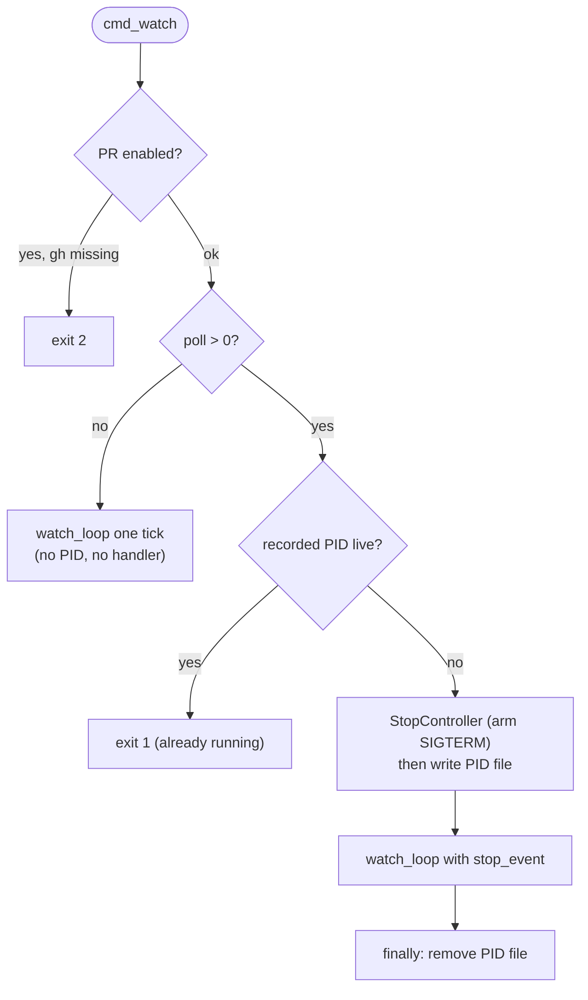

# B02 — Watch Daemon and Task Scheduling

> Reconstructed from code (`cli.py` watch surface, `process_control.py`) and tests (`tests/test_cli_watch.py`, `tests/test_process_control.py`). The code is the only source of truth; this document was rebuilt from the implementation, not from prose or comments. Significant claims carry a `file:line` reference.

**Status:** documented · **Source modules:** `src/wastech_orchestrator/cli.py`, `src/wastech_orchestrator/process_control.py`

## Responsibility

Turn the one-shot `run` pipeline into a stoppable polling service: discover task files dropped (or git-pushed) into `tasks/pending`, resume any single in-flight task first, then feed pending tasks to the orchestrator one at a time under the auto-mode rule. The daemon owns its own lifecycle — a PID file, a refuse-second-instance guard, and a `SIGTERM`-to-event bridge that lets the current tick finish before exit. All scheduling logic lives in `cli.py`; all PID/signal plumbing lives in `process_control.py`, which is print-free and fully seam-injectable so it is unit-testable without real processes ([process_control.py:1](../../../src/wastech_orchestrator/process_control.py#L1)).

The block schedules; it does not execute. Task execution, resumption, slot ownership, and base-branch refresh are all `Orchestrator` methods owned by [B06](B06-orchestrator-pipeline.md); this block only sequences calls to them.

## Public surface

- `select_pending` ([cli.py:535](../../../src/wastech_orchestrator/cli.py#L535)) — pending `.md`/`.json` task files in a deterministic (sorted) order.
- `watch_once` ([cli.py:542](../../../src/wastech_orchestrator/cli.py#L542)) — one scheduling pass: resume, then drain pending under the auto-mode rule.
- `watch_loop` ([cli.py:571](../../../src/wastech_orchestrator/cli.py#L571)) — `refresh_repo` → `watch_once` → sleep/event-wait, bounded by `poll_interval`/`max_iterations`/`stop_event`.
- `cmd_watch` / `cmd_stop` / `cmd_restart` ([cli.py:935](../../../src/wastech_orchestrator/cli.py#L935), [cli.py:1002](../../../src/wastech_orchestrator/cli.py#L1002), [cli.py:1021](../../../src/wastech_orchestrator/cli.py#L1021)) — the operator subcommands, dispatched by [B01](B01-cli-and-operator-commands.md).
- `pending_dir` ([cli.py:522](../../../src/wastech_orchestrator/cli.py#L522)) — `<repo>/tasks/pending`.
- `pid_file_path`, `write_pid_file`, `read_pid`, `is_running`, `stop_process`, `StopController` ([process_control.py:36](../../../src/wastech_orchestrator/process_control.py#L36) onward) — the PID/signal plumbing.

## Behavior

### Single scheduling pass — `watch_once`

A pass resumes the in-flight task **first**, before touching the pending queue ([cli.py:552](../../../src/wastech_orchestrator/cli.py#L552)). `orchestrator.resume()` returns the resumed task's terminal result, or `None` when the slot is free ([orchestrator.py:643](../../../src/wastech_orchestrator/core/orchestrator.py#L643)). If the resume lands in `MANUAL_ACTION_REQUIRED`, the pass returns immediately and **no pending task is picked** ([cli.py:555](../../../src/wastech_orchestrator/cli.py#L555)) — a stuck human-in-the-loop task blocks the queue rather than piling new work behind it.

Otherwise the pass iterates `select_pending(folder)` and, for each file, re-checks the slot via `acquire_slot("")` ([cli.py:560](../../../src/wastech_orchestrator/cli.py#L560)). `acquire_slot` is true iff no task with a non-empty id is active ([orchestrator.py:377](../../../src/wastech_orchestrator/core/orchestrator.py#L377)); the empty-string argument means "is the slot free for _anyone_". A busy slot breaks the loop. On a free slot it runs `orchestrator.run_task(str(task_file))` and appends the result.

Auto-mode gating after each `run_task` ([cli.py:558](../../../src/wastech_orchestrator/cli.py#L558), [cli.py:564](../../../src/wastech_orchestrator/cli.py#L564)):

- `MANUAL_ACTION_REQUIRED` → break (always blocks continuation, regardless of auto-mode).
- auto-mode **off** → break after exactly one task.
- auto-mode **on** → continue to the next pending task (the next iteration re-checks the slot).

So `auto_mode=false` processes at most one task per pass; `auto_mode=true` drains consecutive pending tasks until the slot is busy, the queue empties, or a manual gate fires.

### The loop — `watch_loop`

Each iteration runs `orchestrator.refresh_repo()` then extends results with one `watch_once` ([cli.py:598](../../../src/wastech_orchestrator/cli.py#L598)). `refresh_repo` is a best-effort fetch + ff-only pull of `base_branch` that the Git Manager no-ops unless the working copy is on `base_branch` — i.e. only when the slot is free after terminal cleanup — so it never disturbs an active or interrupted task branch ([orchestrator.py:634](../../../src/wastech_orchestrator/core/orchestrator.py#L634)). This is how a task pushed to git **after** the daemon started becomes visible.

Termination is checked at the **top of the loop**, before the tick ([cli.py:596](../../../src/wastech_orchestrator/cli.py#L596)). `poll_interval <= 0` runs exactly one tick with no sleep ([cli.py:601](../../../src/wastech_orchestrator/cli.py#L601)); `max_iterations` bounds the loop for tests ([cli.py:603](../../../src/wastech_orchestrator/cli.py#L603)). The between-tick wait is `stop_event.wait(poll_interval)` when an event is supplied — it returns the instant `SIGTERM` fires, cutting the sleep short ([cli.py:606](../../../src/wastech_orchestrator/cli.py#L606)) — otherwise plain `sleep_fn(poll_interval)` ([cli.py:609](../../../src/wastech_orchestrator/cli.py#L609)). Because the event is consulted only at the top of the loop and during the wait, **`SIGTERM` is respected only between ticks**: an in-flight `watch_once` (and the task stage inside it) always finishes.

### Daemon vs single pass — `cmd_watch`

`poll` is `--poll-seconds` when given, else `config.orchestrator.poll_interval_seconds` ([cli.py:953](../../../src/wastech_orchestrator/cli.py#L953)). The PID file lives at `<repo>/.worc/orchestrator.pid` — under `worc_home_for` (the gitignored runtime home), not the tracked `tasks/` root ([cli.py:959](../../../src/wastech_orchestrator/cli.py#L959), [cli.py:503](../../../src/wastech_orchestrator/cli.py#L503)).

When `config.git.create_pull_request` is set, `detect.require_gh()` fails fast (exit 2) before the loop starts, in both modes ([cli.py:951](../../../src/wastech_orchestrator/cli.py#L951)).

**Single pass (`poll <= 0`):** no PID file, no signal handler — just `_summarize_watch(watch_loop(..., poll_interval=poll))` ([cli.py:979](../../../src/wastech_orchestrator/cli.py#L979)).

**Daemon (`poll > 0`):**

1. Refuse a second watcher: if the recorded PID is live, print "already running" and exit 1 ([cli.py:963](../../../src/wastech_orchestrator/cli.py#L963)). A stale PID (process gone) is not refused — it is overwritten on start.
2. Enter a `StopController` context (installs the `SIGTERM` handler), then `write_pid_file(pid_path)` ([cli.py:984](../../../src/wastech_orchestrator/cli.py#L984)). Ordering matters: the handler is armed before the PID is published.
3. Run `watch_loop(..., stop_event=controller.event)`.
4. A `KeyboardInterrupt` (Ctrl-C) prints "watch: stopped" and exits 0 ([cli.py:991](../../../src/wastech_orchestrator/cli.py#L991)).
5. A `finally` removes the PID file on every exit path — clean exit, Ctrl-C, error, or a process that survived a `SIGKILL` long enough to reach here ([cli.py:995](../../../src/wastech_orchestrator/cli.py#L995)).
6. If the event was set, the shutdown was a graceful `SIGTERM` → print "watch: stopped", exit 0 ([cli.py:996](../../../src/wastech_orchestrator/cli.py#L996)); otherwise summarize the processed tasks ([cli.py:999](../../../src/wastech_orchestrator/cli.py#L999)).

### stop / restart

`cmd_stop` calls `stop_process(pid_path, timeout=args.timeout)` and maps the `StopOutcome` to one of four operator messages — no PID file, stale PID cleared, escalated to SIGKILL, or stopped — always returning exit 0 ([cli.py:1002](../../../src/wastech_orchestrator/cli.py#L1002)). `cmd_restart` stops the recorded daemon (a _different_ process), reports whether one was running, then delegates to `cmd_watch(args)` to run a fresh loop in-process — so it never needs to remember the old daemon's flags ([cli.py:1021](../../../src/wastech_orchestrator/cli.py#L1021)).

`stop_process` is the escalation engine ([process_control.py:101](../../../src/wastech_orchestrator/process_control.py#L101)): read the PID (absent → `found=False` no-op), probe liveness (dead → reap the stale file, `already_dead=True`), send `SIGTERM`, then poll `is_running` until `timeout`; if still alive, escalate to `SIGKILL`. The PID file is unlinked in every terminal branch — the backstop for a `SIGKILL`ed daemon that could not remove its own file ([process_control.py:144](../../../src/wastech_orchestrator/process_control.py#L144)). A `ProcessLookupError` racing between the probe and either signal is swallowed and treated as already-dead ([process_control.py:128](../../../src/wastech_orchestrator/process_control.py#L128), [process_control.py:139](../../../src/wastech_orchestrator/process_control.py#L139)).

### SIGTERM bridge — `StopController`

A context manager that maps configured signals (default `SIGTERM`) to a `threading.Event`; the handler only calls `self.event.set()` — it never raises ([process_control.py:167](../../../src/wastech_orchestrator/process_control.py#L167)). `__exit__` restores the previous disposition of each signal so a leaked handler can't corrupt later code (or later pytest tests) ([process_control.py:175](../../../src/wastech_orchestrator/process_control.py#L175)); a previous handler of `None` (not installed from Python) is left alone since it cannot be restored ([process_control.py:182](../../../src/wastech_orchestrator/process_control.py#L182)). `signal.signal` only works on the main thread, so the controller must be entered there — the CLI does.

## Invariants & guarantees

- **Resume before pending.** A pass always reconciles the single in-flight task before considering new work; a `MANUAL_ACTION_REQUIRED` resume short-circuits the pass ([cli.py:552](../../../src/wastech_orchestrator/cli.py#L552)).
- **One task at a time.** Every pending pick is gated on a free slot via `acquire_slot("")` ([cli.py:560](../../../src/wastech_orchestrator/cli.py#L560)); the single-slot invariant itself is owned by [B07](B07-state-machine-and-store.md)'s active-task query.
- **`manual_action_required` always blocks continuation**, independent of auto-mode ([cli.py:564](../../../src/wastech_orchestrator/cli.py#L564)).
- **One daemon per artifact root.** A live recorded PID makes `cmd_watch` refuse (exit 1); a stale one is overwritten ([cli.py:963](../../../src/wastech_orchestrator/cli.py#L963)).
- **SIGTERM never interrupts a tick.** The event is set, not raised, and is consulted only at the top of the loop and in the between-tick wait ([process_control.py:167](../../../src/wastech_orchestrator/process_control.py#L167), [cli.py:596](../../../src/wastech_orchestrator/cli.py#L596)).
- **PID file is always removed on daemon exit** via `finally` ([cli.py:995](../../../src/wastech_orchestrator/cli.py#L995)), and `stop_process` reaps it in every branch ([process_control.py:144](../../../src/wastech_orchestrator/process_control.py#L144)).
- **`stop` is idempotent.** Absent, malformed, or stale PID files signal nothing ([process_control.py:119](../../../src/wastech_orchestrator/process_control.py#L119), [read_pid](../../../src/wastech_orchestrator/process_control.py#L54)).
- **PID write is atomic** — temp file + `os.replace` — so a concurrent `stop` never reads a half-written PID ([process_control.py:41](../../../src/wastech_orchestrator/process_control.py#L41)).
- **`refresh_repo` only acts when the slot is free**, guaranteed downstream by the Git Manager no-op off `base_branch` ([orchestrator.py:634](../../../src/wastech_orchestrator/core/orchestrator.py#L634)).

## Dependencies

- **Uses:** B06 (`resume`, `run_task`, `acquire_slot`, `refresh_repo` — all the actual work), B07 (the active-task query backing `acquire_slot`'s single slot), B16 (the pending task files and `tasks/` lifecycle dirs that `select_pending` scans), B05 (`poll_interval_seconds`, `auto_mode.enabled`, `create_pull_request`), B27 (runtime logging). The execution spine `run_task`/`resume` invoke is the flow engine ([B28](B28-flow-engine.md)) over a node graph ([B29](B29-flow-definition-and-validation.md), [B30](B30-flow-node-runners.md)) — opaque to this block.
- **Used by:** B01 (dispatches `watch` / `stop` / `restart`).

## Audit candidates

- `src/wastech_orchestrator/process_control.py:50,71` — PID-recycling window — see [the audit](../../backlog/2026-06-21-audit.md). The PID file stores only the bare integer ([process_control.py:50](../../../src/wastech_orchestrator/process_control.py#L50)) and `is_running` probes solely via `signal 0` ([process_control.py:71](../../../src/wastech_orchestrator/process_control.py#L71)); no process start-time / boot-id is recorded anywhere. Between a daemon's death and a `stop`/`is_running` probe the OS may recycle the PID onto an unrelated process, which `is_running` then reports as "running" — causing `cmd_watch` to refuse a legitimate start ([cli.py:965](../../../src/wastech_orchestrator/cli.py#L965)) or `stop_process` to `SIGTERM`/`SIGKILL` the wrong process ([process_control.py:127](../../../src/wastech_orchestrator/process_control.py#L127)). The module docstring even acknowledges the limitation but no mitigation exists.
- `tests/test_process_control.py:38,122,141` — Windows-unportable test references to `signal.SIGKILL` — see [the audit](../../backlog/2026-06-21-audit.md). Production `stop_process` correctly falls back via `getattr(signal, "SIGKILL", signal.SIGTERM)` ([process_control.py:107](../../../src/wastech_orchestrator/process_control.py#L107)), so the daemon itself is portable. But the tests name `signal.SIGKILL` directly — `FakeProcess.__call__` compares `sig == signal.SIGKILL` ([tests/test_process_control.py:38](../../../tests/test_process_control.py#L38)) and two assertions reference it ([tests/test_process_control.py:122](../../../tests/test_process_control.py#L122), [tests/test_process_control.py:141](../../../tests/test_process_control.py#L141)) — which `AttributeError`s on Windows, where `signal.SIGKILL` does not exist. Minor (CI is POSIX) but it silently undercuts the "fully seam-injectable / portable" claim.

## Tests

- `tests/test_cli_watch.py` — `pending_dir` resolves under the bound repo, not the cwd (`test_pending_dir_is_under_the_bound_repo`); `watch_loop` stop semantics: pre-set event skips the first tick, an event set mid-tick prevents a second tick, and the no-event path uses `sleep_fn` and sleeps only between ticks; daemon control: `stop` is idempotent with no PID file, clears a stale PID, `watch` refuses a second instance and writes-then-removes the PID file, `restart` stops the previous watcher then delegates the flags to `cmd_watch`; and `require_gh` fast-fail is exercised on (and skipped off) `create_pull_request`.
- `tests/test_process_control.py` — round-trip / parent-dir creation and tolerant `read_pid` (absent / empty / garbage); `is_running` truth table (signalable, `ProcessLookupError`, `PermissionError`); `stop_process` paths (absent no-op, stale reap, graceful SIGTERM-only, SIGKILL escalation after timeout); and `StopController` installing the handler, setting the event, and restoring the prior disposition on exit — all with injected OS seams, no real processes or signals.
