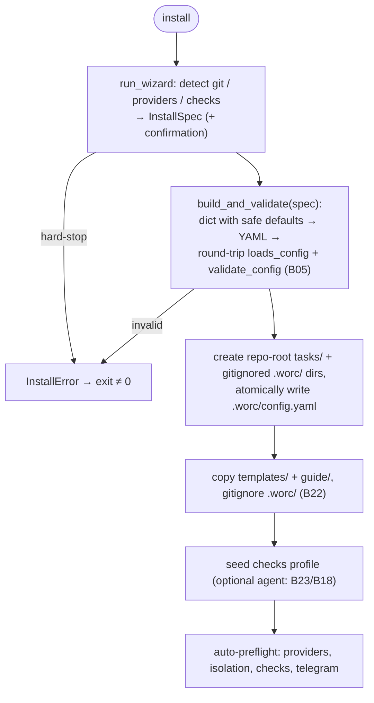

# B03 — Installer and Project Scaffolding

## Purpose

Creates and maintains the on-disk installation of the orchestrator in a target repository: `install` (wizard → generate a valid `config.yaml` and scaffold the `<repo>/.worc/` home + the repo-root `tasks/` lifecycle dirs) plus maintenance commands (`upgrade-config`, `upgrade-docs`, `install-templates`). Environment detection is read-only. `install` is the single setup command; `--non-interactive` resolves everything from flags/detection without prompting.

## Responsibilities

- `install`: run the wizard → `InstallSpec`, generate + validate `config.yaml` under `<repo>/.worc/`, create the runtime + task dirs, copy `templates/` and the `guide/` docs, gitignore `.worc/`, seed checks, auto-preflight ([cli.py:1298-1352](../../../src/wastech_orchestrator/cli.py#L1298)).
- Wizard: detect git / providers / checks, resolve settings, hard-stops ([wizard.py:68-119](../../../src/wastech_orchestrator/install/wizard.py#L68)).
- Configuration generation with safe defaults + round-trip validation ([config_writer.py:99-191](../../../src/wastech_orchestrator/install/config_writer.py#L99)).
- Read-only environment detection ([detect.py](../../../src/wastech_orchestrator/install/detect.py)).

## Block Boundaries

### Within this block's responsibility

- Installation wizard, config generation + validation, `<repo>/.worc/` scaffolding, environment detection, upgrade / template-delivery commands.

### Outside this block's responsibility

- **Configuration model / rules** — [B05](./B05-configuration.md) (`loads_config` / `validate_config` / `upgrade`).
- **Config discovery** — [B04](./B04-install-registry-and-config-discovery.md) (`resolve_config_path`).
- **Pipeline git operations** — [B22](./B22-git-manager.md) (only `append_runtime_excludes` is used here).
- **Task execution** — [B06](./B06-orchestrator-pipeline.md).

## Entry Points

- `cmd_install` / `cmd_upgrade_config` / `cmd_upgrade_docs` / `cmd_install_templates` — dispatcher [B01](./B01-cli-and-operator-commands.md).
- `wizard.run_wizard(...)` → `WizardOutcome` ([wizard.py:68](../../../src/wastech_orchestrator/install/wizard.py#L68)).
- `config_writer.build_and_validate(spec)` ([config_writer.py:182](../../../src/wastech_orchestrator/install/config_writer.py#L182)).
- `detect.git_info` / `detect_providers` / `detect_checks` / `has_gh` / `require_gh` ([detect.py](../../../src/wastech_orchestrator/install/detect.py)) — `require_gh` is also called from [B01/B02](./B01-cli-and-operator-commands.md) on `run` / `watch` / `rerun`.

## Inputs and State

CLI flags (`--provider`, `--check`, `--create-pr`, `--auto-mode`, `--non-interactive`, `--reconfigure`, `--skip-preflight`, `--dry-run`); operator environment (git, PATH, repository ecosystem); packaged `templates/`, `worc/`, `config.example.yaml`. No persistent state (creates files under the repo).

## Main Scenario (`install`)

1. `run_wizard`: verify git; `git_info` (root / origin / branch / cleanliness); resolve providers / checks / create_pr / auto_mode → `InstallSpec` (+ confirmation).
2. `build_and_validate(spec)`: build a dict with safe defaults, render YAML, round-trip through `loads_config` + `validate_config`.
3. Create the tracked repo-root task dirs (`tasks/{pending,processing,done,failed}`) and the gitignored `<repo>/.worc/` runtime dirs (`logs/`, `workspace/`, `checks/`, `tasks/rejected`); atomically write `<repo>/.worc/config.yaml`.
4. Copy `templates/` and the `guide/` docs into `.worc/`; append the single `.worc/` line to the repo's tracked `.gitignore` ([B22](./B22-git-manager.md) `append_runtime_excludes`).
5. Seed the checks profile (optional agent-based resolution) and auto-preflight ([cli.py:1336-1352](../../../src/wastech_orchestrator/cli.py#L1336)).

`install` flow with fail-closed gates (if the wizard hits a hard-stop, or the generated config fails to load / validate, nothing is written):

## Alternative Scenarios

### Upgrade / Template Delivery

`upgrade-config` (via [B05 upgrade](./B05-configuration.md): add-missing + backup + atomic write), `upgrade-docs` (overwrite `.worc/guide/` with the packaged version), `install-templates` (add-missing-only into `.worc/templates/`) ([cli.py:430-591](../../../src/wastech_orchestrator/cli.py#L430)).

### Re-install

Without `--reconfigure`: no-op when `.worc/config.yaml` already exists (still runs auto-preflight); with `--reconfigure` — backup + regeneration (and the templates/guide are refreshed to the packaged version) ([cli.py:1329-1344](../../../src/wastech_orchestrator/cli.py#L1329)).

## Validations and Constraints

- Wizard hard-stops → `InstallError`: no git / not a repository / no origin / no available provider / cancelled ([wizard.py:79-132](../../../src/wastech_orchestrator/install/wizard.py#L79)).
- `build_and_validate` fail-closed: the generated config must load and pass §11 / §21.4 ([config_writer.py:182-191](../../../src/wastech_orchestrator/install/config_writer.py#L182)).
- Safe defaults are hard-coded: strict_isolation, denied commands / paths, the `.worc/` audit footprint, auto_merge off ([config_writer.py:99-173](../../../src/wastech_orchestrator/install/config_writer.py#L99)).
- Git detection uses argv via [B19](./B19-subprocess-runner.md) (no shell), with a timeout ([detect.py](../../../src/wastech_orchestrator/install/detect.py)).

## Output

Created directories / files (`<repo>/.worc/config.yaml`, `.worc/templates/`, `.worc/guide/`, repo-root `tasks/` dirs), a single `.worc/` line in `.gitignore`; auto-preflight result. Return codes are printed by [B01](./B01-cli-and-operator-commands.md).

## Side Effects

- Directory and file creation; atomic write of `config.yaml` (+ backup on reconfigure / upgrade); appending `.worc/` to `.gitignore` ([B22](./B22-git-manager.md)); read-only git probes; auto-preflight (runs provider.preflight, isolation, checks, telegram).

## Errors and Edge Cases

- `InstallError` → message + non-zero exit ([B01](./B01-cli-and-operator-commands.md)).
- `--dry-run` writes nothing (prints the plan).
- Upgrade / delivery commands fail-closed (exit 2) if the installation location cannot be resolved.

## Relationships

### Uses

- [B05 — Configuration](./B05-configuration.md) — `loads_config` / `validate_config` / `upgrade`.
- [B04 — Config Discovery](./B04-install-registry-and-config-discovery.md) — `resolve_config_path` (the upgrade/template commands locate the install via it).
- [B19 — Subprocess Runner](./B19-subprocess-runner.md) — git probes in `detect`.
- [B22 — Git Manager](./B22-git-manager.md) — `append_runtime_excludes`.
- [B25 — Security](./B25-security-policy.md) — safe defaults in the generated config.
- [B18](./B18-agent-providers.md) / [B23](./B23-check-discovery.md) — `build_providers` / resolver when seeding checks.

### Used by

- [B01 — CLI](./B01-cli-and-operator-commands.md) — dispatcher for install / upgrade commands; `require_gh` on `run`.
- [B02 — Watch Daemon](./B02-watch-daemon-and-scheduling.md) — `require_gh` on `watch` startup.
- [B04 — Config Discovery](./B04-install-registry-and-config-discovery.md) — `git_info` in `resolve_config_path`.

## Role in the Overall System

Entry point for deployment: transforms "a repository + operator machine" into a ready, safely configured installation under `<repo>/.worc/` that all other commands then rely on. Round-trip validation guarantees that an unsafe config is never written.

## Code Confirmation

- [cli.py:430-591,1298-1352](../../../src/wastech_orchestrator/cli.py#L430) — `cmd_install` / upgrades.
- [install/wizard.py:68-208](../../../src/wastech_orchestrator/install/wizard.py#L68) — wizard and hard-stops.
- [install/config_writer.py:99-191](../../../src/wastech_orchestrator/install/config_writer.py#L99) — generation + round-trip validation.
- [install/detect.py](../../../src/wastech_orchestrator/install/detect.py) — read-only detection.
- Tests: [tests/install/](../../../tests/install/), [tests/test_cli_install.py](../../../tests/test_cli_install.py), [tests/test_cli_install_templates.py](../../../tests/test_cli_install_templates.py), [tests/test_cli_upgrade_config.py](../../../tests/test_cli_upgrade_config.py), [tests/test_cli_upgrade_docs.py](../../../tests/test_cli_upgrade_docs.py), [tests/test_cli_preflight.py](../../../tests/test_cli_preflight.py).
