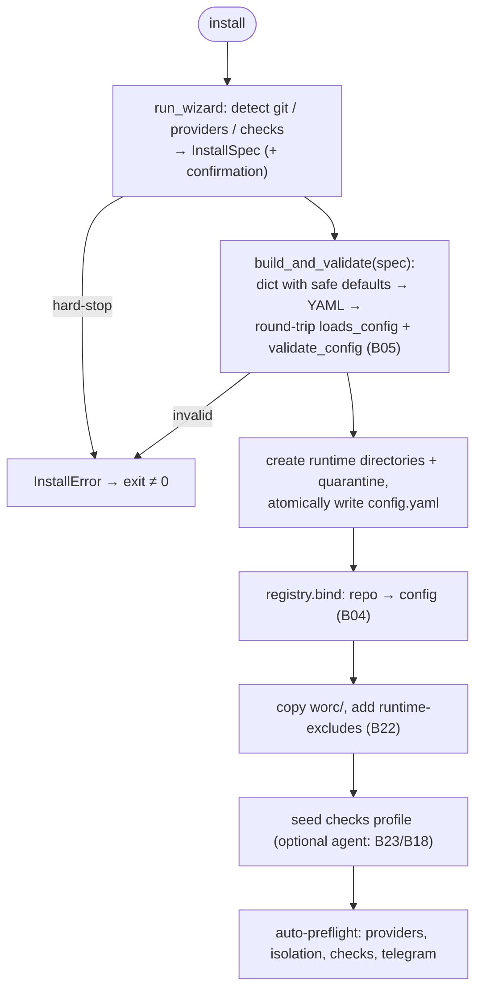

# B03 — Installer and Project Scaffolding

## Purpose

Creates and maintains the on-disk installation of the orchestrator: `init` (directory skeleton / templates / docs / config), `install` (wizard → bind a repository to a sibling workspace + generate a valid `config.yaml`), and maintenance commands (`upgrade-config`, `upgrade-docs`, `install-templates`). Environment detection is read-only.

## Responsibilities

- `init`: idempotently create runtime directories (`.gitkeep`), `config.yaml` from a packaged example with the selected git mode, a `templates/` tree, `worc/` docs, and runtime-excludes ([cli.py:464-539](../../../src/wastech_orchestrator/cli.py#L464)).
- `install`: run the wizard → `InstallSpec`, generate + validate `config.yaml`, create directories, bind the repository, auto-preflight ([cli.py:1430-1494](../../../src/wastech_orchestrator/cli.py#L1430)).
- Wizard: detect git / providers / checks, resolve settings, hard-stops ([wizard.py:68-122](../../../src/wastech_orchestrator/install/wizard.py#L68)).
- Configuration generation with safe defaults + round-trip validation ([config_writer.py:100-195](../../../src/wastech_orchestrator/install/config_writer.py#L100)).
- Read-only environment detection ([detect.py:64-163](../../../src/wastech_orchestrator/install/detect.py#L64)).

## Block Boundaries

### Within this block's responsibility

- Project skeleton, installation wizard, config generation + validation, environment detection, upgrade / template-delivery commands.

### Outside this block's responsibility

- **Configuration model / rules** — [B05](./B05-configuration.md) (`loads_config` / `validate_config` / `upgrade`).
- **Binding store** — [B04](./B04-install-registry-and-config-discovery.md) (`registry.bind`).
- **Pipeline git operations** — [B22](./B22-git-manager.md) (only `append_runtime_excludes` is used here).
- **Task execution** — [B06](./B06-orchestrator-pipeline.md).

## Entry Points

- `cmd_init` / `cmd_install` / `cmd_upgrade_config` / `cmd_upgrade_docs` / `cmd_install_templates` — dispatcher [B01](./B01-cli-and-operator-commands.md).
- `wizard.run_wizard(...)` → `WizardOutcome` ([wizard.py:68](../../../src/wastech_orchestrator/install/wizard.py#L68)).
- `config_writer.build_and_validate(spec)` ([config_writer.py:186](../../../src/wastech_orchestrator/install/config_writer.py#L186)).
- `detect.git_info` / `detect_providers` / `detect_checks` / `has_gh` / `require_gh` ([detect.py](../../../src/wastech_orchestrator/install/detect.py)) — `require_gh` is also called from [B01/B02](./B01-cli-and-operator-commands.md) on `run` / `watch`.

## Inputs and State

CLI flags (`--git-mode`, `--workspace`, `--provider`, `--check`, `--create-pr`, `--auto-mode`, `--non-interactive`, `--reconfigure`, `--dry-run`, …); operator environment (git, PATH, repository ecosystem); packaged `templates/`, `worc/`, `config.example.yaml`. No persistent state (creates files / binding).

## Main Scenario (`install`)

1. `run_wizard`: verify git; `git_info` (root / origin / branch / cleanliness); resolve workspace / providers / checks / create_pr / auto_mode → `InstallSpec` (+ confirmation).
2. `build_and_validate(spec)`: build a dict with safe defaults, render YAML, round-trip through `loads_config` + `validate_config`.
3. Create runtime directories (in-repo) + quarantine (workspace); atomically write `config.yaml`.
4. `registry.bind(repo → config)` ([B04](./B04-install-registry-and-config-discovery.md)); copy `worc/`; add runtime-excludes ([B22](./B22-git-manager.md)).
5. Seed the checks profile (optional agent-based resolution) and auto-preflight ([cli.py:1390-1494](../../../src/wastech_orchestrator/cli.py#L1390)).

`install` flow with fail-closed gates (if the wizard hits a hard-stop, or the generated config fails to load / validate, nothing is written):

## Alternative Scenarios

### `init`

Skeleton without a wizard: directories + `config.yaml` (with `--git-mode`) + `templates/` + `worc/` + excludes; idempotent (skip-existing), `--force` / `--dry-run` / `--quiet` ([cli.py:464-539](../../../src/wastech_orchestrator/cli.py#L464)).

### Upgrade / Template Delivery

`upgrade-config` (via [B05 upgrade](./B05-configuration.md): add-missing + backup + atomic write), `upgrade-docs` (overwrite `worc/` with the packaged version), `install-templates` (add-missing-only) ([cli.py:568-731](../../../src/wastech_orchestrator/cli.py#L568)).

### Re-install

Without `--reconfigure`: no-op when already bound to the same config; error when bound to a different config; with `--reconfigure` — backup + regeneration ([cli.py:1461-1473](../../../src/wastech_orchestrator/cli.py#L1461)).

## Validations and Constraints

- Wizard hard-stops → `InstallError`: no git / not a repository / no origin / workspace inside the repository / no available provider / cancelled ([wizard.py:80-135,150-169](../../../src/wastech_orchestrator/install/wizard.py#L80)).
- `build_and_validate` fail-closed: the generated config must load and pass §11 / §21.4 ([config_writer.py:186-195](../../../src/wastech_orchestrator/install/config_writer.py#L186)).
- Safe defaults are hard-coded: strict_isolation, denied commands / paths, in_repo / commit footprint, auto_merge off ([config_writer.py:127-177](../../../src/wastech_orchestrator/install/config_writer.py#L127)).
- Git detection uses argv via [B19](./B19-subprocess-runner.md) (no shell), with a timeout ([detect.py:41-61](../../../src/wastech_orchestrator/install/detect.py#L41)).

## Output

Created directories / files (`config.yaml`, `templates/`, `worc/`, `.gitkeep`), repository → config binding, runtime-excludes; auto-preflight result. Return codes are printed by [B01](./B01-cli-and-operator-commands.md).

## Side Effects

- Directory and file creation; atomic write of `config.yaml` (+ backup on reconfigure / upgrade); binding in the registry ([B04](./B04-install-registry-and-config-discovery.md)); adding excludes ([B22](./B22-git-manager.md)); read-only git probes; auto-preflight (runs provider.preflight, isolation, checks, telegram).

## Errors and Edge Cases

- `InstallError` → message + non-zero exit ([B01](./B01-cli-and-operator-commands.md)).
- `--dry-run` writes nothing (prints the plan).
- Upgrade / delivery commands fail-closed (exit 2) if the installation location cannot be resolved.

## Relationships

### Uses

- [B05 — Configuration](./B05-configuration.md) — `loads_config` / `validate_config` / `upgrade`.
- [B04 — Registry](./B04-install-registry-and-config-discovery.md) — `registry.bind`.
- [B19 — Subprocess Runner](./B19-subprocess-runner.md) — git probes in `detect`.
- [B22 — Git Manager](./B22-git-manager.md) — `append_runtime_excludes`.
- [B25 — Security](./B25-security-policy.md) — safe defaults in the generated config.
- [B18](./B18-agent-providers.md) / [B23](./B23-check-discovery.md) — `build_providers` / resolver when seeding checks.

### Used by

- [B01 — CLI](./B01-cli-and-operator-commands.md) — dispatcher for install / upgrade commands; `require_gh` on `run`.
- [B02 — Watch Daemon](./B02-watch-daemon-and-scheduling.md) — `require_gh` on `watch` startup.
- [B04 — Registry](./B04-install-registry-and-config-discovery.md) — `git_info` in `resolve_config_path`.

## Role in the Overall System

Entry point for deployment: transforms "a repository + operator machine" into a ready, safely configured installation that all other commands then rely on. Round-trip validation guarantees that an unsafe config is never written.

## Code Confirmation

- [cli.py:464-731,1390-1494](../../../src/wastech_orchestrator/cli.py#L464) — `cmd_init` / `cmd_install` / upgrades.
- [install/wizard.py:68-230](../../../src/wastech_orchestrator/install/wizard.py#L68) — wizard and hard-stops.
- [install/config_writer.py:100-195](../../../src/wastech_orchestrator/install/config_writer.py#L100) — generation + round-trip validation.
- [install/detect.py:64-163](../../../src/wastech_orchestrator/install/detect.py#L64) — read-only detection.
- Tests: [tests/install/](../../../tests/install/), [tests/test_cli_init.py](../../../tests/test_cli_init.py), [tests/test_cli_install.py](../../../tests/test_cli_install.py), [tests/test_cli_install_templates.py](../../../tests/test_cli_install_templates.py), [tests/test_cli_upgrade_config.py](../../../tests/test_cli_upgrade_config.py), [tests/test_cli_upgrade_docs.py](../../../tests/test_cli_upgrade_docs.py), [tests/test_cli_preflight.py](../../../tests/test_cli_preflight.py).
