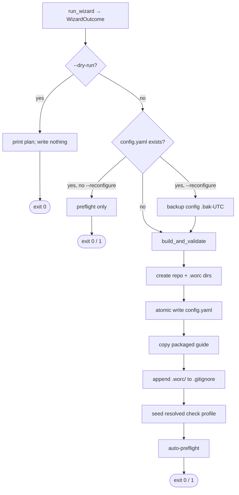

# B03 — Installer and Project Scaffolding

> Reconstructed from code (`install/wizard.py`, `install/config_writer.py`, `install/detect.py`, and the `cmd_install` orchestration in `cli.py`) and tests (`tests/install/`, `tests/test_cli_install.py`). The code is the only source of truth; this document was rebuilt from the implementation, not from prose or comments. Significant claims carry a `file:line` reference.

**Status:** documented · **Source modules:** `src/wastech_orchestrator/install/wizard.py`, `src/wastech_orchestrator/install/config_writer.py`, `src/wastech_orchestrator/install/detect.py`, `src/wastech_orchestrator/cli.py` (`cmd_install`)

## Responsibility

B03 owns the one-time `install` flow that turns a bare Git checkout into an orchestrator-ready repo: it detects the environment, resolves a configuration interactively or from flags, writes a validated `config.yaml` under the gitignored `.worc/` home, scaffolds the repo-root audit dirs and `.worc/` runtime dirs, copies the packaged task-authoring guide, gitignores `.worc/`, seeds the resolved check profile, and auto-runs preflight. The split is deliberate: `install/` (wizard + config generation + detection) is pure and file-system-read-only ([wizard.py:8](../../../src/wastech_orchestrator/install/wizard.py#L8)); all the side effects (dir creation, atomic write, backup, guide copy, `.gitignore`, preflight) live in `cmd_install` ([cli.py:1204](../../../src/wastech_orchestrator/cli.py#L1204)).

The wizard never writes, commits, or installs anything — detection is read-only and operator-side ([wizard.py:8-9](../../../src/wastech_orchestrator/install/wizard.py#L8), [detect.py:7-11](../../../src/wastech_orchestrator/install/detect.py#L7)). The config generator can never emit a structurally broken, contradictory, or sandbox-weakening config because it round-trips its own output through the loader and the semantic validator before returning ([config_writer.py:158-167](../../../src/wastech_orchestrator/install/config_writer.py#L158)).

## Public surface

- `run_wizard(*, repo_path, provider, checks, create_pr, auto_mode, non_interactive, prompter) -> WizardOutcome` ([wizard.py:68](../../../src/wastech_orchestrator/install/wizard.py#L68)) — resolve an `InstallSpec` from flags, detection, and (interactively) operator input.
- `WizardOutcome` ([wizard.py:60](../../../src/wastech_orchestrator/install/wizard.py#L60)) — frozen dataclass: `spec: InstallSpec` plus `missing_providers: tuple[ProviderId, ...]` (selected but not yet on `PATH`).
- `Prompter` (Protocol) / `ConsolePrompter` ([wizard.py:27](../../../src/wastech_orchestrator/install/wizard.py#L27), [wizard.py:36](../../../src/wastech_orchestrator/install/wizard.py#L36)) — console I/O seam (`info`/`ask`/`confirm`/`ask_list`) so the wizard is driven deterministically in tests.
- `InstallError` ([wizard.py:23](../../../src/wastech_orchestrator/install/wizard.py#L23)) — a condition that stops the install; the CLI turns it into a message + exit 1 ([cli.py:1223-1225](../../../src/wastech_orchestrator/cli.py#L1223)).
- `InstallSpec` ([config_writer.py:32](../../../src/wastech_orchestrator/install/config_writer.py#L32)) — frozen dataclass of the resolved settings the generator serializes; `discovery_mode` defaults to `"configured"`.
- `build_and_validate(spec) -> str` ([config_writer.py:158](../../../src/wastech_orchestrator/install/config_writer.py#L158)) — render the config text, then fail-closed verify it loads + passes validation before returning.
- `build_config_mapping(spec)` / `render(mapping)` ([config_writer.py:74](../../../src/wastech_orchestrator/install/config_writer.py#L74), [config_writer.py:152](../../../src/wastech_orchestrator/install/config_writer.py#L152)) — assemble the primitive dict and serialize it to YAML (stable key order).
- `git_info(cwd) -> GitInfo | None` ([detect.py:64](../../../src/wastech_orchestrator/install/detect.py#L64)) — root / origin / branch / cleanliness of the repo containing `cwd`.
- `detect_providers()` / `find_executable(name)` / `has_gh()` / `detect_checks(repo_root)` ([detect.py:106](../../../src/wastech_orchestrator/install/detect.py#L106), [detect.py:101](../../../src/wastech_orchestrator/install/detect.py#L101), [detect.py:115](../../../src/wastech_orchestrator/install/detect.py#L115), [detect.py:135](../../../src/wastech_orchestrator/install/detect.py#L135)) — read-only environment probes.
- `cmd_install(args) -> int` ([cli.py:1204](../../../src/wastech_orchestrator/cli.py#L1204)) — the orchestration entry point invoked by the `install` subcommand (B01).

## Behavior

### Wizard: detection → resolution → spec

`run_wizard` enforces three hard preconditions before resolving anything ([wizard.py:79-92](../../../src/wastech_orchestrator/install/wizard.py#L79)): `git` must be on `PATH`, `cwd` must be inside a Git repo (`git_info` non-`None`), and the repo must have an `origin` remote (so the orchestrator can push / open PRs). Each failure raises `InstallError` with an actionable message. The base branch is `info.default_branch or info.current_branch or "main"` ([wizard.py:93](../../../src/wastech_orchestrator/install/wizard.py#L93)).

`GitInfo` is derived from four read-only `git` probes — `rev-parse --show-toplevel`, `remote get-url origin`, `rev-parse --abbrev-ref HEAD`, and `status --porcelain` ([detect.py:67-88](../../../src/wastech_orchestrator/install/detect.py#L67)) — plus a `symbolic-ref refs/remotes/origin/HEAD` lookup for the remote default branch, falling back to the current branch ([detect.py:91-98](../../../src/wastech_orchestrator/install/detect.py#L91)). A detached `HEAD` maps `current_branch` to `None` ([detect.py:77](../../../src/wastech_orchestrator/install/detect.py#L77)). All git is launched via the shared safe runner as an argv list, never a shell string, with a 30 s timeout ([detect.py:41-61](../../../src/wastech_orchestrator/install/detect.py#L41)) — so the no-shell-interpolation invariant holds (B19). A launch failure maps to rc 127 and a timeout to rc 124 ([detect.py:57-60](../../../src/wastech_orchestrator/install/detect.py#L57)).

A dirty tree is a soft stop: non-interactive prints a `warning:` and proceeds; interactive asks to continue (default **no**) and aborts on a decline ([wizard.py:122-132](../../../src/wastech_orchestrator/install/wizard.py#L122)).

Each setting is resolved by a small flag→detect→prompt helper:

- **Providers** ([wizard.py:135-158](../../../src/wastech_orchestrator/install/wizard.py#L135)): `auto` selects every provider currently on `PATH` (and errors "no agent CLI found" if none); `both` selects `(CODEX, CLAUDE)`; an explicit value selects just that one. Any selected provider not on `PATH` is collected into `missing` (noted, not fatal).
- **Checks** ([wizard.py:161-171](../../../src/wastech_orchestrator/install/wizard.py#L161)): an explicit `--check` list wins; otherwise `detect_checks` proposes ecosystem defaults — non-interactive takes them as-is, interactive offers them (default yes) and falls back to a line-by-line `ask_list`.
- **create_pr** ([wizard.py:174-180](../../../src/wastech_orchestrator/install/wizard.py#L174)): the flag wins; the default is `has_gh()` (no `gh` ⇒ off, since it cannot open a PR).
- **auto_mode** ([wizard.py:183-188](../../../src/wastech_orchestrator/install/wizard.py#L183)): the flag wins; default off.

`discovery_mode` is computed from the resolved checks: `"configured"` when checks were supplied/confirmed (trust them), `"auto"` when none were found so B23/B24 discovery resolves a launchable profile at preflight/runtime ([wizard.py:112-114](../../../src/wastech_orchestrator/install/wizard.py#L112)). Interactive runs end with a final "Write this configuration?" confirm (default yes); a decline raises `InstallError("aborted ...")` ([wizard.py:117-118](../../../src/wastech_orchestrator/install/wizard.py#L117)).

### Config generation and the fail-closed round-trip

`build_config_mapping` assembles a primitive dict mirroring the packaged `config.example.yaml`, stamped with the current `CONFIG_SCHEMA_VERSION` ([config_writer.py:74-149](../../../src/wastech_orchestrator/install/config_writer.py#L74)). Only the _selected_ providers get an `agents.providers.<id>` block, emitted in canonical `ProviderId` order regardless of how the wizard collected them ([config_writer.py:48-51](../../../src/wastech_orchestrator/install/config_writer.py#L48)). Exactly one block is marked `primary: True` — Claude when selected, else the first provider ([config_writer.py:69-71](../../../src/wastech_orchestrator/install/config_writer.py#L69), [config_writer.py:100](../../../src/wastech_orchestrator/install/config_writer.py#L100)) — encoding the single-global-primary routing invariant (B17/B05). Per-provider blocks carry safe defaults: `permission_profile: workspace-write`, Codex `sandbox: workspace-write`, Claude `max_turns: 50` / `max_budget_usd: None`, empty `extra_args` ([config_writer.py:54-66](../../../src/wastech_orchestrator/install/config_writer.py#L54)).

The `security` block is hard-coded to immutable safe defaults — `strict_isolation: True`, a fixed `allowed_environment` allowlist, `denied_read_paths` (`.env`, `secrets/**`), and `denied_commands` including `git commit` / `git push` / `gh pr create` / `gh pr merge` ([config_writer.py:103-114](../../../src/wastech_orchestrator/install/config_writer.py#L103)). The quarantine folder is placed under `.worc/tasks/rejected` so rejected tasks are never swept into the audit commit ([config_writer.py:78](../../../src/wastech_orchestrator/install/config_writer.py#L78), [config_writer.py:122](../../../src/wastech_orchestrator/install/config_writer.py#L122)); `git.footprint.audit_on_branch` is `"task"` ([config_writer.py:139-141](../../../src/wastech_orchestrator/install/config_writer.py#L139)). `auto_merge` is off by default ([config_writer.py:134](../../../src/wastech_orchestrator/install/config_writer.py#L134)).

`render` serializes with `yaml.safe_dump(sort_keys=False, default_flow_style=False)` so absolute Windows paths survive as literal scalars (a regression test pins `C:\Users\…` paths that would corrupt under double-quoting) ([config_writer.py:152-155](../../../src/wastech_orchestrator/install/config_writer.py#L152), [test_config_writer.py:125-135](../../../tests/install/test_config_writer.py#L125)). `build_and_validate` then renders, reloads via `loads_config`, and runs `validate_config` before returning the text — a defensive guard so a generator bug can never persist an unloadable or unsafe config ([config_writer.py:158-167](../../../src/wastech_orchestrator/install/config_writer.py#L158)). No secrets are written ([config_writer.py:8](../../../src/wastech_orchestrator/install/config_writer.py#L8)).

### `cmd_install` orchestration

The side-effecting pipeline ([cli.py:1204-1257](../../../src/wastech_orchestrator/cli.py#L1204)):

1. **Resolve the `.worc` home and config path** ([cli.py:1228-1229](../../../src/wastech_orchestrator/cli.py#L1228)): `<repo>/.worc/config.yaml`, resolved to an absolute path. `WORC_HOME = ".worc"` ([cli.py:71](../../../src/wastech_orchestrator/cli.py#L71)).
2. **`--dry-run`** prints the full plan (dirs it _would_ create, the guide, the `.gitignore` entry) and returns 0 without touching the filesystem ([cli.py:1231-1233](../../../src/wastech_orchestrator/cli.py#L1231), [cli.py:1139-1161](../../../src/wastech_orchestrator/cli.py#L1139)).
3. **Idempotency / reconfigure** ([cli.py:1235-1239](../../../src/wastech_orchestrator/cli.py#L1235)): if `config.yaml` already exists and `--reconfigure` was not passed, print "already configured" and just re-run preflight. With `--reconfigure`, copy the existing config to a timestamped `config.yaml.bak-<UTC>` sibling first ([cli.py:1118-1123](../../../src/wastech_orchestrator/cli.py#L1118)).
4. **Generate + validate, then create dirs, then atomic write** ([cli.py:1241-1244](../../../src/wastech_orchestrator/cli.py#L1241)): `_install_create_dirs` makes the repo-root audit dirs and the `.worc/` runtime dirs (idempotent) ([cli.py:1126-1136](../../../src/wastech_orchestrator/cli.py#L1126)); `_install_atomic_write` writes to a temp file in the same dir and `os.replace`s it into place, unlinking the temp on any failure ([cli.py:1105-1115](../../../src/wastech_orchestrator/cli.py#L1105)).
5. **Copy the packaged guide** ([cli.py:1247-1249](../../../src/wastech_orchestrator/cli.py#L1247)): `_copy_worc_docs` copies the packaged `worc/` docs into `.worc/guide/`, skipping files that already exist unless `--reconfigure` (add-missing on a plain re-run, refresh-from-package on reconfigure) ([cli.py:323-343](../../../src/wastech_orchestrator/cli.py#L323)).
6. **Gitignore `.worc/`** ([cli.py:1251-1252](../../../src/wastech_orchestrator/cli.py#L1251)): `append_runtime_excludes` idempotently appends the `.worc/` line to the repo's tracked `.gitignore` (B22).
7. **Seed the resolved check profile** ([cli.py:1256](../../../src/wastech_orchestrator/cli.py#L1256)): `_install_resolve_checks` loads the just-written config and runs the resolver only when `checks.discovery` opts into the agent fallback; otherwise it is a no-op and the deterministic preflight seeds the profile on its own ([cli.py:1164-1185](../../../src/wastech_orchestrator/cli.py#L1164)) (B23).
8. **Auto-preflight, fail-closed** ([cli.py:1257](../../../src/wastech_orchestrator/cli.py#L1257), [cli.py:1188-1201](../../../src/wastech_orchestrator/cli.py#L1188)): unless `--skip-preflight`, run `run_preflight`; on a non-ready verdict, **keep the written config but return exit 1** with a "config was written; resolve the items above" message. Preflight validates every provider, the isolation policy, check diagnostics, **every flow file** (packaged + operator `.worc/flows/`) via the fatal validator, and Telegram readiness ([cli.py:859-875](../../../src/wastech_orchestrator/cli.py#L859)) (B29).

### The `.worc/` layout it scaffolds

Two distinct trees ([cli.py:68-84](../../../src/wastech_orchestrator/cli.py#L68)):

- **Tracked, repo-root** `tasks/{pending,processing,done,failed}` (`REPO_TASK_DIRS`) — the committed audit trail (the task file + its `<id>.summary.md` in `done`/`failed`). Created empty, so they do not show in `git status` until a task writes into them ([cli.py:1129-1130](../../../src/wastech_orchestrator/cli.py#L1129)).
- **Gitignored, under `.worc/`** `{logs, workspace, checks, tasks/rejected}` (`WORC_RUNTIME_DIRS`) plus `config.yaml`, the runtime `state.db` / `orchestrator.pid`, and the `guide/` ([cli.py:83-84](../../../src/wastech_orchestrator/cli.py#L83)). The whole `.worc/` home is gitignored, so the operator's `git status` stays clean; `tasks/rejected` (the quarantine) lives here so rejected tasks escape the audit commit ([cli.py:73-84](../../../src/wastech_orchestrator/cli.py#L73)).

`test_target_repo_history_is_left_unchanged` pins the net effect: install commits nothing, `HEAD` is unchanged, `.worc` never appears in porcelain, and `.gitignore` is the only new working-tree file ([tests/test_cli_install.py:162-172](../../../tests/test_cli_install.py#L162)).

## Invariants & guarantees

- **No shell interpolation.** Every git probe is an argv list with a mandatory 30 s timeout via the safe runner ([detect.py:41-61](../../../src/wastech_orchestrator/install/detect.py#L41)).
- **No secrets are ever written** to the generated config; the security block is fixed to safe defaults ([config_writer.py:8](../../../src/wastech_orchestrator/install/config_writer.py#L8), [config_writer.py:103-114](../../../src/wastech_orchestrator/install/config_writer.py#L103)).
- **The installer can never persist a broken/unsafe config** — generation always round-trips through loader + validator before the text is returned ([config_writer.py:158-167](../../../src/wastech_orchestrator/install/config_writer.py#L158)).
- **Exactly one global primary provider** in the generated config ([config_writer.py:64-65](../../../src/wastech_orchestrator/install/config_writer.py#L64), [config_writer.py:100](../../../src/wastech_orchestrator/install/config_writer.py#L100)); verified by `test_both_mark_exactly_claude_as_primary` ([tests/install/test_config_writer.py:55-62](../../../tests/install/test_config_writer.py#L55)).
- **Atomic config write** (temp + `os.replace`, temp cleaned on failure) ([cli.py:1105-1115](../../../src/wastech_orchestrator/cli.py#L1105)).
- **Idempotent.** A second plain run is a no-op (config byte-identical) ([tests/test_cli_install.py:130-143](../../../tests/test_cli_install.py#L130)); the `.gitignore` append never duplicates the `.worc/` line ([tests/test_cli_install.py:237-247](../../../tests/test_cli_install.py#L237)); dir creation uses `exist_ok=True` ([cli.py:1133-1136](../../../src/wastech_orchestrator/cli.py#L1133)).
- **Fail-closed but non-destructive preflight.** A failed auto-preflight exits 1 yet leaves the config written ([cli.py:1195-1200](../../../src/wastech_orchestrator/cli.py#L1195), [tests/test_cli_install.py:175-185](../../../tests/test_cli_install.py#L175)).
- **The wizard is side-effect-free.** All filesystem mutation happens in `cmd_install`, never in `install/` ([wizard.py:8-9](../../../src/wastech_orchestrator/install/wizard.py#L8)).

## Dependencies

- **Uses:** B19 (safe subprocess runner for git probes), B05 (config loader + schema + semantic validator the generator round-trips through), B22 (`.gitignore` append; `append_runtime_excludes`), B18/B17 (`ProviderId`, per-provider blocks, single primary), B23 (resolved-profile seeding via the discovery resolver), B29 (preflight's `FlowRegistry.validate_all`), B26 (Telegram preflight line).
- **Used by:** B01 (the `install` subcommand parser + dispatch to `cmd_install`, plus `run_preflight`/`resolve_config_path` reuse `detect.git_info`), B04 (`.worc/config.yaml` home / config discovery written here), B29 (preflight, also reached standalone by `cmd_preflight`).

## Audit candidates

- `src/wastech_orchestrator/install/detect.py:135-163` — **duplicate ecosystem/check detection** independent of B23. `detect_checks` re-implements first-match ecosystem detection over the same markers (`pyproject.toml`, `package.json`, `Cargo.toml`, `go.mod`) that `checks/inspect.py` already inspects ([checks/inspect.py:30-41](../../../src/wastech_orchestrator/checks/inspect.py#L30)) and `checks/detect.py` (B23) turns into ordered `CheckCandidate`s. The two detectors disagree by construction: the installer proposes **shell-string** commands (`"pytest"`, `"npm test"`, `"cargo test"`, `"go test ./..."`) with first-match-wins and no manifest inspection beyond `package.json scripts`, while B23 emits **argv lists**, inspects manifests, honors lockfiles (`uv.lock`/`poetry.lock`/`pnpm-lock.yaml`/`yarn.lock`) and venv tools, and returns _all_ matches by confidence. A repo whose checks the installer writes as `"pytest"` can resolve to a different launchable command (e.g. `uv run pytest`) under B23 — drift risk + two code paths to keep in sync. See [the audit](../../backlog/2026-06-21-audit.md).
- `src/wastech_orchestrator/install/detect.py:111-132` — **`GhNotAvailableError` / `require_gh` are not used by the installer.** They live in the installer-detection module but are only consumed at `watch`/`run` startup; the wizard gates the create-PR default on `has_gh()` and never calls `require_gh`. Minor cohesion smell — detection-time vs. runtime-gate code colocated. See [the audit](../../backlog/2026-06-21-audit.md).

## Tests

- `tests/install/test_wizard.py` — every wizard path: provider resolution (`auto`/explicit/missing), the four hard stops (no git, not a repo, no origin, aborted confirm), dirty-tree warn-vs-abort, checks override vs. detection vs. interactive entry, `discovery_mode` configured/auto, and create_pr/auto_mode flag-vs-`gh`-default.
- `tests/install/test_config_writer.py` — selected-only providers, single global primary (Claude-preferred), safe security defaults, `.worc/` quarantine + audit-branch, schema-version stamp, discovery block, and the absolute-path YAML round-trip (Windows/macOS).
- `tests/install/test_detect.py` — `git_info` root/origin/branch/cleanliness (incl. nested subdir and no-origin), provider/`gh` discovery via `shutil.which`, `require_gh` raise/no-op, and ecosystem `detect_checks` by marker.
- `tests/test_cli_install.py` — end-to-end DoD against a real clone: routing modes, idempotency / reconfigure-backup, dry-run-writes-nothing, the `.worc/` layout, `.gitignore` handling (idempotent), guide copy + reconfigure refresh, fail-closed-but-config-kept preflight, and target-repo history left unchanged.
