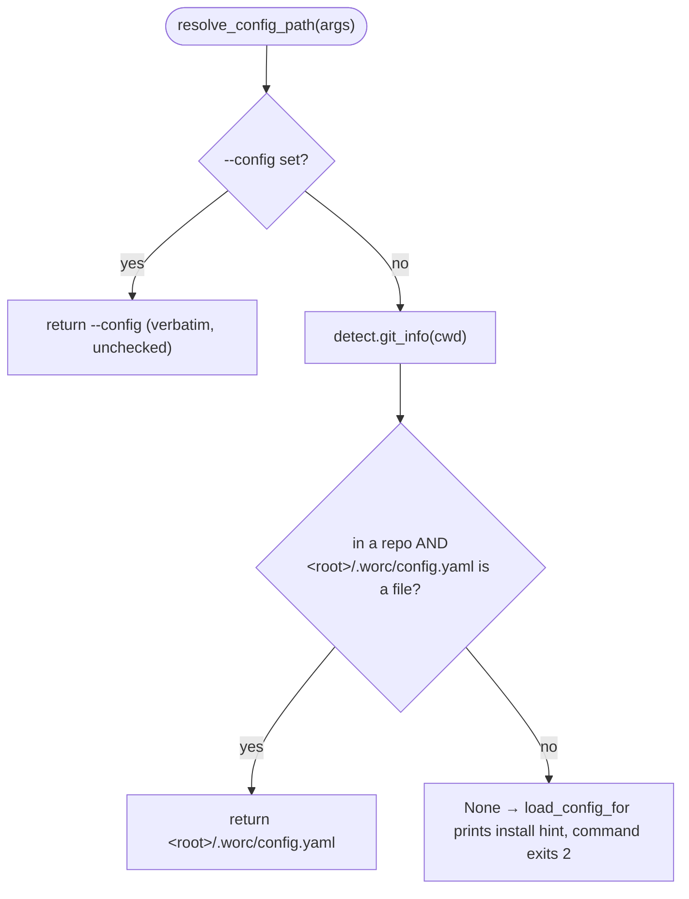

# B04 — Install Registry and Config Discovery

> Reconstructed from code (`src/wastech_orchestrator/cli.py`, `src/wastech_orchestrator/install/detect.py`) and tests (`tests/test_cli_config_discovery.py`). The code is the only source of truth; this document was rebuilt from the implementation, not from prose or comments. Significant claims carry a `file:line` reference.

**Status:** documented · **Source modules:** `src/wastech_orchestrator/cli.py`, `src/wastech_orchestrator/install/detect.py`

## Responsibility

Given the operator's current directory, find the orchestrator's installed `config.yaml`, and given a loaded config, derive the two filesystem roots every command works against: the gitignored runtime **home** (`<repo>/.worc/`) and the repo-root **tasks/** lifecycle tree. This is the link between [B03](B03-installer-and-scaffolding.md) (which writes the home) and the rest of the CLI (which re-discovers it).

There is **no install-registry module**. Despite the block title, the orchestrator keeps no persistent per-user index of installed projects: a project is "installed" iff `<git-root>/.worc/config.yaml` exists, and that fact is recomputed on every invocation by walking up to the Git root. The only `registry` artifact under `install/` is a stale `registry.cpython-314.pyc` in `__pycache__/` with no corresponding `registry.py` and no importer anywhere in `src/` or `tests/` — see [Audit candidates](#audit-candidates).

## Public surface

- `resolve_config_path(args)` ([cli.py:353](../../../src/wastech_orchestrator/cli.py#L353)) — explicit `--config` → discovered `<git-root>/.worc/config.yaml` → `None`.
- `load_config_for(args)` ([cli.py:491](../../../src/wastech_orchestrator/cli.py#L491)) — resolve + load; prints the install hint and returns `None` when unconfigured.
- `worc_home_for(config)` ([cli.py:503](../../../src/wastech_orchestrator/cli.py#L503)) — the gitignored runtime home `<repo>/.worc/`; this **is** the `artifacts_root` passed to the orchestrator.
- `tasks_root_for(config)` ([cli.py:513](../../../src/wastech_orchestrator/cli.py#L513)) — the repo root holding the tracked `tasks/` lifecycle dirs (the committed-audit exception).
- `pending_dir(config)` ([cli.py:522](../../../src/wastech_orchestrator/cli.py#L522)) — `<repo>/tasks/pending`, the folder `watch` scans.
- `WORC_HOME = ".worc"` ([cli.py:71](../../../src/wastech_orchestrator/cli.py#L71)) — the home directory name (single constant; re-derived, not stored).
- `detect.git_info(cwd)` ([detect.py:64](../../../src/wastech_orchestrator/install/detect.py#L64)) — Git-root discovery, consumed by `resolve_config_path` (defined in B03, used here).

## Behavior

### Config resolution priority

`resolve_config_path` ([cli.py:353](../../../src/wastech_orchestrator/cli.py#L353)) resolves in three steps: (1) if `--config PATH` was passed it is returned verbatim, with no existence check and no Git lookup ([cli.py:361-363](../../../src/wastech_orchestrator/cli.py#L361)); (2) otherwise it calls `detect.git_info(Path.cwd())` and, when inside a repo, builds the candidate `info.root / ".worc" / "config.yaml"` and returns it **only if it is an existing file** ([cli.py:364-368](../../../src/wastech_orchestrator/cli.py#L364)); (3) otherwise `None` ([cli.py:369](../../../src/wastech_orchestrator/cli.py#L369)). There is no `./config.yaml` fallback and no registry lookup.

`load_config_for` ([cli.py:491](../../../src/wastech_orchestrator/cli.py#L491)) wraps that: a `None` result prints the actionable hint `"no orchestrator config found. Run 'wastech-orchestrator install .' …, or pass --config PATH."` and returns `None` ([cli.py:494-499](../../../src/wastech_orchestrator/cli.py#L494)); a command then exits 2. The two `upgrade-*` commands repeat their own variant of this hint inline ([cli.py:381-387](../../../src/wastech_orchestrator/cli.py#L381), [cli.py:437-443](../../../src/wastech_orchestrator/cli.py#L437)) instead of reusing `load_config_for`, because they need the raw path string rather than a loaded config.

### Git-root discovery

The "walk up to the Git root" is delegated to Git itself, not a hand-rolled parent-directory walk for a `.git` entry: `git_info` ([detect.py:64](../../../src/wastech_orchestrator/install/detect.py#L64)) shells `git rev-parse --show-toplevel` from `cwd` through the safe argv runner, returns `None` on a non-zero exit (not a repo), and otherwise sets `root` to the **resolved** toplevel path ([detect.py:67-70](../../../src/wastech_orchestrator/install/detect.py#L67)). Because the toplevel is resolved, the discovered config path is canonical even when invoked from a symlinked or nested subdirectory — the test asserts exactly this ([test_cli_config_discovery.py:38-48](../../../tests/test_cli_config_discovery.py#L38)). `git_info` itself belongs to B03 (installer detection); B04 only consumes its `.root`.

### Home and tasks-root derivation

Both roots are derived from `config.repo.local_path` (the absolute repo path written at install, [schema.py:115](../../../src/wastech_orchestrator/config/schema.py#L115)), not from a stored home path:

- `worc_home_for(config)` returns `Path(config.repo.local_path) / WORC_HOME` ([cli.py:510](../../../src/wastech_orchestrator/cli.py#L510)) — the gitignored runtime home that holds everything the orchestrator generates or installs: `state.db`, `logs/`, `orchestrator.pid`, `workspace/`, `checks/`, the resolved check profile, validation reports, plus the installed `config.yaml`, `templates/`, `guide/`, and operator `flows/`.
- `tasks_root_for(config)` returns `Path(config.repo.local_path)` — the bare repo root ([cli.py:519](../../../src/wastech_orchestrator/cli.py#L519)). `tasks/` deliberately stays at the repo root (not under `.worc/`) so a task file and its `<id>.summary.md` can be audit-committed into the repo history. This is the one committed-audit exception to the "everything is gitignored under `.worc/`" rule.

The directory layout these two roots describe is created by `install`, not by B04: `_install_create_dirs` ([cli.py:1126](../../../src/wastech_orchestrator/cli.py#L1126)) makes the tracked `REPO_TASK_DIRS` (`tasks/pending`, `tasks/processing`, `tasks/done`, `tasks/failed` — [cli.py:76-81](../../../src/wastech_orchestrator/cli.py#L76)) at the repo root and the gitignored `WORC_RUNTIME_DIRS` (`logs`, `workspace`, `checks`, `tasks/rejected` — [cli.py:84](../../../src/wastech_orchestrator/cli.py#L84)) under the home. Note `tasks/rejected` (the §19 quarantine) lives under `.worc/`, so rejected tasks are never swept into an audit commit.

### Home as the artifacts root

`worc_home_for(config)` is what the CLI passes as `artifacts_root` when constructing the orchestrator — for `run` ([cli.py:621-623](../../../src/wastech_orchestrator/cli.py#L621)), `watch` ([cli.py:785-786](../../../src/wastech_orchestrator/cli.py#L785)), recovery ([cli.py:690-692](../../../src/wastech_orchestrator/cli.py#L690), [cli.py:972-974](../../../src/wastech_orchestrator/cli.py#L972)) — and to `build_providers` ([cli.py:830](../../../src/wastech_orchestrator/cli.py#L830)), the PID-file path ([cli.py:959](../../../src/wastech_orchestrator/cli.py#L959)), the state DB ([cli.py:1047](../../../src/wastech_orchestrator/cli.py#L1047)), the check profile ([cli.py:1095](../../../src/wastech_orchestrator/cli.py#L1095)), and the operator-flows dir ([cli.py:862](../../../src/wastech_orchestrator/cli.py#L862)). So `<artifacts_root>` (B20) and the `.worc/` home are the same directory: `build_orchestrator` opens `StateStore.open(<artifacts_root>/state.db)` and the ledger at `<artifacts_root>/logs/completed.jsonl` ([orchestrator.py:1984-1994](../../../src/wastech_orchestrator/core/orchestrator.py#L1984)).

## Invariants & guarantees

- A project is installed iff `<git-root>/.worc/config.yaml` exists; there is no separate registry/index file and no persistent binding to keep in sync ([cli.py:364-368](../../../src/wastech_orchestrator/cli.py#L364)).
- Resolution is pure and recomputed per call — no caching, no env var — so any command works from any subdirectory of the repo.
- An explicit `--config` is honored verbatim and is never existence-checked inside `resolve_config_path`; the existence/parse failure surfaces later at load time ([cli.py:361-363](../../../src/wastech_orchestrator/cli.py#L361)).
- `<artifacts_root>` equals the gitignored `<repo>/.worc/` home; the repo-root `tasks/` lifecycle dirs are the sole committed-audit exception ([cli.py:503-519](../../../src/wastech_orchestrator/cli.py#L503)).
- The home is derived from `config.repo.local_path`, never read back from a stored path, so a moved/renamed config still resolves its home correctly as long as `local_path` is right.

## Dependencies

- **Uses:** B03 (`detect.git_info` for Git-root discovery; `install` creates the home + dirs this block names), B05 (the `OrchestratorConfig` / `repo.local_path` it reads).
- **Used by:** B01 (every config-loading command calls `resolve_config_path` / `load_config_for` / `worc_home_for`), B02 (watch scans `pending_dir`), B07 (`state.db` opened under `worc_home_for`), B20 (run artifacts laid out under `<artifacts_root>` = the home).

## Audit candidates

- `src/wastech_orchestrator/install/__pycache__/registry.cpython-314.pyc` — dead/vestigial artifact — a compiled `registry` module with no `registry.py` source and zero importers in `src/`/`tests/`; the block's named "install registry" concept does not exist in code. See [the audit](../../backlog/2026-06-21-audit.md).
- `src/wastech_orchestrator/core/orchestrator.py:142` — DRY duplication — `_WORC_HOME = ".worc"` re-declares `cli.WORC_HOME`; justified by a stated circular-import constraint (core must not import the CLI), but the literal is duplicated and can drift. See [the audit](../../backlog/2026-06-21-audit.md).
- `src/wastech_orchestrator/cli.py:354-360` — stale docstring — `resolve_config_path`'s docstring says the config is "discovered by walking up from the cwd to the Git root", which reads as a manual `.git` walk; the actual mechanism is `git rev-parse --show-toplevel` ([detect.py:67](../../../src/wastech_orchestrator/install/detect.py#L67)). See [the audit](../../backlog/2026-06-21-audit.md).

## Tests

- [tests/test_cli_config_discovery.py](../../../tests/test_cli_config_discovery.py) — covers the full resolution DoD: explicit `--config` wins over everything ([:30](../../../tests/test_cli_config_discovery.py#L30)); discovery from a nested subdir resolves to the canonical `<root>/.worc/config.yaml` ([:38](../../../tests/test_cli_config_discovery.py#L38)); a Git repo with no `.worc/config.yaml` returns `None` ([:51](../../../tests/test_cli_config_discovery.py#L51)); outside any repo `load_config_for` returns `None` and prints the `install .` hint ([:58](../../../tests/test_cli_config_discovery.py#L58)); an unconfigured command (`status`) exits 2 with that hint ([:68](../../../tests/test_cli_config_discovery.py#L68)). The `git_repo` fixture builds a real clone with a `.git` ([conftest.py:184](../../../tests/conftest.py#L184)), so the walk-up is exercised against actual Git.
