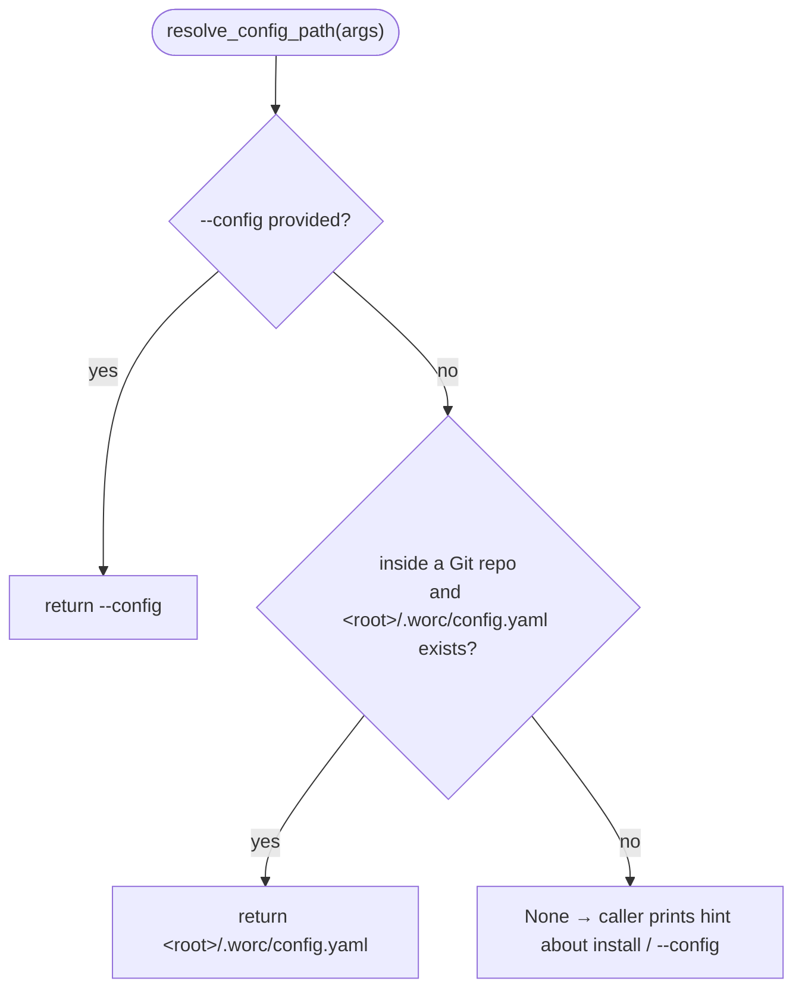

# B04 — Config Discovery

## Purpose

Resolve the path to the orchestrator's `config.yaml` so that commands (`run`/`watch`/`status`/`preflight`/…) find it from anywhere inside the repository without an explicit `--config`. There is no persistent per-user store: discovery is a pure walk-up from the current directory to the Git root.

## Responsibilities

- Resolve the configuration path by priority: explicit `--config` → `<repo-root>/.worc/config.yaml` (discovered by walking up from the cwd to the Git root) → `None` ([cli.py:411-427](../../../src/wastech_orchestrator/cli.py#L411)).

## Block Boundaries

### In scope

- Configuration path resolution.

### Out of scope

- **Configuration generation/validation** — [B03](./B03-installer-and-scaffolding.md)/[B05](./B05-configuration.md).
- **`git_info`** (repository root detection) — [B03 detect](./B03-installer-and-scaffolding.md); `resolve_config_path` only consumes it.
- **Configuration loading** — [B05](./B05-configuration.md).

## Entry Points

- `cli.resolve_config_path(args)` ([cli.py:411](../../../src/wastech_orchestrator/cli.py#L411)) — used by all commands that load the configuration (via `load_config_for`, [cli.py:594](../../../src/wastech_orchestrator/cli.py#L594)).

## Inputs and State

The parsed CLI args (for `--config`) and the current working directory. No persistent state — discovery is recomputed on every call.

## Main Scenario

`resolve_config_path`: return `--config` if set; otherwise call `detect.git_info(cwd)` and, if inside a repository, return `<root>/.worc/config.yaml` when that file exists; otherwise `None`.

Configuration path resolution source priority:

## Checks and Constraints

- The candidate is `<git-root>/.worc/config.yaml`; it is returned only when it is an existing file. There is no `./config.yaml` fallback and no registry lookup.

## Output

Path to `config.yaml` (or `None`).

## Side Effects

- None — discovery reads only `git_info` (read-only git probes via [B03 detect](./B03-installer-and-scaffolding.md)) and a file-existence check.

## Errors and Edge Cases

- Outside a Git repository, or no `<root>/.worc/config.yaml`, with no `--config` → `None` (the caller prints an install/`--config` hint).

## Relations

### Uses

- [B03 detect.git_info](./B03-installer-and-scaffolding.md) (in `resolve_config_path`).

### Used by

- [B01 — CLI](./B01-cli-and-operator-commands.md) — `resolve_config_path` in all commands that load the configuration.

## Role in the Overall System

The link between installation and subsequent commands: `install` writes `<repo>/.worc/config.yaml`, and any command then re-discovers it from any subdirectory of the repository by walking up to the Git root — no binding to maintain.

## Code Confirmation

- [cli.py:411-427](../../../src/wastech_orchestrator/cli.py#L411) — `resolve_config_path` (source priority, `.worc/config.yaml` discovery).
- [cli.py:594-603](../../../src/wastech_orchestrator/cli.py#L594) — `load_config_for` (resolve + the install/`--config` hint).
- Tests: [tests/test_cli_config_discovery.py](../../../tests/test_cli_config_discovery.py) — resolution priority and the walk-up to `.worc/config.yaml`.
