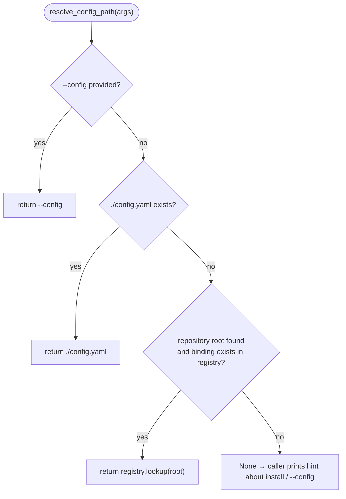

# B04 — Install Registry and Config Discovery

## Purpose

A persistent per-user store that associates a repository root with its generated `config.yaml`, and the logic for resolving the configuration path. Allows commands (`preflight`/`watch`/`status`/…) to find the configuration from anywhere inside the repository without `--config`.

## Responsibilities

- Store and read `repo-root → config.yaml` bindings in a JSON file in the user config directory ([registry.py:88-104](../../../src/wastech_orchestrator/install/registry.py#L88)).
- Resolve the configuration path by priority (`--config` → `./config.yaml` → registry binding) ([cli.py:549-565](../../../src/wastech_orchestrator/cli.py#L549)).

## Block Boundaries

### In scope

- Persistent binding store (bind/lookup/unbind) and configuration path resolution.

### Out of scope

- **Configuration generation/validation** — [B03](./B03-installer-and-scaffolding.md)/[B05](./B05-configuration.md).
- **`git_info`** (repository root detection) — [B03 detect](./B03-installer-and-scaffolding.md); `resolve_config_path` only consumes it.
- **Configuration loading** — [B05](./B05-configuration.md).

## Entry Points

- `registry.bind(repo_root, config_path)` / `lookup(repo_root)` / `unbind(repo_root)` ([registry.py:88-104](../../../src/wastech_orchestrator/install/registry.py#L88)); `registry_dir`/`registry_path`.
- `cli.resolve_config_path(args)` ([cli.py:549](../../../src/wastech_orchestrator/cli.py#L549)) — used by all commands that load the configuration.
- Callers: `bind` — [B03 cmd_install](./B03-installer-and-scaffolding.md) ([cli.py:1478](../../../src/wastech_orchestrator/cli.py#L1478)); `lookup` — inside `resolve_config_path`.

## Inputs and State

Repository root and configuration path (both normalized to absolute paths). State is `registry.json` (`{version, bindings}`) in `$WASTECH_ORCHESTRATOR_HOME` or the per-user config directory (`platformdirs`).

## Main Scenario

- `bind`: read the map, add/replace `repo_root → config_path` (absolute paths), write atomically.
- `lookup`: read the map, return the path or `None`.
- `resolve_config_path`: return `--config` if set, otherwise `./config.yaml` (if it exists), otherwise `registry.lookup(git_info.root)`, otherwise `None`.

Configuration path resolution source priority:

## Checks and Constraints

- Keys are normalized to absolute paths (resolves symlinks/case) ([registry.py:44-46](../../../src/wastech_orchestrator/install/registry.py#L44)).
- Writes are atomic (temp + `os.replace`); reads are **forward-tolerant**: ignores `version`, missing/corrupt → `{}` (config discovery must not fail on a registry from a newer version) ([registry.py:49-85](../../../src/wastech_orchestrator/install/registry.py#L49)).
- No secrets are stored — only paths.

## Output

Path to `config.yaml` (or `None`); updated `registry.json`.

## Side Effects

- Read/write `registry.json` in the user config directory. No secrets.

## Errors and Edge Cases

- Missing/corrupt registry → empty map (no error).
- `resolve_config_path` outside a git repository with no `./config.yaml`/`--config` → `None` (caller prints hint).

## Relations

### Uses

- `platformdirs`; [B03 detect.git_info](./B03-installer-and-scaffolding.md) (in `resolve_config_path`).

### Used by

- [B01 — CLI](./B01-cli-and-operator-commands.md) — `resolve_config_path` in all commands that load the configuration.
- [B03 — Installer](./B03-installer-and-scaffolding.md) — `bind` during `install`.

## Role in the Overall System

The link between installation and subsequent commands: `install` writes the binding, and any command can then find the configuration from any subdirectory of the repository. Read tolerance keeps config discovery stable across versions.

## Code Confirmation

- [install/registry.py:31-104](../../../src/wastech_orchestrator/install/registry.py#L31) — paths, read/write, bind/lookup/unbind.
- [cli.py:549-565](../../../src/wastech_orchestrator/cli.py#L549) — `resolve_config_path` (source priority).
- Tests: [tests/install/test_registry.py](../../../tests/install/test_registry.py), [tests/test_cli_config_discovery.py](../../../tests/test_cli_config_discovery.py) — roundtrip bind/lookup, normalization, versioned JSON, tolerance for corrupt file, resolution priority.
