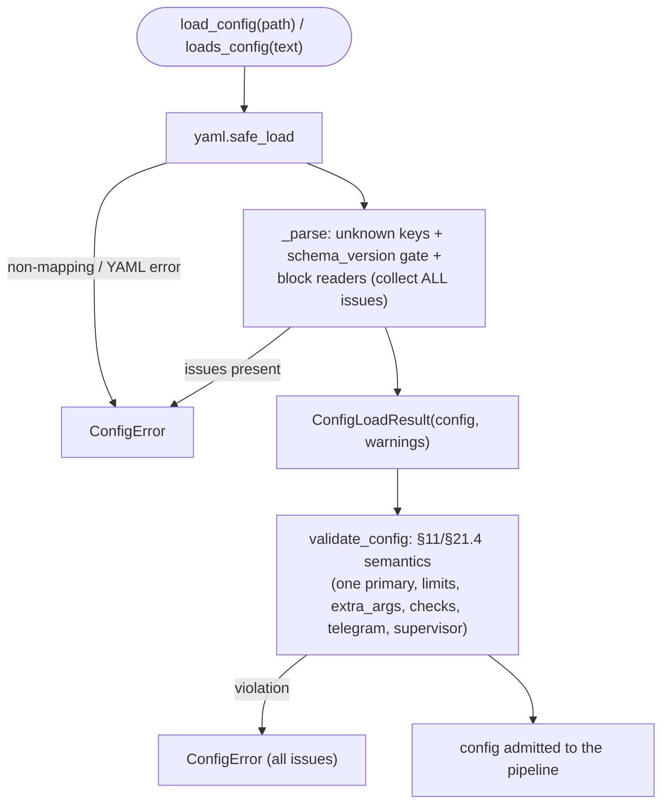

# B05 — Configuration: Schema, Loading, Validation, Upgrade

> Reconstructed from code (`config/schema.py`, `config/loader.py`, `config/validation.py`, `config/upgrade.py`) and tests (`tests/config/`). The code is the only source of truth; this document was rebuilt from the implementation, not from prose or comments. Significant claims carry a `file:line` reference.

**Status:** documented · **Source modules:** `src/wastech_orchestrator/config/schema.py`, `src/wastech_orchestrator/config/loader.py`, `src/wastech_orchestrator/config/validation.py`, `src/wastech_orchestrator/config/upgrade.py`

## Responsibility

Own the typed model of `config.yaml` and its full ingestion lifecycle: the frozen-dataclass shapes ([schema.py](../../../src/wastech_orchestrator/config/schema.py)), fail-closed structural parsing of YAML into an `OrchestratorConfig` ([loader.py](../../../src/wastech_orchestrator/config/loader.py)), semantic cross-field validation ([validation.py](../../../src/wastech_orchestrator/config/validation.py)), and add-missing-only key migration between schema versions ([upgrade.py](../../../src/wastech_orchestrator/config/upgrade.py)). The module is pure: no config-file discovery, no atomic write/backup, no import-time side effects, and it never touches CLI syntax — that is each consumer block's concern.

The split is deliberate: `schema.py` holds _shapes only_ (no parsing, no validation, no CLI syntax — [schema.py:4-7](../../../src/wastech_orchestrator/config/schema.py#L4)); `loader.py` owns _structural_ parsing only and the cross-field rules live in `validation.py` ([loader.py:8-9](../../../src/wastech_orchestrator/config/loader.py#L8)).

## Public surface

- `CONFIG_SCHEMA_VERSION = 21` ([schema.py:107](../../../src/wastech_orchestrator/config/schema.py#L107)) — the `config.yaml` _format_ version; the loader refuses anything newer.
- `OrchestratorConfig` ([schema.py:301-317](../../../src/wastech_orchestrator/config/schema.py#L301)) — the top-level frozen dataclass: `orchestrator`, `repo`, `agents`, `security`, `validation`, `checks`, `git`, `telegram`, `skills`, `supervisor`, plus the top-level `prompt_audit: bool`.
- `ProviderConfig` ([schema.py:120-134](../../../src/wastech_orchestrator/config/schema.py#L120)) — per-provider shape: `command`, `model`, `timeout_seconds`, `permission_profile`, `extra_args`, `sandbox`, `max_turns`, `reasoning`, and `primary`.
- `SKIPPABLE_STAGES` ([schema.py:65-72](../../../src/wastech_orchestrator/config/schema.py#L65)) — the frozenset of stages a task may disable per-task via `stages.<stage>.enabled: false`.
- `loads_config(text, *, source)` / `load_config(path)` → `ConfigLoadResult` ([loader.py:689](../../../src/wastech_orchestrator/config/loader.py#L689), [loader.py:705](../../../src/wastech_orchestrator/config/loader.py#L705)) — structural parse; raises `ConfigError`.
- `ConfigError(issues)` ([loader.py:61-69](../../../src/wastech_orchestrator/config/loader.py#L61)) — carries _every_ problem found, not just the first.
- `ConfigLoadResult(config, warnings)` ([loader.py:72-77](../../../src/wastech_orchestrator/config/loader.py#L72)) — the parsed config plus non-fatal warnings.
- `validate_config(config)` → `list[str]` ([validation.py:66](../../../src/wastech_orchestrator/config/validation.py#L66)) — semantic gate; raises `ConfigError`, returns warnings.
- `upgrade_config_mapping(template, operator)` → `(merged, added, removed)` ([upgrade.py:64-80](../../../src/wastech_orchestrator/config/upgrade.py#L64)); `parse_mapping` / `packaged_template_mapping` / `render` ([upgrade.py:46](../../../src/wastech_orchestrator/config/upgrade.py#L46), [upgrade.py:54](../../../src/wastech_orchestrator/config/upgrade.py#L54), [upgrade.py:121](../../../src/wastech_orchestrator/config/upgrade.py#L121)).
- `default_allowed_environment(system=None)` ([security/env.py](../../../src/wastech_orchestrator/security/env.py)) — the OS-aware default for `security.allowed_environment`: a cross-platform base (`PATH`, `HOME`, `USER`, `USERPROFILE`, `CODEX_HOME`, `CLAUDE_CONFIG_DIR`; `USER` is needed for macOS Keychain-based subscription/OAuth auth) plus `os_essential_env(system)`, the OS-launch essentials of the host OS. On Windows that includes `SystemRoot` (the Node-based `claude.exe` aborts at startup without it); on Linux/macOS (and WSL) the dynamic-linker/temp names. Used as both the loader fallback and the value the installer writes, so the allowlist stays the single env gate (security rule #4) while a fresh install starts the CLIs out of the box on every OS.

## Behavior

### Schema shapes and enums

Every block is a `@dataclass(frozen=True)`, keyed by the canonical enums from `providers.base` ([schema.py:14](../../../src/wastech_orchestrator/config/schema.py#L14)). The shapes mirror `config.example.yaml`: `OrchestratorRuntimeConfig` (`auto_mode`, `poll_interval_seconds`, `queue`), `RepoConfig`, `AgentsConfig`, `SecurityConfig`, `ValidationConfig`, `ChecksConfig`, `GitConfig`, `TelegramConfig`, `SkillsConfig`, `SupervisorConfig`.

`SKIPPABLE_STAGES` is exactly `{PLANNING, TESTING, REVIEW, FIXING}` ([schema.py:65-72](../../../src/wastech_orchestrator/config/schema.py#L65)). `refinement` is excluded (skipped deterministically by completeness classification, never a task flag); `implementation`/`publishing` are never skippable; `summary` is no longer skippable because the whole-task summary is always written by the constant supervisor layer ([B31](B31-supervisor.md)), not a graph node ([schema.py:59-64](../../../src/wastech_orchestrator/config/schema.py#L59)).

`ProviderConfig.primary` ([schema.py:140-142](../../../src/wastech_orchestrator/config/schema.py#L140)) marks the single global primary: the provider that runs any flow node with no `provider` field and the sole infrastructure-fallback target. `reasoning` is stored as a string but validated semantically against provider-specific capability tables: Codex accepts `minimal|low|medium|high|xhigh|max` (`max` maps to `xhigh`), while Claude accepts `low|medium|high|xhigh|max`. Provider-specific optionals: `sandbox` (Codex), `max_turns` (Claude) ([schema.py:127-129](../../../src/wastech_orchestrator/config/schema.py#L127)). `max_turns` parses to a turn cap (positive int, config default 400) or `None` — the `_max_turns` loader helper ([loader.py](../../../src/wastech_orchestrator/config/loader.py)) maps the case-insensitive sentinels `"none"`/`"max"` (and YAML `null`) to `None`, and the Claude adapter then omits `--max-turns` so the run has no turn cap.

`SupervisorConfig` ([schema.py:283-298](../../../src/wastech_orchestrator/config/schema.py#L283)) carries only `role_file` (default `roles/supervisor.md`), `model`, `reasoning` — it is oversight above any flow, validated under the same ceiling as a node. `SkillsConfig` ([schema.py:286-301](../../../src/wastech_orchestrator/config/schema.py#L286)) carries `dynamic` (default `True` — the once-per-task supervisor proposal of a `node → skills` map; skipped when the inventory is empty) and `strict` (default `False` — whether an unresolved operator pin stops the task); discovery is automatic and whole-repo, and operators pin skills per flow node ([B13](B13-skill-selection.md)). The top-level `prompt_audit` boolean ([schema.py:313-317](../../../src/wastech_orchestrator/config/schema.py#L313)) gates per-step prompt recording; a per-task `prompt_audit` always overrides it.

Other enums: `AuditBranch` (`task`/`sibling`) ([schema.py:81-85](../../../src/wastech_orchestrator/config/schema.py#L81)), `MergeStrategy` (`merge`/`squash`/`rebase`). The former `CheckDiscoveryMode` / `CheckRefreshPolicy` enums were removed with the checks-monorepo change (no discovery). The `checks` block is now `ChecksConfig{command_sets: dict[str, CommandSet], timeout_seconds: int}` ([schema.py:193-201](../../../src/wastech_orchestrator/config/schema.py#L193)), where `CommandSet{commands, paths, timeout_seconds?, skip_if_unavailable?}` ([schema.py:175-190](../../../src/wastech_orchestrator/config/schema.py#L175)) and `CheckCommandSpec{argv, name?, cwd?}` ([schema.py:160-172](../../../src/wastech_orchestrator/config/schema.py#L160)) — an empty `command_sets` mapping means no gate.

### Version history (what each bump changed)

`CONFIG_SCHEMA_VERSION` is bumped only when the _format_ changes, not on every release ([schema.py:16-19](../../../src/wastech_orchestrator/config/schema.py#L16)). Confirmed history from the source comments:

- **v2** — added the opt-in `git.auto_merge*` keys ([schema.py:20-21](../../../src/wastech_orchestrator/config/schema.py#L20)).
- **v3** — added the optional `prompts` block (later removed) ([schema.py:22-23](../../../src/wastech_orchestrator/config/schema.py#L22)).
- **v4** — added `agents.skip_stages` / `agents.allow_review_skip` ([schema.py:24-26](../../../src/wastech_orchestrator/config/schema.py#L24)).
- **v5** — added the `skills:` block and `checks.discovery.{run_at_task_start,approve_command_changes}` ([schema.py:27-29](../../../src/wastech_orchestrator/config/schema.py#L27)).
- **v6** — prompt overrides auto-detected by file presence; `prompts.overrides`/`prompts.strict` removed (tolerated/ignored) ([schema.py:30-33](../../../src/wastech_orchestrator/config/schema.py#L30)).
- **v7** — worc-home consolidation; `git.footprint.{location,tracking,external_root}` removed, leaving only `audit_commit_message` + `audit_on_branch` ([schema.py:34-38](../../../src/wastech_orchestrator/config/schema.py#L34)).
- **v8** — added the optional top-level `prompt_audit` flag (default false) ([schema.py:39-41](../../../src/wastech_orchestrator/config/schema.py#L39)).
- **v9** — the `prompts` block (`templates_dir`/`mode`) removed; a node's prompt template is its `role_file` (the _primary_ now) ([schema.py:42-44](../../../src/wastech_orchestrator/config/schema.py#L42)).
- **v10** — the global `agents.skip_stages` list removed (per-task `stages.<stage>.enabled: false` survives; `agents.allow_review_skip` stays) ([schema.py:45-50](../../../src/wastech_orchestrator/config/schema.py#L45)).
- **v11** — provider routing moves onto the flow node: the stage-keyed `agents.routing` block is removed, exactly one `agents.providers.<id>.primary: true` marks the global primary; the per-task auto-merge gate `git.auto_merge_allow_per_task` is also removed (a per-task `auto_merge` now wins outright) ([schema.py:51-56](../../../src/wastech_orchestrator/config/schema.py#L51)).
- **v12** — the decorative `agents.decomposition.min_size_signal` and `agents.decomposition.commit_per_subtask` keys are removed (neither was ever read; subtask commit is unconditional) ([schema.py:57](../../../src/wastech_orchestrator/config/schema.py#L57)).
- **v13/v14** — the `Stage` enum is deleted (per-task skip re-founded on flow node ids; `agents.allow_review_skip` removed); the unused `agents.providers.
.max_budget_usd` key removed ([schema.py:61-70](../../../src/wastech_orchestrator/config/schema.py#L61)).
- **v15** (`CONFIG_SCHEMA_VERSION = 15`, 2026-06-23, checks-monorepo) — a _format_ change to the `checks` block: the whole `checks.discovery` block (modes / agent-fallback / refresh / approval) is removed and the flat `checks.commands` list is replaced by named `checks.command_sets` — each a `paths` glob list + optional `timeout_seconds` / `skip_if_unavailable` + structured `commands`, every command gaining an optional repo-relative `cwd`. The only check behavior is "operator lists command sets; empty = no gate". A stale `checks.discovery` / `checks.commands` key is tolerated (ignored) on load and `upgrade-config` strips it; `command_sets` is operator-authored, never auto-generated ([schema.py:71-78](../../../src/wastech_orchestrator/config/schema.py#L71)).
- **v19** (`CONFIG_SCHEMA_VERSION = 19`, 2026-06-27, skills-selection-rework) — the `skills:` block is replaced outright: `scan_root` / `exclude` are removed (discovery is automatic and whole-repo via `git ls-files`; operators pin skills per flow node instead of denylisting), and the block shrinks to `dynamic` (the once-per-task supervisor `node → skills` proposal; on, skip-when-empty) and `strict` (whether an unresolved operator pin stops the task). `upgrade-config` strips the two removed keys ([schema.py:90-96](../../../src/wastech_orchestrator/config/schema.py#L90)).
- **v20** (`CONFIG_SCHEMA_VERSION = 20`, 2026-06-27, transient-provider-failure-recovery) — a _format_ add of the optional `agents.retry` block (`max_attempts` / `base_delay_s` / `max_delay_s` / `max_blocked_s`) — the bounded same-provider transient-retry policy (Option A) plus the B-lite soft-pause ceiling. Absent → safe defaults `{2, 2.0, 30.0, 3600.0}`; old configs load fail-open and `upgrade-config` adds it from the template ([schema.py:159-170](../../../src/wastech_orchestrator/config/schema.py#L159)).
- **v21** (`CONFIG_SCHEMA_VERSION = 21`, 2026-06-27, telegram-step-trace) — a _format_ add of the optional `telegram.trace` bool (default `false`) — a one-way, best-effort live progress feed that pushes one message per flow node finish (`<emoji> <node-id> → <outcome>`; node id + outcome only, no secrets; a no-op when Telegram is disabled). Absent → `false`; old configs load fail-open and `upgrade-config` adds it from the template ([schema.py:308-316](../../../src/wastech_orchestrator/config/schema.py#L308)).
- **v22** (`CONFIG_SCHEMA_VERSION = 22`, 2026-06-27, operator-confirmation-gates) — a _format_ add of two optional fail-closed confirmation-gate flags for full-auto `watch`: `orchestrator.auto_mode.confirm_next_task` (Telegram approve/deny before claiming each pending task — idea 27) and `agents.providers.<id>.max_turns_gate` (Claude-only continue/stop prompt when a run exhausts `max_turns` — idea 29). Both default `false`; both require `telegram.enabled` when on (a new cross-field validation rule). Absent → `false`; old configs load fail-open and `upgrade-config` adds them from the template ([schema.py:121-127](../../../src/wastech_orchestrator/config/schema.py#L121), [schema.py:183-211](../../../src/wastech_orchestrator/config/schema.py#L183)).

### Fail-closed structural loading

`loads_config` runs `yaml.safe_load`; a YAML error or a non-mapping root raises `ConfigError` immediately ([loader.py:691-696](../../../src/wastech_orchestrator/config/loader.py#L691)). Otherwise `_parse` assembles each block through typed readers that _collect_ problems into a shared `issues` list and return a safe placeholder on mismatch ([loader.py:80-89](../../../src/wastech_orchestrator/config/loader.py#L80)); only after the whole document is walked does a non-empty `issues` raise `ConfigError(issues)` with the full list ([loader.py:700-702](../../../src/wastech_orchestrator/config/loader.py#L700)). Every typed reader (`_str`, `_int`, `_bool`, `_float`, `_enum`, …) appends one issue per mismatch — so a config with several errors reports them all at once (test `test_all_issues_collected_not_just_first`, [test_loader.py:163-166](../../../tests/config/test_loader.py#L163)).

Unknown keys are rejected, not dropped: `_check_keys` reports `unknown key '<k>'` for any key outside the allowed set ([loader.py:92-104](../../../src/wastech_orchestrator/config/loader.py#L92)) — applied at the top level against `_TOP_LEVEL_KEYS` ([loader.py:633-646](../../../src/wastech_orchestrator/config/loader.py#L633)) and inside every block builder. Bad enum values fail closed too: `_enum` reports `invalid value <v>, expected one of <choices>` ([loader.py:251-264](../../../src/wastech_orchestrator/config/loader.py#L251)), and an unknown provider key in `agents.providers` is an explicit issue ([loader.py:343-348](../../../src/wastech_orchestrator/config/loader.py#L343)). The closed reasoning set `_REASONING_LEVELS = {low, medium, high, xhigh, max}` ([loader.py:49](../../../src/wastech_orchestrator/config/loader.py#L49)) is enforced for provider `reasoning` and `supervisor.reasoning` (the former `checks.discovery.reasoning` enforcement is gone — there is no discovery block). The `checks.command_sets` mapping is parsed by `_build_command_sets` / `_command_set` ([loader.py:225](../../../src/wastech_orchestrator/config/loader.py#L225), [loader.py:198](../../../src/wastech_orchestrator/config/loader.py#L198)), and a stale `checks.discovery` / `checks.commands` key is tolerated (ignored).

A partial config still loads: each reader supplies a default mirroring `config.example.yaml` (for example `poll_interval_seconds` → 300 and provider `timeout_seconds` → 7200). The two security deny lists are different: `_DEFAULT_DENIED_COMMANDS` and the default denied paths form a mandatory baseline, and operator entries are appended with stable deduplication. An empty/configured list therefore cannot remove `git push`, `.env`, or another baseline restriction. The shipped example mirrors the baseline, guarded by `test_example_denied_commands_match_loader_default` ([test_roundtrip.py](../../../tests/config/test_roundtrip.py)).

### The schema_version gate (refuse newer)

`_check_schema_version` ([loader.py:683-700](../../../src/wastech_orchestrator/config/loader.py#L683)) enforces the one-directional gate: an absent `schema_version` is accepted (the future-migration hook), a value `<= CONFIG_SCHEMA_VERSION` is accepted, and a value _greater_ than 22 raises `schema_version <n> is newer than this orchestrator supports (22); upgrade wastech-orchestrator` ([loader.py:696-700](../../../src/wastech_orchestrator/config/loader.py#L696)). A non-integer (or bool) value is itself an error ([loader.py:693-694](../../../src/wastech_orchestrator/config/loader.py#L693)). `schema_version` is config metadata only: it is validated here and **not** stored on `OrchestratorConfig` ([loader.py:688](../../../src/wastech_orchestrator/config/loader.py#L688)). Confirmed by `test_newer_schema_version_is_refused` and `test_current_and_absent_schema_version_load` ([test_config_schema_version.py:16-24](../../../tests/config/test_config_schema_version.py#L16)).

### Tolerated (removed) keys — fail-open, never rejected

Removed-but-legacy keys are _tolerated_: neither accepted into the schema nor reported as errors, so an old config still loads. `_check_keys` takes a `tolerated` set for this ([loader.py:92-104](../../../src/wastech_orchestrator/config/loader.py#L92)). Tolerated keys: top-level `prompts` (v9) ([loader.py:670-672](../../../src/wastech_orchestrator/config/loader.py#L670)); `agents.skip_stages` (v10) and `agents.routing` (v11) ([loader.py:383-400](../../../src/wastech_orchestrator/config/loader.py#L383)); `git.auto_merge_allow_per_task` (v11) ([loader.py:556-571](../../../src/wastech_orchestrator/config/loader.py#L556)); `agents.decomposition.min_size_signal` / `commit_per_subtask` (v12) ([loader.py:361-372](../../../src/wastech_orchestrator/config/loader.py#L361)). Tests confirm each loads fail-open and is not stored on the schema (`test_legacy_skip_stages_tolerated_not_error`, `test_legacy_routing_block_is_tolerated`, `test_legacy_auto_merge_allow_per_task_is_tolerated`, `test_legacy_prompts_block_is_tolerated` — [test_loader.py:60-66](../../../tests/config/test_loader.py#L60), [test_loader.py:148-154](../../../tests/config/test_loader.py#L148), [test_loader.py:259-263](../../../tests/config/test_loader.py#L259), [test_loader.py:306-312](../../../tests/config/test_loader.py#L306)).

### Semantic cross-field validation

`validate_config` runs after a successful load and is a second fail-closed gate, also collecting all issues into one `ConfigError` ([validation.py:66-110](../../../src/wastech_orchestrator/config/validation.py#L66)). The confirmed rules:

- **Exactly one global primary, in `agents.allowed`** — `_check_global_primary` counts providers with `primary: true`; `!= 1` is rejected (`exactly one provider must set primary: true`), and the single primary must be in `agents.allowed` ([validation.py:44-63](../../../src/wastech_orchestrator/config/validation.py#L44)). Tests cover zero, two, and not-in-allowed ([test_validation.py:28-53](../../../tests/config/test_validation.py#L28)).
- **Provider argument policy** — Claude `extra_args` is screened by the common `find_forbidden_args` detector from [B25](B25-security-policy.md). Codex `extra_args` is parsed by the stricter closed parser shared with the adapter: only harmless flags/config keys survive, while `--add-dir`, sandbox/profile/feature selectors, and arbitrary `-c`/`--config` keys are config issues. Tests cover split/equals forms and confirm rejected values are omitted from errors.
- **Loop limits** — `max_total_fix_iterations >= max_fix_cycles` ([validation.py:87-91](../../../src/wastech_orchestrator/config/validation.py#L87)); `poll_interval_seconds >= 0` ([validation.py:80-84](../../../src/wastech_orchestrator/config/validation.py#L80)); `orchestrator.queue` non-empty; `decomposition.max_subtasks >= 2` ([validation.py:94-98](../../../src/wastech_orchestrator/config/validation.py#L94)).
- **Retry bounds** — `agents.retry`: `max_attempts >= 0` (`0` disables transient retry), `base_delay_s >= 0`, `max_delay_s >= base_delay_s`, `max_blocked_s >= 0` ([validation.py](../../../src/wastech_orchestrator/config/validation.py)).
- **Check coherence** (`_validate_checks`, [validation.py:139-182](../../../src/wastech_orchestrator/config/validation.py#L139)) — `checks.timeout_seconds > 0`; per `checks.command_sets.<name>`: a non-empty set name, an optional `timeout_seconds > 0`, at least one command, non-empty `paths` entries; per command (normalized via `checks.model.normalize_check_command`) reject a shell metacharacter, a forbidden arg, or a `security.denied_commands` match, and reject a `cwd` that is not a repo-relative path (`is_safe_relpath` — no absolute / `..`). An empty `command_sets` mapping is a valid no-gate config.
- **Supervisor path containment** — `supervisor.role_file` must not contain `..` or be absolute ([validation.py:113-124](../../../src/wastech_orchestrator/config/validation.py#L113)) — the same rule the flow validator applies to a node `role_file`.
- **Security policy shape** (`_validate_security`) — every `security.denied_read_paths` and `security.protected_paths` glob must be repo-relative (no absolute / `~` / `..`), and denied-command prefixes must be non-empty. `security.trust_level` is validated against `strict`/`auto`. Tests cover valid globs, traversal/absolute paths, and blank command prefixes ([test_validation.py](../../../tests/config/test_validation.py)). Codex separately fails provider preflight if `CODEX_HOME` was removed from the env allowlist needed for its isolated policy home.
- **Telegram** — `ask_timeout_s > 0` and `bot_token_env`/`chat_id_env` are valid environment-variable names ([validation.py:127-138](../../../src/wastech_orchestrator/config/validation.py#L127)).
- **Confirmation gates require a transport** (`_validate_confirmation_gates`, v22) — if `orchestrator.auto_mode.confirm_next_task` or any provider's `max_turns_gate` is on while `telegram.enabled` is `false`, it is rejected. An enabled-but-silent safety gate could never reach the operator (and both gates resolve to STOP on silence), so it is a misconfiguration, not a no-op. Tests cover both gates rejected without Telegram and both clean with it ([test_validation.py](../../../tests/config/test_validation.py)).

### Config upgrade (add-missing-only)

`upgrade_config_mapping` ([upgrade.py:64-80](../../../src/wastech_orchestrator/config/upgrade.py#L64)) recursively merges the packaged template into the operator mapping: at every existing leaf the **operator value wins**, nested mappings merge so a new sub-key is added without touching siblings, operator-only keys are preserved, and template-ordered keys come first so additions land in the documented order ([upgrade.py:98-118](../../../src/wastech_orchestrator/config/upgrade.py#L98)). Removed keys (`_REMOVED_KEYS`: `prompts`, `agents.skip_stages`, `agents.routing`, `git.auto_merge_allow_per_task`) are stripped in place ([upgrade.py:31-36](../../../src/wastech_orchestrator/config/upgrade.py#L31), [upgrade.py:83-95](../../../src/wastech_orchestrator/config/upgrade.py#L83)), and `schema_version` is always stamped to `CONFIG_SCHEMA_VERSION` ([upgrade.py:79](../../../src/wastech_orchestrator/config/upgrade.py#L79)). It is **idempotent**: upgrading the packaged template against itself adds nothing (`test_packaged_template_is_complete_and_self_idempotent` [test_upgrade.py:81-88](../../../tests/config/test_upgrade.py#L81)). `render` re-emits via `yaml.safe_dump` (so inline comments are lost) with a header pointing back to `config.example.yaml` ([upgrade.py:38-43](../../../src/wastech_orchestrator/config/upgrade.py#L38), [upgrade.py:121-126](../../../src/wastech_orchestrator/config/upgrade.py#L121)). The timestamped backup and `--dry-run` belong to the CLI driver (`cmd_upgrade_config`, [B01](B01-cli-and-operator-commands.md)) — this module only computes the merge.

### Load + validate pipeline

## Invariants & guarantees

- **Fail closed, report everything.** A non-mapping root, an unknown key, an unknown provider/enum, a bad type, or a newer `schema_version` is an error — never silently dropped — and every problem is collected before raising ([loader.py:1-6](../../../src/wastech_orchestrator/config/loader.py#L1), [loader.py:700-702](../../../src/wastech_orchestrator/config/loader.py#L700)).
- **Exactly one global primary.** Validation enforces `len(primaries) == 1` and membership in `agents.allowed` — the router relies on this ([validation.py:52-63](../../../src/wastech_orchestrator/config/validation.py#L52)).
- **Security cannot be weakened at load.** Claude `extra_args`, closed Codex `extra_args`, and check commands that would disable the sandbox/approvals are rejected at config time using the same decision functions repeated at run time.
- **Schema shapes are immutable.** All dataclasses are `frozen=True`; `schema.py` carries no parsing or validation logic ([schema.py:4-7](../../../src/wastech_orchestrator/config/schema.py#L4)).
- **Versioning is one-directional and lossless for operators.** Newer is refused; older/absent is accepted; upgrade adds only what is missing and never overwrites an operator value ([loader.py:649-666](../../../src/wastech_orchestrator/config/loader.py#L649), [upgrade.py:64-80](../../../src/wastech_orchestrator/config/upgrade.py#L64)).
- **No import-time side effects.** Loading is an explicit call; only `load_config` (reads a file) and `packaged_template_mapping` (reads packaged data) touch the filesystem.

## Dependencies

- **Uses:** [B25](B25-security-policy.md) (`find_forbidden_args` plus the typed Codex parser), [B23](B23-check-discovery.md) (`checks.model` — `normalize_check_command`, `argv_matches_denied`, `shell_metachars`, `is_safe_relpath` for a check `cwd`), `providers.base` (`ProviderId`), PyYAML.
- **Used by:** [B01](B01-cli-and-operator-commands.md) (`_load_config`, `cmd_upgrade_config` / `upgrade-config` + `upgrade-docs`), [B04](B04-install-registry-and-config-discovery.md) (resolves the path this module then loads), [B06](B06-orchestrator-pipeline.md) (reads `OrchestratorConfig`), [B18](B18-agent-providers.md) (`ProviderConfig` drives the adapters), [B29](B29-flow-definition-and-validation.md) (the flow config-aware validator reads `providers.allowed`/`reasoning`/the permission ceiling), [B31](B31-supervisor.md) (`SupervisorConfig`), [B13](B13-skill-selection.md) (`SkillsConfig`).

## Tests

- [tests/config/test_loader.py](../../../tests/config/test_loader.py) — structural fail-closed paths: non-mapping/empty root, unknown top-level and block keys, type/enum rejection, collect-all-issues, the reasoning closed set, provider/auto-merge/prompt-audit parsing, and all four tolerated-legacy-key paths.
- [tests/config/test_validation.py](../../../tests/config/test_validation.py) — every semantic reject path: the one-global-primary rule (zero/two/not-in-allowed), loop-limit and `max_subtasks` bounds, sandbox/permission-bypass `extra_args`, poll interval, telegram timeout and env-name validation; `test_packaged_config_validates_clean` anchors the packaged config.
- [tests/config/test_config_schema_version.py](../../../tests/config/test_config_schema_version.py) — the `schema_version` gate: newer refused, current/absent/non-integer/packaged behavior.
- [tests/config/test_command_sets.py](../../../tests/config/test_command_sets.py) — `checks.command_sets` (v15) loading + semantic validation: a valid monorepo (per-set `paths` / `timeout_seconds` / `skip_if_unavailable` / per-command `cwd`), an empty mapping = no gate, and the reject paths (`cwd` traversal, denied command, shell metacharacter, empty `commands`).
- [tests/config/test_upgrade.py](../../../tests/config/test_upgrade.py) — add-missing merge, operator-value precedence, removed-key stripping (including a stale `checks.discovery` / `checks.commands`), idempotence, packaged-template completeness, and render round-trip.
- [tests/config/test_roundtrip.py](../../../tests/config/test_roundtrip.py) — the shipped `config.example.yaml` (packaged and repo-root copies) loads, validates clean, and the two copies are in sync.
