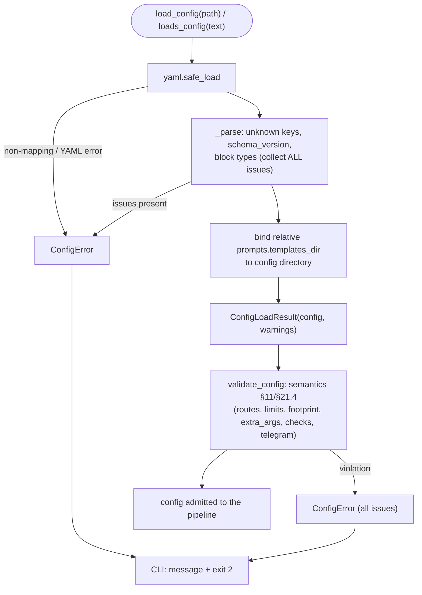

# B05 — Configuration: schema, loading, validation, upgrade

## Purpose

The typed model for `config.yaml` and its full data lifecycle: structural YAML parsing into dataclasses (fail-closed), semantic validation of rules §11/§21.4, and key migration between schema versions. The configuration defines the behavior of the entire system (providers, routes, loop limits, security, footprint, checks, telegram, prompts, skills).

## Responsibilities

- Define the configuration shapes (frozen dataclasses per block) and invariant enumerations ([schema.py:105-334](../../../src/wastech_orchestrator/config/schema.py#L105)).
- Parse YAML into a typed `OrchestratorConfig`, collecting all issues and raising `ConfigError` ([loader.py:778-808](../../../src/wastech_orchestrator/config/loader.py#L778)).
- Validate semantic rules §11/§21.4 and raise `ConfigError` ([validation.py:69-121](../../../src/wastech_orchestrator/config/validation.py#L69)).
- Validate per-task route-override (pure function, no exceptions) ([validation.py:218-240](../../../src/wastech_orchestrator/config/validation.py#L218)).
- Merge the packaged template into the operator config (add-missing-only), remove deleted keys, set the version ([upgrade.py:58-120](../../../src/wastech_orchestrator/config/upgrade.py#L58)).

## Block boundaries

### Within the block's responsibility

- Data model (shapes), structural parsing (types, unknown keys, version), semantic validation, key migration, binding the relative `templates_dir` to the config directory.

### Outside the block's responsibility

- **Config file discovery** (`resolve_config_path`) and the binding registry — that is [B04](./B04-install-registry-and-config-discovery.md).
- **Atomic write/backup** of the config file — that belongs to the CLI/installer drivers ([B03](./B03-installer-and-scaffolding.md)/[B01](./B01-cli-and-operator-commands.md)).
- **Defining forbidden flags** — delegated to [B25 `find_forbidden_args`](./B25-security-policy.md) ([validation.py:46](../../../src/wastech_orchestrator/config/validation.py#L46)).
- **Normalizing/validating check commands** — delegated to [B23 (checks.model)](./B23-check-discovery.md) ([validation.py:17-22,154-166](../../../src/wastech_orchestrator/config/validation.py#L154)).
- **Using** the values (launching, routing) — that belongs to the consumer blocks.

## Entry points

- `load_config(path)` / `loads_config(text)` → `ConfigLoadResult` ([loader.py:811,795](../../../src/wastech_orchestrator/config/loader.py#L795)); `ConfigError` ([loader.py:67](../../../src/wastech_orchestrator/config/loader.py#L67)).
- `validate_config(config)` → warnings | raise ([validation.py:69](../../../src/wastech_orchestrator/config/validation.py#L69)); `check_task_route_override(override, config)` ([validation.py:218](../../../src/wastech_orchestrator/config/validation.py#L218)).
- `upgrade_config_mapping` / `parse_mapping` / `packaged_template_mapping` / `render` ([upgrade.py](../../../src/wastech_orchestrator/config/upgrade.py)).
- `OrchestratorConfig` + block dataclasses + `ROUTABLE_STAGES`/`SKIPPABLE_STAGES`/`CONFIG_SCHEMA_VERSION` ([schema.py](../../../src/wastech_orchestrator/config/schema.py)).
- Callers: CLI `_load_config` (load + validate, fail-closed) ([cli.py:542-546](../../../src/wastech_orchestrator/cli.py#L542)); `cmd_upgrade_config` ([cli.py:568](../../../src/wastech_orchestrator/cli.py#L568)); [B16 gate](./B16-task-parsing-and-validation-gate.md) and [B17 Router](./B17-agent-router-and-fallback.md) — `check_task_route_override`.

## Input data and state

Text/path of `config.yaml`; for upgrade — the packaged `templates/config.example.yaml`. No state is stored — each call is independent, with no side effects on import.

## Main scenario (load + validate)

1. `loads_config`: `yaml.safe_load`; non-mapping root or YAML error → `ConfigError`.
2. `_parse`: check unknown top-level keys and `schema_version`; assemble each block with typed readers (type mismatch → issue + safe default).
3. If there are issues — `ConfigError` with the full list; otherwise `ConfigLoadResult(config, warnings)`.
4. `load_config` additionally binds the relative `prompts.templates_dir` to the config directory.
5. CLI calls `validate_config` (semantics) as a fail-closed gate before use.

Loading and validation are two fail-closed checkpoints; each collects **all** issues, not just the first:

## Alternative scenarios

### Legacy config without `agents.routing`

Missing routing block → auto-migration to Codex route for all `ROUTABLE_STAGES` + warning ([loader.py:476-485,388-392](../../../src/wastech_orchestrator/config/loader.py#L476)).

### Removed keys (schema v6)

`prompts.overrides`/`prompts.strict` are tolerated on load (ignored) with a warning; `upgrade-config` strips them ([loader.py:711-728](../../../src/wastech_orchestrator/config/loader.py#L711), [upgrade.py:27-30,77-89](../../../src/wastech_orchestrator/config/upgrade.py#L27)).

### Config upgrade

`upgrade_config_mapping`: recursive merge of the template into the operator config — operator values always win, only missing keys are added (including new sub-keys), removed keys are stripped, `schema_version` is set to current ([upgrade.py:92-112](../../../src/wastech_orchestrator/config/upgrade.py#L92)).

## Checks and constraints

- **Structural** (loader): non-mapping root, unknown keys (top-level and block-level), unknown stage/provider/enum, wrong types → `ConfigError`; `schema_version` newer than current (=6) → `ConfigError` ([loader.py:758-775](../../../src/wastech_orchestrator/config/loader.py#L758)).
- **Semantic** (validation): routes only for `ROUTABLE_STAGES`, primary/fallback ∈ `agents.allowed` and present in `agents.providers`; `poll_interval_seconds ≥ 0`; `max_total_fix_iterations ≥ max_fix_cycles`; `decomposition.max_subtasks ≥ 2`; `extra_args` without bypass flags; footprint pairs (external is incompatible with exclude_local/commit; in_repo requires tracking ≠ none) and anti-traversal `external_root` outside `repo.local_path`; check commands — argv without shell metacharacters, without bypass flags, not from `denied_commands`; telegram timeout > 0 and valid env-variable names ([validation.py:80-216](../../../src/wastech_orchestrator/config/validation.py#L80)).
- `check_task_route_override` — the same allowed/configured/routable checks, but **pure** (returns a list of issues, raises nothing) ([validation.py:228-240](../../../src/wastech_orchestrator/config/validation.py#L228)).

## Output

`ConfigLoadResult(config, warnings)`; list of warnings from `validate_config` (e.g. `disabled` discovery); `(merged, added, removed)` from upgrade; YAML text from `render`. The block itself writes nothing (writing belongs to the callers).

## Side effects

- `load_config` reads a file; `packaged_template_mapping` reads the packaged template. All other functions are pure. Writing the config file does not happen here.

## Errors and edge cases

- Any structural/semantic issue → `ConfigError(issues)` with the **full** list (not just the first).
- A partial config is supplemented with safe defaults from §11 (if it does not violate semantics).
- `schema_version` newer than current → fail-closed (CLI prints a message + exits with 2).

## Relations

### Uses

- [B25 — Security](./B25-security-policy.md) — `find_forbidden_args` (validates `extra_args` and commands).
- [B23 — Checks](./B23-check-discovery.md) — `checks.model` (`normalize_check_command`, `argv_matches_denied`, `shell_metachars`) when validating commands.
- PyYAML.

### Used by

- [B01 — CLI](./B01-cli-and-operator-commands.md) — `_load_config`, `cmd_upgrade_config`.
- [B06 — Pipeline](./B06-orchestrator-pipeline.md) and almost all blocks — read `OrchestratorConfig` types.
- [B16](./B16-task-parsing-and-validation-gate.md), [B17](./B17-agent-router-and-fallback.md) — `check_task_route_override`, `ROUTABLE_STAGES`/`SKIPPABLE_STAGES`.
- [B03 — Installer](./B03-installer-and-scaffolding.md) — `loads_config` + `validate_config` (validating generated config), `upgrade.*`.

## Role in the overall system

Configuration is the single source of behavioral parameters. Fail-closed loading and validation form the config-time half of the invariant "the security policy cannot be weakened": an unsafe or contradictory config never reaches the pipeline. Versioning enables safe evolution of the format and migration of existing installations.

## Code confirmation

- [config/schema.py:34-334](../../../src/wastech_orchestrator/config/schema.py#L34) — format version, `ROUTABLE_STAGES`/`SKIPPABLE_STAGES`, all block dataclasses and enumerations.
- [config/loader.py:778-829](../../../src/wastech_orchestrator/config/loader.py#L778) — `_parse`, `loads_config`, `load_config`, `templates_dir` binding.
- [config/loader.py:458-502](../../../src/wastech_orchestrator/config/loader.py#L458) — legacy routing migration, defaults.
- [config/validation.py:69-240](../../../src/wastech_orchestrator/config/validation.py#L69) — semantic rules and `check_task_route_override`.
- [config/upgrade.py:58-120](../../../src/wastech_orchestrator/config/upgrade.py#L58) — add-missing merge, key removal, render.
- Tests: [test_loader.py](../../../tests/config/test_loader.py), [test_validation.py](../../../tests/config/test_validation.py), [test_upgrade.py](../../../tests/config/test_upgrade.py), [test_config_schema_version.py](../../../tests/config/test_config_schema_version.py), [test_roundtrip.py](../../../tests/config/test_roundtrip.py), [test_checks_discovery.py](../../../tests/config/test_checks_discovery.py).
