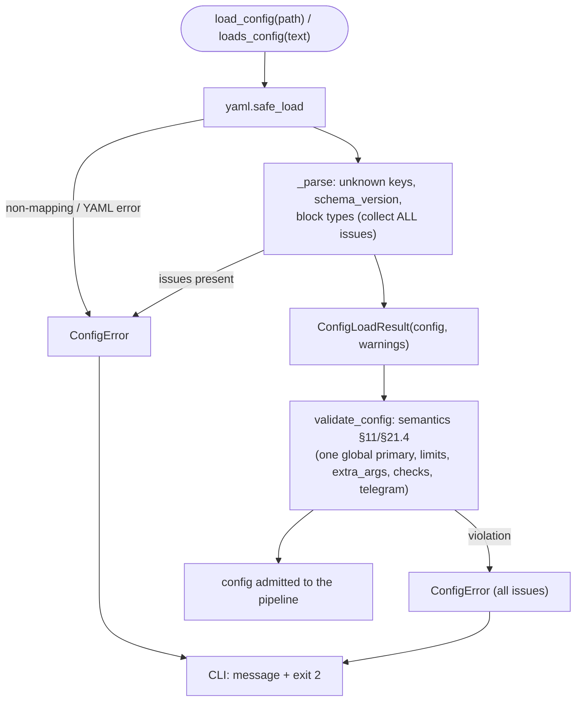

# B05 — Configuration: schema, loading, validation, upgrade

## Purpose

The typed model for `config.yaml` and its full data lifecycle: structural YAML parsing into dataclasses (fail-closed), semantic validation of rules §11/§21.4, and key migration between schema versions. The configuration defines the behavior of the entire system (providers, the global primary, loop limits, security, the git audit footprint, checks, telegram, skills, the prompt audit toggle).

## Responsibilities

- Define the configuration shapes (frozen dataclasses per block) and invariant enumerations ([schema.py:99-298](../../../src/wastech_orchestrator/config/schema.py#L99)).
- Parse YAML into a typed `OrchestratorConfig`, collecting all issues and raising `ConfigError` ([loader.py](../../../src/wastech_orchestrator/config/loader.py)).
- Validate semantic rules §11/§21.4 and raise `ConfigError` ([validation.py:66-109](../../../src/wastech_orchestrator/config/validation.py#L66)).
- Enforce the one-global-primary rule (`_check_global_primary`): exactly one `agents.providers.<id>.primary: true`, and it must be in `agents.allowed` ([validation.py:44-63](../../../src/wastech_orchestrator/config/validation.py#L44)).
- Merge the packaged template into the operator config (add-missing-only), remove deleted keys, set the version ([upgrade.py:58-120](../../../src/wastech_orchestrator/config/upgrade.py#L58)).

## Block boundaries

### Within the block's responsibility

- Data model (shapes), structural parsing (types, unknown keys, version), semantic validation, key migration.

### Outside the block's responsibility

- **Config file discovery** (`resolve_config_path`) — that is [B04](./B04-install-registry-and-config-discovery.md).
- **Atomic write/backup** of the config file — that belongs to the CLI/installer drivers ([B03](./B03-installer-and-scaffolding.md)/[B01](./B01-cli-and-operator-commands.md)).
- **Defining forbidden flags** — delegated to [B25 `find_forbidden_args`](./B25-security-policy.md) ([validation.py:46](../../../src/wastech_orchestrator/config/validation.py#L46)).
- **Normalizing/validating check commands** — delegated to [B23 (checks.model)](./B23-check-discovery.md) ([validation.py:17-22,154-166](../../../src/wastech_orchestrator/config/validation.py#L154)).
- **Using** the values (launching, routing) — that belongs to the consumer blocks.

## Entry points

- `load_config(path)` / `loads_config(text)` → `ConfigLoadResult`; `ConfigError` ([loader.py:67](../../../src/wastech_orchestrator/config/loader.py#L67)).
- `validate_config(config)` → warnings | raise ([validation.py:66](../../../src/wastech_orchestrator/config/validation.py#L66)).
- `upgrade_config_mapping` / `parse_mapping` / `packaged_template_mapping` / `render` ([upgrade.py](../../../src/wastech_orchestrator/config/upgrade.py)).
- `OrchestratorConfig` + block dataclasses + `SKIPPABLE_STAGES`/`CONFIG_SCHEMA_VERSION` ([schema.py](../../../src/wastech_orchestrator/config/schema.py)).
- Callers: CLI `_load_config` (load + validate, fail-closed); `cmd_upgrade_config`.

## Input data and state

Text/path of `config.yaml`; for upgrade — the packaged `templates/config.example.yaml`. No state is stored — each call is independent, with no side effects on import.

## Main scenario (load + validate)

1. `loads_config`: `yaml.safe_load`; non-mapping root or YAML error → `ConfigError`.
2. `_parse`: check unknown top-level keys and `schema_version`; assemble each block with typed readers (type mismatch → issue + safe default).
3. If there are issues — `ConfigError` with the full list; otherwise `ConfigLoadResult(config, warnings)`.
4. CLI calls `validate_config` (semantics) as a fail-closed gate before use.

Loading and validation are two fail-closed checkpoints; each collects **all** issues, not just the first:

## Alternative scenarios

### Legacy `agents.routing` is tolerated/ignored (v11)

The stage-keyed `agents.routing` block was removed in v11 — provider routing is now node-based (a flow node declares its own `provider`, else the global `providers.<id>.primary`). An old config that still carries `agents.routing` (or the removed `agents.skip_stages`) loads fail-open: the key is tolerated and ignored, and `upgrade-config` strips it ([loader.py:382-398](../../../src/wastech_orchestrator/config/loader.py#L382)).

### Schema changes (v6 / v7 / v8 / v9 / v10 / v11)

v6: `prompts.overrides`/`prompts.strict` are tolerated on load (ignored) with a warning; `upgrade-config` strips them. v7 (worc-home consolidation): the `git.footprint.location`/`.tracking`/`.external_root` keys are removed — `git.footprint` now carries only `audit_commit_message` + `audit_on_branch` ([schema.py:36-38,225-232](../../../src/wastech_orchestrator/config/schema.py#L36)); `upgrade-config` strips the removed keys. v8 (prompt-audit): adds the optional top-level `prompt_audit` boolean (default false); an absent value takes the safe `false`, so no migration flips anything and `upgrade-config` adds it from the template. v9 (flow-engine P1): the entire `prompts` block (`templates_dir`/`mode`) is removed — a flow node's prompt template is its `role_file`, not a stage-indexed packaged default; an operator's `prompts:` block is tolerated (ignored) on load and `upgrade-config` strips it. v10 (flexible-flow stage-skip): the global `agents.skip_stages` list is removed (per-task `stages.<stage>.enabled: false` survives as the bounded toggle); the key is tolerated/ignored and `upgrade-config` strips it. v11 (flow-engine PRE.1/PRE.2): the stage-keyed `agents.routing` block and the `git.auto_merge_allow_per_task` gate are removed — routing moves onto the flow node (else the global primary) and a per-task `auto_merge` now wins outright; both dead keys are tolerated/ignored on load and `upgrade-config` strips them ([schema.py:51-57](../../../src/wastech_orchestrator/config/schema.py#L51), [loader.py:382-398,555-570](../../../src/wastech_orchestrator/config/loader.py#L382)).

### Config upgrade

`upgrade_config_mapping`: recursive merge of the template into the operator config — operator values always win, only missing keys are added (including new sub-keys), removed keys are stripped, `schema_version` is set to current ([upgrade.py:92-112](../../../src/wastech_orchestrator/config/upgrade.py#L92)).

## Checks and constraints

- **Structural** (loader): non-mapping root, unknown keys (top-level and block-level), unknown stage/provider/enum, wrong types → `ConfigError`; `schema_version` newer than current (=11) → `ConfigError`.
- **Semantic** (validation): exactly one global primary (`agents.providers.<id>.primary: true`), and it must be in `agents.allowed`; `poll_interval_seconds ≥ 0`; `max_total_fix_iterations ≥ max_fix_cycles`; `decomposition.max_subtasks ≥ 2`; `extra_args` without bypass flags; check commands — argv without shell metacharacters, without bypass flags, not from `denied_commands`; telegram timeout > 0 and valid env-variable names ([validation.py:76-104](../../../src/wastech_orchestrator/config/validation.py#L76)).

## Output

`ConfigLoadResult(config, warnings)`; list of warnings from `validate_config` (e.g. `disabled` discovery); `(merged, added, removed)` from upgrade; YAML text from `render`. The block itself writes nothing (writing belongs to the callers).

## Side effects

- `load_config` reads a file; `packaged_template_mapping` reads the packaged template. All other functions are pure. Writing the config file does not happen here.

## Errors and edge cases

- Any structural/semantic issue → `ConfigError(issues)` with the **full** list (not just the first).
- A partial config is supplemented with safe defaults from §11 (if it does not violate semantics).
- `schema_version` newer than current → fail-closed (CLI prints a message + exits with 2).

## Relations

### Uses

- [B25 — Security](./B25-security-policy.md) — `find_forbidden_args` (validates `extra_args` and commands).
- [B23 — Checks](./B23-check-discovery.md) — `checks.model` (`normalize_check_command`, `argv_matches_denied`, `shell_metachars`) when validating commands.
- PyYAML.

### Used by

- [B01 — CLI](./B01-cli-and-operator-commands.md) — `_load_config`, `cmd_upgrade_config`.
- [B06 — Pipeline](./B06-orchestrator-pipeline.md) and almost all blocks — read `OrchestratorConfig` types.
- [B16](./B16-task-parsing-and-validation-gate.md), [B17](./B17-agent-router-and-fallback.md) — `SKIPPABLE_STAGES`, `agents.providers` + the global primary.
- [B03 — Installer](./B03-installer-and-scaffolding.md) — `loads_config` + `validate_config` (validating generated config), `upgrade.*`.

## Role in the overall system

Configuration is the single source of behavioral parameters. Fail-closed loading and validation form the config-time half of the invariant "the security policy cannot be weakened": an unsafe or contradictory config never reaches the pipeline. Versioning enables safe evolution of the format and migration of existing installations.

## Code confirmation

- [config/schema.py:16-72](../../../src/wastech_orchestrator/config/schema.py#L16) — `CONFIG_SCHEMA_VERSION` (=11) + version history, `SKIPPABLE_STAGES`.
- [config/schema.py:128-156](../../../src/wastech_orchestrator/config/schema.py#L128) — `ProviderConfig.primary` (the global primary marker) and `AgentsConfig`.
- [config/loader.py:380-398,552-571](../../../src/wastech_orchestrator/config/loader.py#L380) — `agents.routing` / `auto_merge_allow_per_task` tolerated-and-ignored on load.
- [config/validation.py:44-109](../../../src/wastech_orchestrator/config/validation.py#L44) — semantic rules and `_check_global_primary`.
- [config/upgrade.py:58-120](../../../src/wastech_orchestrator/config/upgrade.py#L58) — add-missing merge, key removal, render.
- Tests: [test_loader.py](../../../tests/config/test_loader.py), [test_validation.py](../../../tests/config/test_validation.py), [test_upgrade.py](../../../tests/config/test_upgrade.py), [test_config_schema_version.py](../../../tests/config/test_config_schema_version.py), [test_roundtrip.py](../../../tests/config/test_roundtrip.py), [test_checks_discovery.py](../../../tests/config/test_checks_discovery.py).
