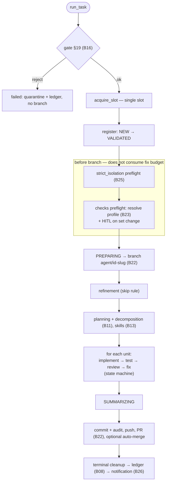

# B06 — Orchestrator Pipeline

## Purpose

The deterministic "spinal cord" of the system: drives **one task at a time** through the entire pipeline — from the validation gate to Git publication and terminal cleanup — and owns all state transitions. The core **never** builds a CLI command: it only calls the Router (agent stages), Check Runner (the `testing` stage), and Git Manager (everything git-related). Context is passed to agents **only as paths to artifact files**.

## Responsibilities

- Drive a task: gate → slot → isolation/checks preflight → branch → refinement (skip rule) → planning (+decomposition, skills) → for each unit `implementation → testing → review → fixing` → summary → publishing → terminal cleanup → ledger ([orchestrator.py:350-381,820-1047](../../../src/wastech_orchestrator/core/orchestrator.py#L820)).
- Atomically execute and persist each status transition ([orchestrator.py:2434-2450](../../../src/wastech_orchestrator/core/orchestrator.py#L2434)).
- Orchestrate the HITL round-trip and the dangerous-diff guardrail ([orchestrator.py:1790-2044](../../../src/wastech_orchestrator/core/orchestrator.py#L1790)).
- When prompt audit is enabled (`_prompt_audit_on`: per-task value overrides the global `config.prompt_audit`, no operator gate), record each stage run — who (provider/model/attempt/fallback/status) plus the redacted prompt — as a self-contained JSON file under `logs/<task-id>/prompt-audit/` and append it to `timeline.jsonl`, after the router returns so the actual providers are known (`_write_prompt_audit`) ([orchestrator.py:1777-1780](../../../src/wastech_orchestrator/core/orchestrator.py#L1777)).
- Operator flows: `resume`, `rerun`/`continue`, `finalize` ([orchestrator.py:400-644](../../../src/wastech_orchestrator/core/orchestrator.py#L400)).
- Wire the full dependency graph (`build_orchestrator`/`build_providers`) ([orchestrator.py:2564-2651](../../../src/wastech_orchestrator/core/orchestrator.py#L2564)).

## Block Boundaries

### In scope

- Stage sequence, branching (skip/decomposition/fixing), all status transitions, HITL/guardrail orchestration, terminal handling, operator `resume`/`rerun`/`finalize`, dependency wiring.

### Out of scope

- **Building/launching the agent CLI** — that is [B17 Router](./B17-agent-router-and-fallback.md)/[B18](./B18-agent-providers.md); the core only calls `router.run_stage`.
- **Running checks** — [B24](./B24-check-execution.md); **git/gh** — [B22](./B22-git-manager.md).
- **Component rules**: transition validity — [B07](./B07-state-machine-and-store.md); loop limits — [B09](./B09-fix-loop-control.md); recovery decision — [B10](./B10-recovery-and-resume.md); decomposition intake — [B11](./B11-task-decomposition.md); HITL output validation — [B12](./B12-hitl-and-typed-output.md); skills — [B13](./B13-skill-selection.md); dangerous-diff classification — [B14](./B14-dangerous-diff-guardrail.md); prompts — [B15](./B15-prompt-templates.md); gate §19 — [B16](./B16-task-parsing-and-validation-gate.md).
- **CLI dispatch and the watch loop** — [B01](./B01-cli-and-operator-commands.md)/[B02](./B02-watch-daemon-and-scheduling.md).

## Entry Points

- `run_task(task_file)` ([orchestrator.py:350](../../../src/wastech_orchestrator/core/orchestrator.py#L350)) — [B01 run](./B01-cli-and-operator-commands.md)/[B02 watch](./B02-watch-daemon-and-scheduling.md).
- `resume()` ([orchestrator.py:655](../../../src/wastech_orchestrator/core/orchestrator.py#L655)) and `refresh_repo()`/`acquire_slot()` — [B02](./B02-watch-daemon-and-scheduling.md).
- `plan_rerun`/`rerun_task`/`continue_task` ([orchestrator.py:400-520](../../../src/wastech_orchestrator/core/orchestrator.py#L400)); `plan_finalize`/`finalize_task` ([orchestrator.py:524-644](../../../src/wastech_orchestrator/core/orchestrator.py#L524)) — [B01 rerun/finalize](./B01-cli-and-operator-commands.md).
- `build_orchestrator`/`build_providers` ([orchestrator.py:2564,2594](../../../src/wastech_orchestrator/core/orchestrator.py#L2564)) — [B01](./B01-cli-and-operator-commands.md).

## Input Data and State

Path to the task file or `task_id`; `OrchestratorConfig`; injected dependencies (router, git, checks, store, ledger, loops, gate, notifier, resolver, skill_scanner). Working state for a single task is held in the mutable `_Pipeline` ([orchestrator.py:264-291](../../../src/wastech_orchestrator/core/orchestrator.py#L264)); persistent state is in [B07](./B07-state-machine-and-store.md).

## Main Scenario (`run_task`)

1. `read_task_source` + `gate.validate` ([B16](./B16-task-parsing-and-validation-gate.md)); reject → `_reject` (quarantine + ledger, **no branch**).
2. `acquire_slot` (otherwise `SlotBusyError`); `_register_task` (NEW→VALIDATED, writes the normalized manifest + validation report).
3. `_drive`: `strict_isolation` preflight ([B25](./B25-security-policy.md), on failure → `PipelineFailed` before the branch) → `_check_preflight` (resolve the active checks profile before the branch; gate any changed set through HITL; not-ready → `PipelineFailed`) → PREPARING → `_prepare_branch` (`ensure_runtime_excludes`: gitignore `.worc/`, then attach the branch) → `_refinement` (skipped if `refined`/complete) → `_planning` (+decomposition, skills) → `_run_units_and_finish`.
4. For each unit (`_run_unit`): **IMPLEMENTING** (edit + dangerous-diff guardrail) → **TESTING** (checks: pass→review; launch failure→single re-resolve or fail; quality failure→`_enter_fixing`) → **REVIEWING** (skip or review; blocking findings→fixing; otherwise commit subtask/transition or SUMMARIZING) → **FIXING** (edit + guardrail → back to testing/review).
5. `_summary` (agent / stub / minimal) → `_publish` (finalize artifacts, `commit_code` + `commit_audit`, `push`, `create_pr`, optional auto-merge) → `_go_terminal` (cleanup, status, file move, ledger, notification).

The main path is `run_task` → `_drive`. Key detail: isolation and checks preflights run **before** branch creation and do not consume the fix budget. Operator paths (`resume`/`rerun`/`finalize`) are described in the section below.

## Alternative Scenarios

### Resume (`resume`)

`RecoveryReconciler` ([B10](./B10-recovery-and-resume.md)) → `_resume_task` (restore context and continue from the recorded stage), `_resume_cleanup` (complete pending cleanup), `_resume_manual` (mark ambiguous tasks `manual_action_required`) ([orchestrator.py:655-795](../../../src/wastech_orchestrator/core/orchestrator.py#L655)).

### Rerun / Continue

`rerun_task`: archive artifacts, reset branch to base, clear per-attempt state, run `run_task`. `continue_task`: revive the task at the interrupted stage (reset incomplete HITL) and `resume` ([orchestrator.py:471-520](../../../src/wastech_orchestrator/core/orchestrator.py#L471)).

### Finalize

`finalize_task`: terminal cleanup, set the declared status **outside** the state machine, move the file, append a `manual` entry to the ledger, optionally delete the branch — **without** the pipeline and without commit/push/PR ([orchestrator.py:583-644](../../../src/wastech_orchestrator/core/orchestrator.py#L583)).

### Stage Skipping

`planning`/`testing`/`review`/`fixing`/`summary` can be skipped (union of global and per-task `effective_skip`): a stub/`record_skip` is written, transitions are adjusted (e.g., fix after review with testing skipped returns to review) ([orchestrator.py:231-239,1068-1088,2249-2251](../../../src/wastech_orchestrator/core/orchestrator.py#L231)).

### Auto-merge (DANGER)

With `review` skip + auto_merge — a warning is issued; with auto_merge — `merge_pr`; a blocked merge → `ManualActionRequired`, the PR remains open ([orchestrator.py:1371-1419](../../../src/wastech_orchestrator/core/orchestrator.py#L1371)).

## Checks and Constraints

- Every transition goes through `assert_transition` ([B07](./B07-state-machine-and-store.md)) inside a transaction ([orchestrator.py:2434-2445](../../../src/wastech_orchestrator/core/orchestrator.py#L2434)).
- Single slot (`acquire_slot` via `find_active_tasks`) ([orchestrator.py:383-385](../../../src/wastech_orchestrator/core/orchestrator.py#L383)).
- Isolation preflight and checks preflight run **before** branch creation and do not consume the fix budget.
- Fix-loop limits ([B09](./B09-fix-loop-control.md)); stall → `manual_action_required` + failure report.
- Blocking review findings: `blocking`/`critical`/`high` ([orchestrator.py:137](../../../src/wastech_orchestrator/core/orchestrator.py#L137)).
- Checks re-resolve — only on launch failure and at most once per task ([orchestrator.py:982-1015](../../../src/wastech_orchestrator/core/orchestrator.py#L982)).
- HITL failure (timeout/transport/invalid response) → `ManualActionRequired` ([orchestrator.py:2060-2110](../../../src/wastech_orchestrator/core/orchestrator.py#L2060)).

## Output

`PipelineResult(task_id, final_status, pr_url, validation_reason)`. For the operator — the final status and PR URL; at each step — updated persistent state and artifacts.

## Side Effects

Primarily through delegated blocks: transitions and records in SQLite ([B07](./B07-state-machine-and-store.md)), git/PR ([B22](./B22-git-manager.md)), run artifacts ([B20](./B20-artifact-layout.md)), ledger entries and failure reports ([B08](./B08-ledger-and-failure-reports.md)), Telegram notifications ([B26](./B26-notifications-telegram.md)), HITL artifacts ([B12](./B12-hitl-and-typed-output.md)). Directly: writes `task.enriched.md`/`plan.md`/`fixing-context.json`/`review/*`/`summary.*`/skip section and, when prompt audit is on, the `prompt-audit/` records + `timeline.jsonl`; moves the task file between lifecycle folders; quarantines on reject.

## Errors and Edge Cases

- Reject §19 → `failed` without a branch (quarantine + ledger).
- `PipelineFailed`/`GitCommandError` → `_fail` (if a branch exists — best-effort publish of the failed attempt).
- `ManualActionRequired` → `manual_action_required` (HITL failure, stall, blocked auto-merge, ambiguous recovery).
- Unsafe terminal cleanup on success → result `manual_action_required` ([orchestrator.py:1608-1610](../../../src/wastech_orchestrator/core/orchestrator.py#L1608)).

## Relationships

### Uses

- [B16](./B16-task-parsing-and-validation-gate.md), [B07](./B07-state-machine-and-store.md), [B17](./B17-agent-router-and-fallback.md), [B22](./B22-git-manager.md), [B24](./B24-check-execution.md), [B23](./B23-check-discovery.md), [B08](./B08-ledger-and-failure-reports.md), [B09](./B09-fix-loop-control.md), [B10](./B10-recovery-and-resume.md), [B11](./B11-task-decomposition.md), [B12](./B12-hitl-and-typed-output.md), [B13](./B13-skill-selection.md), [B14](./B14-dangerous-diff-guardrail.md), [B15](./B15-prompt-templates.md), [B26](./B26-notifications-telegram.md), [B27](./B27-observability.md), [B20](./B20-artifact-layout.md), [B21](./B21-secret-redaction.md), [B25](./B25-security-policy.md).

### Used by

- [B01 — CLI](./B01-cli-and-operator-commands.md) — `run`/`status`-adjacent commands, `rerun`, `finalize`.
- [B02 — Watch Daemon](./B02-watch-daemon-and-scheduling.md) — `resume`/`acquire_slot`/`run_task`/`refresh_repo`.

## Place in the Overall System

This is the node that ties everything together: every other block is either an input (validation, config), a tool (providers, checks, git), or a store (state, ledger, artifacts), and the pipeline coordinates them in strict order, owning the state and the invariants (single slot, separation of concerns, fallback only for infrastructure errors, non-weakenable security).

## Code Confirmation

- [orchestrator.py:350-385](../../../src/wastech_orchestrator/core/orchestrator.py#L350) — `run_task`/`acquire_slot`.
- [orchestrator.py:820-1047](../../../src/wastech_orchestrator/core/orchestrator.py#L820) — `_drive`, preflights, branch, refinement/planning, unit loop.
- [orchestrator.py:1196-1419](../../../src/wastech_orchestrator/core/orchestrator.py#L1196) — `_run_unit`, review, publishing, auto-merge.
- [orchestrator.py:1468-1641](../../../src/wastech_orchestrator/core/orchestrator.py#L1468) — fixing, failure reports, terminal handling.
- [orchestrator.py:1719-1877](../../../src/wastech_orchestrator/core/orchestrator.py#L1719) — stage launch, HITL round-trip.
- [orchestrator.py:2434-2651](../../../src/wastech_orchestrator/core/orchestrator.py#L2434) — transitions and dependency wiring.
- Tests: [test_orchestrator.py](../../../tests/core/test_orchestrator.py), [test_cli_pipeline.py](../../../tests/core/test_cli_pipeline.py), [test_cli_rerun.py](../../../tests/core/test_cli_rerun.py), [test_cli_finalize.py](../../../tests/core/test_cli_finalize.py), [test_recovery.py](../../../tests/core/test_recovery.py), [test_check_discovery_hitl.py](../../../tests/core/test_check_discovery_hitl.py).
