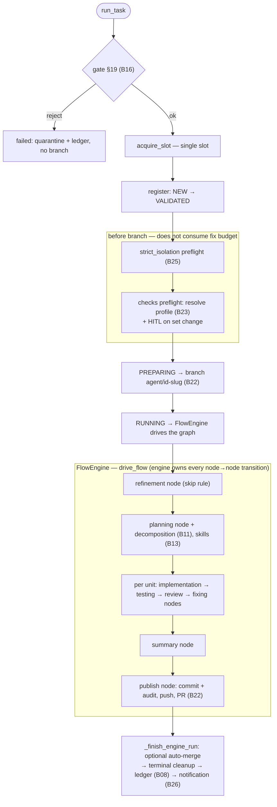

# B06 — Orchestrator Pipeline

## Purpose

The deterministic "spinal cord" of the system: drives **one task at a time** from the validation gate to Git publication and terminal cleanup, and owns the lifecycle status transitions. The refinement→…→publish body itself is executed by the [FlowEngine](./B17-agent-router-and-fallback.md) (`core/flow/engine.py`) over a validated flow graph — the orchestrator keeps the preamble (isolation + check preflight, branch prep) and terminal handling around it and wires the engine's node services. The core **never** builds a CLI command: it only calls the Router (agent nodes), Check Runner (the `testing` node), and Git Manager (everything git-related). Context is passed to agents **only as paths to artifact files**.

## Responsibilities

- Drive a task: gate → slot → isolation/checks preflight → branch → hand the validated flow graph to the FlowEngine (refinement → planning (+decomposition, skills) → for each unit `implementation → testing → review → fixing` → summary → publishing) → terminal cleanup → ledger ([orchestrator.py:326-359,798-938](../../../src/wastech_orchestrator/core/orchestrator.py#L798)).
- Atomically execute and persist each lifecycle status transition (`assert_transition` + `set_status` inside one transaction) ([orchestrator.py:1703-1714](../../../src/wastech_orchestrator/core/orchestrator.py#L1703)).
- Build the per-node services/inputs and the persistence recorder for the engine; resolve the flow snapshot via the `FlowRegistry` ([orchestrator.py:821-865](../../../src/wastech_orchestrator/core/orchestrator.py#L821)).
- When prompt audit is enabled (`_prompt_audit_on`: per-task value overrides the global `config.prompt_audit`, no operator gate), wire it into the node services so each node run records who (provider/model/attempt/fallback/status) plus the redacted prompt as a self-contained JSON file under `logs/<task-id>/prompt-audit/` and appends it to `timeline.jsonl` ([orchestrator.py:857](../../../src/wastech_orchestrator/core/orchestrator.py#L857)).
- Operator flows: `resume` (`_resume_via_engine`), `rerun`/`continue`, `finalize` ([orchestrator.py:400-752](../../../src/wastech_orchestrator/core/orchestrator.py#L400)).
- Wire the full dependency graph (`build_orchestrator`/`build_providers`) ([orchestrator.py:2564-2651](../../../src/wastech_orchestrator/core/orchestrator.py#L2564)).

## Block Boundaries

### In scope

- The lifecycle status transitions (`validated → preparing → running → terminal`), the preamble (isolation + check preflight, branch prep), driving the flow engine in phases (single-unit / decomposition fan-out), terminal handling (auto-merge + cleanup), operator `resume`/`rerun`/`finalize`, dependency wiring.

### Out of scope

- **Picking the next flow node / the in-`running` transitions** — that is the FlowEngine ([engine.py](../../../src/wastech_orchestrator/core/flow/engine.py)); a node runner returns a `NodeOutcome` and the engine resolves the edge. The orchestrator only moves the coarse lifecycle status.
- **Building/launching the agent CLI** — that is [B17 Router](./B17-agent-router-and-fallback.md)/[B18](./B18-agent-providers.md); the core only calls `router.run_stage`.
- **Running checks** — [B24](./B24-check-execution.md); **git/gh** — [B22](./B22-git-manager.md).
- **Component rules**: transition validity — [B07](./B07-state-machine-and-store.md); loop limits — [B09](./B09-fix-loop-control.md); recovery decision — [B10](./B10-recovery-and-resume.md); decomposition intake — [B11](./B11-task-decomposition.md); HITL output validation — [B12](./B12-hitl-and-typed-output.md); skills — [B13](./B13-skill-selection.md); dangerous-diff classification — [B14](./B14-dangerous-diff-guardrail.md); prompts — [B15](./B15-prompt-templates.md); gate §19 — [B16](./B16-task-parsing-and-validation-gate.md).
- **CLI dispatch and the watch loop** — [B01](./B01-cli-and-operator-commands.md)/[B02](./B02-watch-daemon-and-scheduling.md).

## Entry Points

- `run_task(task_file)` ([orchestrator.py:326](../../../src/wastech_orchestrator/core/orchestrator.py#L326)) → `_drive_via_engine` ([orchestrator.py:798](../../../src/wastech_orchestrator/core/orchestrator.py#L798)) — [B01 run](./B01-cli-and-operator-commands.md)/[B02 watch](./B02-watch-daemon-and-scheduling.md).
- `resume()` ([orchestrator.py:655](../../../src/wastech_orchestrator/core/orchestrator.py#L655)) → `_resume_task` → `_resume_via_engine` ([orchestrator.py:706,733](../../../src/wastech_orchestrator/core/orchestrator.py#L706)) and `refresh_repo()`/`acquire_slot()` — [B02](./B02-watch-daemon-and-scheduling.md).
- `plan_rerun`/`rerun_task`/`continue_task` ([orchestrator.py:367-520](../../../src/wastech_orchestrator/core/orchestrator.py#L367)); `plan_finalize`/`finalize_task` ([orchestrator.py:524-644](../../../src/wastech_orchestrator/core/orchestrator.py#L524)) — [B01 rerun/finalize](./B01-cli-and-operator-commands.md).
- `build_orchestrator`/`build_providers` ([orchestrator.py:2564,2594](../../../src/wastech_orchestrator/core/orchestrator.py#L2564)) — [B01](./B01-cli-and-operator-commands.md).

## Input Data and State

Path to the task file or `task_id`; `OrchestratorConfig`; injected dependencies (router, git, checks, store, ledger, loops, gate, notifier, resolver, skill_scanner, `FlowRegistry`). Working state for a single task is held in the mutable `_Pipeline` ([orchestrator.py:264-291](../../../src/wastech_orchestrator/core/orchestrator.py#L264)); per-flow-run traversal state (`current_node`, completed nodes, loop counters) is the `FlowRunState` checkpointed into the store; persistent state is in [B07](./B07-state-machine-and-store.md).

## Main Scenario (`run_task`)

1. `read_task_source` + `gate.validate` ([B16](./B16-task-parsing-and-validation-gate.md)); reject → `_reject` (quarantine + ledger, **no branch**).
2. `acquire_slot` (otherwise `SlotBusyError`); `_register_task` (NEW→VALIDATED, writes the normalized manifest + validation report).
3. `_drive_via_engine`: `strict_isolation` preflight ([B25](./B25-security-policy.md), on failure → `PipelineFailed` before the branch) → `_check_preflight` (resolve the active checks profile before the branch; gate any changed set through HITL; not-ready → `PipelineFailed`) → PREPARING → `_prepare_branch` (`ensure_runtime_excludes`: gitignore `.worc/`, then attach the branch) → RUNNING → `_engine_run` ([orchestrator.py:798-874](../../../src/wastech_orchestrator/core/orchestrator.py#L798)).
4. `_engine_run`/`_run_phases`: resolve the flow snapshot ([B17 flow runtime](./B17-agent-router-and-fallback.md)), build the node services/inputs + the `StateStoreRunRecorder`, and call `drive_flow` ([engine_driver.py](../../../src/wastech_orchestrator/core/flow/engine_driver.py)). A flow with no decomposition runs in one pass; a decomposed one runs the `pre` prefix once, the `sub_flow` region once per subtask (commit between), then `post` once ([orchestrator.py:876-938](../../../src/wastech_orchestrator/core/orchestrator.py#L876)). The engine runs each node (refinement / planning / implementation / testing / review / fixing / summary / publish nodes), takes its `NodeOutcome`, and resolves the edge; the refinement skip rule, the dangerous-diff guardrail, the fix-loop budgets, and review-finding routing are all node/edge behavior now, not orchestrator branches.
5. The `publish` node finalizes artifacts and does `commit_code` + `commit_audit`, `push`, `create_pr`; back in the orchestrator, `_finish_engine_run` applies the optional auto-merge and `_go_terminal` (cleanup, status, file move, ledger, notification) ([orchestrator.py:1098-1456](../../../src/wastech_orchestrator/core/orchestrator.py#L1098)).

The main path is `run_task` → `_drive_via_engine` → `_engine_run`. Key detail: isolation and checks preflights run **before** branch creation and do not consume the fix budget. Operator paths (`resume`/`rerun`/`finalize`) are described in the section below.

The lifecycle diagram (`new → … → running → terminal`) is in [B07](./B07-state-machine-and-store.md); the per-node flow graph diagram is in [B17](./B17-agent-router-and-fallback.md) and [flows/coding/index.md](../flows/coding/index.md).

## Alternative Scenarios

### Resume (`resume`)

`RecoveryReconciler` ([B10](./B10-recovery-and-resume.md)) → `_resume_task` → `_resume_via_engine`: hydrate the `FlowRunState` from `node_runs` + the `tasks` checkpoint and continue from `current_node` (a task with no usable checkpoint, or whose flow fingerprint no longer matches, restarts from the top via `_drive_via_engine`); `_resume_cleanup` (complete pending cleanup); `_resume_manual` (mark ambiguous tasks `manual_action_required`) ([orchestrator.py:655-795](../../../src/wastech_orchestrator/core/orchestrator.py#L655)).

### Rerun / Continue

`rerun_task`: archive artifacts, reset branch to base, clear per-attempt state, run `run_task`. `continue_task`: revive the terminal task back to active (reset incomplete HITL) and `resume` — the engine re-enters at the `current_node` flow checkpoint, not a saved granular status ([orchestrator.py:471-520](../../../src/wastech_orchestrator/core/orchestrator.py#L471)).

### Finalize

`finalize_task`: terminal cleanup, set the declared status **outside** the state machine, move the file, append a `manual` entry to the ledger, optionally delete the branch — **without** the pipeline and without commit/push/PR ([orchestrator.py:583-644](../../../src/wastech_orchestrator/core/orchestrator.py#L583)).

### Stage Skipping

`planning`/`testing`/`review`/`fixing`/`summary` can be skipped (union of global and per-task `effective_skip`, surfaced to the engine as a `when`-fact): the engine evaluates a node's `when` condition, calls `record_skip`, and takes the node's pass-through edge so the graph routes onward without running the node ([engine.py:291-312](../../../src/wastech_orchestrator/core/flow/engine.py#L291)).

### Auto-merge (DANGER)

With `review` skip + auto_merge — a warning is issued; with auto_merge — `merge_pr`; a blocked merge → `ManualActionRequired`, the PR remains open ([orchestrator.py:1371-1419](../../../src/wastech_orchestrator/core/orchestrator.py#L1371)).

## Checks and Constraints

- Every lifecycle status transition goes through `assert_transition` ([B07](./B07-state-machine-and-store.md)) inside a transaction (`_transition`) ([orchestrator.py:1703-1714](../../../src/wastech_orchestrator/core/orchestrator.py#L1703)).
- Single slot (`acquire_slot` via `find_active_tasks`) ([orchestrator.py:361-363](../../../src/wastech_orchestrator/core/orchestrator.py#L361)).
- Isolation preflight and checks preflight run **before** branch creation and do not consume the fix budget.
- Fix-loop limits are enforced generically by the engine over `FlowRunState.loop_counters` ([B09](./B09-fix-loop-control.md)); on an exhausted budget the engine ends the run at `MANUAL_ACTION_REQUIRED` with a failure report.
- Checks re-resolve — only on launch failure and at most once per task (`_engine_check_reresolve`, injected into the node services) ([orchestrator.py:861](../../../src/wastech_orchestrator/core/orchestrator.py#L861)).
- A node needing human action (HITL failure: timeout/transport/invalid response) raises `NodeManualRequired` → `_go_terminal(MANUAL_ACTION_REQUIRED)`; an infra failure raises `NodeInfraError` → `_fail` ([orchestrator.py:870-873](../../../src/wastech_orchestrator/core/orchestrator.py#L870)).

## Output

`PipelineResult(task_id, final_status, pr_url, validation_reason)`. For the operator — the final status and PR URL; at each step — updated persistent state and artifacts.

## Side Effects

Primarily through delegated blocks: transitions and records in SQLite ([B07](./B07-state-machine-and-store.md)), git/PR ([B22](./B22-git-manager.md)), run artifacts ([B20](./B20-artifact-layout.md)), ledger entries and failure reports ([B08](./B08-ledger-and-failure-reports.md)), Telegram notifications ([B26](./B26-notifications-telegram.md)), HITL artifacts ([B12](./B12-hitl-and-typed-output.md)). Directly: writes `task.enriched.md`/`plan.md`/`fixing-context.json`/`review/*`/`summary.*`/skip section and, when prompt audit is on, the `prompt-audit/` records + `timeline.jsonl`; moves the task file between lifecycle folders; quarantines on reject.

## Errors and Edge Cases

- Reject §19 → `failed` without a branch (quarantine + ledger).
- `PipelineFailed`/`GitCommandError` → `_fail` (if a branch exists — best-effort publish of the failed attempt). Exception: a git failure inside the `publish` node _after_ finalize moved the task file to `done/` raises `NodeManualRequired` → resumable `manual_action_required` (not `_fail`): the deliverable is committed, only the push/PR is incomplete, and the idempotent `publish_operations` let `rerun --continue` finish it without a `done/`-committed `FAILED`.
- `ManualActionRequired` → `manual_action_required` (HITL failure, stall, blocked auto-merge, ambiguous recovery).
- Unsafe terminal cleanup on success → result `manual_action_required` ([orchestrator.py:1608-1610](../../../src/wastech_orchestrator/core/orchestrator.py#L1608)).

## Relationships

### Uses

- [B16](./B16-task-parsing-and-validation-gate.md), [B07](./B07-state-machine-and-store.md), [B17](./B17-agent-router-and-fallback.md), [B22](./B22-git-manager.md), [B24](./B24-check-execution.md), [B23](./B23-check-discovery.md), [B08](./B08-ledger-and-failure-reports.md), [B09](./B09-fix-loop-control.md), [B10](./B10-recovery-and-resume.md), [B11](./B11-task-decomposition.md), [B12](./B12-hitl-and-typed-output.md), [B13](./B13-skill-selection.md), [B14](./B14-dangerous-diff-guardrail.md), [B15](./B15-prompt-templates.md), [B26](./B26-notifications-telegram.md), [B27](./B27-observability.md), [B20](./B20-artifact-layout.md), [B21](./B21-secret-redaction.md), [B25](./B25-security-policy.md).

### Used by

- [B01 — CLI](./B01-cli-and-operator-commands.md) — `run`/`status`-adjacent commands, `rerun`, `finalize`.
- [B02 — Watch Daemon](./B02-watch-daemon-and-scheduling.md) — `resume`/`acquire_slot`/`run_task`/`refresh_repo`.

## Place in the Overall System

This is the node that ties everything together: every other block is either an input (validation, config), a tool (providers, checks, git), or a store (state, ledger, artifacts), and the pipeline coordinates them in strict order, owning the state and the invariants (single slot, separation of concerns, fallback only for infrastructure errors, non-weakenable security).

## Code Confirmation

- [orchestrator.py:326-363](../../../src/wastech_orchestrator/core/orchestrator.py#L326) — `run_task`/`acquire_slot`.
- [orchestrator.py:798-819](../../../src/wastech_orchestrator/core/orchestrator.py#L798) — `_drive_via_engine`: preflights, branch, PREPARING→RUNNING.
- [orchestrator.py:821-938](../../../src/wastech_orchestrator/core/orchestrator.py#L821) — `_engine_run`/`_run_phases`/`_fan_out_subtasks`: build services/inputs/recorder, drive the flow in phases.
- [orchestrator.py:1098-1456](../../../src/wastech_orchestrator/core/orchestrator.py#L1098) — `_finish_engine_run` (auto-merge), `_go_terminal` (terminal handling).
- [orchestrator.py:706-795](../../../src/wastech_orchestrator/core/orchestrator.py#L706) — `_resume_task`/`_resume_via_engine`/`_restore_engine_inputs` (node-based recovery).
- [orchestrator.py:1703-1714](../../../src/wastech_orchestrator/core/orchestrator.py#L1703) — `_transition`; [orchestrator.py:2564-2651](../../../src/wastech_orchestrator/core/orchestrator.py#L2564) — dependency wiring.
- Tests: [test_orchestrator.py](../../../tests/core/test_orchestrator.py), [test_cli_pipeline.py](../../../tests/core/test_cli_pipeline.py), [test_cli_rerun.py](../../../tests/core/test_cli_rerun.py), [test_cli_finalize.py](../../../tests/core/test_cli_finalize.py), [test_recovery.py](../../../tests/core/test_recovery.py), [test_check_discovery_hitl.py](../../../tests/core/test_check_discovery_hitl.py).
