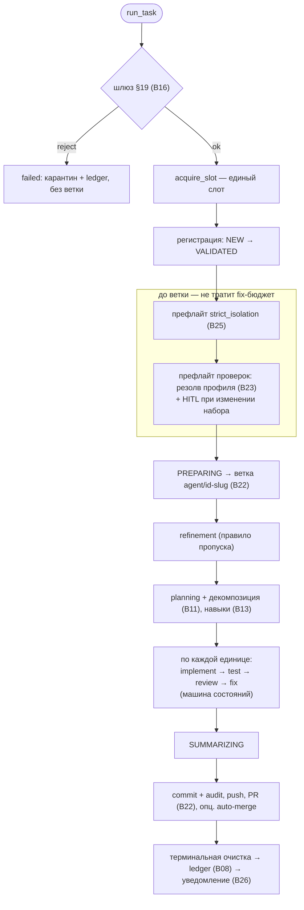

# B06 — Конвейер оркестратора

## Назначение

Детерминированный «спинной мозг» системы: проводит **одну задачу за раз** через весь конвейер — от
шлюза валидации до публикации в Git и терминальной очистки — и владеет всеми переходами состояний.
Ядро **никогда** не строит команду CLI: оно вызывает только Router (агентские стадии), Check Runner
(стадия `testing`) и Git Manager (всё, что касается git). Контекст агентам передаётся **только путями
к файлам-артефактам**.

## Ответственность

- Прогнать задачу: шлюз → слот → префлайт изоляции/проверок → ветка → refinement (правило пропуска)
  → planning (+декомпозиция, навыки) → по каждой единице `implementation → testing → review → fixing`
  → summary → публикация → терминальная очистка → ledger ([orchestrator.py:350-381,820-1047](../../../src/wastech_orchestrator/core/orchestrator.py#L820)).
- Атомарно выполнять и персистить каждый переход статуса ([orchestrator.py:2434-2450](../../../src/wastech_orchestrator/core/orchestrator.py#L2434)).
- Оркестрировать HITL round-trip и guardrail «опасного» диффа ([orchestrator.py:1790-2044](../../../src/wastech_orchestrator/core/orchestrator.py#L1790)).
- Операторские потоки: `resume`, `rerun`/`continue`, `finalize` ([orchestrator.py:400-644](../../../src/wastech_orchestrator/core/orchestrator.py#L400)).
- Связать весь граф зависимостей (`build_orchestrator`/`build_providers`) ([orchestrator.py:2564-2651](../../../src/wastech_orchestrator/core/orchestrator.py#L2564)).

## Границы блока

### Входит в ответственность блока

- Последовательность стадий, ветвления (skip/декомпозиция/fixing), все переходы статусов, оркестрация
  HITL/guardrail, терминальная обработка, операторские `resume`/`rerun`/`finalize`, сборка зависимостей.

### Не входит в ответственность блока

- **Построение/запуск CLI агента** — это [B17 Router](./B17-agent-router-and-fallback.md)/[B18](./B18-agent-providers.md); ядро вызывает только `router.run_stage`.
- **Запуск проверок** — [B24](./B24-check-execution.md); **git/gh** — [B22](./B22-git-manager.md).
- **Правила** компонентов: допустимость переходов — [B07](./B07-state-machine-and-store.md); лимиты циклов — [B09](./B09-fix-loop-control.md); решение восстановления — [B10](./B10-recovery-and-resume.md); приём декомпозиции — [B11](./B11-task-decomposition.md); валидация HITL-вывода — [B12](./B12-hitl-and-typed-output.md); навыки — [B13](./B13-skill-selection.md); классификация опасного диффа — [B14](./B14-dangerous-diff-guardrail.md); промпты — [B15](./B15-prompt-templates.md); шлюз §19 — [B16](./B16-task-parsing-and-validation-gate.md).
- **Диспетчеризация CLI и цикл watch** — [B01](./B01-cli-and-operator-commands.md)/[B02](./B02-watch-daemon-and-scheduling.md).

## Точки входа

- `run_task(task_file)` ([orchestrator.py:350](../../../src/wastech_orchestrator/core/orchestrator.py#L350)) — [B01 run](./B01-cli-and-operator-commands.md)/[B02 watch](./B02-watch-daemon-and-scheduling.md).
- `resume()` ([orchestrator.py:655](../../../src/wastech_orchestrator/core/orchestrator.py#L655)) и `refresh_repo()`/`acquire_slot()` — [B02](./B02-watch-daemon-and-scheduling.md).
- `plan_rerun`/`rerun_task`/`continue_task` ([orchestrator.py:400-520](../../../src/wastech_orchestrator/core/orchestrator.py#L400)); `plan_finalize`/`finalize_task` ([orchestrator.py:524-644](../../../src/wastech_orchestrator/core/orchestrator.py#L524)) — [B01 rerun/finalize](./B01-cli-and-operator-commands.md).
- `build_orchestrator`/`build_providers` ([orchestrator.py:2564,2594](../../../src/wastech_orchestrator/core/orchestrator.py#L2564)) — [B01](./B01-cli-and-operator-commands.md).

## Входные данные и состояние

Путь к файлу задачи или `task_id`; `OrchestratorConfig`; инъектированные зависимости (router, git,
checks, store, ledger, loops, gate, notifier, resolver, skill_scanner). Рабочее состояние одной задачи
— в мутируемом `_Pipeline` ([orchestrator.py:264-291](../../../src/wastech_orchestrator/core/orchestrator.py#L264)); персистентное — в [B07](./B07-state-machine-and-store.md).

## Основной сценарий (`run_task`)

1. `read_task_source` + `gate.validate` ([B16](./B16-task-parsing-and-validation-gate.md)); reject →
   `_reject` (карантин + ledger, **без ветки**).
2. `acquire_slot` (иначе `SlotBusyError`); `_register_task` (NEW→VALIDATED, пишет нормализованный
   манифест + отчёт валидации).
3. `_drive`: префлайт `strict_isolation` ([B25](./B25-security-policy.md), при провале → `PipelineFailed`
   до ветки) → `_check_preflight` (резолв запускаемого профиля проверок до ветки; шлюз изменённого
   набора через HITL; не-ready → `PipelineFailed`) → PREPARING → `_prepare_branch` (footprint-префлайт
   + excludes + ветка) → `_refinement` (пропуск, если `refined`/complete) → `_planning` (+декомпозиция,
   навыки) → `_run_units_and_finish`.
4. По каждой единице (`_run_unit`): **IMPLEMENTING** (правка + guardrail опасного диффа) →
   **TESTING** (проверки: pass→review; launch-сбой→повторный резолв один раз или провал; качественный
   провал→`_enter_fixing`) → **REVIEWING** (пропуск или ревью; блокирующие находки→fixing; иначе
   коммит сабтаска/переход или SUMMARIZING) → **FIXING** (правка + guardrail → обратно к testing/review).
5. `_summary` (агент / stub / минимальный) → `_publish` (финализация артефактов, `commit_code` +
   `commit_audit`, `push`, `create_pr`, опц. auto-merge) → `_go_terminal` (очистка, статус, перенос
   файла, ledger, уведомление).

Главный путь `run_task` → `_drive`. Ключевая деталь: префлайты изоляции и проверок выполняются **до**
создания ветки и не тратят fix-бюджет. Операторские пути (`resume`/`rerun`/`finalize`) — в разделе ниже.

## Альтернативные сценарии

### Возобновление (`resume`)

`RecoveryReconciler` ([B10](./B10-recovery-and-resume.md)) → `_resume_task` (восстановить контекст и
продолжить с записанной стадии), `_resume_cleanup` (дозавершить очистку), `_resume_manual` (пометить
неоднозначные задачи `manual_action_required`) ([orchestrator.py:655-795](../../../src/wastech_orchestrator/core/orchestrator.py#L655)).

### Rerun / Continue

`rerun_task`: архивировать артефакты, сбросить ветку к base, очистить per-attempt состояние, прогнать
`run_task`. `continue_task`: оживить задачу на прерванной стадии (сброс незавершённого HITL) и `resume`
([orchestrator.py:471-520](../../../src/wastech_orchestrator/core/orchestrator.py#L471)).

### Finalize

`finalize_task`: терминальная очистка, выставить заявленный статус **вне** машины состояний, перенести
файл, дописать `manual`-запись в ledger, опц. удалить ветку — **без** конвейера и без commit/push/PR
([orchestrator.py:583-644](../../../src/wastech_orchestrator/core/orchestrator.py#L583)).

### Пропуск стадий

`planning`/`testing`/`review`/`fixing`/`summary` могут быть пропущены (union глобального и
per-task `effective_skip`): пишется stub/`record_skip`, переходы корректируются (например, fix после
ревью при пропущенном testing возвращается к review) ([orchestrator.py:231-239,1068-1088,2249-2251](../../../src/wastech_orchestrator/core/orchestrator.py#L231)).

### Auto-merge (DANGER)

При `review` skip + auto_merge — предупреждение; при auto_merge — `merge_pr`; заблокированный merge →
`ManualActionRequired`, PR остаётся открытым ([orchestrator.py:1371-1419](../../../src/wastech_orchestrator/core/orchestrator.py#L1371)).

## Проверки и ограничения

- Каждый переход проходит `assert_transition` ([B07](./B07-state-machine-and-store.md)) в транзакции
  ([orchestrator.py:2434-2445](../../../src/wastech_orchestrator/core/orchestrator.py#L2434)).
- Единый слот (`acquire_slot` через `find_active_tasks`) ([orchestrator.py:383-385](../../../src/wastech_orchestrator/core/orchestrator.py#L383)).
- Префлайт изоляции и префлайт проверок выполняются **до** создания ветки и не тратят fix-бюджет.
- Лимиты fix-циклов ([B09](./B09-fix-loop-control.md)); застревание → `manual_action_required` + отчёт о провале.
- Блокирующие находки ревью: `blocking`/`critical`/`high` ([orchestrator.py:137](../../../src/wastech_orchestrator/core/orchestrator.py#L137)).
- Повторный резолв проверок — только при launch-сбое и не более одного раза на задачу ([orchestrator.py:982-1015](../../../src/wastech_orchestrator/core/orchestrator.py#L982)).
- Сбой HITL (timeout/transport/невалидный ответ) → `ManualActionRequired` ([orchestrator.py:2060-2110](../../../src/wastech_orchestrator/core/orchestrator.py#L2060)).

## Результат

`PipelineResult(task_id, final_status, pr_url, validation_reason)`. Для оператора — итоговый статус и
URL PR; на каждом шаге — обновлённое персистентное состояние и артефакты.

## Побочные эффекты

Преимущественно через делегируемые блоки: переходы и записи в SQLite ([B07](./B07-state-machine-and-store.md)),
git/PR ([B22](./B22-git-manager.md)), артефакты запусков ([B20](./B20-artifact-layout.md)), записи
ledger и отчёты о провале ([B08](./B08-ledger-and-failure-reports.md)), Telegram-уведомления
([B26](./B26-notifications-telegram.md)), HITL-артефакты ([B12](./B12-hitl-and-typed-output.md)).
Напрямую: пишет `task.enriched.md`/`plan.md`/`fixing-context.json`/`review/*`/`summary.*`/секцию
пропусков; переносит файл задачи между lifecycle-папками; карантин при reject.

## Ошибки и граничные случаи

- Reject §19 → `failed` без ветки (карантин + ledger).
- `PipelineFailed`/`GitCommandError` → `_fail` (если есть ветка — best-effort публикация неудачной попытки).
- `ManualActionRequired` → `manual_action_required` (HITL-сбой, застревание, заблокированный auto-merge, неоднозначное восстановление).
- Небезопасная терминальная очистка при успехе → итог `manual_action_required` ([orchestrator.py:1608-1610](../../../src/wastech_orchestrator/core/orchestrator.py#L1608)).

## Связи

### Использует

- [B16](./B16-task-parsing-and-validation-gate.md), [B07](./B07-state-machine-and-store.md), [B17](./B17-agent-router-and-fallback.md), [B22](./B22-git-manager.md), [B24](./B24-check-execution.md), [B23](./B23-check-discovery.md), [B08](./B08-ledger-and-failure-reports.md), [B09](./B09-fix-loop-control.md), [B10](./B10-recovery-and-resume.md), [B11](./B11-task-decomposition.md), [B12](./B12-hitl-and-typed-output.md), [B13](./B13-skill-selection.md), [B14](./B14-dangerous-diff-guardrail.md), [B15](./B15-prompt-templates.md), [B26](./B26-notifications-telegram.md), [B27](./B27-observability.md), [B20](./B20-artifact-layout.md), [B21](./B21-secret-redaction.md), [B25](./B25-security-policy.md).

### Используется в

- [B01 — CLI](./B01-cli-and-operator-commands.md) — `run`/`status`-смежные команды, `rerun`, `finalize`.
- [B02 — Демон watch](./B02-watch-daemon-and-scheduling.md) — `resume`/`acquire_slot`/`run_task`/`refresh_repo`.

## Место в общей системе

Это узел, связывающий всё: каждый другой блок — это либо вход (валидация, конфиг), либо инструмент
(провайдеры, проверки, git), либо хранилище (состояние, ledger, артефакты), а конвейер координирует их
в строгом порядке, владея состоянием и инвариантами (единый слот, разделение ответственности, fallback
только для инфраструктуры, неослабляемая безопасность).

## Подтверждение в коде

- [orchestrator.py:350-385](../../../src/wastech_orchestrator/core/orchestrator.py#L350) — `run_task`/`acquire_slot`.
- [orchestrator.py:820-1047](../../../src/wastech_orchestrator/core/orchestrator.py#L820) — `_drive`, префлайты, ветка, refinement/planning, цикл единиц.
- [orchestrator.py:1196-1419](../../../src/wastech_orchestrator/core/orchestrator.py#L1196) — `_run_unit`, ревью, публикация, auto-merge.
- [orchestrator.py:1468-1641](../../../src/wastech_orchestrator/core/orchestrator.py#L1468) — fixing, отчёты о провале, терминальная обработка.
- [orchestrator.py:1719-1877](../../../src/wastech_orchestrator/core/orchestrator.py#L1719) — запуск стадии, HITL round-trip.
- [orchestrator.py:2434-2651](../../../src/wastech_orchestrator/core/orchestrator.py#L2434) — переходы и сборка зависимостей.
- Тесты: [test_orchestrator.py](../../../tests/core/test_orchestrator.py), [test_cli_pipeline.py](../../../tests/core/test_cli_pipeline.py), [test_cli_rerun.py](../../../tests/core/test_cli_rerun.py), [test_cli_finalize.py](../../../tests/core/test_cli_finalize.py), [test_recovery.py](../../../tests/core/test_recovery.py), [test_check_discovery_hitl.py](../../../tests/core/test_check_discovery_hitl.py).
