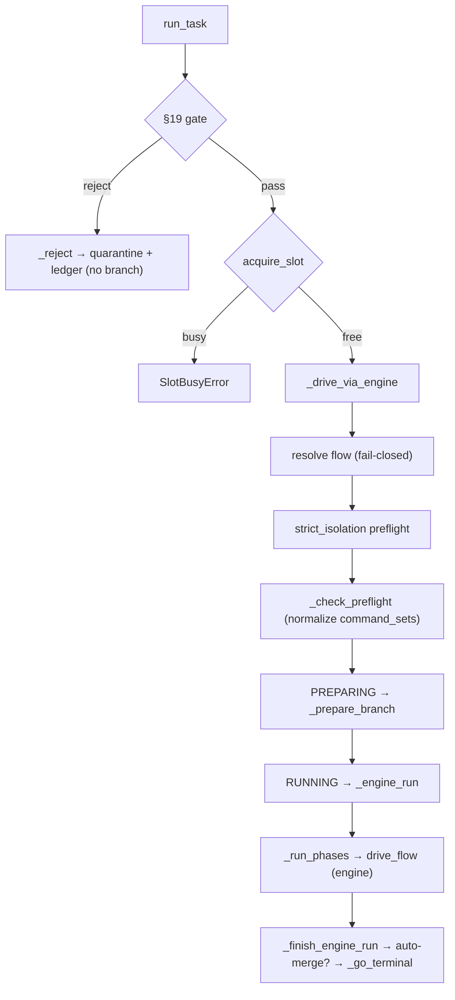

# B06 — Orchestrator Pipeline

> Reconstructed from code (`src/wastech_orchestrator/core/orchestrator.py`) and tests (`tests/core/test_orchestrator.py`, `tests/e2e/`). The code is the only source of truth; this document was rebuilt from the implementation, not from prose or comments. Significant claims carry a `file:line` reference.

**Status:** documented · **Source module:** `core/orchestrator.py`

## Responsibility

The orchestrator is the single-slot pipeline spine, but it is **no longer** a hardcoded stage loop — it is a thin wrapper around the [flow engine](B28-flow-engine.md). It owns everything the engine and node runners must not: the validation gate, slot acquisition, the orchestrator-owned preamble (flow resolution, isolation/check preflight, branch prep), the engine wiring (`NodeServices`/`NodeInputs`, the fact resolver, the post-node hook, the supervisor), phase driving for decomposed tasks, terminal handling (cleanup, ledger, auto-merge), and the operator commands `rerun` / `finalize` / `resume`. **The core never builds a CLI command** — it calls only the Router (agent nodes), the Check Runner (checks nodes), and the Git Manager (publish), and hands context to agents **only as artifact file paths**.

## Public surface

- `Orchestrator` ([orchestrator.py:281](../../../src/wastech_orchestrator/core/orchestrator.py#L281)) — one instance drives one task at a time.
- `run_task(task_file)` ([orchestrator.py:342](../../../src/wastech_orchestrator/core/orchestrator.py#L342)) — process one task end to end.
- `acquire_slot(task_id)` ([orchestrator.py:377](../../../src/wastech_orchestrator/core/orchestrator.py#L377)) — the single-slot guard (§8.2).
- `resume()` ([orchestrator.py:643](../../../src/wastech_orchestrator/core/orchestrator.py#L643)) — reconcile and resume the one unfinished task on startup.
- `plan_rerun` / `rerun_task` / `continue_task` ([orchestrator.py:383-508](../../../src/wastech_orchestrator/core/orchestrator.py#L383)) — operator re-attempt (fresh or `--continue`).
- `plan_finalize` / `finalize_task` ([orchestrator.py:512-632](../../../src/wastech_orchestrator/core/orchestrator.py#L512)) — operator records an out-of-band outcome.
- `refresh_repo()` ([orchestrator.py:634](../../../src/wastech_orchestrator/core/orchestrator.py#L634)) — between-tick base-branch fetch/pull for `watch`.
- `build_orchestrator(config, ...)` ([orchestrator.py:1974](../../../src/wastech_orchestrator/core/orchestrator.py#L1974)) and `build_providers` ([orchestrator.py:1944](../../../src/wastech_orchestrator/core/orchestrator.py#L1944)) — the dependency-injection assembly.
- `PipelineResult` ([orchestrator.py:229](../../../src/wastech_orchestrator/core/orchestrator.py#L229)), `_Pipeline` ([orchestrator.py:251](../../../src/wastech_orchestrator/core/orchestrator.py#L251)) (the mutable per-run context), `SlotBusyError` / `PipelineFailed` ([orchestrator.py:239-248](../../../src/wastech_orchestrator/core/orchestrator.py#L239)).

## Behavior

### `run_task` → drive via the engine

`run_task` ([orchestrator.py:342](../../../src/wastech_orchestrator/core/orchestrator.py#L342)) validates the source through the gate ([B16](B16-task-parsing-and-validation-gate.md)); a reject quarantines and ledgers without a branch (`_reject`, [orchestrator.py:1678](../../../src/wastech_orchestrator/core/orchestrator.py#L1678)). On pass it acquires the slot (else `SlotBusyError`), registers the task, builds the `_Pipeline`, and calls `_drive_via_engine` ([orchestrator.py:839](../../../src/wastech_orchestrator/core/orchestrator.py#L839)):

`_drive_via_engine` ([orchestrator.py:1114](../../../src/wastech_orchestrator/core/orchestrator.py#L1114)) resolves the flow up front so an unknown/invalid `task_type` fails before any side effect (`_resolve_flow`, [orchestrator.py:1095](../../../src/wastech_orchestrator/core/orchestrator.py#L1095)), runs the strict-isolation preflight ([orchestrator.py:1129](../../../src/wastech_orchestrator/core/orchestrator.py#L1129)), normalizes the operator's check command sets onto the pipeline (`_check_preflight` → `CheckResolver.resolve()`, trivial now — no discovery/readiness/approval; [orchestrator.py:1538](../../../src/wastech_orchestrator/core/orchestrator.py#L1538)), then transitions `PREPARING` → prepares the branch → `RUNNING` → `_engine_run`.

### Engine wiring (`_engine_run`)

`_engine_run` ([orchestrator.py:1143](../../../src/wastech_orchestrator/core/orchestrator.py#L1143)) builds the data bundles and collaborators the node runners need ([B30](B30-flow-node-runners.md), via `build_node_inputs`/`build_node_services`) — `build_node_inputs` carries the normalized `check_sets` (`_check_sets(p)`; `()` = no gate, [orchestrator.py:1163](../../../src/wastech_orchestrator/core/orchestrator.py#L1163)) — constructs the per-task `Supervisor` ([B31](B31-supervisor.md), `_build_supervisor`, [orchestrator.py:1334](../../../src/wastech_orchestrator/core/orchestrator.py#L1334)), then resolves the per-node skill selection before any node runs (`_resolve_skill_layers`, [orchestrator.py:1559](../../../src/wastech_orchestrator/core/orchestrator.py#L1559)): it discovers the whole-repo inventory (`git ls-files`), applies operator pins (subject to `skills.strict`) plus the supervisor's once-per-task `node → skills` proposal, persists the effective map to `skill_map.json`, and threads it into `NodeInputs.skill_paths_by_node` ([B13](B13-skill-selection.md)). On resume the persisted map is restored without re-proposing. `build_node_services` also receives `max_turns_gate=self._max_turns_gate_enabled()` ([orchestrator.py](../../../src/wastech_orchestrator/core/orchestrator.py)) — resolved once from the claude provider block (`agents.providers.claude.max_turns_gate`; `False` in a codex-only setup), threading the Claude max-turns continue/stop gate down to the agent node runner ([B30](B30-flow-node-runners.md)). (The orchestrator also exposes a read-only `notifier` property for the CLI watch loop's next-task gate — [B02](B02-watch-daemon-and-scheduling.md).) It then wires three orchestrator-owned hooks and drives the phases:

- **finalize hook** (`_engine_finalize`, [orchestrator.py:1352](../../../src/wastech_orchestrator/core/orchestrator.py#L1352)) — the publish node calls it to write the supervisor summary, move the task file, and write the committed `<id>.summary.md` (the PR body) before the audit commit.
- **fact resolver** (`_engine_facts`, [orchestrator.py:1366](../../../src/wastech_orchestrator/core/orchestrator.py#L1366)) — resolves `derived.needs_refinement` (purely from the gate's completeness classification — never a task flag), `config.external_research` (true iff the flow grants network), and `config.<stage>_enabled` (a per-task `stages.<stage>.enabled: false` removes the node by skipping it). An unknown fact defaults off; an unknown `*_enabled` stage does not skip.
- **post-node hook** (`_engine_post_node`, [orchestrator.py:1563](../../../src/wastech_orchestrator/core/orchestrator.py#L1563)) — after each executed node: the supervisor observes the step (read-only, except the terminal publish node); when `telegram.trace` is on, a best-effort live step-trace (`<emoji> <node-id> → <outcome>`, node id + outcome only) is pushed via the notifier ([B26](B26-notifications-telegram.md)) — fire-and-forget, never raised; an `output_artifact` slot is persisted; for the decomposition `proposed_by` node the decomposition is decided and materialized. (Skill selection no longer runs here — it is resolved once at task start in `_resolve_skill_layers`, above.)

(The former launch-failure check-reresolve hook was removed with the checks-monorepo change: a check launch failure now goes straight to manual, never a re-resolve.)

`_engine_run` catches `NodeManualRequired` → `manual_action_required`, `EvaluatorInfraError` (an evaluator that could not run) → `manual_action_required` (branch + green diff preserved for the operator, not discarded), and the plain `NodeInfraError` (an agent node with no usable result) → either a **B-lite soft pause** when its `error_class` is transient (`provider_unavailable` / `network_unavailable` — every allowed provider exhausted: `_park` stamps `tasks.blocked_since` and returns a non-terminal `RUNNING` result so the next `resume` continues it) or terminal `failed` for any other class. It syncs the engine's authoritative loop counters back into the operator-facing `tasks` columns before any terminal transition (`_sync_counters_from_run_state`, [orchestrator.py:929](../../../src/wastech_orchestrator/core/orchestrator.py#L929)). The B-lite ceiling (`agents.retry.max_blocked_s`) is enforced on the resume side in `_resume_via_engine` ([B10](B10-recovery-and-resume.md)).

### Phase driving and decomposition

`_run_phases` ([orchestrator.py:945](../../../src/wastech_orchestrator/core/orchestrator.py#L945)) runs a flow with no decomposition in one pass; a decomposed flow runs the `pre` region once (entry…`proposed_by`), the `sub_flow` region once per subtask with a commit between (`_fan_out_subtasks`, [orchestrator.py:1009](../../../src/wastech_orchestrator/core/orchestrator.py#L1009)), then `post` once. A subtask with a verified commit is never re-run; per-loop counters reset between subtasks while the global fix counter accumulates (the shared budget). Each phase seeds `current_node` before its entry node runs so resume is crash-safe.

### Resume, rerun, finalize

- `resume()` ([orchestrator.py:643](../../../src/wastech_orchestrator/core/orchestrator.py#L643)) delegates to the `RecoveryReconciler` ([B10](B10-recovery-and-resume.md)) → `NONE` (free slot), `MANUAL` (ambiguous → mark `manual_action_required`), `CLEANUP` (finish interrupted cleanup), or resume the one active task. `_resume_via_engine` ([orchestrator.py:749](../../../src/wastech_orchestrator/core/orchestrator.py#L749)) hydrates the `FlowRunState` from the checkpoint and continues from `current_node`; a missing checkpoint or a fingerprint mismatch restarts from the top via the full driver.
- `rerun_task` ([orchestrator.py:457](../../../src/wastech_orchestrator/core/orchestrator.py#L457)) archives prior artifacts, resets the branch to base, clears per-attempt state, and re-runs from scratch; `continue_task` ([orchestrator.py:479](../../../src/wastech_orchestrator/core/orchestrator.py#L479)) revives the terminal task and resumes at the flow checkpoint. `plan_rerun` / `plan_finalize` are read-only fact-gatherers for the dry-run views. `plan_rerun` resolves the task source file tolerant of lifecycle-folder desync: if the stored `source_path` is missing it searches `tasks/{pending,processing,done,failed}/` for the task by id (then slug) via `_resolve_task_source`, so a file manually moved between lifecycle folders still reruns; more than one match refuses with an ambiguity message rather than guessing.
- `finalize_task` ([orchestrator.py:571](../../../src/wastech_orchestrator/core/orchestrator.py#L571)) records an out-of-band outcome: terminal cleanup (fail-closed if unsafe), set the declared status (operator override, no `assert_transition`), relocate the file, append a `manual` ledger record — no pipeline, no commit/push/PR.

### Terminal handling

`_finish_engine_run` ([orchestrator.py:1517](../../../src/wastech_orchestrator/core/orchestrator.py#L1517)) maps the `FlowRunResult` to a `PipelineResult`: `DONE` with a recorded PR URL and auto-merge on → `_auto_merge` ([orchestrator.py:1609](../../../src/wastech_orchestrator/core/orchestrator.py#L1609), DANGER: bypasses review; a blocked merge → `manual_action_required`, never force/`--admin`), else `_go_terminal`. **Skip-gate:** auto-merge is blocked when `store.task_had_skipped_checks(task_id)` is true — a check skipped (toolchain absent) means the quality gate did not fully run, so the open PR is left for a human instead ([orchestrator.py:1521-1529](../../../src/wastech_orchestrator/core/orchestrator.py#L1521), [B07](B07-state-machine-and-store.md)/[B24](B24-check-execution.md)). `_go_terminal` ([orchestrator.py:1713](../../../src/wastech_orchestrator/core/orchestrator.py#L1713)) runs terminal cleanup, clears the flow checkpoint on `DONE` (keeps it on a non-success terminal for `rerun --continue`), transitions, moves the task file, appends exactly one ledger record, and sends the best-effort terminal notification. `_fail` ([orchestrator.py:1689](../../../src/wastech_orchestrator/core/orchestrator.py#L1689)) always writes a `failure_report.json` + `stuck.md` (so no infra terminal is silent — `_write_infra_failure_report`, `loop="infra"`, via [B08](B08-ledger-and-failure-reports.md)) and, when a branch exists, publishes the attempt (commit code + audit, push, no PR). It takes a terminal `status`: the default `failed`, or `manual_action_required` for an evaluator that could not run — preserving the green diff on the branch for the operator rather than discarding it.

### Dependency injection

`build_orchestrator` ([orchestrator.py:2105](../../../src/wastech_orchestrator/core/orchestrator.py#L2105)) wires the full graph from a validated config: the provider adapters ([B18](B18-agent-providers.md)), `AgentRouter` ([B17](B17-agent-router-and-fallback.md)), `StateStore` at `<artifacts_root>/state.db` ([B07](B07-state-machine-and-store.md)), `Ledger` ([B08](B08-ledger-and-failure-reports.md)), `GitManager` ([B22](B22-git-manager.md)), `CheckRunner` ([B24](B24-check-execution.md)), `CheckResolver` (just normalizes `checks.command_sets`, no discovery; [B23](B23-check-discovery.md)), `ValidationGate` ([B16](B16-task-parsing-and-validation-gate.md)), and the notifier ([B26](B26-notifications-telegram.md)). The `FlowRegistry` ([B29](B29-flow-definition-and-validation.md)) is constructed in `__init__` with the operator flows dir (`<repo>/.worc/flows/`) and the config (turning on the config-aware validation layer).

## Invariants & guarantees

- **The engine is the sole driver** — `run_task` and `resume` both go through `drive_flow`; there is no parallel hardcoded loop ([orchestrator.py:366-369](../../../src/wastech_orchestrator/core/orchestrator.py#L366)).
- **Core builds no CLI** — only the Router/Check Runner/Git Manager touch external processes; context to agents is paths only.
- **One slot** — `acquire_slot` refuses a second active task; the state machine ([B07](B07-state-machine-and-store.md)) `ACTIVE` set defines "owns the slot".
- **One ledger record per terminal** — appended in `_go_terminal` / `_fail` / `_reject` / finalize, never twice.
- **Resume is idempotent** — checkpoint + `publish_operations` dedup means a resumed run never repeats a commit/push/PR.

## Dependencies

- **Drives:** [B28](B28-flow-engine.md)/[B30](B30-flow-node-runners.md) (engine + runners), [B31](B31-supervisor.md) (supervisor). **Calls:** [B16](B16-task-parsing-and-validation-gate.md), [B07](B07-state-machine-and-store.md), [B08](B08-ledger-and-failure-reports.md), [B09](B09-fix-loop-control.md), [B10](B10-recovery-and-resume.md), [B11](B11-task-decomposition.md), [B12](B12-hitl-and-typed-output.md), [B13](B13-skill-selection.md), [B17](B17-agent-router-and-fallback.md), [B22](B22-git-manager.md), [B23](B23-check-discovery.md)/[B24](B24-check-execution.md), [B26](B26-notifications-telegram.md). Normalizes the command sets via [B23](B23-check-discovery.md) at preflight; consults [B07](B07-state-machine-and-store.md) `task_had_skipped_checks` to gate auto-merge.
- **Used by:** [B01](B01-cli-and-operator-commands.md) (CLI dispatch), [B02](B02-watch-daemon-and-scheduling.md) (watch loop).

## Tests

- `tests/core/test_orchestrator.py`, `tests/core/test_hitl.py`, `tests/e2e/` — gate→slot→engine flow, decomposition fan-out, resume/rerun/continue, auto-merge guardrail (including the skipped-check skip-gate), terminal cleanup.
