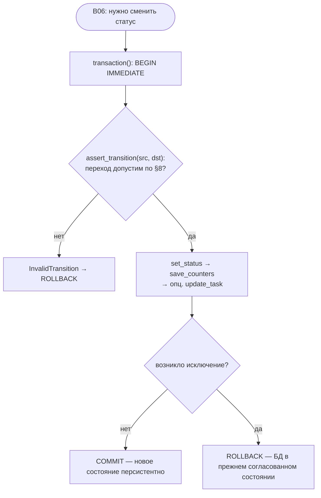

# B07 — Машина состояний и State Store

## Назначение

Определяет словарь статусов задачи и допустимые переходы между ними, и персистит всё состояние
конвейера в одной SQLite-БД (`state.db`). Это «спинной мозг» состояния: единственный слот обработки,
транзакционные переходы (устойчивые к падению) и идемпотентные записи, благодаря которым прерванную
задачу можно возобновить.

## Ответственность

- **Машина состояний** (чистая, без IO): перечислить статусы (§8), задать допустимые переходы,
  проверять/утверждать переход ([state_machine.py:15-143](../../../src/wastech_orchestrator/core/state_machine.py#L15)).
- **State Store**: создать/мигрировать БД и применить схему ([state_store.py:328-340](../../../src/wastech_orchestrator/state_store.py#L328)); хранить 7 сущностей: `tasks`, `stage_runs`, `provider_attempts`, `check_runs`, `artifacts`, `publish_operations`, `subtasks` ([state_store.py:83-196](../../../src/wastech_orchestrator/state_store.py#L83)).
- Дать транзакции `BEGIN IMMEDIATE`…`COMMIT`/`ROLLBACK` ([state_store.py:359-368](../../../src/wastech_orchestrator/state_store.py#L359)).
- Отвечать на вопрос «кто владеет слотом» ([state_store.py:455-460](../../../src/wastech_orchestrator/state_store.py#L455)).
- Версионировать схему БД и отказывать более новой ([state_store.py:63-81](../../../src/wastech_orchestrator/state_store.py#L63)).

## Границы блока

### Входит в ответственность блока

- Словарь статусов и таблица переходов (политика).
- Персист и чтение всех 7 сущностей; счётчики циклов; идемпотентные upsert-ы.
- Запрос активных задач (слот) и задач с незавершённой очисткой (recovery).
- Транзакции, миграция и версионирование схемы, режим read-only.

### Не входит в ответственность блока

- **Решение, какой переход делать** — это [B06 Конвейер](./B06-orchestrator-pipeline.md): он вызывает
  `assert_transition` затем `set_status` внутри транзакции ([orchestrator.py:2434-2445](../../../src/wastech_orchestrator/core/orchestrator.py#L2434)). Сам стор переход не выбирает; `set_status` пишет любой статус.
- **Редактирование секретов**: стор пишет ровно то, что дано; ответственность «не передавать секрет в
  поле» лежит на вызывающих ([state_store.py:8-11](../../../src/wastech_orchestrator/state_store.py#L8)).
- **Журнал терминальных исходов** — это отдельный блок [B08 Ledger](./B08-ledger-and-failure-reports.md).
- **Сами git-операции** — это [B22](./B22-git-manager.md); стор лишь хранит строки идемпотентности
  публикации (`publish_operations`).

## Точки входа

Машина состояний: `Status`, `ALLOWED_TRANSITIONS`, `can_transition`, `assert_transition`,
`is_terminal`, `is_active`, `InvalidTransition` ([state_machine.py](../../../src/wastech_orchestrator/core/state_machine.py)).

State Store ([state_store.py](../../../src/wastech_orchestrator/state_store.py)):
- `StateStore.open(db_path)` / `open_readonly(db_path)` ([:328,:342](../../../src/wastech_orchestrator/state_store.py#L328)).
- `transaction()` ([:359](../../../src/wastech_orchestrator/state_store.py#L359)).
- Задачи: `insert_task`, `get_task`, `latest_task`, `task_id_exists`, `find_active_tasks`, `find_incomplete_cleanup`, `update_task`, `set_status`, `reset_task_for_rerun`, `revive_task_for_continue`.
- Счётчики: `get_counters`, `save_counters`.
- Записи: `record_stage_run`, `record_skip`, `complete_stage_run`, `record_provider_attempt`, `record_check_run`, `latest_failed_check_log`, `register_artifact`.
- Идемпотентность публикации: `record_publish_op`, `get_publish_op`, `clear_publish_operations`.
- Сабтаски: `insert_subtasks`, `get_subtasks`, `set_subtask_commit`.

## Входные данные и состояние

Путь к `state.db`; строки-дата-классы (`TaskRow`, `StageRunRow`, …). Внутреннее состояние —
единственное соединение SQLite (WAL, `foreign_keys=ON`, ручное управление транзакциями).

## Основной сценарий (переход статуса задачи)

1. [B06](./B06-orchestrator-pipeline.md) открывает транзакцию `transaction()` (`BEGIN IMMEDIATE`).
2. Внутри: `assert_transition(src, dst)` (политика машины состояний) → `set_status(task_id, dst)` →
   `save_counters(...)` → опц. `update_task(...)`.
3. На успехе `COMMIT`, на исключении `ROLLBACK` — БД остаётся в согласованном прежнем состоянии.

Каждый переход статуса — внутри одной транзакции: сначала проверка по §8, затем запись; на исключении —
полный откат:

## Альтернативные сценарии

### Внеплановые (operator-driven) статусы

`finalize` и `recovery` выставляют терминальный статус напрямую через `set_status`/`update_task`
**без** `assert_transition` (намеренная out-of-band смена) — например `revive_task_for_continue`
делает terminal→active для `rerun --continue` ([state_store.py:533-554](../../../src/wastech_orchestrator/state_store.py#L533)).

### Сброс/оживление при rerun

`reset_task_for_rerun` чистит всё per-attempt состояние, обнуляет ветку и удаляет `subtasks` +
`publish_operations`, оставляя статус терминальным (чтобы повторный upsert в `insert_task` перевёл в
`new`) ([state_store.py:491-531](../../../src/wastech_orchestrator/state_store.py#L491)).

### Read-only режим

`open_readonly` открывает файл `?mode=ro`, ставит `PRAGMA query_only=ON`, проверяет (не мигрируя)
версию; используется командой `status` ([state_store.py:342-352](../../../src/wastech_orchestrator/state_store.py#L342)).

## Проверки и ограничения

- **Допустимые переходы** (§8): «счастливый путь» + у каждого нетерминального статуса добавлены
  универсальные рёбра `-> failed` и `-> manual_action_required`; терминальные статусы исходящих рёбер
  не имеют ([state_machine.py:70-113](../../../src/wastech_orchestrator/core/state_machine.py#L70)).
- **Единый слот**: активны все статусы, кроме `{NEW, PENDING, DONE, FAILED, MANUAL_ACTION_REQUIRED}`
  ([state_store.py:455-460,872-875](../../../src/wastech_orchestrator/state_store.py#L455)). Это
  логический слот (запрос к БД), а не блокировка СУБД.
- **Версия схемы БД** = 3; более новая → `IncompatibleStateError` (на обоих путях открытия); старая
  мигрируется in-place идемпотентным `ALTER TABLE ADD COLUMN` и переклеймляется
  ([state_store.py:40-81](../../../src/wastech_orchestrator/state_store.py#L40)).
- **Идемпотентность**: `insert_task`/`register_artifact`/`record_publish_op`/`insert_subtasks` —
  upsert по уникальному ключу; `insert_subtasks` не «оживляет» уже закоммиченные сабтаски
  (`WHERE subtasks.commit_sha IS NULL`) ([state_store.py:818-837](../../../src/wastech_orchestrator/state_store.py#L818)).
- **Никаких секретов** в схеме (только id, статусы, классы ошибок, пути, sha256, счётчики, отпечатки,
  SHA коммитов) ([state_store.py:8-11](../../../src/wastech_orchestrator/state_store.py#L8)).

## Результат

Персистентные строки в `state.db`; `TaskRow`/`SubtaskRow`/… при чтении; `run_id` при резервировании
стадии; `LoopCounters` при чтении счётчиков; список активных/незавершённых задач.

## Побочные эффекты

- Создание файла `state.db` (+ WAL/SHM) и запись в него.
- Транзакционные мутации (commit/rollback).
- В read-only режиме запись запрещена на уровне SQLite (`query_only`).

## Ошибки и граничные случаи

- Более новая версия схемы → `IncompatibleStateError` (ловится в CLI → выход 2).
- `complete_stage_run`/`get_counters` на несуществующий id → `KeyError`.
- FK включены: запись `stage_run` без `tasks`-строки нарушит FK (подтверждено тестом).

## Связи

### Использует

- [B09](./B09-fix-loop-control.md) — тип `LoopCounters` (импортируется для счётчиков).
- [B07 машина состояний] — `Status` (внутри стора).

### Используется в

- [B06 — Конвейер](./B06-orchestrator-pipeline.md) — все переходы и записи; `acquire_slot` через `find_active_tasks`.
- [B22 — Git Manager](./B22-git-manager.md) — чтение/запись `publish_operations` (идемпотентность).
- [B10 — Восстановление](./B10-recovery-and-resume.md) — `find_active_tasks`/`find_incomplete_cleanup`.
- [B16 — Шлюз валидации](./B16-task-parsing-and-validation-gate.md) — `task_id_exists` (дедуп id).
- [B01 — CLI](./B01-cli-and-operator-commands.md) — `open_readonly` для команды `status`.

## Место в общей системе

Все решения конвейера материализуются как переходы статусов и строки в `state.db`. Транзакционность и
идемпотентность здесь — основа возобновляемости: после падения [B10](./B10-recovery-and-resume.md)
читает это состояние и решает, продолжать ли задачу.

## Подтверждение в коде

- [core/state_machine.py:15-143](../../../src/wastech_orchestrator/core/state_machine.py#L15) — статусы, таблица переходов, проверки.
- [state_store.py:83-196](../../../src/wastech_orchestrator/state_store.py#L83) — схема 7 таблиц.
- [state_store.py:328-352](../../../src/wastech_orchestrator/state_store.py#L328) — open/open_readonly, прагмы, версия.
- [state_store.py:455-471](../../../src/wastech_orchestrator/state_store.py#L455) — слот и незавершённая очистка.
- Тесты: [test_state_machine.py](../../../tests/core/test_state_machine.py), [test_state_store.py](../../../tests/state/test_state_store.py), [test_db_schema_version.py](../../../tests/state/test_db_schema_version.py) — переходы, слот, транзакции (commit/rollback), upsert, отказ более новой версии, отсутствие секретных колонок.
