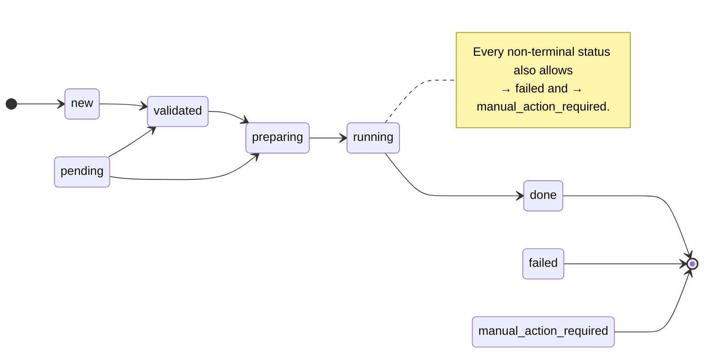

# B07 — State Machine and State Store

> Reconstructed from code (`src/wastech_orchestrator/core/state_machine.py`, `state_store.py`) and tests (`tests/test_state_store.py`, `tests/core/test_state_machine.py`). The code is the only source of truth; this document was rebuilt from the implementation, not from prose or comments. Significant claims carry a `file:line` reference.

**Status:** documented · **Source modules:** `core/state_machine.py`, `state_store.py`

## Responsibility

Two pieces: the **state machine** (a pure module: the canonical task statuses and the allowed transitions, with no IO) and the **state store** (the authoritative SQLite persistence — tasks, the flow-engine audit tables, idempotency, and durable sessions). Together they make the pipeline crash-safe: a transition is asserted in the pure module, then persisted in a transaction, so a crash leaves a consistent prior state a restart can reconcile.

## State machine

### Statuses and transitions

The lifecycle is **generic** — progress _within_ `running` (which flow node is executing) is the `current_node` in `node_runs`, not a status ([state_machine.py:7-10](../../../src/wastech_orchestrator/core/state_machine.py#L7)). `Status` ([state_machine.py:18](../../../src/wastech_orchestrator/core/state_machine.py#L18)) is `new`, `validated`, `preparing`, `running`, `done`, `failed`, `manual_action_required`, and the queue waiting-state `pending`.

The happy-path edges live in `_BASE_TRANSITIONS` ([state_machine.py:48](../../../src/wastech_orchestrator/core/state_machine.py#L48)); `_build_transitions` ([state_machine.py:61](../../../src/wastech_orchestrator/core/state_machine.py#L61)) adds the universal `→ failed` / `→ manual_action_required` bailout to every non-terminal status and gives terminal statuses no outgoing edges. `assert_transition` ([state_machine.py:93](../../../src/wastech_orchestrator/core/state_machine.py#L93)) raises `InvalidTransition` ([state_machine.py:79](../../../src/wastech_orchestrator/core/state_machine.py#L79)) for any edge not in `ALLOWED_TRANSITIONS`. `TERMINAL` ([state_machine.py:38](../../../src/wastech_orchestrator/core/state_machine.py#L38)) is `{done, failed, manual_action_required}`; `ACTIVE` ([state_machine.py:42](../../../src/wastech_orchestrator/core/state_machine.py#L42)) is `{validated, preparing, running}` — the statuses that own the processing slot (§8.2). Two transitions deliberately bypass `assert_transition` as out-of-band operator overrides: `finalize` (`set_status`) and `rerun --continue` (`revive_task_for_continue`).

## State store

### Schema version and the greenfield policy

`DB_SCHEMA_VERSION = 11` ([state_store.py:65](../../../src/wastech_orchestrator/state_store.py#L65)). `_enforce_schema_version` ([state_store.py:88](../../../src/wastech_orchestrator/state_store.py#L88)) refuses **fail-closed** any DB stamped newer than 11, **and** any older versioned DB (`1 ≤ v < 11`): the historical bumps were destructive (dropped/renamed tables/columns) and `_migrate` ([state_store.py:72](../../../src/wastech_orchestrator/state_store.py#L72)) only _adds_ the v4 checkpoint columns, so an old shape cannot be reshaped in place. Only a brand-new / pre-versioning (`0`) database is adopted at the current shape (greenfield — there is no production data to preserve). The version history (v4 `node_runs` + checkpoint columns; v5/v6 dropped `stage_runs`; v7 dropped `interrupted_status`; v8 `evaluations`; v9 `editing_lineage`; v10 `node_lineage`; v11 dropped the always-0 `tasks.stage_attempts` column) is documented in the module comment ([state_store.py:42-68](../../../src/wastech_orchestrator/state_store.py#L42)).

### Tables (`_SCHEMA`, [state_store.py:124](../../../src/wastech_orchestrator/state_store.py#L124))

| Table | Purpose / notable columns |
| --- | --- |
| `tasks` | one row per task; status, branch/slug, validation, counters, decomposition, cleanup, `finished_at`, and the **flow checkpoint** columns `current_node` / `flow_run_counters` / `flow_fingerprint` ([state_store.py:125-157](../../../src/wastech_orchestrator/state_store.py#L125)) |
| `node_runs` | per-node execution audit (`node_kind`, `outcome`, `route_*`, `provider_used`, `error_class`, `commit_sha_after` = result ref / PR URL, `skipped`/`skip_reason`) ([state_store.py:159](../../../src/wastech_orchestrator/state_store.py#L159)) |
| `provider_attempts` | per-attempt audit, `node_run_id` a plain monotonic id (FK dropped at v5) ([state_store.py:181](../../../src/wastech_orchestrator/state_store.py#L181)) |
| `check_runs` | one row per check command (`exit_code`, `timed_out`, `passed`, `log_path`) ([state_store.py:195](../../../src/wastech_orchestrator/state_store.py#L195)) |
| `artifacts` | sha256-checksummed artifact registry, `UNIQUE(task_id, kind, path)` (idempotent upsert) ([state_store.py:208](../../../src/wastech_orchestrator/state_store.py#L208)) |
| `publish_operations` | commit/push/PR idempotency, `UNIQUE(task_id, kind, subtask_order)` with `-1` the no-subtask sentinel ([state_store.py:218](../../../src/wastech_orchestrator/state_store.py#L218), [state_store.py:463-465](../../../src/wastech_orchestrator/state_store.py#L463)) |
| `subtasks` | the decomposition units (`order`, `slug`, `depends_on`, `commit_sha`) ([state_store.py:230](../../../src/wastech_orchestrator/state_store.py#L230)) |
| `evaluations` | **append-only** audit: `in_flow_verdict` (evaluators) + `supervisor_step` / `supervisor_final` (advisory); the per-instance rework limit is a `COUNT` of `rework` verdicts ([state_store.py:243](../../../src/wastech_orchestrator/state_store.py#L243)) |
| `editing_lineage` | the durable editing session per `(task_id, subtask_order)` — the **only** place a raw provider session id is stored ([state_store.py:255](../../../src/wastech_orchestrator/state_store.py#L255)) |
| `node_lineage` | the durable `resume_own_lineage` session per `(task_id, node_id, subtask_order)` — raw session id, never leaves `state.db` ([state_store.py:264](../../../src/wastech_orchestrator/state_store.py#L264)) |

### Transactions and access

`open()` ([state_store.py:477](../../../src/wastech_orchestrator/state_store.py#L477)) connects with `isolation_level=None` (manual transactions), WAL, and foreign keys on; `open_readonly()` ([state_store.py:491](../../../src/wastech_orchestrator/state_store.py#L491)) is the operator `status` path (no creation/mutation). Writes go through `transaction()` (`BEGIN IMMEDIATE` … `COMMIT`/`ROLLBACK`, [state_store.py:508](../../../src/wastech_orchestrator/state_store.py#L508)); `_writer` ([state_store.py:519](../../../src/wastech_orchestrator/state_store.py#L519)) lets callers reuse an open transaction so a multi-step state change is atomic. Idempotency helpers: `record_publish_op` / `get_publish_op` ([state_store.py:962](../../../src/wastech_orchestrator/state_store.py#L962)), `register_artifact` (upsert, [state_store.py:945](../../../src/wastech_orchestrator/state_store.py#L945)), `insert_subtasks` (refresh-if-uncommitted, [state_store.py:1009](../../../src/wastech_orchestrator/state_store.py#L1009)). The flow checkpoint is saved by `save_flow_checkpoint` ([state_store.py:844](../../../src/wastech_orchestrator/state_store.py#L844)) and read by `get_flow_checkpoint` ([state_store.py:869](../../../src/wastech_orchestrator/state_store.py#L869)); `find_active_tasks` ([state_store.py:603](../../../src/wastech_orchestrator/state_store.py#L603)) and `find_incomplete_cleanup` ([state_store.py:610](../../../src/wastech_orchestrator/state_store.py#L610)) back slot acquisition and recovery. `reset_task_for_rerun` ([state_store.py:639](../../../src/wastech_orchestrator/state_store.py#L639)) and `revive_task_for_continue` ([state_store.py:685](../../../src/wastech_orchestrator/state_store.py#L685)) implement the two `rerun` modes.

## Invariants & guarantees

- **No secrets in the DB** ([state_store.py:8-11](../../../src/wastech_orchestrator/state_store.py#L8)) — only ids, statuses, error classes, paths, checksums, counters, fingerprints, commit SHAs, and (the sole exception) raw session ids in the two lineage tables, which never leave `state.db`.
- **Transactional transitions** — `assert_transition` (pure) then a serialized write; a crash leaves a consistent prior state ([B10](B10-recovery-and-resume.md) reconciles).
- **Fail-closed on schema mismatch** — a newer or older-versioned DB is refused, never silently used.
- **Idempotent side-effect records** — `publish_operations` / `artifacts` upserts mean a resumed run never duplicates.

## Dependencies

- **Used by:** [B06](B06-orchestrator-pipeline.md) (read/write), [B28](B28-flow-engine.md) (the `RunRecorder` checkpoint via `recorder.py`), [B30](B30-flow-node-runners.md) (node_runs / evaluations / lineage), [B22](B22-git-manager.md) (publish idempotency), [B10](B10-recovery-and-resume.md) (recovery queries), [B01](B01-cli-and-operator-commands.md) (read-only `status`).
- **Uses:** [B09](B09-fix-loop-control.md) (`LoopCounters`).

## Audit candidates

- The module docstring ([state_store.py:1-12](../../../src/wastech_orchestrator/state_store.py#L1)) enumerates the entities as "tasks, node_runs, provider_attempts, check_runs, artifacts, publish_operations and subtasks" — it omits `evaluations` / `editing_lineage` / `node_lineage` (added v8/v9/v10). Minor stale comment. See [the audit](../../backlog/2026-06-21-audit.md).

## Tests

- `tests/test_state_store.py`, `tests/core/test_state_machine.py` — transition legality, schema-version fail-closed, transactional writes, idempotency upserts, checkpoint round-trip, lineage tables.
