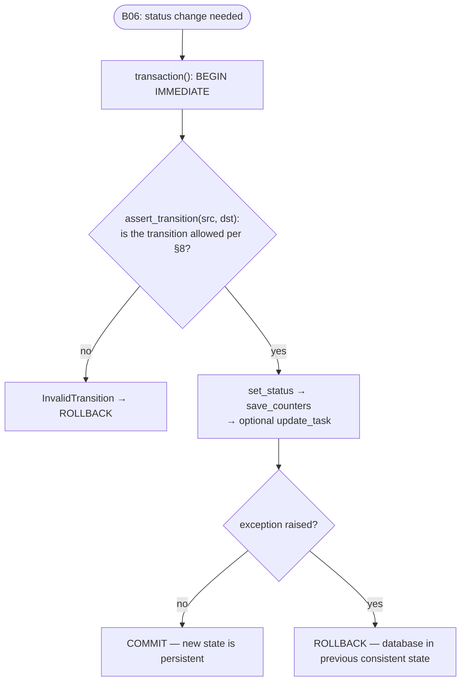
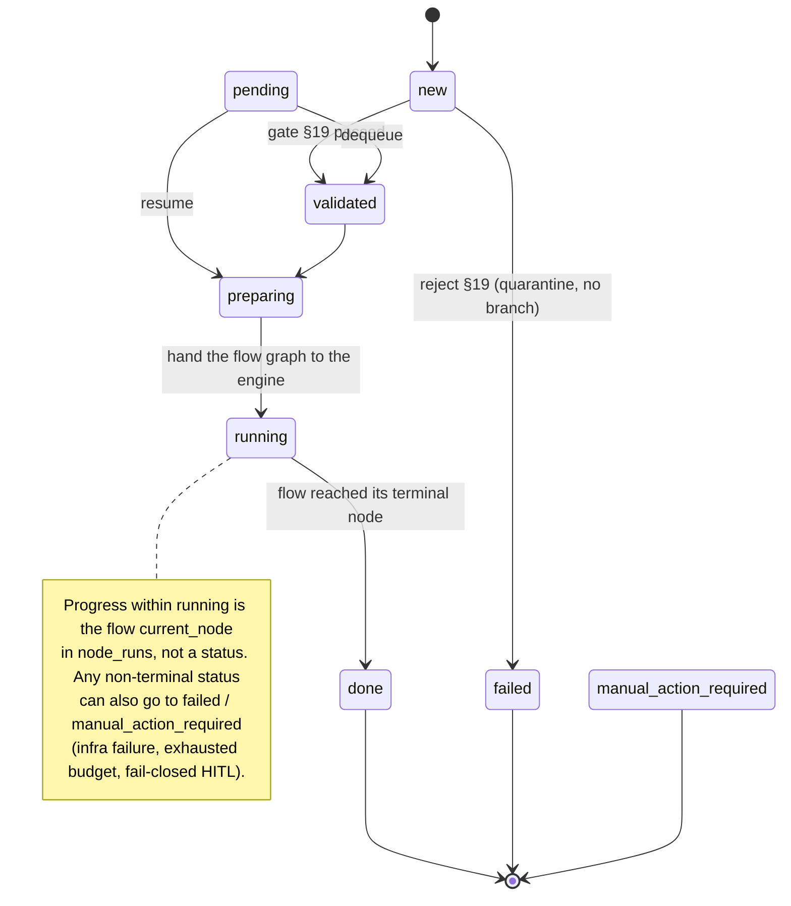

# B07 — State Machine and State Store

## Purpose

Defines the task status vocabulary and the allowed transitions between statuses, and persists all pipeline state in a single SQLite database (`state.db`). This is the "backbone" of state: a single processing slot, transactional transitions (crash-safe), and idempotent writes that allow an interrupted task to be resumed.

## Responsibilities

- **State machine** (pure, no IO): enumerate the generic lifecycle statuses (§8), define allowed transitions, validate/assert transitions ([state_machine.py:18-107](../../../src/wastech_orchestrator/core/state_machine.py#L18)).
- **State Store**: create/migrate the database and apply the schema ([state_store.py:348-377](../../../src/wastech_orchestrator/state_store.py#L348)); store 7 entities: `tasks`, `node_runs`, `provider_attempts`, `check_runs`, `artifacts`, `publish_operations`, `subtasks` ([state_store.py:90-213](../../../src/wastech_orchestrator/state_store.py#L90)).
- Persist and rehydrate the flow checkpoint (`tasks.current_node` / `flow_run_counters` / `flow_fingerprint`) so a resumed run continues from the node where it stopped ([state_store.py:713-744](../../../src/wastech_orchestrator/state_store.py#L713)).
- Provide `BEGIN IMMEDIATE`…`COMMIT`/`ROLLBACK` transactions ([state_store.py:379-388](../../../src/wastech_orchestrator/state_store.py#L379)).
- Answer the question "who owns the slot" ([state_store.py:473-476](../../../src/wastech_orchestrator/state_store.py#L473)).
- Version the database schema; reject a newer version, and refuse an older incompatible (pre-v7) one fail-closed ([state_store.py:70-87](../../../src/wastech_orchestrator/state_store.py#L70)).

## Block Boundaries

### Within scope

- Status vocabulary and transition table (policy).
- Persistence and reading of all 7 entities; loop counters; idempotent upserts.
- Querying active tasks (slot) and tasks with incomplete cleanup (recovery).
- Transactions, schema migration and versioning, read-only mode.

### Out of scope

- **Deciding which transition to make** — that is [B06 Pipeline](./B06-orchestrator-pipeline.md): it calls `assert_transition` then `set_status` inside a transaction (`_transition`) ([orchestrator.py:1703-1714](../../../src/wastech_orchestrator/core/orchestrator.py#L1703)). The store itself does not choose transitions; `set_status` writes any given status.
- **Progress within `running`** (which flow node is executing) — that is the FlowEngine's `current_node`, persisted here as the flow checkpoint, not a status.
- **Secret redaction**: the store writes exactly what it is given; the responsibility of "do not pass a secret into a field" lies with the callers ([state_store.py:8-11](../../../src/wastech_orchestrator/state_store.py#L8)).
- **Terminal outcome ledger** — that is a separate block [B08 Ledger](./B08-ledger-and-failure-reports.md).
- **Git operations themselves** — that is [B22](./B22-git-manager.md); the store only holds idempotency strings for publishing (`publish_operations`).

## Entry Points

State machine: `Status`, `ALLOWED_TRANSITIONS`, `can_transition`, `assert_transition`, `is_terminal`, `is_active`, `InvalidTransition` ([state_machine.py](../../../src/wastech_orchestrator/core/state_machine.py)).

State Store ([state_store.py](../../../src/wastech_orchestrator/state_store.py)):

- `StateStore.open(db_path)` / `open_readonly(db_path)` ([:348,:362](../../../src/wastech_orchestrator/state_store.py#L348)).
- `transaction()` ([:379](../../../src/wastech_orchestrator/state_store.py#L379)).
- Tasks: `insert_task`, `get_task`, `latest_task`, `task_id_exists`, `find_active_tasks`, `find_incomplete_cleanup`, `update_task`, `set_status`, `reset_task_for_rerun`, `revive_task_for_continue`.
- Counters: `get_counters`, `save_counters`.
- Flow checkpoint: `save_flow_checkpoint`, `get_flow_checkpoint` ([:713,:731](../../../src/wastech_orchestrator/state_store.py#L713)).
- Records: `record_node_run`, `record_skip`, `complete_node_run`, `record_provider_attempt`, `record_check_run`, `latest_failed_check_log`, `register_artifact`.
- Publish idempotency: `record_publish_op`, `get_publish_op`, `clear_publish_operations`.
- Subtasks: `insert_subtasks`, `get_subtasks`, `set_subtask_commit`.

## Input Data and State

Path to `state.db`; dataclass row objects (`TaskRow`, `NodeRunRow`, `ProviderAttemptRow`, …). Internal state is a single SQLite connection (WAL, `foreign_keys=ON`, manual transaction management).

## Main Scenario (task status transition)

1. [B06](./B06-orchestrator-pipeline.md) opens a transaction via `transaction()` (`BEGIN IMMEDIATE`).
2. Inside: `assert_transition(src, dst)` (state machine policy) → `set_status(task_id, dst)` → `save_counters(...)` → optional `update_task(...)`.
3. On success: `COMMIT`; on exception: `ROLLBACK` — the database remains in the previous consistent state.

Each status transition happens inside a single transaction: first the §8 check, then the write; on exception — full rollback:

The status vocabulary is the generic lifecycle: `new → validated → preparing → running → (done | failed | manual_action_required)`, with `pending` as the §8.2 queue waiting-state and a universal `-> failed` / `-> manual_action_required` edge from every non-terminal status:

Source: [state_machine.py:26-76](../../../src/wastech_orchestrator/core/state_machine.py#L26).

## Alternative Scenarios

### Out-of-band (operator-driven) statuses

`finalize` and `recovery` set a terminal status directly via `set_status`/`update_task` **without** `assert_transition` (intentional out-of-band change) — for example, `revive_task_for_continue` performs terminal→active for `rerun --continue`, keeping branch/slug/counters/decomposition/`subtasks`/`publish_operations` and only clearing the terminal markers so the resume engine drives it from the `current_node` checkpoint to a fresh terminal ([state_store.py:554-588](../../../src/wastech_orchestrator/state_store.py#L554)).

### Reset/revival on rerun

`reset_task_for_rerun` clears all per-attempt state, resets the branch, and deletes `subtasks` + `publish_operations`, leaving the status terminal (so that a subsequent upsert in `insert_task` moves it to `new`) ([state_store.py:509-552](../../../src/wastech_orchestrator/state_store.py#L509)).

### Read-only mode

`open_readonly` opens the file with `?mode=ro`, sets `PRAGMA query_only=ON`, and checks (without migrating) the schema version; used by the `status` command (which reads `current_node` via `get_flow_checkpoint`) ([state_store.py:362-377](../../../src/wastech_orchestrator/state_store.py#L362)).

## Checks and Constraints

- **Allowed transitions** (§8): the generic lifecycle "happy path" (`new → validated → preparing → running → done`, plus `pending → {validated, preparing}`) plus universal edges `-> failed` and `-> manual_action_required` for every non-terminal status; terminal statuses have no outgoing edges ([state_machine.py:48-76](../../../src/wastech_orchestrator/core/state_machine.py#L48)). The granular per-stage statuses are gone — progress within `running` is the flow `current_node`.
- **Single slot**: all statuses except `{NEW, PENDING, DONE, FAILED, MANUAL_ACTION_REQUIRED}` are considered active (`find_active_tasks` over `_NON_ACTIVE`; the `ACTIVE` set is `{VALIDATED, PREPARING, RUNNING}`) ([state_store.py:473-476,934-936](../../../src/wastech_orchestrator/state_store.py#L473), [state_machine.py:42-44](../../../src/wastech_orchestrator/core/state_machine.py#L42)). This is a logical slot (a database query), not a DBMS lock.
- **Schema version** = 7; a newer version raises `IncompatibleStateError` (on both open paths). An older _versioned_ database (`1 ≤ v < 7`) is also **refused fail-closed**: the v5–v7 changes are destructive and `_migrate` only _adds_ columns, so an old shape cannot be reshaped in place (greenfield — recreate the local `state.db`); stamping the current version onto an old shape would pass the gate and then crash on the first write to a reshaped table. Only a brand-new / pre-versioning `0` database is adopted (created at the current shape by `_SCHEMA`, then the additive `_migrate` columns + stamp) ([state_store.py:47-87](../../../src/wastech_orchestrator/state_store.py#L47)). v7 is greenfield-destructive: it dropped the legacy `stage_runs` table (the engine writes `node_runs`), renamed `provider_attempts.stage_run_id` → `node_run_id`, and dropped `tasks.interrupted_status` (rerun --continue re-enters at `current_node`, not a saved granular status).
- **Idempotency**: `insert_task`/`register_artifact`/`record_publish_op`/`insert_subtasks` are upserts keyed on a unique key; `insert_subtasks` does not "revive" already-committed subtasks (`WHERE subtasks.commit_sha IS NULL`) ([state_store.py:871-905](../../../src/wastech_orchestrator/state_store.py#L871)).
- **No secrets** in the schema (only ids, statuses, error classes, paths, sha256, counters, fingerprints, commit SHAs) ([state_store.py:8-11](../../../src/wastech_orchestrator/state_store.py#L8)).

## Output

Persistent rows in `state.db`; `TaskRow`/`SubtaskRow`/… on read; the `node_runs` id when reserving a node run; `LoopCounters` when reading counters; the `(current_node, counters_json, fingerprint)` tuple on `get_flow_checkpoint`; list of active/incomplete tasks.

## Side Effects

- Creation of the `state.db` file (+ WAL/SHM) and writes to it.
- Transactional mutations (commit/rollback).
- In read-only mode, writes are prohibited at the SQLite level (`query_only`).

## Errors and Edge Cases

- Newer schema version → `IncompatibleStateError` (caught by CLI → exit 2); an older incompatible (pre-v7) version → `IncompatibleStateError` too (delete `state.db` / fresh workspace).
- `complete_node_run`/`get_counters` on a non-existent id → `KeyError`.
- FK enabled: inserting a `node_run` without a matching `tasks` row will violate the FK constraint. `provider_attempts.node_run_id` is a plain monotonic id, **not** an FK (so the engine can store either a `node_runs` id there) ([state_store.py:147-159](../../../src/wastech_orchestrator/state_store.py#L147)).

## Relationships

### Uses

- [B09](./B09-fix-loop-control.md) — `LoopCounters` type (imported for counters).
- [B07 state machine] — `Status` (used internally in the store).

### Used by

- [B06 — Pipeline](./B06-orchestrator-pipeline.md) — all transitions and records; `acquire_slot` via `find_active_tasks`.
- [B22 — Git Manager](./B22-git-manager.md) — reading/writing `publish_operations` (idempotency).
- [B10 — Recovery](./B10-recovery-and-resume.md) — `find_active_tasks`/`find_incomplete_cleanup`.
- [B16 — Validation Gate](./B16-task-parsing-and-validation-gate.md) — `task_id_exists` (id deduplication).
- [B01 — CLI](./B01-cli-and-operator-commands.md) — `open_readonly` for the `status` command.

## Place in the Overall System

All pipeline decisions materialize as status transitions and rows in `state.db`. Transactionality and idempotency here are the foundation of resumability: after a crash, [B10](./B10-recovery-and-resume.md) reads this state and decides whether to continue the task.

## Code References

- [core/state_machine.py:18-107](../../../src/wastech_orchestrator/core/state_machine.py#L18) — the 8 generic statuses, transition table, `ACTIVE`/`TERMINAL`, checks.
- [state_store.py:90-213](../../../src/wastech_orchestrator/state_store.py#L90) — schema of 7 tables (`node_runs`, `provider_attempts.node_run_id`, the `tasks` flow-checkpoint columns).
- [state_store.py:47-87](../../../src/wastech_orchestrator/state_store.py#L47) — schema version 7, migration, version gate.
- [state_store.py:348-377](../../../src/wastech_orchestrator/state_store.py#L348) — open/open_readonly, pragmas, version.
- [state_store.py:473-489](../../../src/wastech_orchestrator/state_store.py#L473) — slot and incomplete cleanup; [state_store.py:713-744](../../../src/wastech_orchestrator/state_store.py#L713) — flow checkpoint save/get.
- Tests: [test_state_machine.py](../../../tests/core/test_state_machine.py), [test_state_store.py](../../../tests/state/test_state_store.py), [test_db_schema_version.py](../../../tests/state/test_db_schema_version.py) — transitions, slot, transactions (commit/rollback), upsert, rejection of newer version, absence of secret columns.
