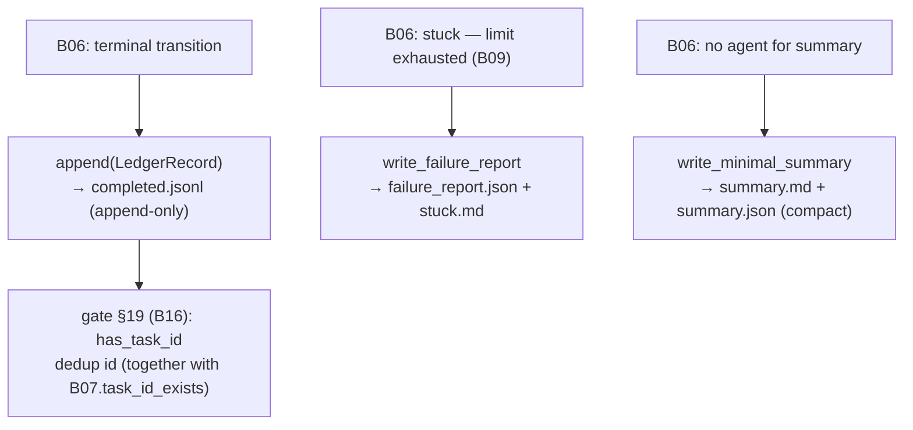

# B08 — Ledger and Failure Reports

## Purpose

Maintains an append-only log of terminal task outcomes (`logs/completed.jsonl`) outside of SQLite, and writes "stuck" artifacts (`failure_report.json` + `stuck.md`) along with a compact deterministic fallback summary when no provider was able to complete the `summary` stage. SQLite remains the authoritative state; the ledger is a convenient index of completed work and a source of duplicate id detection for gate §19.

## Responsibilities

- Append one `LedgerRecord` entry per terminal transition; read records; check for id presence ([ledger.py:92-123](../../../src/wastech_orchestrator/ledger.py#L92)).
- Write `failure_report.json` (machine-readable) + `stuck.md` (human-readable) ([ledger.py:136-196](../../../src/wastech_orchestrator/ledger.py#L136)).
- Write a compact `summary.md` + `summary.json` as a fallback for the summary stage ([ledger.py:199-249](../../../src/wastech_orchestrator/ledger.py#L199)).

## Block Boundaries

### Within the block's responsibility

- Append-only log of terminal records; failure artifacts; deterministic minimal summary.

### Outside the block's responsibility

- **Authoritative state** — that is SQLite [B07](./B07-state-machine-and-store.md); the ledger is a derived index.
- **Decision on terminal outcome and when to append** — that is [B06](./B06-orchestrator-pipeline.md).
- **Gate §19 logic** — that is [B16](./B16-task-parsing-and-validation-gate.md) (uses `has_task_id`).
- **Artifact directory layout** — [B20](./B20-artifact-layout.md).

## Entry Points

- `Ledger(logs_root)` — constructed in `build_orchestrator` ([orchestrator.py:2615](../../../src/wastech_orchestrator/core/orchestrator.py#L2615)).
- `append(record)` — [B06](./B06-orchestrator-pipeline.md) terminal paths (`_append_ledger`, `_reject`, `_resume_*`, `finalize_task`); `has_task_id` — injected into gate [B16](./B16-task-parsing-and-validation-gate.md) ([orchestrator.py:2634](../../../src/wastech_orchestrator/core/orchestrator.py#L2634)); `records` — `_ledger_attempt_count`/`_ledger_has_manual` ([orchestrator.py:210-217](../../../src/wastech_orchestrator/core/orchestrator.py#L210)).
- `write_failure_report` ([ledger.py:136](../../../src/wastech_orchestrator/ledger.py#L136)) — [B06 `_write_failure_report`](./B06-orchestrator-pipeline.md); `write_minimal_summary` ([ledger.py:199](../../../src/wastech_orchestrator/ledger.py#L199)) — [B06 `_summary`/`_summary_md_body`](./B06-orchestrator-pipeline.md).
- `LedgerRecord`, `DecomposedFailureInfo`.

## Input Data and State

`logs_root` (= `<artifacts_root>/logs`); `LedgerRecord` fields (id, title, status, branch, pr*url, auto_merged/merge_outcome, fix_iterations, decomposed/subtask*\*, attempt/rerun_of, manual/note/outcome, validation_reason, …). State — the `completed.jsonl` file (append-only).

## Main Scenario

1. On each terminal transition [B06](./B06-orchestrator-pipeline.md) constructs a `LedgerRecord` and calls `append` — one JSON line is appended; the file is never rewritten.
2. Gate §19 ([B16](./B16-task-parsing-and-validation-gate.md)) uses `has_task_id` to check for a duplicate id (together with `task_id_exists` from [B07](./B07-state-machine-and-store.md)).
3. On a stuck task, `failure_report.json` + `stuck.md` are written; when no summary agent is available, `write_minimal_summary` is called (compact, with `git diff --stat`, without the full patch).

Three ledger write paths and one read path (dedup id for gate §19):

## Constraints and Invariants

- The log is strictly append-only (one record per terminal transition) ([ledger.py:104-109](../../../src/wastech_orchestrator/ledger.py#L104)).
- Old records without new keys are read without errors (tolerant `records`).
- The minimal summary is intentionally compact: it references the task file and shows the stat, while the full (already redacted) patch remains in `current.diff` ([ledger.py:207-214](../../../src/wastech_orchestrator/ledger.py#L207)).

## Output

An appended line in `completed.jsonl`; paths to `failure_report.json`/`stuck.md`; paths to `summary.md`/`summary.json`; `has_task_id`/`records` for callers.

## Side Effects

- Appending to `completed.jsonl`; writing `failure_report.json`, `stuck.md`, `summary.md`, `summary.json` under `logs/<task-id>/`.

## Errors and Edge Cases

- Empty or missing log → `records` returns `[]` (no error).
- `failure_report` for a decomposed task adds a `decomposed` block (failing subtask + committed SHAs).

## Relations

### Uses

- [B20 — Artifacts](./B20-artifact-layout.md) — `task_artifact_dir`.

### Used by

- [B06 — Pipeline](./B06-orchestrator-pipeline.md) — terminal records, failure reports, fallback summary, attempt/manual counting.
- [B16 — Validation Gate](./B16-task-parsing-and-validation-gate.md) — `has_task_id` (duplicate id).

## Place in the Overall System

The ledger is an audit trail of "what completed and how," surviving any restarts, and is one half of the duplicate id check (the other half being SQLite [B07](./B07-state-machine-and-store.md)). Failure artifacts give the operator everything needed to investigate a stuck task; the minimal summary ensures a PR always has a body even without an agent.

## Code Confirmation

- [ledger.py:92-123](../../../src/wastech_orchestrator/ledger.py#L92) — append-only log, `has_task_id`/`records`.
- [ledger.py:136-249](../../../src/wastech_orchestrator/ledger.py#L136) — `write_failure_report`, `write_minimal_summary`.
- Test: [tests/core/test_ledger.py](../../../tests/core/test_ledger.py) — append-only, duplicate id, rerun linking, manual/outcome, failure report (including decomposed), compact summary.
