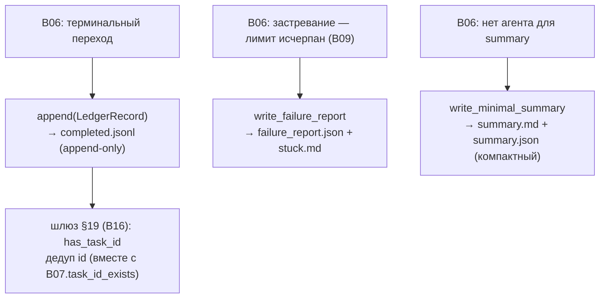

# B08 — Ledger и отчёты о провале

## Назначение

Ведёт append-only журнал терминальных исходов задач (`logs/completed.jsonl`) вне SQLite и пишет артефакты «застревания» (`failure_report.json` + `stuck.md`) и компактный детерминированный fallback-summary, когда ни один провайдер не смог выполнить стадию `summary`. SQLite остаётся авторитетным состоянием; ledger — это удобный индекс выполненного и источник дубликатов id для шлюза §19.

## Ответственность

- Дописывать по одной записи `LedgerRecord` на каждый терминальный переход; читать записи; проверять наличие id ([ledger.py:92-123](../../../src/wastech_orchestrator/ledger.py#L92)).
- Писать `failure_report.json` (машинный) + `stuck.md` (человекочитаемый) ([ledger.py:136-196](../../../src/wastech_orchestrator/ledger.py#L136)).
- Писать компактный `summary.md` + `summary.json` как fallback стадии summary ([ledger.py:199-249](../../../src/wastech_orchestrator/ledger.py#L199)).

## Границы блока

### Входит в ответственность блока

- Append-only журнал терминальных записей; артефакты провала; детерминированный минимальный summary.

### Не входит в ответственность блока

- **Авторитетное состояние** — это SQLite [B07](./B07-state-machine-and-store.md); ledger — производный индекс.
- **Решение терминального исхода и когда дописывать** — это [B06](./B06-orchestrator-pipeline.md).
- **Логика шлюза §19** — это [B16](./B16-task-parsing-and-validation-gate.md) (использует `has_task_id`).
- **Каталог артефактов** — [B20](./B20-artifact-layout.md).

## Точки входа

- `Ledger(logs_root)` — строится в `build_orchestrator` ([orchestrator.py:2615](../../../src/wastech_orchestrator/core/orchestrator.py#L2615)).
- `append(record)` — [B06](./B06-orchestrator-pipeline.md) терминальные пути (`_append_ledger`, `_reject`, `_resume_*`, `finalize_task`); `has_task_id` — инъектируется в шлюз [B16](./B16-task-parsing-and-validation-gate.md) ([orchestrator.py:2634](../../../src/wastech_orchestrator/core/orchestrator.py#L2634)); `records` — `_ledger_attempt_count`/`_ledger_has_manual` ([orchestrator.py:210-217](../../../src/wastech_orchestrator/core/orchestrator.py#L210)).
- `write_failure_report` ([ledger.py:136](../../../src/wastech_orchestrator/ledger.py#L136)) — [B06 `_write_failure_report`](./B06-orchestrator-pipeline.md); `write_minimal_summary` ([ledger.py:199](../../../src/wastech_orchestrator/ledger.py#L199)) — [B06 `_summary`/`_summary_md_body`](./B06-orchestrator-pipeline.md).
- `LedgerRecord`, `DecomposedFailureInfo`.

## Входные данные и состояние

`logs_root` (= `<artifacts_root>/logs`); `LedgerRecord` поля (id, title, статус, branch, pr*url, auto_merged/merge_outcome, fix_iterations, decomposed/subtask*\*, attempt/rerun_of, manual/note/outcome, validation_reason, …). Состояние — файл `completed.jsonl` (append-only).

## Основной сценарий

1. На каждый терминальный переход [B06](./B06-orchestrator-pipeline.md) формирует `LedgerRecord` и вызывает `append` — одна JSON-строка дописывается, файл никогда не переписывается.
2. Шлюз §19 ([B16](./B16-task-parsing-and-validation-gate.md)) использует `has_task_id` для проверки дубликата id (вместе с `task_id_exists` из [B07](./B07-state-machine-and-store.md)).
3. При застревании пишется `failure_report.json` + `stuck.md`; при отсутствии агента summary — `write_minimal_summary` (компактный, с `git diff --stat`, без полного патча).

Три пути записи ledger и один путь чтения (дедуп id для шлюза §19):

## Проверки и ограничения

- Журнал строго append-only (одна запись на терминальный переход) ([ledger.py:104-109](../../../src/wastech_orchestrator/ledger.py#L104)).
- Старые записи без новых ключей читаются без ошибок (толерантный `records`).
- Минимальный summary намеренно компактен: ссылается на task-файл и показывает stat, а полный (уже редактированный) патч остаётся в `current.diff` ([ledger.py:207-214](../../../src/wastech_orchestrator/ledger.py#L207)).

## Результат

Дописанная строка в `completed.jsonl`; пути `failure_report.json`/`stuck.md`; пути `summary.md`/`summary.json`; `has_task_id`/`records` для вызывающих.

## Побочные эффекты

- Дозапись `completed.jsonl`; запись `failure_report.json`, `stuck.md`, `summary.md`, `summary.json` под `logs/<task-id>/`.

## Ошибки и граничные случаи

- Пустой/отсутствующий журнал → `records` возвращает `[]` (без ошибки).
- `failure_report` для декомпозированной задачи добавляет блок `decomposed` (failing subtask + committed SHAs).

## Связи

### Использует

- [B20 — Артефакты](./B20-artifact-layout.md) — `task_artifact_dir`.

### Используется в

- [B06 — Конвейер](./B06-orchestrator-pipeline.md) — терминальные записи, отчёты о провале, fallback-summary, подсчёт попыток/manual.
- [B16 — Шлюз валидации](./B16-task-parsing-and-validation-gate.md) — `has_task_id` (дубликат id).

## Место в общей системе

Ledger — аудит-след «что и чем закончилось», переживающий любые перезапуски, и половина проверки дубликатов id (вторая — SQLite [B07](./B07-state-machine-and-store.md)). Артефакты провала дают оператору всё для разбора «застрявшей» задачи; минимальный summary гарантирует, что у PR всегда есть тело, даже без агента.

## Подтверждение в коде

- [ledger.py:92-123](../../../src/wastech_orchestrator/ledger.py#L92) — append-only журнал, `has_task_id`/`records`.
- [ledger.py:136-249](../../../src/wastech_orchestrator/ledger.py#L136) — `write_failure_report`, `write_minimal_summary`.
- Тест: [tests/core/test_ledger.py](../../../tests/core/test_ledger.py) — append-only, дубликат id, линковка rerun, manual/outcome, отчёт о провале (в т.ч. decomposed), компактный summary.
