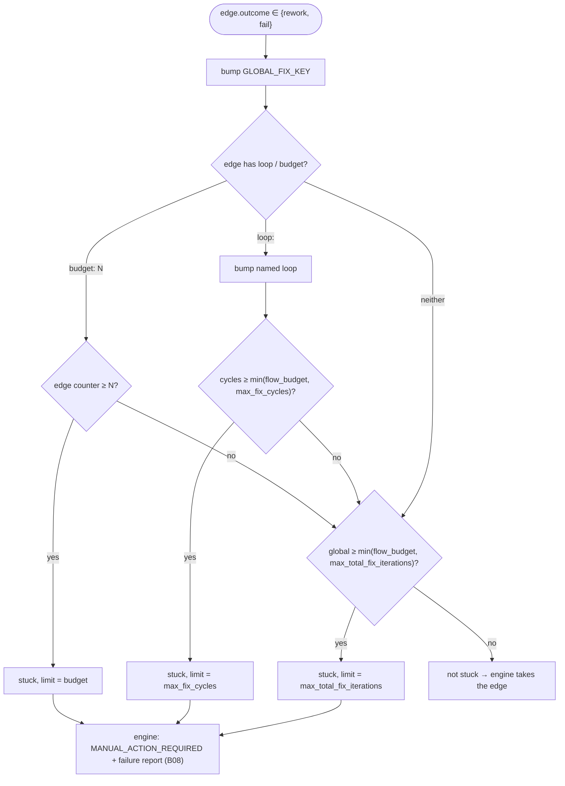

# B09 — Fix Loop Control

## Purpose

Deterministically guarantees task completion: the persisted per-task counter struct (`LoopCounters`) plus the **generic** budget enforcement the FlowEngine ([B06](./B06-orchestrator-pipeline.md)) runs over `FlowRunState.loop_counters`. Replaces a supervisor agent with simple persistent counters and hard limits, to prevent an infinite ping-pong of `review ↔ fixing` or `testing ↔ fixing`. The engine carries no domain knowledge — it does not know `test_fix`/`review_fix` by name; the named loops live in the flow YAML edges.

## Responsibilities

- Define the mutable per-task counter struct (`stage_attempts`, `test_fix_cycles`, `review_fix_cycles`, `fix_iterations`) persisted on the `tasks` row ([loop_control.py:23-30](../../../src/wastech_orchestrator/core/loop_control.py#L23)).
- (Engine) On every `rework`/`fail` edge, charge it against a single global counter plus its named loop / inline budget, and decide whether the run is stuck and which limit was exhausted ([engine.py:342-361](../../../src/wastech_orchestrator/core/flow/engine.py#L342)).
- (Engine) Reset a loop / inline-budget counter when a forward edge leaves the node ([engine.py:363-375](../../../src/wastech_orchestrator/core/flow/engine.py#L363)); preserve the global counter across subtasks ([run_state.py:69-79](../../../src/wastech_orchestrator/core/flow/run_state.py#L69)).

## Block Boundaries

### Within the block's responsibility

- The counter struct (§8.1) and the engine's "stuck / not stuck" decision with the name of the exhausted limit.

### Outside the block's responsibility

- **Persistence** of the counters — that is [B07](./B07-state-machine-and-store.md) (the engine checkpoint via the [recorder](../../../src/wastech_orchestrator/core/flow/recorder.py)).
- **Ownership of `stage_attempts`** — it is counted by [B17 Router](./B17-agent-router-and-fallback.md); on the `tasks` row it is only mirrored as the latest value.
- **The named loops themselves** (`test_fix`/`review_fix`) — they live in the flow YAML edges, not in the engine ([implementation.yaml:74-83](../../../src/wastech_orchestrator/core/flow/packaged/implementation.yaml#L74)).

## Entry Points

- `LoopCounters` — the persisted counter dataclass ([loop_control.py:23](../../../src/wastech_orchestrator/core/loop_control.py#L23)).
- Engine budget bookkeeping: `_charge_rework` / `_reset_loops_at` / `_loop_cap` / `_global_cap` ([engine.py:342-382](../../../src/wastech_orchestrator/core/flow/engine.py#L342)).
- `FlowRunState.loop_counters` and the reserved `GLOBAL_FIX_KEY` ("global_fix_iterations") ([run_state.py:37,44](../../../src/wastech_orchestrator/core/flow/run_state.py#L37)).

## Input Data and State

`AgentsConfig` limits (`max_fix_cycles`, `max_total_fix_iterations`) and the flow's `budgets`; the engine's runtime `FlowRunState.loop_counters` (a single `dict[str, int]` keyed by named loop, synthetic edge key, or `GLOBAL_FIX_KEY`). `loop_control.py` itself is pure data.

## Main Scenario (engine charges a `rework`/`fail` edge)

1. Bump the global counter (`GLOBAL_FIX_KEY`).
2. If the edge carries `loop: <name>`, bump that named loop and compare with `>=` against the per-loop cap; if it carries an inline `budget: N`, compare the synthetic edge key with `allow N` before bumping.
3. If the per-loop / inline cap is reached → `stuck`, `limit_name="max_fix_cycles"` (or `budget:<from>-><to>`) — checked first.
4. Otherwise, if the global counter reaches the global cap → `stuck`, `limit_name="max_total_fix_iterations"`.
5. Otherwise not stuck — the engine takes the rework/fail edge.

The per-loop / inline cap is `min(flow_budget, max_fix_cycles)` and is checked before the global cap `min(flow_budget, max_total_fix_iterations)`; on exhaustion the engine ends the run at `MANUAL_ACTION_REQUIRED` and writes a failure report ([engine.py:239-256](../../../src/wastech_orchestrator/core/flow/engine.py#L239)):

## Checks and Constraints

- Two independent limits: per-loop (`max_fix_cycles`) and global hard stop (`max_total_fix_iterations`); each is the config ceiling clamping the flow budget (`min(flow_budget, config_cap)`, [engine.py:377-382](../../../src/wastech_orchestrator/core/flow/engine.py#L377)). The configuration validator requires `max_total_fix_iterations ≥ max_fix_cycles` ([B05](./B05-configuration.md)).
- When both limits trip on the same entry, the per-loop / inline limit is reported before the global one ([engine.py:359-361](../../../src/wastech_orchestrator/core/flow/engine.py#L359)).
- `_reset_loops_at` resets a loop / inline-budget counter when a forward edge leaves the node ([engine.py:363-375](../../../src/wastech_orchestrator/core/flow/engine.py#L363)).
- `FlowRunState.reset_for_next_subtask` drops every loop / inline counter **except** the global counter, so decomposition cannot bypass the hard stop ([run_state.py:69-79](../../../src/wastech_orchestrator/core/flow/run_state.py#L69)).

## Output

A `_Stuck(loop, limit_name)` (or `None`) from `_charge_rework`; mutated `FlowRunState.loop_counters`.

## Side Effects

- The engine mutates `FlowRunState.loop_counters`, persisted via the recorder checkpoint ([recorder.py:39-45](../../../src/wastech_orchestrator/core/flow/recorder.py#L39)). `loop_control.py` itself is pure data (a dataclass).

## Errors and Edge Cases

- When both limits are triggered on the same entry, the per-loop / inline limit is reported first.

## Relationships

### Uses

- [B05 — Configuration](./B05-configuration.md) — limits from `AgentsConfig`.

### Used by

- [B06 — Pipeline / FlowEngine](./B06-orchestrator-pipeline.md) — budget enforcement over `FlowRunState.loop_counters`.
- [B07 — State Store](./B07-state-machine-and-store.md) — imports `LoopCounters` for counter persistence.

## Role in the Overall System

This is the "circuit breaker" for the fix loop, now realized as the engine's bounded-termination guarantee over generic counters: every `rework`/`fail` edge is charged, and when a limit is exhausted the run ends at `MANUAL_ACTION_REQUIRED` with a failure report ([B08](./B08-ledger-and-failure-reports.md)).

## Code Confirmation

- [core/loop_control.py:23-30](../../../src/wastech_orchestrator/core/loop_control.py#L23) — the `LoopCounters` dataclass.
- [core/flow/engine.py:340-383](../../../src/wastech_orchestrator/core/flow/engine.py#L340) — engine budget bookkeeping (`_charge_rework`/`_reset_loops_at`/`_loop_cap`/`_global_cap`).
- [core/flow/run_state.py](../../../src/wastech_orchestrator/core/flow/run_state.py) — `loop_counters`, `GLOBAL_FIX_KEY`, `reset_for_next_subtask`.
- Test: [tests/core/test_flow_engine.py](../../../tests/core/test_flow_engine.py) — fix-loop budget scenarios (both caps, resets, global accumulation across subtasks).
