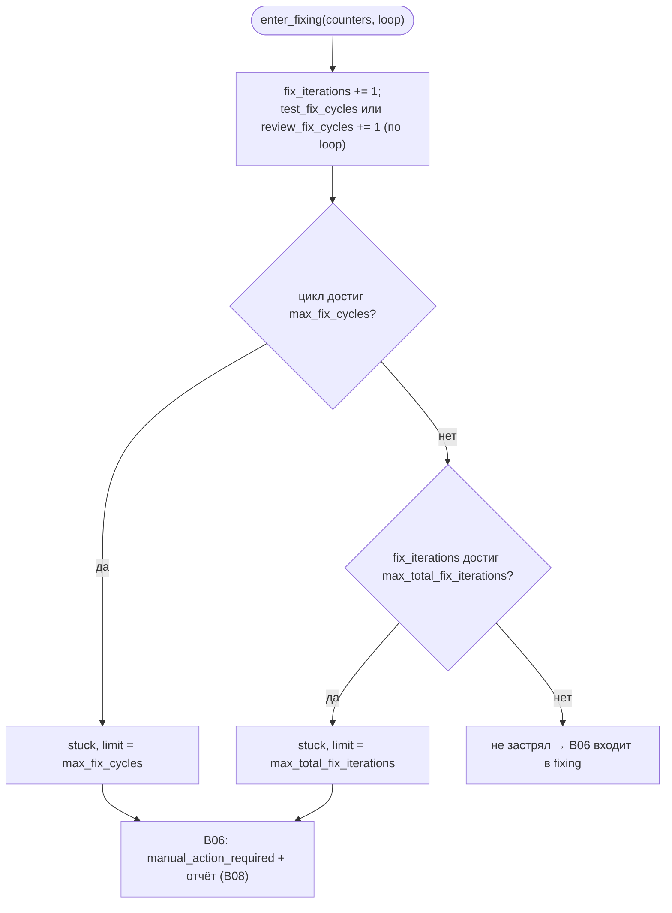

# B09 — Контроль циклов исправления

## Назначение

Детерминированно гарантирует завершение задачи: считает циклы исправления и решает, не «застряла»
ли задача. Заменяет супервайзер-агента простыми персистентными счётчиками с жёсткими лимитами, чтобы
не было бесконечного пинг-понга `review ↔ fixing` или `testing ↔ fixing`.

## Ответственность

- Хранить per-task счётчики (`stage_attempts`, `test_fix_cycles`, `review_fix_cycles`,
  `fix_iterations`) ([loop_control.py:35-42](../../../src/wastech_orchestrator/core/loop_control.py#L35)).
- На входе в `fixing` инкрементировать нужные счётчики и решить, застряла ли задача и какой лимит
  исчерпан ([loop_control.py:63-83](../../../src/wastech_orchestrator/core/loop_control.py#L63)).
- Сбрасывать счётчики при прохождении проверок/ревью и при переходе к следующему сабтаску
  ([loop_control.py:85-103](../../../src/wastech_orchestrator/core/loop_control.py#L85)).

## Границы блока

### Входит в ответственность блока

- Правила счётчиков §8.1 и решение «застрял/не застрял» с именем исчерпанного лимита.

### Не входит в ответственность блока

- **Персист** счётчиков — это [B07](./B07-state-machine-and-store.md) (`save_counters`/`get_counters`).
- **Владение `stage_attempts`** — его считает [B17 Router](./B17-agent-router-and-fallback.md);
  здесь лишь зеркалится последнее значение ([loop_control.py:5-7](../../../src/wastech_orchestrator/core/loop_control.py#L5)).
- **Решение войти в `fixing`** и **запись отчёта о провале** — это [B06](./B06-orchestrator-pipeline.md)/[B08](./B08-ledger-and-failure-reports.md).

## Точки входа

- `LoopController(limits: AgentsConfig)` — строится в `build_orchestrator` ([orchestrator.py:2637](../../../src/wastech_orchestrator/core/orchestrator.py#L2637)).
- `enter_fixing(counters, loop)` → `LoopDecision` ([loop_control.py:63](../../../src/wastech_orchestrator/core/loop_control.py#L63)) — [B06 `_enter_fixing`](./B06-orchestrator-pipeline.md) ([orchestrator.py:1480](../../../src/wastech_orchestrator/core/orchestrator.py#L1480)).
- `on_check_pass` / `on_review_pass` / `reset_for_next_subtask` ([loop_control.py:85-103](../../../src/wastech_orchestrator/core/loop_control.py#L85)).
- `FixLoop` (TEST/REVIEW), `LoopCounters`, `LoopDecision`.

## Входные данные и состояние

`AgentsConfig` лимиты (`max_fix_cycles`, `max_total_fix_iterations`); мутируемый `LoopCounters`
(передаёт вызывающий). Контроллер сам состояния не хранит.

## Основной сценарий (`enter_fixing`)

1. `fix_iterations += 1`; в зависимости от `loop` инкрементируется `test_fix_cycles` или
   `review_fix_cycles`.
2. Если цикл достиг `max_fix_cycles` → `stuck`, `limit_name="max_fix_cycles"` (проверяется первым).
3. Иначе если `fix_iterations` достиг `max_total_fix_iterations` → `stuck`,
   `limit_name="max_total_fix_iterations"`.
4. Иначе `stuck=False` — [B06](./B06-orchestrator-pipeline.md) переходит в `fixing`.

Решение `enter_fixing`: per-loop лимит (`max_fix_cycles`) проверяется раньше глобального
(`max_total_fix_iterations`):

## Проверки и ограничения

- Два независимых лимита: per-loop (`max_fix_cycles`) и глобальный жёсткий стоп
  (`max_total_fix_iterations`); валидатор конфигурации требует
  `max_total_fix_iterations ≥ max_fix_cycles` ([B05](./B05-configuration.md)).
- `on_check_pass` сбрасывает только `test_fix_cycles`; `on_review_pass` — оба цикла.
- `reset_for_next_subtask` сбрасывает `stage_attempts` и оба цикла, но **не** `fix_iterations` (он
  копится через все сабтаски, чтобы декомпозиция не обходила жёсткий стоп) ([loop_control.py:94-103](../../../src/wastech_orchestrator/core/loop_control.py#L94)).

## Результат

`LoopDecision(stuck, loop, limit_name)`; мутированный `LoopCounters`.

## Побочные эффекты

Нет — модуль чистый (мутирует только переданный `LoopCounters`, не пишет на диск/в БД).

## Ошибки и граничные случаи

- Когда оба лимита срабатывают на одном входе, первым сообщается per-loop (`max_fix_cycles`).

## Связи

### Использует

- [B05 — Конфигурация](./B05-configuration.md) — лимиты из `AgentsConfig`.

### Используется в

- [B06 — Конвейер](./B06-orchestrator-pipeline.md) — управление циклами test/review/fixing.
- [B07 — State Store](./B07-state-machine-and-store.md) — импортирует `LoopCounters` для персиста счётчиков.

## Место в общей системе

Это «предохранитель» цикла исправления: после провала тестов/ревью [B06](./B06-orchestrator-pipeline.md)
спрашивает этот блок, можно ли ещё чинить; при исчерпании лимита задача уходит в
`manual_action_required` с отчётом о провале ([B08](./B08-ledger-and-failure-reports.md)).

## Подтверждение в коде

- [core/loop_control.py:56-103](../../../src/wastech_orchestrator/core/loop_control.py#L56) — `LoopController` и все правила счётчиков.
- Тест: [tests/core/test_loop_control.py](../../../tests/core/test_loop_control.py) — инкременты, оба лимита, сбросы, накопление `fix_iterations` через сабтаски.
