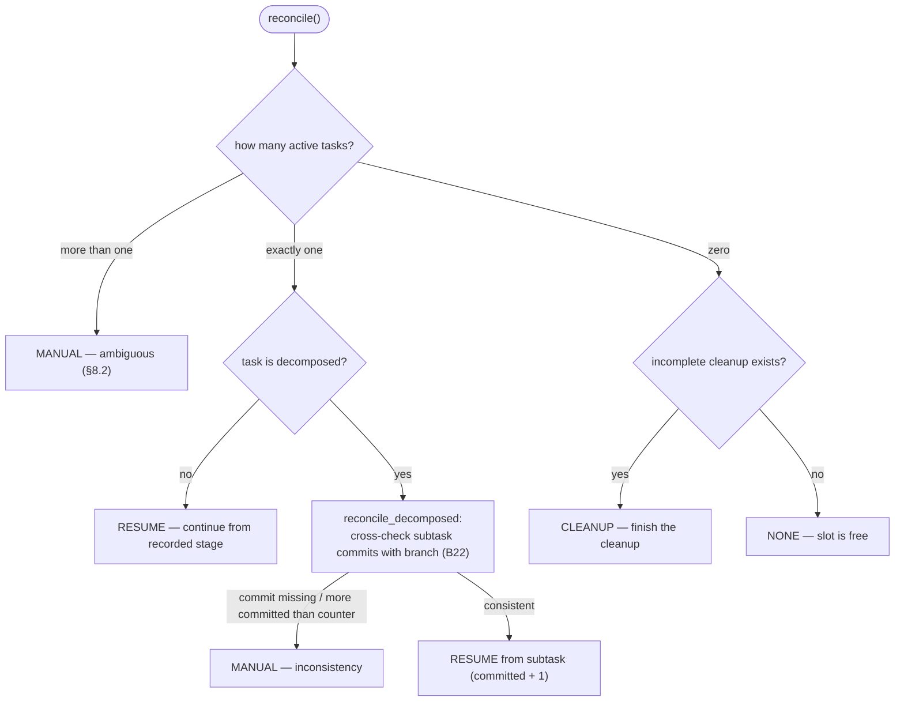

# B10 — Recovery and Resume

## Purpose

On startup, reconciles persistent state (SQLite ↔ branch ↔ artifacts) and decides what to do with the single unfinished operation: resume it, finish an interrupted cleanup, mark it as requiring manual intervention, or do nothing (slot is free). This is the "brain" of the idempotent restart — the actual action is executed by [B06](./B06-orchestrator-pipeline.md).

## Responsibilities

- Find active tasks and apply the single-slot rule §8.2 ([recovery.py:57-74](../../../src/wastech_orchestrator/core/recovery.py#L57)).
- For a decomposed task, cross-check the recorded subtask commits against the branch and find the resume point ([recovery.py:76-107](../../../src/wastech_orchestrator/core/recovery.py#L76)).
- Return a `RecoveryPlan` decision (NONE/RESUME/CLEANUP/MANUAL) — without side effects.

## Block Boundaries

### Within block responsibility

- Computing the recovery decision and resume point; detecting inconsistencies.

### Outside block responsibility

- **Executing** the decision — that is [B06](./B06-orchestrator-pipeline.md) (`resume` → `_resume_task`/`_resume_cleanup`/`_resume_manual`).
- **Checking whether a commit exists on the branch** is delegated to [B22 `commit_on_branch`](./B22-git-manager.md).
- **Reading state** — [B07](./B07-state-machine-and-store.md); this block writes nothing.
- **Publish idempotency** — [B22](./B22-git-manager.md) (fingerprints publish operations).

## Entry Points

- `RecoveryReconciler(config, store, git).reconcile()` → `RecoveryPlan` ([recovery.py:49-74](../../../src/wastech_orchestrator/core/recovery.py#L49)); constructed and called in [B06 `resume`](./B06-orchestrator-pipeline.md) ([orchestrator.py:661](../../../src/wastech_orchestrator/core/orchestrator.py#L661)).
- `RecoveryAction`, `RecoveryPlan` — decision types.

## Input Data and State

Config, `StateStore`, `GitManager`. The decision is based on: the list of active tasks, whether an incomplete cleanup exists, and (for decomposition) subtask records and their commits on the branch. Does not store state.

## Main Scenario (`reconcile`)

1. `> 1` active tasks → `MANUAL` (ambiguous, §8.2) with a list of ids.
2. Exactly 1 active: if decomposed → `reconcile_decomposed`; otherwise → `RESUME`.
3. `0` active: if there is a task with an incomplete cleanup → `CLEANUP`; otherwise → `NONE` (slot is free).

Decision from `reconcile` based on the number of active tasks (any ambiguity — fail-safe to `MANUAL`):

## Alternative Scenarios

### Decomposition Reconciliation

For each subtask with a recorded `commit_sha`: if the commit is not on the branch → `MANUAL` (inconsistency). If more commits exist than `subtasks_completed` → `MANUAL`. Otherwise the resume point = `committed + 1` → `RESUME` ([recovery.py:76-107](../../../src/wastech_orchestrator/core/recovery.py#L76)).

## Checks and Constraints

- Single slot: more than one active task always results in `MANUAL`.
- Never re-commit a recorded SHA or continue when an inconsistency is detected — fail-safe to `MANUAL` ([recovery.py:8-16](../../../src/wastech_orchestrator/core/recovery.py#L8)).

## Result

`RecoveryPlan(action, task_id, resume_subtask, manual_reason, manual_task_ids)`.

## Side Effects

None — the block only reads state and returns a decision.

## Errors and Edge Cases

- Inconsistency between subtask commits and counters → `MANUAL` with a clear reason.
- Interrupted terminal cleanup (terminal status + branch + `cleanup_completed` not set) → `CLEANUP`.

## Connections

### Uses

- [B07 — State Store](./B07-state-machine-and-store.md) — `find_active_tasks`, `get_subtasks`, `find_incomplete_cleanup`.
- [B22 — Git Manager](./B22-git-manager.md) — `commit_on_branch`.
- [B05 — Configuration](./B05-configuration.md) — configuration types.

### Used by

- [B06 — Pipeline](./B06-orchestrator-pipeline.md) — `resume` and `rerun --continue` (via task revival).

## Place in the Overall System

Makes restarts safe: when `watch`/`run`/`continue` starts, [B06](./B06-orchestrator-pipeline.md) first queries this block, and only then resumes the single unfinished task or frees the slot. Together with the idempotency of [B22](./B22-git-manager.md), this ensures the property "a crash does not corrupt state" (§13).

## Code Confirmation

- [core/recovery.py:49-107](../../../src/wastech_orchestrator/core/recovery.py#L49) — `reconcile` and `reconcile_decomposed`.
- Test: [tests/core/test_recovery.py](../../../tests/core/test_recovery.py) — NONE/RESUME/CLEANUP/MANUAL, decomposition reconciliation, resume point.
