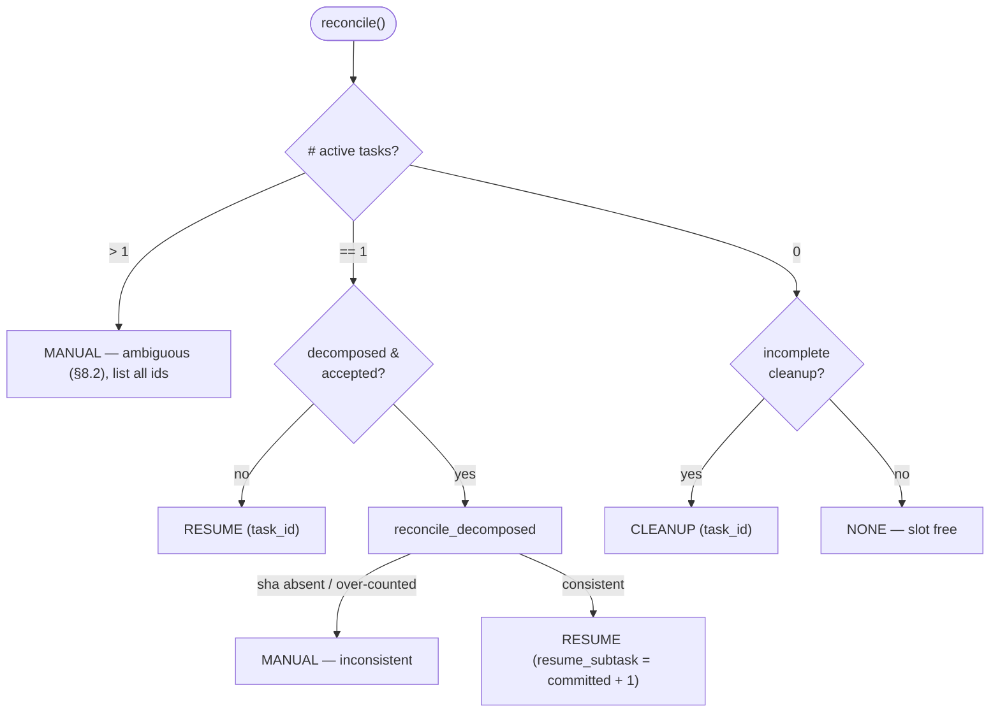

# B10 — Recovery and Resume

> Reconstructed from code (`core/recovery.py`, `core/flow/recorder.py`) and tests (`tests/core/test_recovery.py`, `tests/core/test_flow_recorder.py`). The code is the only source of truth; this document was rebuilt from the implementation, not from prose or comments. Significant claims carry a `file:line` reference.

**Status:** documented · **Source modules:** `src/wastech_orchestrator/core/recovery.py`, `src/wastech_orchestrator/core/flow/recorder.py`

## Responsibility

On startup the orchestrator must reconcile SQLite, the working branch, and the on-disk artifacts to find the single unfinished operation and decide what to do with it. This block owns two halves of that: (1) `RecoveryReconciler.reconcile` computes a side-effect-free `RecoveryPlan` decision (`NONE` / `RESUME` / `CLEANUP` / `MANUAL`) ([recovery.py:57](../../../src/wastech_orchestrator/core/recovery.py#L57)); (2) `hydrate_run_state` rebuilds the engine's `FlowRunState` checkpoint from the persisted snapshot so a `RESUME` continues from the recorded node instead of restarting ([recorder.py:86](../../../src/wastech_orchestrator/core/flow/recorder.py#L86)).

The block decides and reconstructs; it does not act. Executing a plan (marking manual, finishing cleanup, re-running the unfinished work) is the orchestrator wrapper's job in [B06](B06-orchestrator-pipeline.md), and side-effect idempotency (never re-commit/push/PR) lives in `publish_operations` via [B22](B22-git-manager.md), not here.

## Public surface

- `RecoveryAction` ([recovery.py:29](../../../src/wastech_orchestrator/core/recovery.py#L29)) — `StrEnum` of `NONE` / `RESUME` / `CLEANUP` / `MANUAL`.
- `RecoveryPlan` ([recovery.py:38](../../../src/wastech_orchestrator/core/recovery.py#L38)) — frozen dataclass: `action`, `task_id`, `resume_subtask`, `manual_reason`, `manual_task_ids`.
- `RecoveryReconciler(config, store, git)` ([recovery.py:49](../../../src/wastech_orchestrator/core/recovery.py#L49)) with `.reconcile()` and `.reconcile_decomposed(task)`.
- `StateStoreRunRecorder(store, task_id, *, artifacts_root)` ([recorder.py:26](../../../src/wastech_orchestrator/core/flow/recorder.py#L26)) — backs the engine's `RunRecorder` seam (records node skips, checkpoints `FlowRunState`, writes the flow-neutral failure report).
- `hydrate_run_state(store, task_id) -> FlowRunState | None` ([recorder.py:86](../../../src/wastech_orchestrator/core/flow/recorder.py#L86)) — rebuilds the resume checkpoint, or `None` when the engine never ran.

## Behavior

### The reconciliation decision (`reconcile`)

`reconcile` reads the active-task set from the store and branches on its size ([recovery.py:57-74](../../../src/wastech_orchestrator/core/recovery.py#L57)). "Active" means a status that owns the single processing slot — `find_active_tasks` selects every status except the non-active set `{NEW, PENDING, DONE, FAILED, MANUAL_ACTION_REQUIRED}` ([state_store.py:603](../../../src/wastech_orchestrator/state_store.py#L603), [state_store.py:1226](../../../src/wastech_orchestrator/state_store.py#L1226)), so a merely pending or already-terminal task does not count as active.

- **More than one active → `MANUAL`.** Ambiguous; the plan carries the reason and every active task id, and the reconciler stops rather than guess ([recovery.py:59-64](../../../src/wastech_orchestrator/core/recovery.py#L59)).
- **Exactly one active.** If the task is decomposed and its decomposition was accepted (`subtask_count and decomposition_accepted`) it delegates to `reconcile_decomposed`; otherwise it returns `RESUME` for that task id ([recovery.py:65-69](../../../src/wastech_orchestrator/core/recovery.py#L65)).
- **Zero active.** If a terminal task with a branch but an unfinished cleanup exists (`find_incomplete_cleanup` — terminal status `AND branch IS NOT NULL AND (cleanup_completed IS NULL OR = 0)`, [state_store.py:610-619](../../../src/wastech_orchestrator/state_store.py#L610)) it returns `CLEANUP` for the first such task; otherwise `NONE` — the slot is free for a pending task ([recovery.py:71-74](../../../src/wastech_orchestrator/core/recovery.py#L71)).

### Decomposed subtask verification (`reconcile_decomposed`)

For a decomposed task the reconciler does not trust the recorded counters alone — it cross-checks each recorded subtask commit against the branch ([recovery.py:76-107](../../../src/wastech_orchestrator/core/recovery.py#L76)). Walking the subtasks in order, for every one carrying a `commit_sha` it asks the Git Manager `commit_on_branch(sha, branch)` ([recovery.py:82-93](../../../src/wastech_orchestrator/core/recovery.py#L82)), which resolves to `git merge-base --is-ancestor` ([git_manager.py:346](../../../src/wastech_orchestrator/git_manager.py#L346)):

- a recorded SHA that is **not** on the branch → `MANUAL` ("absent … inconsistent"), because re-running would either re-commit or diverge ([recovery.py:83-92](../../../src/wastech_orchestrator/core/recovery.py#L83));
- more verified commits than `subtasks_completed` records → `MANUAL` ("committed but only … recorded") ([recovery.py:94-102](../../../src/wastech_orchestrator/core/recovery.py#L94));
- otherwise the resume point is the first subtask without a verified commit, i.e. `committed + 1`, returned as `RESUME` with `resume_subtask` set ([recovery.py:103-107](../../../src/wastech_orchestrator/core/recovery.py#L103)).

This is the "never re-commit a known SHA, never continue past a detected inconsistency" rule — anything fishy fails safe to `MANUAL`.

### The resume checkpoint (`hydrate_run_state`)

The durable checkpoint is three columns on the `tasks` row — `current_node`, `flow_run_counters`, `flow_fingerprint` — written by `StateStoreRunRecorder.save_checkpoint` after each engine transition via `save_flow_checkpoint` ([recorder.py:39-46](../../../src/wastech_orchestrator/core/flow/recorder.py#L39), [state_store.py:844](../../../src/wastech_orchestrator/state_store.py#L844)). `hydrate_run_state` reads those three back through `get_flow_checkpoint` ([recorder.py:94](../../../src/wastech_orchestrator/core/flow/recorder.py#L94), [state_store.py:869](../../../src/wastech_orchestrator/state_store.py#L869)) and reconstructs a `FlowRunState`:

- if the stored `fingerprint` is `None` the engine never ran for this task → returns `None` (a legacy/fresh row) ([recorder.py:95-96](../../../src/wastech_orchestrator/core/flow/recorder.py#L95));
- `completed_nodes` is **not** persisted as a list — it is rebuilt as the execution trace from the `node_runs` table (`get_node_runs`, which includes both executed and skipped nodes) ([recorder.py:98](../../../src/wastech_orchestrator/core/flow/recorder.py#L98));
- `loop_counters` and `current_node` come straight from the checkpoint columns; the `flow_fingerprint` is taken **as-is and never re-resolved from the live config** ([recorder.py:91-104](../../../src/wastech_orchestrator/core/flow/recorder.py#L91)). `hydrate_run_state` deliberately takes only `(store, task_id)` — no config, no registry — so recovery structurally cannot re-derive the flow ([test_flow_recorder.py:93-102](../../../tests/core/test_flow_recorder.py#L93)).

The fingerprint round-trip is what makes resume safe: the orchestrator wrapper compares the hydrated fingerprint against the freshly-resolved flow snapshot and, on a missing checkpoint **or** a mismatch (the flow definition changed), restarts from the entry node instead of resuming a stale graph; on a match it continues from `current_node`. That comparison and the restart-vs-continue branch live in `_resume_via_engine` in [B06](B06-orchestrator-pipeline.md) — this block only supplies the trusted snapshot.

Re-validation against the live config still happens on resume even though the flow shape is trusted: flow resolution re-validates structure **and** the config-aware ceiling (provider / reasoning / budget / git) before any side effect, so a flow made unsafe by a config change since the crash is rejected rather than run — the recovery ceiling never widens (`_resolve_flow`, [orchestrator.py:824-837](../../../src/wastech_orchestrator/core/orchestrator.py#L824); see [B29](B29-flow-definition-and-validation.md)).

### Recording during a run (`StateStoreRunRecorder`)

The same module supplies the write side that recovery later reads. As the engine runs, the recorder: persists skipped nodes into `node_runs` (`record_skip` → `record_node_skip`) so the trace is complete ([recorder.py:34-37](../../../src/wastech_orchestrator/core/flow/recorder.py#L34)); checkpoints `FlowRunState` after every transition ([recorder.py:39-46](../../../src/wastech_orchestrator/core/flow/recorder.py#L39)); and, when a budget is exhausted, writes the flow-neutral failure report and points `tasks.failure_report_path` at it ([recorder.py:48-70](../../../src/wastech_orchestrator/core/flow/recorder.py#L48)). When the stuck node was inside a subtask region, `_decomposed_failure` enriches the report with the subtask count, completed count, the failing subtask, and the committed SHAs ([recorder.py:72-83](../../../src/wastech_orchestrator/core/flow/recorder.py#L72)).

## Invariants & guarantees

- **Single slot.** More than one active task is always `MANUAL`; the reconciler never picks one to resume ([recovery.py:59-64](../../../src/wastech_orchestrator/core/recovery.py#L59)).
- **No side effects in this block.** `reconcile`/`hydrate_run_state` only read; the plan is a frozen dataclass ([recovery.py:38](../../../src/wastech_orchestrator/core/recovery.py#L38)). Execution and idempotency belong to B06/B22.
- **Never re-commit a recorded SHA, never continue past an inconsistency** — fail safe to `MANUAL` ([recovery.py:82-102](../../../src/wastech_orchestrator/core/recovery.py#L82)).
- **A resumed run never repeats a commit/push/PR** — idempotency is enforced by `publish_operations` (B22), so re-running the unfinished tail is safe ([recorder.py:9-12](../../../src/wastech_orchestrator/core/flow/recorder.py#L9)).
- **Recovery trusts the stored flow.** The persisted fingerprint is used verbatim; a mismatch restarts from the entry node rather than resuming a changed graph ([recorder.py:91-104](../../../src/wastech_orchestrator/core/flow/recorder.py#L91)).
- **The recovery ceiling never widens.** Resume re-validates the flow against the live config before any side effect ([orchestrator.py:824-837](../../../src/wastech_orchestrator/core/orchestrator.py#L824)).

## Dependencies

- **Uses:** [B07](B07-state-machine-and-store.md) (checkpoint columns, `find_active_tasks`, `find_incomplete_cleanup`, `get_subtasks`, `get_node_runs`, `save_flow_checkpoint`/`get_flow_checkpoint`); [B22](B22-git-manager.md) (`commit_on_branch`, publish-op idempotency, terminal cleanup); [B28](B28-flow-engine.md) (`FlowRunState`, the `RunRecorder` seam); [B08](B08-ledger-and-failure-reports.md) (`write_failure_report`); [B05](B05-configuration.md) (config types).
- **Used by:** [B06](B06-orchestrator-pipeline.md) — the resume entry points `resume` / `_resume_task` / `_resume_via_engine` plus `rerun`/`continue` consume the `RecoveryPlan` and the hydrated checkpoint. [B29](B29-flow-definition-and-validation.md) — the live-config re-validation on resume.

## Audit candidates

- `src/wastech_orchestrator/core/orchestrator.py:727` — in `_resume_task`, `load_normalized(...)` (and `get_counters` at line 733) run **before** the `try/except` at line 742, so a corrupt or missing `task.normalized.json` raises an uncaught exception from the unguarded `json.loads(path.read_text(...))` / required-key access in `load_normalized` ([parser.py:231](../../../src/wastech_orchestrator/task/parser.py#L231)) and crashes resume instead of degrading to a terminal `manual_action_required`/`failed`. The code lives in B06 but the failure-to-degrade is B10's concern (safe restart). See [the audit](../../backlog/2026-06-21-audit.md).

## Tests

- [tests/core/test_recovery.py](../../../tests/core/test_recovery.py) — `reconcile` over the full decision space: no active → `NONE`; one active → `RESUME`; >1 active → `MANUAL` (with both ids); terminal-with-branch → `CLEANUP`; terminal without branch → `NONE`; and the decomposition cases — resume at `committed + 1`, recorded SHA absent → `MANUAL`, more committed than recorded → `MANUAL`. Plus B06-level `resume()` integration: continuing from each persisted `current_node`, no-checkpoint → restart from refinement, restoring planning-selected skills and a persisted HITL prompt on resume, and a decomposed resume that does not duplicate subtask 1's commit.
- [tests/core/test_flow_recorder.py](../../../tests/core/test_flow_recorder.py) — `StateStoreRunRecorder` records node skips, checkpoints `FlowRunState`, and writes the flow-neutral failure report; `hydrate_run_state` returns `None` when the engine never ran, rebuilds `completed_nodes` from the `node_runs` trace, and trusts the persisted fingerprint without consulting any config/registry.
