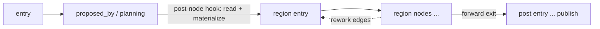

# B11 — Task Decomposition

> Reconstructed from code (`core/decomposition.py`, `core/flow/postprocess.py`, the fan-out in `core/orchestrator.py`) and tests (`tests/core/test_decomposition.py`, `tests/core/test_flow_postprocess.py`, `tests/core/test_recovery.py`, `tests/core/test_orchestrator.py`). The code is the only source of truth; this document was rebuilt from the implementation, not from prose or comments. Significant claims carry a `file:line` reference.

**Status:** documented · **Source modules:** `src/wastech_orchestrator/core/decomposition.py`, `src/wastech_orchestrator/core/flow/postprocess.py`

## Responsibility

Decide deterministically whether a task is split into a linear chain of subtasks, and own the on-disk subtask artifacts. The planning agent _recommends_ a split in its structured output; the core _decides_ by a fixed acceptance rule that the agent cannot weaken ([decomposition.py:106](../../../src/wastech_orchestrator/core/decomposition.py#L106)). A `DecompositionDecision` carries `accepted`, a machine `reason`, the unit count `n`, and the parsed `SubtaskSpec` tuple ([decomposition.py:57](../../../src/wastech_orchestrator/core/decomposition.py#L57)).

This block is pure decision + artifact mechanics. It does not drive the graph and does not commit: the flow engine (B28) runs the regions, and the orchestrator (B06) materializes the decision and fans the subtasks out. The thin read-side wrapper the engine post-node hook calls lives in `postprocess.read_decomposition` (B30, [postprocess.py:82](../../../src/wastech_orchestrator/core/flow/postprocess.py#L82)).

## Public surface

- `SubtaskSpec` ([decomposition.py:46](../../../src/wastech_orchestrator/core/decomposition.py#L46)) — frozen `(order, title, slug, acceptance_criteria, depends_on)` for one accepted subtask.
- `DecompositionDecision` ([decomposition.py:57](../../../src/wastech_orchestrator/core/decomposition.py#L57)) — frozen `(accepted, reason, n, subtasks)`.
- `decide_decomposition(structured_output, *, gate_on, max_subtasks)` ([decomposition.py:106](../../../src/wastech_orchestrator/core/decomposition.py#L106)) — the §5.1 deterministic acceptance rule.
- `write_subtask_artifacts(decision, artifacts_root, task_id)` ([decomposition.py:182](../../../src/wastech_orchestrator/core/decomposition.py#L182)) — writes `subtasks/index.json` + one immutable `NN-<slug>.md` per subtask.
- `update_subtask_index(artifacts_root, task_id, order, *, status, commit_sha=None)` ([decomposition.py:214](../../../src/wastech_orchestrator/core/decomposition.py#L214)) — atomic per-subtask status/SHA update.
- `subtask_spec_path(artifacts_root, task_id, order, slug)` ([decomposition.py:152](../../../src/wastech_orchestrator/core/decomposition.py#L152)) — the single source of the `NN-<slug>.md` filename.
- Reason codes `REASON_GATE_OFF` … `REASON_ACCEPTED` ([decomposition.py:31](../../../src/wastech_orchestrator/core/decomposition.py#L31)); status constants `SUBTASK_PENDING`/`SUBTASK_IN_PROGRESS`/`SUBTASK_COMMITTED` ([decomposition.py:39](../../../src/wastech_orchestrator/core/decomposition.py#L39)).
- `read_decomposition(outcome, *, gate_on, max_subtasks)` ([postprocess.py:82](../../../src/wastech_orchestrator/core/flow/postprocess.py#L82)) — flow-neutral wrapper that reads the `structured_output` contract off the node outcome and delegates to `decide_decomposition`.

## Behavior

### The deterministic acceptance rule

`decide_decomposition` short-circuits to a single unit (a rejecting decision with `n=1`, no subtasks — `_single_unit`, [decomposition.py:67](../../../src/wastech_orchestrator/core/decomposition.py#L67)) on the first failed condition, in order ([decomposition.py:113](../../../src/wastech_orchestrator/core/decomposition.py#L113)):

1. `gate_on` is false → `REASON_GATE_OFF`.
2. `structured_output` is not a mapping → `REASON_NOT_RECOMMENDED` ([decomposition.py:115](../../../src/wastech_orchestrator/core/decomposition.py#L115)).
3. `structured_output["decompose"]` is not exactly `True` → `REASON_NOT_RECOMMENDED` (the `is not True` check rejects truthy non-booleans, [decomposition.py:118](../../../src/wastech_orchestrator/core/decomposition.py#L118)).
4. `subtasks` is not a list/tuple (a `str`/`bytes` is rejected) → `REASON_NOT_RECOMMENDED` ([decomposition.py:120](../../../src/wastech_orchestrator/core/decomposition.py#L120)).
5. `n < 2` or `n > max_subtasks` → `REASON_N_OUT_OF_RANGE` ([decomposition.py:124](../../../src/wastech_orchestrator/core/decomposition.py#L124)). The lower bound `2` is hardcoded; only the upper bound is a parameter.
6. Any subtask malformed → `REASON_MALFORMED_SUBTASK` ([decomposition.py:128](../../../src/wastech_orchestrator/core/decomposition.py#L128)).
7. After sorting by `order`, orders must be exactly `1..n` and each `depends_on` value must satisfy `1 <= dep < order` (strictly earlier; no self-, forward-, or out-of-range dependency) → `REASON_NON_LINEAR_DEPENDENCIES` ([decomposition.py:135](../../../src/wastech_orchestrator/core/decomposition.py#L135)). A gap in orders (e.g. `[1, 3]`) is also reported under this reason because the `spec.order != index` check fires ([decomposition.py:139](../../../src/wastech_orchestrator/core/decomposition.py#L139)).

Per-subtask parsing (`_parse_subtask`, [decomposition.py:71](../../../src/wastech_orchestrator/core/decomposition.py#L71)) is defensive: `order` must be an `int` and explicitly not a `bool` (since `bool` subclasses `int`, [decomposition.py:82](../../../src/wastech_orchestrator/core/decomposition.py#L82)); `title`/`slug` must be non-blank strings; `acceptance_criteria` must be a non-empty sequence of non-blank strings (and not a bare `str`/`bytes`, [decomposition.py:88](../../../src/wastech_orchestrator/core/decomposition.py#L88)); `depends_on` must be a sequence of non-bool `int`s ([decomposition.py:92](../../../src/wastech_orchestrator/core/decomposition.py#L92)). Any deviation returns `None`, which the caller maps to `REASON_MALFORMED_SUBTASK`.

### Where the inputs come from

`gate_on` is resolved by the orchestrator: `_decomposition_gate_on` returns `config.agents.decomposition.enabled` ([orchestrator.py:1801](../../../src/wastech_orchestrator/core/orchestrator.py#L1801)), and `max_subtasks` is `config.agents.decomposition.max_subtasks` ([orchestrator.py:1161](../../../src/wastech_orchestrator/core/orchestrator.py#L1161), config field at [config/schema.py:121](../../../src/wastech_orchestrator/config/schema.py#L121)). The contract (`decompose`/`subtasks`) is read off the proposed_by node's `structured_output` by `read_decomposition` ([postprocess.py:90](../../../src/wastech_orchestrator/core/flow/postprocess.py#L90)) — the engine itself never inspects these fields.

### Artifacts

`write_subtask_artifacts` is a no-op when the decision is rejected ([decomposition.py:191](../../../src/wastech_orchestrator/core/decomposition.py#L191)), so a single-unit task leaves no `subtasks/` directory. For an accepted decision it creates `logs/<task-id>/subtasks/` and writes `index.json` (a list of entries, each `pending` with `commit_sha: None`, [decomposition.py:164](../../../src/wastech_orchestrator/core/decomposition.py#L164)) via a temp-file-plus-atomic-replace helper so the index is never half-written ([decomposition.py:175](../../../src/wastech_orchestrator/core/decomposition.py#L175)). Each subtask gets a `NN-<slug>.md` spec whose filename is supplied by `subtask_spec_path` (zero-padded order, [decomposition.py:161](../../../src/wastech_orchestrator/core/decomposition.py#L161)); an existing spec is never overwritten ([decomposition.py:201](../../../src/wastech_orchestrator/core/decomposition.py#L201)), so a restart that re-runs `write_subtask_artifacts` preserves the original specs.

`update_subtask_index` reloads the index, mutates the matching `order`'s `status` (and `commit_sha` if given), and re-writes atomically; an unknown order raises `KeyError` ([decomposition.py:234](../../../src/wastech_orchestrator/core/decomposition.py#L234)). All paths are rooted under `logs/<task-id>/` via `task_artifact_dir` ([decomposition.py:148](../../../src/wastech_orchestrator/core/decomposition.py#L148)) — never in the target repository.

### How decomposition is driven (region split → materialize → fan-out)

A flow opts into decomposition with a `decomposition:` block (B29) naming `proposed_by` (the planning node) and a `sub_flow` node set. The orchestrator's phased driver checks for that block; with none present the whole graph runs in one pass ([orchestrator.py:987](../../../src/wastech_orchestrator/core/orchestrator.py#L987)). With one present, `partition_decomposition` carves the graph into `pre` (entry…proposed_by), the per-subtask `region` (the `sub_flow`), and the `post` suffix ([engine_driver.py:58](../../../src/wastech_orchestrator/core/flow/engine_driver.py#L58)); the region exit is the single forward (non-rework) edge leaving the region ([engine_driver.py:69](../../../src/wastech_orchestrator/core/flow/engine_driver.py#L69)).

The engine runs `pre` once; planning's completion fires the post-node hook, which — for the `proposed_by` node — calls `_engine_materialize_decomposition` ([orchestrator.py:1151](../../../src/wastech_orchestrator/core/orchestrator.py#L1151)). Materialize resolves `gate_on`/`max_subtasks`, calls `read_decomposition`, stores the decision on the pipeline, persists `decomposition_enabled`/`decomposition_accepted`/`decomposition_reason`/`subtask_count`/`active_subtask` to the task row, and (only when accepted) writes the artifacts, registers `subtasks_index` + per-`subtask_spec` artifacts, and inserts the `subtasks` rows (B07) ([orchestrator.py:1156](../../../src/wastech_orchestrator/core/orchestrator.py#L1156)).

When the decision is accepted, `_fan_out_subtasks` runs the region once per subtask ([orchestrator.py:1009](../../../src/wastech_orchestrator/core/orchestrator.py#L1009)). For each unit it injects the active immutable spec path into `inputs.subtask_spec_path` (the source of `{subtask_spec_path}` for the edit prompts; `inputs.subtask_count` is set here too because the count was unknown when `inputs` was built, [orchestrator.py:1027](../../../src/wastech_orchestrator/core/orchestrator.py#L1027)), runs the region, then commits via `_commit_subtask` ([orchestrator.py:1045](../../../src/wastech_orchestrator/core/orchestrator.py#L1045)) — which makes one commit on the single task branch, mirrors the SHA into both `index.json` (`update_subtask_index`) and the store (`set_subtask_commit`), and advances `subtasks_completed`. Between subtasks (but not after the last) the run-state's per-loop counters are reset while the global fix counter accumulates (`reset_for_next_subtask`, [run_state.py:69](../../../src/wastech_orchestrator/core/flow/run_state.py#L69)), and `active_subtask` is bumped ([orchestrator.py:1041](../../../src/wastech_orchestrator/core/orchestrator.py#L1041)). After all subtasks the spec path is cleared and the `post` region runs once, whole-task ([orchestrator.py:1042](../../../src/wastech_orchestrator/core/orchestrator.py#L1042)).

### Recovery (B10)

On resume the fan-out reads already-committed orders from the store (`{s.order for s in get_subtasks(...) if s.commit_sha}`) and skips them ([orchestrator.py:1028](../../../src/wastech_orchestrator/core/orchestrator.py#L1028)), so a subtask with a verified commit is never re-run or re-committed; execution re-enters the region at the first uncommitted subtask. A resume rebuilds the decision from the task row + `subtasks` rows in `_rebuild_decomposition` ([orchestrator.py:800](../../../src/wastech_orchestrator/core/orchestrator.py#L800)) — note that the rebuilt `SubtaskSpec`s carry empty `acceptance_criteria` ([orchestrator.py:810](../../../src/wastech_orchestrator/core/orchestrator.py#L810)) because the criteria live only in the immutable `.md` spec, not the DB.

## Invariants & guarantees

- The agent recommends; the core decides. `decide_decomposition` is the sole accept/reject authority and cannot be relaxed by flow or agent — the only inputs are `gate_on` and `max_subtasks` ([decomposition.py:106](../../../src/wastech_orchestrator/core/decomposition.py#L106)).
- Subtask chains are strictly linear: orders are exactly `1..n` and each dependency references only a strictly-earlier order ([decomposition.py:138](../../../src/wastech_orchestrator/core/decomposition.py#L138)).
- A rejected decision writes nothing ([decomposition.py:191](../../../src/wastech_orchestrator/core/decomposition.py#L191), test at [test_decomposition.py:133](../../../tests/core/test_decomposition.py#L133)).
- Per-subtask `NN-<slug>.md` specs are immutable — written once, never overwritten ([decomposition.py:201](../../../src/wastech_orchestrator/core/decomposition.py#L201), test at [test_decomposition.py:123](../../../tests/core/test_decomposition.py#L123)).
- `index.json` writes are atomic (temp + replace, [decomposition.py:175](../../../src/wastech_orchestrator/core/decomposition.py#L175)); the on-disk index and the SQLite rows are updated together on each commit ([orchestrator.py:1049](../../../src/wastech_orchestrator/core/orchestrator.py#L1049)).
- A committed subtask is never re-run or re-committed on resume ([orchestrator.py:1030](../../../src/wastech_orchestrator/core/orchestrator.py#L1030), test at [test_recovery.py:708](../../../tests/core/test_recovery.py#L708)).
- All artifacts live under `logs/<task-id>/`, never in the target repo ([decomposition.py:148](../../../src/wastech_orchestrator/core/decomposition.py#L148)).

## Dependencies

- **Uses:** `providers.artifacts.task_artifact_dir` (artifact rooting, B20). **Used by:** B30 (`postprocess.read_decomposition` reads the contract), B06 (`_engine_materialize_decomposition` + `_fan_out_subtasks` materialize and drive), B28/B29 (the engine + `decomposition:` block partition the graph into pre/region/post, [engine_driver.py:58](../../../src/wastech_orchestrator/core/flow/engine_driver.py#L58)), B07 (the `subtasks` table mirrors `index.json`), B10 (resume from the first uncommitted subtask), B22 (Git Manager commits each subtask).

## Audit candidates

See [the audit](../../backlog/2026-06-21-audit.md).

- `src/wastech_orchestrator/core/flow/schema.py:134` — the flow `decomposition.gate` fields (`gate_min`, `gate_max`, `linear_depends_on`) are parsed ([snapshot.py:378](../../../src/wastech_orchestrator/core/flow/snapshot.py#L378)) but never consumed — bounds come from `config.agents.decomposition.max_subtasks` and the hardcoded floor of `2`, and linearity is always enforced regardless of `linear_depends_on`. The packaged flow sets `gate: { min: 2, max: 8, linear_depends_on: true }` ([implementation.yaml:89](../../../src/wastech_orchestrator/core/flow/packaged/implementation.yaml#L89)), implying the YAML controls the bounds when it does not.
- `src/wastech_orchestrator/core/flow/schema.py:137` — `commit_each_subtask` (flow block) and `commit_per_subtask` (config, [config/schema.py:125](../../../src/wastech_orchestrator/config/schema.py#L125)) are parsed but never read at runtime; `_fan_out_subtasks` unconditionally commits each subtask ([orchestrator.py:1038](../../../src/wastech_orchestrator/core/orchestrator.py#L1038)) — two vestigial knobs that look like they gate per-subtask commits but do not.
- `src/wastech_orchestrator/core/decomposition.py:9` — the module docstring says the gate can be on via "the per-task `decompose` tri-state", but no such field exists on `NormalizedTask` (only `auto_merge`/`prompt_audit` are task-wins, [task/model.py:34](../../../src/wastech_orchestrator/task/model.py#L34)) and `_decomposition_gate_on` returns only the config default ([orchestrator.py:1805](../../../src/wastech_orchestrator/core/orchestrator.py#L1805)); stale docstring.
- `src/wastech_orchestrator/config/schema.py:124` — `min_size_signal` is documented as an advisory threshold passed to the planning prompt ([config.example.yaml:34](../../../src/wastech_orchestrator/templates/config.example.yaml#L34)) but is never referenced outside config load/scaffolding; effectively dead config.

## Tests

- `tests/core/test_decomposition.py` — the acceptance rule end to end: gate-off, well-formed accept (linear deps), `decompose:false`/missing output, `n<2` and `n>max`, malformed subtask, forward/self/non-sequential dependency rejections; artifact write + atomic index update; spec immutability; rejected-decision-writes-nothing.
- `tests/core/test_flow_postprocess.py` — `read_decomposition` accepts a valid contract, returns single-unit on gate-off, and on `decompose:false` ([test_flow_postprocess.py:106](../../../tests/core/test_flow_postprocess.py#L106)).
- `tests/core/test_recovery.py` — resume of a decomposed task: subtask 1 already committed is not re-committed and execution continues to subtask 2 ([test_recovery.py:660](../../../tests/core/test_recovery.py#L660)).
- `tests/core/test_orchestrator.py` — the decomposed task commits each subtask ([test_orchestrator.py:765](../../../tests/core/test_orchestrator.py#L765)); the active spec path reaches the implementation prompt ([test_orchestrator.py:842](../../../tests/core/test_orchestrator.py#L842)); the supervisor summary is written once per whole task, not per subtask ([test_orchestrator.py:413](../../../tests/core/test_orchestrator.py#L413)).
