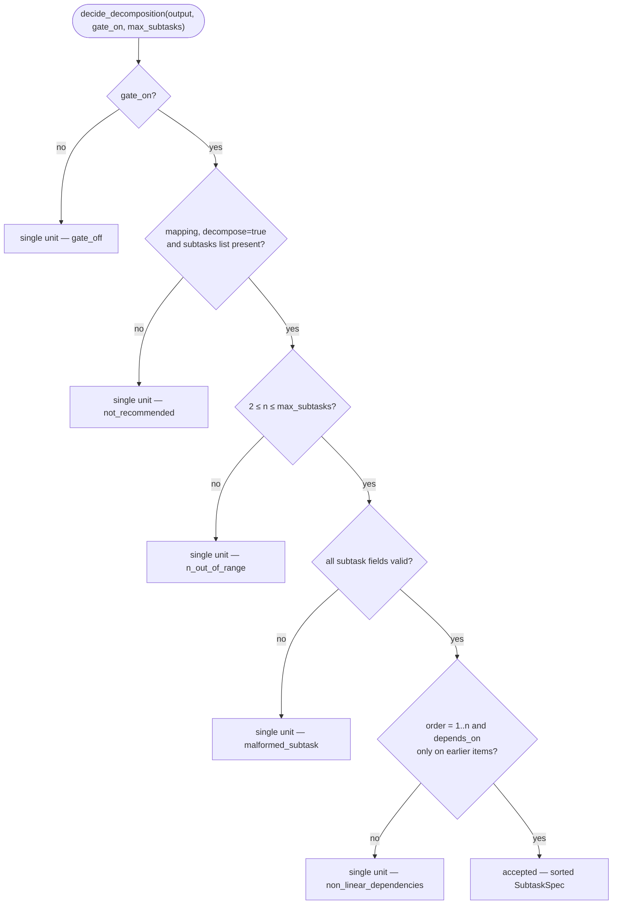

# B11 — Task Decomposition

## Purpose

Deterministically decides whether to split a task into subtasks based on structured output from the `planning` stage, and persists subtask artifacts. Implements the "agent proposes — core decides" principle: the planner may _recommend_ a split, but the core accepts it only according to a hard rule (the agent cannot relax `max_subtasks`, routing, or security). Disabled by default.

## Responsibilities

- Apply the acceptance rule §5.1 to the structured planning output ([decomposition.py:106-145](../../../src/wastech_orchestrator/core/decomposition.py#L106)).
- Write `subtasks/index.json` and one immutable `NN-<slug>.md` per subtask ([decomposition.py:170-199](../../../src/wastech_orchestrator/core/decomposition.py#L170)).
- Transactionally update subtask status/`commit_sha` in the index ([decomposition.py:202-224](../../../src/wastech_orchestrator/core/decomposition.py#L202)).

## Block Boundaries

### Within this block's responsibility

- Deterministic accept/reject decision (with a reason code) and subtask file artifacts.

### Outside this block's responsibility

- **Launching subtasks** (the implement→test→review→fix cycle per unit) — that is [B06](./B06-orchestrator-pipeline.md).
- **Persisting subtasks to SQLite** — that is [B07 `insert_subtasks`/`set_subtask_commit`](./B07-state-machine-and-store.md).
- **Resolving `gate_on`** (config `decomposition.enabled` + per-task `decompose` tri-state) — that is [B06 `_decomposition_gate_on`](./B06-orchestrator-pipeline.md).
- **Validating the planning output schema** — that is [B12 `parse_typed_stage_output`](./B12-hitl-and-typed-output.md); the input is rechecked defensively here.

## Entry Points

- `decide_decomposition(structured_output, *, gate_on, max_subtasks)` → `DecompositionDecision` ([decomposition.py:106](../../../src/wastech_orchestrator/core/decomposition.py#L106)) — [B06 `_planning`](./B06-orchestrator-pipeline.md) ([orchestrator.py:1093](../../../src/wastech_orchestrator/core/orchestrator.py#L1093)).
- `write_subtask_artifacts` / `update_subtask_index` ([decomposition.py:170,202](../../../src/wastech_orchestrator/core/decomposition.py#L170)) — [B06](./B06-orchestrator-pipeline.md).
- `SubtaskSpec`, `DecompositionDecision`, reason codes, `SUBTASK_*` statuses.

## Input Data and State

Structured planning output (`decompose`, `subtasks[]`), `gate_on` flag, `max_subtasks`. State consists of files under `logs/<task-id>/subtasks/` (source for the index, supplemented by SQLite in [B07](./B07-state-machine-and-store.md)).

## Main Scenario (`decide_decomposition`)

1. `gate_on=False` → single unit (`gate_off`).
2. No mapping / `decompose != True` / no `subtasks` list → single unit (`not_recommended`).
3. `n < 2` or `n > max_subtasks` → single unit (`n_out_of_range`).
4. Any subtask with invalid fields → single unit (`malformed_subtask`).
5. `order` is not exactly `1..n`, or `depends_on` references non-strictly earlier items → single unit (`non_linear_dependencies`).
6. Otherwise → `accepted` with sorted `SubtaskSpec`.

The deterministic acceptance rule §5.1 — the first failed check yields "single unit" with a reason code (the agent cannot relax the limit, routing, or dependency linearity):

## Checks and Constraints

- `2 ≤ n ≤ max_subtasks`; `order == 1..n`; `depends_on` — only strictly earlier items (linear, no forward references or cycles) ([decomposition.py:124-144](../../../src/wastech_orchestrator/core/decomposition.py#L124)).
- Subtask fields are validated by type; `bool` is rejected where `int` is expected ([decomposition.py:71-103](../../../src/wastech_orchestrator/core/decomposition.py#L71)).
- `NN-<slug>.md` files are immutable — never overwritten; `index.json` is written atomically ([decomposition.py:163-199](../../../src/wastech_orchestrator/core/decomposition.py#L163)).

## Output

`DecompositionDecision(accepted, reason, n, subtasks)`; on disk — `subtasks/index.json` and subtask specs. The actual run and persistence are performed by [B06](./B06-orchestrator-pipeline.md)/[B07](./B07-state-machine-and-store.md).

## Side Effects

- Writing `subtasks/index.json` and `NN-<slug>.md` under `logs/<task-id>/` (never into the target repository).
- `update_subtask_index` atomically updates the index.

## Errors and Edge Cases

- Any structural defect → "single unit" with a reason code (not an exception).
- `update_subtask_index` when the order is missing from the index → `KeyError` ([decomposition.py:222-223](../../../src/wastech_orchestrator/core/decomposition.py#L222)).

## Relationships

### Uses

- [B20 — Artifacts](./B20-artifact-layout.md) — `task_artifact_dir`.

### Used by

- [B06 — Pipeline](./B06-orchestrator-pipeline.md) — `planning` (decision), unit loop, index update on subtask commit; restoring decomposition on resume.
- [B12 — HITL/typed output](./B12-hitl-and-typed-output.md) — neighboring validator for planning output (subtask schema).

## Place in the Overall System

Decomposition is an optional sub-phase of `planning`. When accepted, [B06](./B06-orchestrator-pipeline.md) runs each subtask as a separate unit (with its own local commit), while the global `fix_iterations` counter ([B09](./B09-fix-loop-control.md)) continues to accumulate, preventing the hard stop from being bypassed.

## Code Confirmation

- [core/decomposition.py:106-224](../../../src/wastech_orchestrator/core/decomposition.py#L106) — acceptance rule, artifacts, index update.
- Test: [tests/core/test_decomposition.py](../../../tests/core/test_decomposition.py) — each reason code, dependency linearity, spec immutability.
