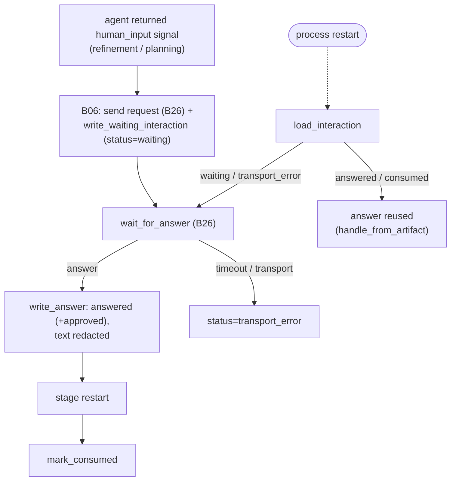

# B12 — HITL and Typed Stage Output

## Purpose

Provides "human-in-the-loop" (HITL) and strict parsing of structured output from agent stages. Two interconnected functions: (1) validate typed output from `refinement`/`planning` and extract a human-request signal from it; (2) persist and resume durable HITL interactions as artifact files so that an interrupted request survives a process restart.

## Responsibilities

- Define strict output schemas for HITL stages and validate output independently of the provider ([hitl.py:96-165](../../../src/wastech_orchestrator/core/hitl.py#L96)).
- Parse the `human_input` signal (kind, text, risk, normalized repo-relative paths) ([hitl.py:168-198](../../../src/wastech_orchestrator/core/hitl.py#L168)).
- Persist interactions (waiting/answer/consumed/reconsidering) atomically and be able to reload them ([hitl.py:308-415](../../../src/wastech_orchestrator/core/hitl.py#L308)).
- Produce deterministic interaction IDs (within Telegram callback limits) ([hitl.py:290-305](../../../src/wastech_orchestrator/core/hitl.py#L290)).

## Block Boundaries

### Within this block's responsibility

- Strict validation of typed output and the signal; durable persist/resume of HITL artifacts; deterministic IDs; reconstruction of `AskHandle` from an artifact.

### Outside this block's responsibility

- **Transport** (sending/polling for an answer) — that is [B26 `Notifier`](./B26-notifications-telegram.md).
- **Round-trip orchestration** (when to ask, wait, restart a node) — the durable round-trip is the flow `HumanGate` ([core/flow/nodes/human_gate.py](../../../src/wastech_orchestrator/core/flow/nodes/human_gate.py)) driven by the agent/evaluator node runners and the standalone `hitl` gate node ([core/flow/nodes/hitl.py](../../../src/wastech_orchestrator/core/flow/nodes/hitl.py)); the check-set-change approval at preflight is [B06](./B06-orchestrator-pipeline.md) `_ask_check_command_approval` ([orchestrator.py:1198](../../../src/wastech_orchestrator/core/orchestrator.py#L1198)).
- **Redaction rules** — [B21](./B21-secret-redaction.md); **artifact catalog** — [B20](./B20-artifact-layout.md).
- **Dangerous diff classification** — [B14](./B14-dangerous-diff-guardrail.md); **decomposition parsing** — [B11](./B11-task-decomposition.md) (only the subtask schema is validated here).

## Entry Points

- `stage_output_schema(stage)` ([hitl.py:96](../../../src/wastech_orchestrator/core/hitl.py#L96)) — placed into `AgentRunRequest.output_schema` ([orchestrator.py:1762](../../../src/wastech_orchestrator/core/orchestrator.py#L1762)).
- `parse_typed_stage_output(stage, structured)` → `TypedStageOutput` ([hitl.py:131](../../../src/wastech_orchestrator/core/hitl.py#L131)) — [B06 `_typed_output`](./B06-orchestrator-pipeline.md).
- Interaction utilities: `interaction_path`/`guardrail_interaction_path`/`discovery_interaction_path`, `interaction_id`/`discovery_interaction_id`, `load_interaction`, `write_waiting_interaction`, `write_answer`, `mark_consumed`/`mark_interaction_status`, `reset_pending_interactions`, `consume_pending_interactions`, `handle_from_artifact` — all consumed by [B06](./B06-orchestrator-pipeline.md).
- Types: `HumanInputSignal`, `TypedStageOutput`, `StageOutputError`.

## Inputs and State

Structured stage output; `AskHandle`/`AskResult` from [B26](./B26-notifications-telegram.md); `artifacts_root`, `task_id`, `stage`, optional `subtask`/`cycle`. State — JSON artifacts under `logs/<task-id>/hitl/`.

## Main Scenario (typed output + request)

1. `parse_typed_stage_output` strictly checks the key set and types; for planning — `decompose`/`subtasks`/`skills`; extracts the `human_input` signal (or `None`).
2. If a signal is present, [B06](./B06-orchestrator-pipeline.md) sends the request via [B26](./B26-notifications-telegram.md) and writes `write_waiting_interaction` (status `waiting`, redacted text/context).
3. `wait_for_answer` ([B26](./B26-notifications-telegram.md)) → `write_answer` (status `answered`/error code, redacted answer, `approved`).
4. After a successful stage restart — `mark_consumed`.

The HITL interaction lifecycle is durable: the artifact on disk allows resumption after a process crash even while waiting for an answer:

## Alternative Scenarios

### Resume After Restart

`load_interaction` reads the artifact; `waiting`/`transport_error` → can wait/re-request; `answered`/`consumed` → answer is reused; `handle_from_artifact` reconstructs `AskHandle` (strict field validation) ([hitl.py:418-459](../../../src/wastech_orchestrator/core/hitl.py#L418)).

### Continue / Finalize

`reset_pending_interactions` deletes incomplete (`waiting`/`transport_error`) artifacts for `rerun --continue`; `consume_pending_interactions` marks them `consumed` for `finalize` ([hitl.py:378-415](../../../src/wastech_orchestrator/core/hitl.py#L378)).

## Constraints and Checks

- Only `refinement`/`planning` may request a human ([hitl.py:23,135-136](../../../src/wastech_orchestrator/core/hitl.py#L23)).
- The output key set must be **exact**; `content` must be a string; signal: `kind∈{question,approval}`, bounded `question`/`context`, `risk∈{clarification,deletion,dependency,other}`, paths must be repo-relative, no `..`/absolute paths, ≤100 ([hitl.py:140-198,253-260](../../../src/wastech_orchestrator/core/hitl.py#L140)).
- Text/context/answer are redacted before writing; writes are atomic (temp+replace) ([hitl.py:336-337,356,462-469](../../../src/wastech_orchestrator/core/hitl.py#L336)).
- Corrupt artifact/handle → `StageOutputError` (fail-closed) ([hitl.py:308-315,458-459](../../../src/wastech_orchestrator/core/hitl.py#L308)).

## Output

`TypedStageOutput(content, human_input, structured, skills)`; JSON interaction artifacts on disk; reconstructed `AskHandle`. HITL artifact contents are redacted and auditable.

## Side Effects

- Write/read/delete/mark JSON artifacts under `logs/<task-id>/hitl/`.
- `stage_output_schema`/`parse_typed_stage_output` are pure-functional (no IO).

## Errors and Edge Cases

- Malformed typed output → `StageOutputError` (Core converts to `PipelineFailed`).
- Undelivered request → artifact with status `transport_error`; failed answer → corresponding error code.
- Path outside the repository or containing `..` → `StageOutputError` during normalization.

## Relationships

### Uses

- [B26 — Telegram](./B26-notifications-telegram.md) — types `AskHandle`/`AskKind`/`AskResult`.
- [B21 — Redaction](./B21-secret-redaction.md) — `redact_text` for text/answer.
- [B20 — Artifacts](./B20-artifact-layout.md) — `task_artifact_dir`.

### Used by

- [B06 — Pipeline](./B06-orchestrator-pipeline.md) — round-trip refinement/planning, guardrail for editing stages, approval of changed check sets.
- [B11 — Decomposition](./B11-task-decomposition.md) — adjacent parsing of planning output (subtask schema).

## Role in the Overall System

Makes "human pause" points durable: even if the process crashes while waiting for an answer, the artifact allows [B06](./B06-orchestrator-pipeline.md) to resume correctly. Strict output validation is the trust boundary for the agent: the core accepts only what has passed schema validation and normalization.

## Code Evidence

- [core/hitl.py:96-260](../../../src/wastech_orchestrator/core/hitl.py#L96) — schemas and validation of typed output and signal.
- [core/hitl.py:263-470](../../../src/wastech_orchestrator/core/hitl.py#L263) — paths/IDs/persist/resume for interactions, `handle_from_artifact`.
- Tests: [tests/core/test_hitl.py](../../../tests/core/test_hitl.py), [tests/core/test_check_discovery_hitl.py](../../../tests/core/test_check_discovery_hitl.py) — validation, persist/resume, reset/consume, handle reconstruction.
