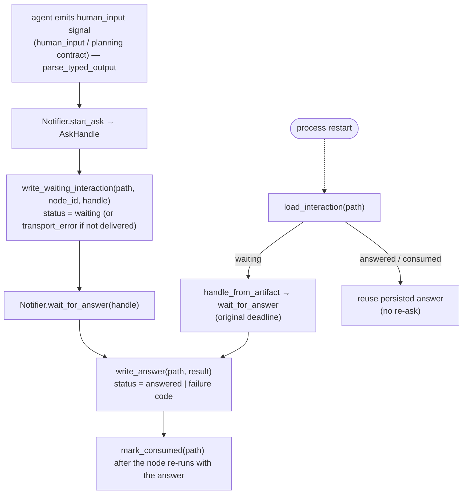

# B12 — HITL and Typed Node Output

> Reconstructed from code (`core/hitl.py`, `notify/interface.py`) and tests (`tests/core/test_hitl.py`, `tests/core/test_flow_node_runners.py`, `tests/core/test_recovery.py`). The code is the only source of truth; this document was rebuilt from the implementation, not from prose or comments. Significant claims carry a `file:line` reference.

**Status:** documented · **Source modules:** `src/wastech_orchestrator/core/hitl.py`, `src/wastech_orchestrator/notify/interface.py`

## Responsibility

This block owns two things: (1) the **typed node-output contract** for a flow node that may pause for a human — selected by a per-node `OutputContract` (`"human_input"` / `"planning"`), never by a stage name — and its strict, provider-independent validator `parse_typed_output`, which surfaces an optional `HumanInputSignal`; and (2) the **durable interaction-artifact lifecycle** (JSON files under `logs/<task-id>/hitl/`) that records a human round-trip so it survives a process restart. It does not perform the round-trip itself and does not know any transport: the actual ask/wait primitive is `HumanGate` ([B30](B30-flow-node-runners.md)), and the transport is the `Notifier` ([B26](B26-notifications-telegram.md)). This block defines the schema, the validation, the path/id helpers, and the read/write/mark/reset helpers that `HumanGate` and the node runners build on.

The strict validator is the trust boundary against the agent: the JSON schema returned by `typed_output_schema` is only advisory (it is handed to the provider as `output_schema`), and `parse_typed_output` re-validates the structured result independently of any provider-side schema enforcement ([hitl.py:100](../../../src/wastech_orchestrator/core/hitl.py#L100), [hitl.py:140](../../../src/wastech_orchestrator/core/hitl.py#L140)). There is no `jsonschema` call anywhere in the Core for this — the hand-written parser is the enforcement.

## Public surface

- `OutputContract` ([hitl.py:26](../../../src/wastech_orchestrator/core/hitl.py#L26)) — `Literal["none", "human_input", "planning"]`, the per-node selector for the typed-output schema/parser (derived from the node's declared structure, never a stage name).
- `StageOutputError(ValueError)` ([hitl.py:75](../../../src/wastech_orchestrator/core/hitl.py#L75)) — raised on any malformed typed result, artifact, or handle (the fail-closed signal).
- `HumanInputSignal` ([hitl.py:79](../../../src/wastech_orchestrator/core/hitl.py#L79)) — one validated `kind`/`question`/`context`/`risk`/`paths` request, frozen.
- `TypedStageOutput` ([hitl.py:90](../../../src/wastech_orchestrator/core/hitl.py#L90)) — `content`, optional `human_input`, the raw `structured` mapping, and planning's proposed `skills` tuple.
- `typed_output_schema(contract)` ([hitl.py:100](../../../src/wastech_orchestrator/core/hitl.py#L100)) — the strict provider schema for the `human_input`/`planning` contract, else `None`.
- `parse_typed_output(contract, structured)` ([hitl.py:140](../../../src/wastech_orchestrator/core/hitl.py#L140)) — the independent validator → `TypedStageOutput`.
- Path/id helpers: `interaction_path` ([hitl.py:272](../../../src/wastech_orchestrator/core/hitl.py#L272)), `guardrail_interaction_path` ([hitl.py:284](../../../src/wastech_orchestrator/core/hitl.py#L284)), `node_interaction_path` ([hitl.py:300](../../../src/wastech_orchestrator/core/hitl.py#L300)), `interaction_id` ([hitl.py:315](../../../src/wastech_orchestrator/core/hitl.py#L315)). `discovery_interaction_path` / `discovery_interaction_id` ([hitl.py:325](../../../src/wastech_orchestrator/core/hitl.py#L325), [hitl.py:330](../../../src/wastech_orchestrator/core/hitl.py#L330)) remain defined but are **no longer called** by any code path — the check-command-set approval that used them was removed with the checks-monorepo change.
- Artifact lifecycle: `iter_task_interactions` ([hitl.py:337](../../../src/wastech_orchestrator/core/hitl.py#L337) — yields every `hitl/*.json` for a task; the dangerous-diff guard uses it to honor a prior in-task approval of an identical diff, see [B30](B30-flow-node-runners.md)), `load_interaction` ([hitl.py:353](../../../src/wastech_orchestrator/core/hitl.py#L353)), `write_waiting_interaction` ([hitl.py:363](../../../src/wastech_orchestrator/core/hitl.py#L363)), `write_answer` ([hitl.py:396](../../../src/wastech_orchestrator/core/hitl.py#L396)), `mark_consumed` ([hitl.py:407](../../../src/wastech_orchestrator/core/hitl.py#L407)), `mark_interaction_status` ([hitl.py:415](../../../src/wastech_orchestrator/core/hitl.py#L415)), `reset_pending_interactions` ([hitl.py:430](../../../src/wastech_orchestrator/core/hitl.py#L430)), `consume_pending_interactions` ([hitl.py:451](../../../src/wastech_orchestrator/core/hitl.py#L451)), `handle_from_artifact` ([hitl.py:470](../../../src/wastech_orchestrator/core/hitl.py#L470)).
- Transport contract (from `notify/interface.py`): `AskKind` ([interface.py:14](../../../src/wastech_orchestrator/notify/interface.py#L14)), `AskHandle` ([interface.py:18](../../../src/wastech_orchestrator/notify/interface.py#L18)), `AskResult` ([interface.py:35](../../../src/wastech_orchestrator/notify/interface.py#L35)).

## Behavior

### HITL capability is a node setting; the schema follows a per-node contract

Two independent per-node decisions drive HITL, and **neither is a stage name**. (1) The runtime _decision_ to ask is the node's declared `hitl` capability: the agent node runner does a round-trip only if the node declares `hitl` with `allow_question`/`allow_approval` (`_wants_hitl`, [agent.py:497](../../../src/wastech_orchestrator/core/flow/nodes/agent.py#L497)). (2) Which typed-output schema/parser applies is the node's `OutputContract`, derived in `AgentNodeRunner._contract` ([agent.py:159](../../../src/wastech_orchestrator/core/flow/nodes/agent.py#L159)): the decomposition proposer (the node named by `decomposition.proposed_by`) gets `"planning"`; any other HITL-capable node gets `"human_input"`; a plain author node gets `"none"`. `typed_output_schema` returns a schema for the `human_input`/`planning` contracts and `None` for `"none"` ([hitl.py:100](../../../src/wastech_orchestrator/core/hitl.py#L100)), and `parse_typed_output` raises `StageOutputError` for the `"none"` contract ([hitl.py:144](../../../src/wastech_orchestrator/core/hitl.py#L144)). In the packaged implementation flow the node ids equal the old stage values, so the contract resolves the way `refinement` (`human_input`) and `planning` (`planning`) used to — but the selector is the node's structure, not its id.

### The typed node-output schema per contract

The `human_input` contract requires exactly `{content, human_input}`; the `planning` contract requires exactly `{content, human_input, decompose, subtasks, skills}` ([hitl.py:107](../../../src/wastech_orchestrator/core/hitl.py#L107), [hitl.py:117](../../../src/wastech_orchestrator/core/hitl.py#L117)). Both are `additionalProperties: false`. `human_input` is `_HUMAN_INPUT_SCHEMA` ([hitl.py:34](../../../src/wastech_orchestrator/core/hitl.py#L34)): nullable object with required `{kind, question, context, risk, paths}`, where `kind ∈ {question, approval}`, `question` is 1..16000 chars, `context` ≤16000, `risk ∈ {clarification, deletion, dependency, other}` (sorted `_RISKS`, [hitl.py:28](../../../src/wastech_orchestrator/core/hitl.py#L28)), and `paths` is ≤100 strings of 1..512 chars. For the `planning` contract, `subtasks` items follow `_SUBTASK_SCHEMA` ([hitl.py:54](../../../src/wastech_orchestrator/core/hitl.py#L54)) — required `{order≥1, title, slug, acceptance_criteria(≥1), depends_on(int≥1)}` — and `skills` is ≤20 strings of 1..128 chars.

`parse_typed_output` re-checks all of this by hand rather than trusting the schema. It rejects a non-`Mapping` ([hitl.py:146](../../../src/wastech_orchestrator/core/hitl.py#L146)), enforces the **exact** key set per contract ([hitl.py:154](../../../src/wastech_orchestrator/core/hitl.py#L154)), requires `content` to be a string ([hitl.py:157](../../../src/wastech_orchestrator/core/hitl.py#L157)), and for the `planning` contract validates `decompose` is a bool, `subtasks` is a list passed through `_validate_subtasks` ([hitl.py:210](../../../src/wastech_orchestrator/core/hitl.py#L210)), and `skills` through `_validate_skills` ([hitl.py:244](../../../src/wastech_orchestrator/core/hitl.py#L244)). `_validate_skills` returns the proposed names verbatim — de-duplication and matching against the real inventory is the deterministic job of `core.skills.resolve_planning_skills` ([B13](B13-skill-selection.md)), not this block. The signal, if non-null, is built by `_parse_signal` ([hitl.py:177](../../../src/wastech_orchestrator/core/hitl.py#L177)), which strips `question`/`context`, validates `risk`, and normalizes `paths`. Path normalization (`_normalize_path`, [hitl.py:262](../../../src/wastech_orchestrator/core/hitl.py#L262)) backslash-converts, rejects absolute paths and any `..` component, and the set of normalized paths is **deduplicated and sorted** into a tuple ([hitl.py:200](../../../src/wastech_orchestrator/core/hitl.py#L200)) — verified by `test_human_input_paths_are_normalized_as_an_exact_set` ([test_hitl.py:38](../../../tests/core/test_hitl.py#L38)).

`typed_output_schema(contract)` is wired into the agent request at [agent.py:377](../../../src/wastech_orchestrator/core/flow/nodes/agent.py#L377) (a node may override it with its own `output_schema`); the evaluator request sends no schema and parses findings directly ([evaluator.py:175](../../../src/wastech_orchestrator/core/flow/nodes/evaluator.py#L175)). The agent runner converts a `StageOutputError` from the parser into a `NodeInfraError` ([agent.py:155](../../../src/wastech_orchestrator/core/flow/nodes/agent.py#L155)).

### The durable transport handle and result

The block depends on two value types from the `Notifier` contract. `AskHandle` ([interface.py:18](../../../src/wastech_orchestrator/notify/interface.py#L18)) is a frozen, **secret-free** handle persisted before waiting: `interaction_id`, `kind`, `expires_at` (a Unix timestamp so a restarted process waits against the _original_ deadline), and Telegram correlation metadata `message_id` / `update_offset`, plus a `delivered` flag. `AskResult` ([interface.py:35](../../../src/wastech_orchestrator/notify/interface.py#L35)) is the outcome: `answered`, `text` (free-form reply for `question`), `approved` (`True`/`False`/`None` for `approval`), `timed_out`, and a `failure ∈ {timeout, transport_error, invalid_response}` ([interface.py:15](../../../src/wastech_orchestrator/notify/interface.py#L15)). The `NullNotifier` ([interface.py:99](../../../src/wastech_orchestrator/notify/interface.py#L99)) fails closed — its `start_ask` returns an undelivered handle (`delivered=False`, `expires_at=0.0`) and `wait_for_answer` returns `failure="transport_error"` — so a missing transport is the same as a transport failure.

### Interaction-path keying

Every artifact lives under `task_artifact_dir(...)/hitl/` ([hitl.py:281](../../../src/wastech_orchestrator/core/hitl.py#L281), `task_artifact_dir` from [B20](B20-artifact-layout.md)). The filename encodes the interaction key — the flow `node_id` — so different kinds of gate never collide:

- `interaction_path` — `<node_id>.json` (`-subtask-<N>` suffix when decomposed) — the embedded refinement/planning HITL ([hitl.py:272](../../../src/wastech_orchestrator/core/hitl.py#L272)). (For the implementation flow the node ids equal the old stage values, so `refinement.json` / `planning.json` are unchanged in practice.)
- `guardrail_interaction_path` — `guardrail-<node_id>[-subtask-N]-cycle-<C>.json` — the dangerous-diff approval ([B14](B14-dangerous-diff-guardrail.md)), keyed by fix cycle so each re-edit asks afresh ([hitl.py:284](../../../src/wastech_orchestrator/core/hitl.py#L284)).
- `node_interaction_path` — `node-<node_id>[-subtask-N].json`, prefixed `node-` precisely so it can never collide with the unprefixed embedded-HITL file for the same node — the standalone `hitl` gate node ([hitl.py:300](../../../src/wastech_orchestrator/core/hitl.py#L300)).
- `discovery_interaction_path` — `check-discovery.json` ([hitl.py:325](../../../src/wastech_orchestrator/core/hitl.py#L325)) — defined but no longer used (the former check-command-set approval, now removed).

`interaction_id(task_id, node_id, subtask)` ([hitl.py:315](../../../src/wastech_orchestrator/core/hitl.py#L315)) produces a deterministic id `"h" + sha256(task:node_id:subtask)[:24]` that fits Telegram callback-data limits. `discovery_interaction_id` ([hitl.py:330](../../../src/wastech_orchestrator/core/hitl.py#L330)) prefixes `"d"` and folds a signature into the hash; it is likewise vestigial now that no caller drives a discovery approval.

### The durable round-trip lifecycle

The contract is **write `waiting` (with the handle) before asking → wait against the persisted deadline → `write_answer` → `mark_consumed`**. This block supplies the primitives; `HumanGate` ([B30](B30-flow-node-runners.md), `human_gate.py`) sequences them in `request`/`resume`.

`write_waiting_interaction` ([hitl.py:347](../../../src/wastech_orchestrator/core/hitl.py#L347)) writes `schema_version: 1`, a `"node_id"` key (the interaction's flow node id, [hitl.py:360](../../../src/wastech_orchestrator/core/hitl.py#L360)), the handle (`asdict`), the redacted request (`redact_text` on `question`/`context`, [hitl.py:366](../../../src/wastech_orchestrator/core/hitl.py#L366)), `deadline = handle.expires_at`, and a status that is `"waiting"` **only if `handle.delivered`** — an undelivered prompt is persisted directly as `"transport_error"` with `failure="transport_error"` ([hitl.py:362](../../../src/wastech_orchestrator/core/hitl.py#L362)). `write_answer` ([hitl.py:380](../../../src/wastech_orchestrator/core/hitl.py#L380)) loads the artifact (raising if missing), sets `status` to `"answered"` when `result.failure is None` else to the failure string, redacts `result.text`, and records `approved`/`failure`. `mark_consumed` ([hitl.py:391](../../../src/wastech_orchestrator/core/hitl.py#L391)) and `mark_interaction_status` ([hitl.py:399](../../../src/wastech_orchestrator/core/hitl.py#L399)) flip the status field in place (the latter is used for the guardrail's intermediate `reconsidering`/`reconsidered` states, [agent.py:339](../../../src/wastech_orchestrator/core/flow/nodes/agent.py#L339)). All writes go through `_atomic_json` ([hitl.py:491](../../../src/wastech_orchestrator/core/hitl.py#L491)) — write to `.tmp`, then `replace` — so a crash never leaves a half-written artifact, and content is `sort_keys=True`, `ensure_ascii=False`.

`HumanGate.request` ([human_gate.py:37](../../../src/wastech_orchestrator/core/flow/nodes/human_gate.py#L37)) starts the ask, persists `waiting`, waits, then writes the answer; `HumanGate.resume` ([human_gate.py:67](../../../src/wastech_orchestrator/core/flow/nodes/human_gate.py#L67)) reconstructs the handle via `handle_from_artifact` and waits against the original deadline. The agent runner's `_run_with_hitl` ([agent.py:90](../../../src/wastech_orchestrator/core/flow/nodes/agent.py#L90)) loads any persisted interaction first: a `waiting` one is resumed, an `answered`/`consumed` one is re-validated and reused without re-asking, any other status fails closed to `manual_action_required` ([agent.py:136](../../../src/wastech_orchestrator/core/flow/nodes/agent.py#L136)). `test_resume_waits_on_persisted_planning_prompt_without_resending` ([test_recovery.py:553](../../../tests/core/test_recovery.py#L553)) proves the end-to-end resume: a pre-written `waiting` planning prompt is waited on (no second `start_ask`) and ends `consumed`.

### `handle_from_artifact` — strict reconstruction

Rebuilding an `AskHandle` from persisted JSON is the most defensive path: `handle_from_artifact` ([hitl.py:447](../../../src/wastech_orchestrator/core/hitl.py#L447)) requires `interaction_id` (non-empty, ≤64 chars), a valid `kind`, a finite non-bool `expires_at`, a positive `message_id` if present, a non-negative `update_offset` if present, and enforces the invariant that a `delivered` handle has a `message_id` ([hitl.py:477](../../../src/wastech_orchestrator/core/hitl.py#L477)). Any failure becomes `StageOutputError("HITL artifact handle is malformed")` ([hitl.py:488](../../../src/wastech_orchestrator/core/hitl.py#L488)) — `test_persisted_handle_rejects_invalid_kind` ([test_hitl.py:109](../../../tests/core/test_hitl.py#L109)).

### Continue and finalize cleanup

For `rerun --continue`, `reset_pending_interactions` ([hitl.py:407](../../../src/wastech_orchestrator/core/hitl.py#L407)) **deletes** un-answered artifacts so the re-entered node asks fresh instead of replaying a stale prompt; `answered`/`consumed` artifacts are left intact (the resume engine skips those nodes). It is called from `continue_task` ([orchestrator.py:496](../../../src/wastech_orchestrator/core/orchestrator.py#L496)). For `finalize`, `consume_pending_interactions` ([hitl.py:428](../../../src/wastech_orchestrator/core/hitl.py#L428)) instead **marks** the same un-answered artifacts `consumed` (preserving the audit artifact) so a later resume can't act on a prompt for an already-finalized task — called at [orchestrator.py:606](../../../src/wastech_orchestrator/core/orchestrator.py#L606), tested by `test_consume_pending_interactions_closes_only_unanswered` ([test_hitl.py:164](../../../tests/core/test_hitl.py#L164)). Both helpers act on the full un-answered set `_RESETTABLE_STATUSES` — `waiting` plus every `AskFailure` (`transport_error`, `timeout`, `invalid_response`, derived from the `AskFailure` Literal so a new failure mode is covered automatically) — so a `timeout`/`invalid_response` interaction is never skipped (which would otherwise block the re-entered node at `manual_action_required`).

## Invariants & guarantees

- **Fail-closed everywhere.** A missing/malformed artifact ([hitl.py:343](../../../src/wastech_orchestrator/core/hitl.py#L343)), a malformed handle ([hitl.py:488](../../../src/wastech_orchestrator/core/hitl.py#L488)), or invalid typed output all raise `StageOutputError`; timeout / transport-error / no-notifier / invalid-response all resolve to `manual_action_required` (`NodeManualRequired` in the node runners).
- **HITL capability is a per-node setting, not a stage name.** A node round-trips only if it declares `hitl` (`_wants_hitl`, [agent.py:497](../../../src/wastech_orchestrator/core/flow/nodes/agent.py#L497)); the typed-output schema/parser is selected by the node's derived `OutputContract` ([agent.py:159](../../../src/wastech_orchestrator/core/flow/nodes/agent.py#L159)), and the validator refuses the `"none"` contract ([hitl.py:144](../../../src/wastech_orchestrator/core/hitl.py#L144)).
- **No secrets persisted.** The handle is secret-free by contract ([interface.py:18](../../../src/wastech_orchestrator/notify/interface.py#L18)); `question`/`context`/`answer` are run through `redact_text` ([B21](B21-secret-redaction.md)) before being written ([hitl.py:366](../../../src/wastech_orchestrator/core/hitl.py#L366), [hitl.py:385](../../../src/wastech_orchestrator/core/hitl.py#L385)).
- **Restart-durable.** The deadline is persisted as a Unix timestamp and a `waiting` artifact is resumed against it, so a crash mid-wait does not lose or re-issue the prompt.
- **Atomic writes** via temp-file + `replace` ([hitl.py:491](../../../src/wastech_orchestrator/core/hitl.py#L491)).
- **Repository-relative paths only** in a signal: absolute or `..`-containing paths are rejected and the set is deduplicated+sorted ([hitl.py:262](../../../src/wastech_orchestrator/core/hitl.py#L262), [hitl.py:200](../../../src/wastech_orchestrator/core/hitl.py#L200)).
- **Schema is advisory; the parser is authoritative.** `typed_output_schema` is sent to the provider as `output_schema`, but `parse_typed_output` re-validates independently — there is no `jsonschema` enforcement in the Core ([hitl.py:140](../../../src/wastech_orchestrator/core/hitl.py#L140)).

## Dependencies

- **Uses:** [B26](B26-notifications-telegram.md) (the `AskHandle`/`AskResult`/`AskKind` transport value types), [B21](B21-secret-redaction.md) (`redact_text`), [B20](B20-artifact-layout.md) (`task_artifact_dir`). The block no longer depends on the `Stage` enum — the interaction key and the typed-output contract are derived from the flow node, not a stage name.
- **Used by:** [B30](B30-flow-node-runners.md) (`HumanGate` and the agent / `hitl` node runners consume the typed schema, the per-node `OutputContract`, and the artifact lifecycle), [B14](B14-dangerous-diff-guardrail.md) (the dangerous-diff approval uses `guardrail_interaction_path`), [B06](B06-orchestrator-pipeline.md) (`continue`/`finalize` call the reset/consume helpers), [B16](B16-task-parsing-and-validation-gate.md) (the typed schema constrains the planning `skills`/`subtasks` contract), [B13](B13-skill-selection.md) (consumes the proposed `skills`).

## Tests

- `tests/core/test_hitl.py` ([test_hitl.py:38](../../../tests/core/test_hitl.py#L38)) — typed-output parsing for the human_input/planning contracts, exact-key enforcement, path normalization as a sorted set, traversal-path rejection, malformed-subtask rejection, strict `handle_from_artifact` reconstruction, and `consume_pending_interactions` closing only un-answered artifacts (and the no-`hitl`-dir case).
- `tests/core/test_flow_node_runners.py` ([test_flow_node_runners.py:603](../../../tests/core/test_flow_node_runners.py#L603)) — the embedded agent HITL round-trip (no-signal proceed, question round-trip, timeout→manual) and that the round-trip is keyed by the node's `hitl` flag, not a stage name (`test_agent_hitl_dispatch_is_data_driven_not_stage`, [test_flow_node_runners.py:667](../../../tests/core/test_flow_node_runners.py#L667)); the standalone `hitl` gate node (approval routes approve/deny, question proceeds, timeout/no-notifier→manual, resume of a persisted `waiting` interaction).
- `tests/core/test_recovery.py` ([test_recovery.py:553](../../../tests/core/test_recovery.py#L553)) — restart resumes a persisted `waiting` planning prompt against its original handle without resending and ends `consumed`.
