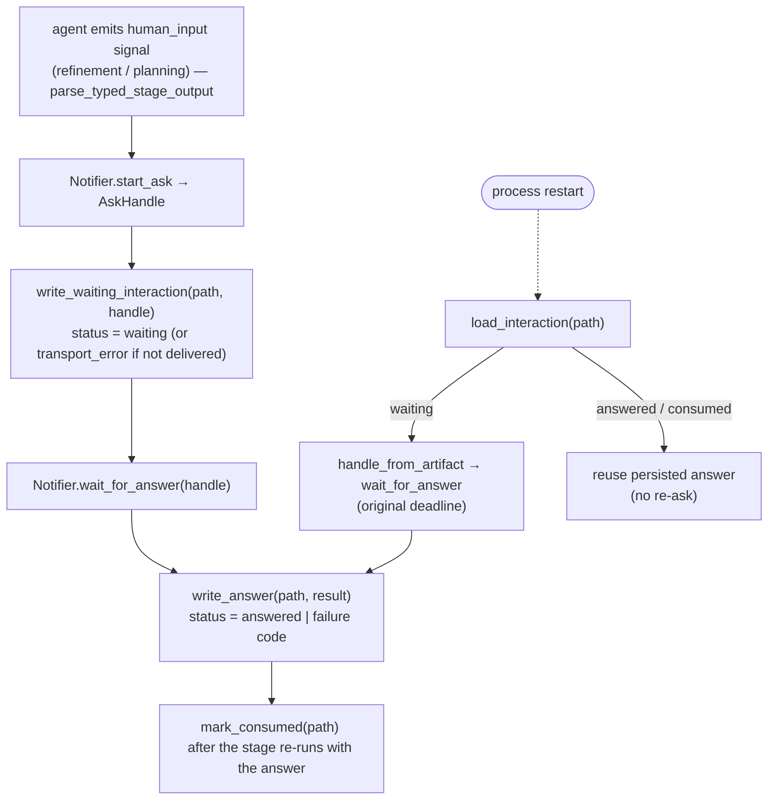

# B12 — HITL and Typed Stage Output

> Reconstructed from code (`core/hitl.py`, `notify/interface.py`) and tests (`tests/core/test_hitl.py`, `tests/core/test_flow_node_runners.py`, `tests/core/test_recovery.py`, `tests/core/test_check_discovery_hitl.py`). The code is the only source of truth; this document was rebuilt from the implementation, not from prose or comments. Significant claims carry a `file:line` reference.

**Status:** documented · **Source modules:** `src/wastech_orchestrator/core/hitl.py`, `src/wastech_orchestrator/notify/interface.py`

## Responsibility

This block owns two things: (1) the **typed stage-output contract** for the only two stages that may pause for a human — `refinement` and `planning` — and its strict, provider-independent validator `parse_typed_stage_output`, which surfaces an optional `HumanInputSignal`; and (2) the **durable interaction-artifact lifecycle** (JSON files under `logs/<task-id>/hitl/`) that records a human round-trip so it survives a process restart. It does not perform the round-trip itself and does not know any transport: the actual ask/wait primitive is `HumanGate` ([B30](B30-flow-node-runners.md)), and the transport is the `Notifier` ([B26](B26-notifications-telegram.md)). This block defines the schema, the validation, the path/id helpers, and the read/write/mark/reset helpers that `HumanGate`, the node runners, and the orchestrator's check-command approval ([B06](B06-orchestrator-pipeline.md)) all build on.

The strict validator is the trust boundary against the agent: the JSON schema returned by `stage_output_schema` is only advisory (it is handed to the provider as `output_schema`), and `parse_typed_stage_output` re-validates the structured result independently of any provider-side schema enforcement ([hitl.py:1](../../../src/wastech_orchestrator/core/hitl.py#L1), [hitl.py:134](../../../src/wastech_orchestrator/core/hitl.py#L134)). There is no `jsonschema` call anywhere in the Core for this — the hand-written parser is the enforcement.

## Public surface

- `StageOutputError(ValueError)` ([hitl.py:71](../../../src/wastech_orchestrator/core/hitl.py#L71)) — raised on any malformed typed result, artifact, or handle (the fail-closed signal).
- `HumanInputSignal` ([hitl.py:75](../../../src/wastech_orchestrator/core/hitl.py#L75)) — one validated `kind`/`question`/`context`/`risk`/`paths` request, frozen.
- `TypedStageOutput` ([hitl.py:86](../../../src/wastech_orchestrator/core/hitl.py#L86)) — `content`, optional `human_input`, the raw `structured` mapping, and planning's proposed `skills` tuple.
- `stage_output_schema(stage)` ([hitl.py:96](../../../src/wastech_orchestrator/core/hitl.py#L96)) — the strict provider schema for `refinement`/`planning`, else `None`.
- `parse_typed_stage_output(stage, structured)` ([hitl.py:131](../../../src/wastech_orchestrator/core/hitl.py#L131)) — the independent validator → `TypedStageOutput`.
- Path/id helpers: `interaction_path` ([hitl.py:263](../../../src/wastech_orchestrator/core/hitl.py#L263)), `guardrail_interaction_path` ([hitl.py:274](../../../src/wastech_orchestrator/core/hitl.py#L274)), `node_interaction_path` ([hitl.py:290](../../../src/wastech_orchestrator/core/hitl.py#L290)), `interaction_id` ([hitl.py:305](../../../src/wastech_orchestrator/core/hitl.py#L305)), `discovery_interaction_path` ([hitl.py:316](../../../src/wastech_orchestrator/core/hitl.py#L316)), `discovery_interaction_id` ([hitl.py:321](../../../src/wastech_orchestrator/core/hitl.py#L321)).
- Artifact lifecycle: `load_interaction` ([hitl.py:328](../../../src/wastech_orchestrator/core/hitl.py#L328)), `write_waiting_interaction` ([hitl.py:338](../../../src/wastech_orchestrator/core/hitl.py#L338)), `write_answer` ([hitl.py:371](../../../src/wastech_orchestrator/core/hitl.py#L371)), `mark_consumed` ([hitl.py:382](../../../src/wastech_orchestrator/core/hitl.py#L382)), `mark_interaction_status` ([hitl.py:390](../../../src/wastech_orchestrator/core/hitl.py#L390)), `reset_pending_interactions` ([hitl.py:398](../../../src/wastech_orchestrator/core/hitl.py#L398)), `consume_pending_interactions` ([hitl.py:419](../../../src/wastech_orchestrator/core/hitl.py#L419)), `handle_from_artifact` ([hitl.py:438](../../../src/wastech_orchestrator/core/hitl.py#L438)).
- Transport contract (from `notify/interface.py`): `AskKind` ([interface.py:14](../../../src/wastech_orchestrator/notify/interface.py#L14)), `AskHandle` ([interface.py:18](../../../src/wastech_orchestrator/notify/interface.py#L18)), `AskResult` ([interface.py:35](../../../src/wastech_orchestrator/notify/interface.py#L35)).

## Behavior

### HITL-capable stages

Only `refinement` and `planning` may ask the human: `_SIGNAL_STAGES = {Stage.REFINEMENT, Stage.PLANNING}` ([hitl.py:23](../../../src/wastech_orchestrator/core/hitl.py#L23)). `stage_output_schema` returns a schema only for those two and `None` otherwise ([hitl.py:96](../../../src/wastech_orchestrator/core/hitl.py#L96)), and `parse_typed_stage_output` raises `StageOutputError` for any other stage ([hitl.py:135](../../../src/wastech_orchestrator/core/hitl.py#L135)). Note that being HITL-_capable_ (a stage that can emit a signal) is distinct from the runtime _decision_ to ask: the agent node runner only does a round-trip if the node declares an `hitl` capability flag, never on the stage name (`_wants_hitl`, [agent.py:480](../../../src/wastech_orchestrator/core/flow/nodes/agent.py#L480)); the typed-output parsing that follows is still keyed by stage because the schema is stage-specific.

### The typed stage-output schema per stage

`refinement` requires exactly `{content, human_input}`; `planning` requires exactly `{content, human_input, decompose, subtasks, skills}` ([hitl.py:98](../../../src/wastech_orchestrator/core/hitl.py#L98), [hitl.py:108](../../../src/wastech_orchestrator/core/hitl.py#L108)). Both are `additionalProperties: false`. `human_input` is `_HUMAN_INPUT_SCHEMA` ([hitl.py:30](../../../src/wastech_orchestrator/core/hitl.py#L30)): nullable object with required `{kind, question, context, risk, paths}`, where `kind ∈ {question, approval}`, `question` is 1..16000 chars, `context` ≤16000, `risk ∈ {clarification, deletion, dependency, other}` (sorted `_RISKS`, [hitl.py:24](../../../src/wastech_orchestrator/core/hitl.py#L24)), and `paths` is ≤100 strings of 1..512 chars. For `planning`, `subtasks` items follow `_SUBTASK_SCHEMA` ([hitl.py:50](../../../src/wastech_orchestrator/core/hitl.py#L50)) — required `{order≥1, title, slug, acceptance_criteria(≥1), depends_on(int≥1)}` — and `skills` is ≤20 strings of 1..128 chars.

`parse_typed_stage_output` re-checks all of this by hand rather than trusting the schema. It rejects a non-`Mapping` ([hitl.py:137](../../../src/wastech_orchestrator/core/hitl.py#L137)), enforces the **exact** key set per stage ([hitl.py:140](../../../src/wastech_orchestrator/core/hitl.py#L140)), requires `content` to be a string ([hitl.py:147](../../../src/wastech_orchestrator/core/hitl.py#L147)), and for planning validates `decompose` is a bool, `subtasks` is a list passed through `_validate_subtasks` ([hitl.py:201](../../../src/wastech_orchestrator/core/hitl.py#L201)), and `skills` through `_validate_skills` ([hitl.py:235](../../../src/wastech_orchestrator/core/hitl.py#L235)). `_validate_skills` returns the proposed names verbatim — de-duplication and matching against the real inventory is the deterministic job of `core.skills.resolve_planning_skills` ([B13](B13-skill-selection.md)), not this block. The signal, if non-null, is built by `_parse_signal` ([hitl.py:168](../../../src/wastech_orchestrator/core/hitl.py#L168)), which strips `question`/`context`, validates `risk`, and normalizes `paths`. Path normalization (`_normalize_path`, [hitl.py:253](../../../src/wastech_orchestrator/core/hitl.py#L253)) backslash-converts, rejects absolute paths and any `..` component, and the set of normalized paths is **deduplicated and sorted** into a tuple ([hitl.py:191](../../../src/wastech_orchestrator/core/hitl.py#L191)) — verified by `test_human_input_paths_are_normalized_as_an_exact_set` ([test_hitl.py:39](../../../tests/core/test_hitl.py#L39)).

`stage_output_schema(stage)` is wired into the agent request at [agent.py:359](../../../src/wastech_orchestrator/core/flow/nodes/agent.py#L359) (a node may override it with its own `output_schema`) and into the evaluator request at [evaluator.py:178](../../../src/wastech_orchestrator/core/flow/nodes/evaluator.py#L178). The agent runner converts a `StageOutputError` from the parser into a `NodeInfraError` ([agent.py:156](../../../src/wastech_orchestrator/core/flow/nodes/agent.py#L156)).

### The durable transport handle and result

The block depends on two value types from the `Notifier` contract. `AskHandle` ([interface.py:18](../../../src/wastech_orchestrator/notify/interface.py#L18)) is a frozen, **secret-free** handle persisted before waiting: `interaction_id`, `kind`, `expires_at` (a Unix timestamp so a restarted process waits against the _original_ deadline), and Telegram correlation metadata `message_id` / `update_offset`, plus a `delivered` flag. `AskResult` ([interface.py:35](../../../src/wastech_orchestrator/notify/interface.py#L35)) is the outcome: `answered`, `text` (free-form reply for `question`), `approved` (`True`/`False`/`None` for `approval`), `timed_out`, and a `failure ∈ {timeout, transport_error, invalid_response}` ([interface.py:15](../../../src/wastech_orchestrator/notify/interface.py#L15)). The `NullNotifier` ([interface.py:99](../../../src/wastech_orchestrator/notify/interface.py#L99)) fails closed — its `start_ask` returns an undelivered handle (`delivered=False`, `expires_at=0.0`) and `wait_for_answer` returns `failure="transport_error"` — so a missing transport is the same as a transport failure.

### Interaction-path keying

Every artifact lives under `task_artifact_dir(...)/hitl/` ([hitl.py:271](../../../src/wastech_orchestrator/core/hitl.py#L271), `task_artifact_dir` from [B20](B20-artifact-layout.md)). The filename encodes the interaction key, so different kinds of gate never collide:

- `interaction_path` — `<stage>.json` (`-subtask-<N>` suffix when decomposed) — the embedded refinement/planning HITL ([hitl.py:263](../../../src/wastech_orchestrator/core/hitl.py#L263)).
- `guardrail_interaction_path` — `guardrail-<stage>[-subtask-N]-cycle-<C>.json` — the dangerous-diff approval ([B14](B14-dangerous-diff-guardrail.md)), keyed by fix cycle so each re-edit asks afresh ([hitl.py:274](../../../src/wastech_orchestrator/core/hitl.py#L274)).
- `node_interaction_path` — `node-<node_id>[-subtask-N].json`, prefixed `node-` precisely so a node id can never collide with a stage-keyed file — the standalone `hitl` gate node ([hitl.py:290](../../../src/wastech_orchestrator/core/hitl.py#L290)).
- `discovery_interaction_path` — `check-discovery.json` — the check-command-set approval ([B06](B06-orchestrator-pipeline.md)) ([hitl.py:316](../../../src/wastech_orchestrator/core/hitl.py#L316)).

`interaction_id` ([hitl.py:305](../../../src/wastech_orchestrator/core/hitl.py#L305)) produces a deterministic id `"h" + sha256(task:key:subtask)[:24]` that fits Telegram callback-data limits; `key` is `stage.value` for a `Stage` or the raw string for a node id. `discovery_interaction_id` ([hitl.py:321](../../../src/wastech_orchestrator/core/hitl.py#L321)) prefixes `"d"` and folds the **command-set signature** into the hash, so a changed check-set yields a fresh interaction rather than reusing a stale approval.

### The durable round-trip lifecycle

The contract is **write `waiting` (with the handle) before asking → wait against the persisted deadline → `write_answer` → `mark_consumed`**. This block supplies the primitives; `HumanGate` ([B30](B30-flow-node-runners.md), `human_gate.py`) sequences them in `request`/`resume`.

`write_waiting_interaction` ([hitl.py:338](../../../src/wastech_orchestrator/core/hitl.py#L338)) writes `schema_version: 1`, the handle (`asdict`), the redacted request (`redact_text` on `question`/`context`, [hitl.py:357](../../../src/wastech_orchestrator/core/hitl.py#L357)), `deadline = handle.expires_at`, and a status that is `"waiting"` **only if `handle.delivered`** — an undelivered prompt is persisted directly as `"transport_error"` with `failure="transport_error"` ([hitl.py:353](../../../src/wastech_orchestrator/core/hitl.py#L353)). `write_answer` ([hitl.py:371](../../../src/wastech_orchestrator/core/hitl.py#L371)) loads the artifact (raising if missing), sets `status` to `"answered"` when `result.failure is None` else to the failure string, redacts `result.text`, and records `approved`/`failure`. `mark_consumed` ([hitl.py:382](../../../src/wastech_orchestrator/core/hitl.py#L382)) and `mark_interaction_status` ([hitl.py:390](../../../src/wastech_orchestrator/core/hitl.py#L390)) flip the status field in place (the latter is used for the guardrail's intermediate `reconsidering`/`reconsidered` states, [agent.py:328](../../../src/wastech_orchestrator/core/flow/nodes/agent.py#L328)). All writes go through `_atomic_json` ([hitl.py:482](../../../src/wastech_orchestrator/core/hitl.py#L482)) — write to `.tmp`, then `replace` — so a crash never leaves a half-written artifact, and content is `sort_keys=True`, `ensure_ascii=False`.

`HumanGate.request` ([human_gate.py:38](../../../src/wastech_orchestrator/core/flow/nodes/human_gate.py#L38)) starts the ask, persists `waiting`, waits, then writes the answer; `HumanGate.resume` ([human_gate.py:69](../../../src/wastech_orchestrator/core/flow/nodes/human_gate.py#L69)) reconstructs the handle via `handle_from_artifact` and waits against the original deadline. The agent runner's `_run_with_hitl` ([agent.py:92](../../../src/wastech_orchestrator/core/flow/nodes/agent.py#L92)) loads any persisted interaction first: a `waiting` one is resumed, an `answered`/`consumed` one is re-validated and reused without re-asking, any other status fails closed to `manual_action_required` ([agent.py:128](../../../src/wastech_orchestrator/core/flow/nodes/agent.py#L128)). `test_resume_waits_on_persisted_planning_prompt_without_resending` ([test_recovery.py:547](../../../tests/core/test_recovery.py#L547)) proves the end-to-end resume: a pre-written `waiting` planning prompt is waited on (no second `start_ask`) and ends `consumed`.

### `handle_from_artifact` — strict reconstruction

Rebuilding an `AskHandle` from persisted JSON is the most defensive path: `handle_from_artifact` ([hitl.py:438](../../../src/wastech_orchestrator/core/hitl.py#L438)) requires `interaction_id` (non-empty, ≤64 chars), a valid `kind`, a finite non-bool `expires_at`, a positive `message_id` if present, a non-negative `update_offset` if present, and enforces the invariant that a `delivered` handle has a `message_id` ([hitl.py:468](../../../src/wastech_orchestrator/core/hitl.py#L468)). Any failure becomes `StageOutputError("HITL artifact handle is malformed")` ([hitl.py:478](../../../src/wastech_orchestrator/core/hitl.py#L478)) — `test_persisted_handle_rejects_invalid_kind` ([test_hitl.py:110](../../../tests/core/test_hitl.py#L110)).

### Continue and finalize cleanup

For `rerun --continue`, `reset_pending_interactions` ([hitl.py:398](../../../src/wastech_orchestrator/core/hitl.py#L398)) **deletes** un-answered artifacts (status `waiting`/`transport_error`) so the re-entered stage asks fresh instead of replaying a stale prompt; `answered`/`consumed` artifacts are left intact (the resume engine skips those stages). It is called from `continue_task` ([orchestrator.py:496](../../../src/wastech_orchestrator/core/orchestrator.py#L496)). For `finalize`, `consume_pending_interactions` ([hitl.py:419](../../../src/wastech_orchestrator/core/hitl.py#L419)) instead **marks** the same un-answered artifacts `consumed` (preserving the audit artifact) so a later resume can't act on a prompt for an already-finalized task — called at [orchestrator.py:606](../../../src/wastech_orchestrator/core/orchestrator.py#L606), tested by `test_consume_pending_interactions_closes_only_unanswered` ([test_hitl.py:165](../../../tests/core/test_hitl.py#L165)).

### Reuse by B06 check-command approval

The orchestrator's `_ask_check_command_approval` ([orchestrator.py:1324](../../../src/wastech_orchestrator/core/orchestrator.py#L1324)) reuses these helpers directly rather than going through `HumanGate`: it builds a `HumanInputSignal`, calls `discovery_interaction_path`/`discovery_interaction_id`, and on a restart resumes a still-`waiting` interaction for the **same** command-set signature via `handle_from_artifact` + `write_answer` + `mark_consumed` ([orchestrator.py:1335](../../../src/wastech_orchestrator/core/orchestrator.py#L1335)). A denial, timeout, transport error, or absent notifier raises `ManualActionRequired` — the same fail-closed posture as the node gates.

## Invariants & guarantees

- **Fail-closed everywhere.** A missing/malformed artifact ([hitl.py:333](../../../src/wastech_orchestrator/core/hitl.py#L333)), a malformed handle ([hitl.py:478](../../../src/wastech_orchestrator/core/hitl.py#L478)), or invalid typed output all raise `StageOutputError`; timeout / transport-error / no-notifier / invalid-response all resolve to `manual_action_required` (`NodeManualRequired` in the node runners, `ManualActionRequired` in B06).
- **Only `refinement`/`planning` are HITL-capable** ([hitl.py:23](../../../src/wastech_orchestrator/core/hitl.py#L23)); the validator refuses any other stage ([hitl.py:135](../../../src/wastech_orchestrator/core/hitl.py#L135)).
- **No secrets persisted.** The handle is secret-free by contract ([interface.py:18](../../../src/wastech_orchestrator/notify/interface.py#L18)); `question`/`context`/`answer` are run through `redact_text` ([B21](B21-secret-redaction.md)) before being written ([hitl.py:357](../../../src/wastech_orchestrator/core/hitl.py#L357), [hitl.py:377](../../../src/wastech_orchestrator/core/hitl.py#L377)).
- **Restart-durable.** The deadline is persisted as a Unix timestamp and a `waiting` artifact is resumed against it, so a crash mid-wait does not lose or re-issue the prompt.
- **Atomic writes** via temp-file + `replace` ([hitl.py:482](../../../src/wastech_orchestrator/core/hitl.py#L482)).
- **Repository-relative paths only** in a signal: absolute or `..`-containing paths are rejected and the set is deduplicated+sorted ([hitl.py:253](../../../src/wastech_orchestrator/core/hitl.py#L253), [hitl.py:191](../../../src/wastech_orchestrator/core/hitl.py#L191)).
- **Schema is advisory; the parser is authoritative.** `stage_output_schema` is sent to the provider as `output_schema`, but `parse_typed_stage_output` re-validates independently — there is no `jsonschema` enforcement in the Core ([hitl.py:134](../../../src/wastech_orchestrator/core/hitl.py#L134)).

## Dependencies

- **Uses:** [B26](B26-notifications-telegram.md) (the `AskHandle`/`AskResult`/`AskKind` transport value types), [B21](B21-secret-redaction.md) (`redact_text`), [B20](B20-artifact-layout.md) (`task_artifact_dir`), `Stage` from `providers/base.py`.
- **Used by:** [B30](B30-flow-node-runners.md) (`HumanGate` and the agent / `hitl` node runners consume the typed schema and the artifact lifecycle), [B14](B14-dangerous-diff-guardrail.md) (the dangerous-diff approval uses `guardrail_interaction_path`), [B06](B06-orchestrator-pipeline.md) (check-command approval reuses the discovery helpers; `continue`/`finalize` call the reset/consume helpers), [B16](B16-task-parsing-and-validation-gate.md) (the typed schema constrains the planning `skills`/`subtasks` contract), [B13](B13-skill-selection.md) (consumes the proposed `skills`).

## Audit candidates

- `src/wastech_orchestrator/core/hitl.py:399` and `:420` — `reset_pending_interactions` / `consume_pending_interactions` match only statuses `("waiting", "transport_error")`, but `write_answer` ([hitl.py:375](../../../src/wastech_orchestrator/core/hitl.py#L375)) can persist `status="timeout"` or `"invalid_response"` (the other two `AskFailure` values, produced by `HumanGate.request` before the node fails closed). An artifact left in either of those states is skipped by both `continue`-reset and `finalize`-consume; on a later `continue` the agent runner then hits the `else` branch of `_resume_interaction` ([agent.py:138](../../../src/wastech_orchestrator/core/flow/nodes/agent.py#L138)) and blocks at `manual_action_required` instead of asking fresh, defeating the reset's stated intent ([hitl.py:399](../../../src/wastech_orchestrator/core/hitl.py#L399)). See [the audit](../../backlog/2026-06-21-audit.md).

## Tests

- `tests/core/test_hitl.py` ([test_hitl.py:21](../../../tests/core/test_hitl.py#L21)) — typed-output parsing for refinement/planning, exact-key enforcement, path normalization as a sorted set, traversal-path rejection, malformed-subtask rejection, strict `handle_from_artifact` reconstruction, and `consume_pending_interactions` closing only un-answered artifacts (and the no-`hitl`-dir case).
- `tests/core/test_flow_node_runners.py` ([test_flow_node_runners.py:528](../../../tests/core/test_flow_node_runners.py#L528)) — the embedded agent HITL round-trip (no-signal proceed, question round-trip, data-driven dispatch, timeout→manual) and the standalone `hitl` gate node (approval routes approve/deny, question proceeds, timeout/no-notifier→manual, resume of a persisted `waiting` interaction).
- `tests/core/test_recovery.py` ([test_recovery.py:547](../../../tests/core/test_recovery.py#L547)) — restart resumes a persisted `waiting` planning prompt against its original handle without resending and ends `consumed`.
- `tests/core/test_check_discovery_hitl.py` ([test_check_discovery_hitl.py:71](../../../tests/core/test_check_discovery_hitl.py#L71)) — B06's reuse of the discovery helpers: first-ever set auto-approved, unchanged set not re-prompted, changed set prompts and records the `d…` interaction id, denial and absent-notifier both fail closed.
