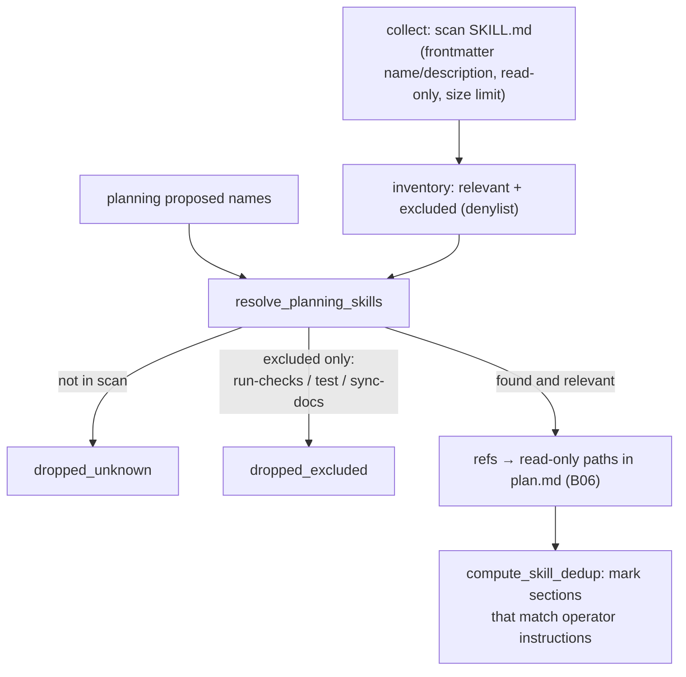

# B13 — Skill Inventory and Selection

## Purpose

Scans `SKILL.md` files in the target repository (`<repo>/.claude/skills/*`), allows the `planning` stage to select relevant ones, and deterministically filters the selection (the agent proposes — the core decides). Selected skills are passed downstream as **read-only path references** (never executed, not via the Claude-only Skill tool — so that both providers behave identically).

## Responsibilities

- Read the skill inventory (frontmatter `name`/`description`), with size limits and in read-only mode ([skills.py:86-138](../../../src/wastech_orchestrator/core/skills.py#L86)).
- From the names proposed by planning, keep only those that were actually found and are not on the gate-duplicating denylist ([skills.py:155-186](../../../src/wastech_orchestrator/core/skills.py#L155)).
- Mark skill sections whose headings match operator instructions (dedup §2.2) ([skills.py:200-229](../../../src/wastech_orchestrator/core/skills.py#L200)).

## Block Boundaries

### Within the block's responsibility

- Read-only inventory, deterministic selection, heading-level deduplication.

### Outside the block's responsibility

- **Passing skills to stages** — that is [B06](./B06-orchestrator-pipeline.md): it places paths in `request.skill_reference_paths` and renders a section in `plan.md`.
- **Executing skills** — never (path references only) ([skills.py:6-8](../../../src/wastech_orchestrator/core/skills.py#L6)).
- **Validating names proposed by planning** — that is [B12 `_validate_skills`](./B12-hitl-and-typed-output.md); here names are resolved in the inventory.
- **The alloy-list of denied paths** — the rule is defined by [B25](./B25-security-policy.md) (used during reading).

## Entry Points

- `SkillInventoryScanner(...).collect()` / `read_body(ref)` ([skills.py:86-118](../../../src/wastech_orchestrator/core/skills.py#L86)) — the scanner is constructed in `Orchestrator._default_skill_scanner` ([orchestrator.py:338](../../../src/wastech_orchestrator/core/orchestrator.py#L338)); `collect` is called in `run_task`/resume.
- `resolve_planning_skills(proposed, inventory)` → `SkillSelection` ([skills.py:155](../../../src/wastech_orchestrator/core/skills.py#L155)) — [B06 `_resolve_and_render_skills`](./B06-orchestrator-pipeline.md).
- `compute_skill_dedup(user_text, bodies)` ([skills.py:200](../../../src/wastech_orchestrator/core/skills.py#L200)).
- Types: `SkillRef`, `SkillInventory`, `SkillSelection`, `SkillDedupEntry`; `DEFAULT_EXCLUDED_SKILLS`.

## Input Data and State

Skill root (default `<repo.local_path>/.claude/skills`), `denied_read_paths`, name denylist; names proposed by planning; operator planning override text. Holds no state.

## Main Scenario

1. `collect`: for each `<root>/<dir>/SKILL.md`, the frontmatter is read; a valid `name` → `SkillRef`; denylist names are marked as excluded (present in inventory but not offered to planning).
2. `resolve_planning_skills`: from the proposed names, only **relevant** skills that were found are kept; not-found names → `dropped_unknown`; found only as excluded → `dropped_excluded`; the result is deduplicated and sorted.
3. (optional) `compute_skill_dedup`: if operator planning override text is present, sections of selected skills with matching normalized headings are marked (operator text takes priority).

"The agent proposes — the core decides": selection is only possible from what the inventory scan found:

## Checks and Constraints

- Reading is size-limited (262 KB/file) and skips `denied_read_paths` ([skills.py:140-152](../../../src/wastech_orchestrator/core/skills.py#L140)).
- The agent cannot introduce a path that the scan did not find (selection is from the inventory only) ([skills.py:156-162](../../../src/wastech_orchestrator/core/skills.py#L156)).
- Default denylist: `run-checks`, `test`, `sync-docs` (gate-duplicating) ([skills.py:35](../../../src/wastech_orchestrator/core/skills.py#L35)).

## Output

`SkillInventory`; `SkillSelection(refs, dropped_unknown, dropped_excluded)`; tuple of `SkillDedupEntry`. [B06](./B06-orchestrator-pipeline.md) converts this into read-only paths and a deterministic `plan.md` section.

## Side Effects

- Reading `SKILL.md` files (read-only, size-limited). Selection/dedup logic is pure.

## Errors and Edge Cases

- No skills directory / no frontmatter / malformed YAML → skill is skipped; inventory is empty without error.

## Relationships

### Uses

- [B25 — Security](./B25-security-policy.md) — `denied_read_paths` (when reading files).

### Used by

- [B06 — Pipeline](./B06-orchestrator-pipeline.md) — scans the inventory at startup; resolves the selection and computes dedup during `planning`; passes paths to downstream stages.

## Place in the Overall System

Gives agents repository-specific procedural reference material, but strictly as read-only content and only from what the core itself discovered. Follows the same principle as decomposition ([B11](./B11-task-decomposition.md)): the agent proposes — the core decides.

## Code Confirmation

- [core/skills.py:86-229](../../../src/wastech_orchestrator/core/skills.py#L86) — scanner, `resolve_planning_skills`, `compute_skill_dedup`.
- Test: [tests/core/test_skills.py](../../../tests/core/test_skills.py) — inventory, dropping unknown/excluded, heading dedup, denied-aware reading.
