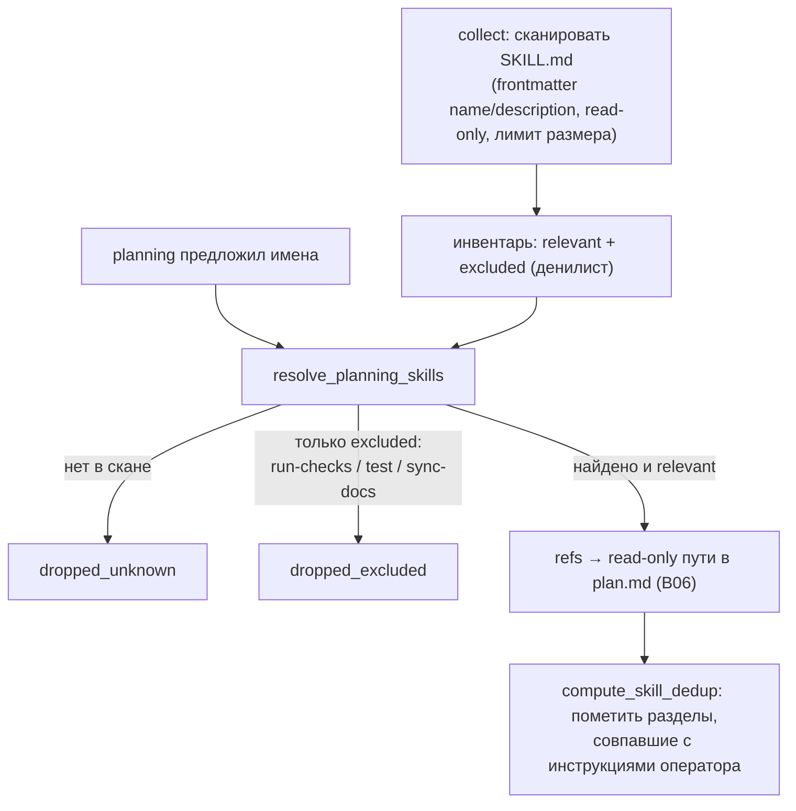

# B13 — Инвентарь и выбор навыков (skills)

## Назначение

Сканирует `SKILL.md`-файлы в целевом репозитории (`<repo>/.claude/skills/*`), даёт стадии `planning`
выбрать релевантные, и детерминированно фильтрует выбор (агент предлагает — ядро решает). Выбранные
навыки передаются дальше как **read-only ссылки по пути** (никогда не исполняются, не через Claude-only
Skill-tool — чтобы оба провайдера вели себя одинаково).

## Ответственность

- Прочитать инвентарь навыков (frontmatter `name`/`description`), ограниченно и read-only
  ([skills.py:86-138](../../../src/wastech_orchestrator/core/skills.py#L86)).
- Оставить из предложенных planning только реально найденные и не входящие в gate-дублирующий
  денилист ([skills.py:155-186](../../../src/wastech_orchestrator/core/skills.py#L155)).
- Пометить разделы навыков, чьи заголовки совпадают с инструкциями оператора (дедуп §2.2)
  ([skills.py:200-229](../../../src/wastech_orchestrator/core/skills.py#L200)).

## Границы блока

### Входит в ответственность блока

- Read-only инвентарь, детерминированный выбор, дедуп на уровне заголовков.

### Не входит в ответственность блока

- **Передача навыков стадиям** — это [B06](./B06-orchestrator-pipeline.md): кладёт пути в
  `request.skill_reference_paths` и рендерит секцию в `plan.md`.
- **Исполнение навыков** — никогда (только ссылки по пути) ([skills.py:6-8](../../../src/wastech_orchestrator/core/skills.py#L6)).
- **Валидация имён, предложенных planning** — это [B12 `_validate_skills`](./B12-hitl-and-typed-output.md); здесь имена резолвятся в инвентаре.
- **Аллой-лист denied-путей** — правило задаёт [B25](./B25-security-policy.md) (используется при чтении).

## Точки входа

- `SkillInventoryScanner(...).collect()` / `read_body(ref)` ([skills.py:86-118](../../../src/wastech_orchestrator/core/skills.py#L86)) — сканер строится в `Orchestrator._default_skill_scanner` ([orchestrator.py:338](../../../src/wastech_orchestrator/core/orchestrator.py#L338)); `collect` вызывается в `run_task`/resume.
- `resolve_planning_skills(proposed, inventory)` → `SkillSelection` ([skills.py:155](../../../src/wastech_orchestrator/core/skills.py#L155)) — [B06 `_resolve_and_render_skills`](./B06-orchestrator-pipeline.md).
- `compute_skill_dedup(user_text, bodies)` ([skills.py:200](../../../src/wastech_orchestrator/core/skills.py#L200)).
- Типы: `SkillRef`, `SkillInventory`, `SkillSelection`, `SkillDedupEntry`; `DEFAULT_EXCLUDED_SKILLS`.

## Входные данные и состояние

Корень навыков (по умолчанию `<repo.local_path>/.claude/skills`), `denied_read_paths`, денилист имён;
предложенные planning имена; текст оверрайда planning оператора. Состояния не хранит.

## Основной сценарий

1. `collect`: для каждого `<root>/<dir>/SKILL.md` читается frontmatter; валидный `name` → `SkillRef`;
   денилист-имена помечаются как excluded (присутствуют, но не предлагаются planning).
2. `resolve_planning_skills`: из предложенных имён оставляются только найденные **relevant** навыки;
   ненайденные → `dropped_unknown`; найденные только как excluded → `dropped_excluded`; результат
   дедуплицирован и отсортирован.
3. (опц.) `compute_skill_dedup`: если есть текст оверрайда planning, разделы выбранных навыков с
   совпадающими нормализованными заголовками помечаются (приоритет у текста оператора).

«Агент предлагает — ядро решает»: выбор возможен только из того, что нашёл скан инвентаря:

## Проверки и ограничения

- Чтение ограничено по размеру (262 КБ/файл) и пропускает `denied_read_paths` ([skills.py:140-152](../../../src/wastech_orchestrator/core/skills.py#L140)).
- Агент не может ввести путь, который скан не нашёл (выбор только из инвентаря) ([skills.py:156-162](../../../src/wastech_orchestrator/core/skills.py#L156)).
- Денилист по умолчанию: `run-checks`, `test`, `sync-docs` (gate-дублирующие) ([skills.py:35](../../../src/wastech_orchestrator/core/skills.py#L35)).

## Результат

`SkillInventory`; `SkillSelection(refs, dropped_unknown, dropped_excluded)`; кортеж `SkillDedupEntry`.
[B06](./B06-orchestrator-pipeline.md) превращает это в read-only пути и детерминированную секцию `plan.md`.

## Побочные эффекты

- Чтение `SKILL.md`-файлов (read-only, ограниченное). Логика выбора/дедупа — чистая.

## Ошибки и граничные случаи

- Нет каталога навыков / нет frontmatter / битый YAML → навык пропускается; инвентарь пуст без ошибки.

## Связи

### Использует

- [B25 — Security](./B25-security-policy.md) — `denied_read_paths` (при чтении файлов).

### Используется в

- [B06 — Конвейер](./B06-orchestrator-pipeline.md) — на старте сканирует инвентарь; в `planning` резолвит выбор и считает дедуп; пути передаёт downstream-стадиям.

## Место в общей системе

Даёт агентам репозиторий-специфичную процедурную справку, но строго как read-only материал и только
из того, что ядро само нашло. Совпадает по принципу с декомпозицией ([B11](./B11-task-decomposition.md)):
агент предлагает — ядро решает.

## Подтверждение в коде

- [core/skills.py:86-229](../../../src/wastech_orchestrator/core/skills.py#L86) — сканер, `resolve_planning_skills`, `compute_skill_dedup`.
- Тест: [tests/core/test_skills.py](../../../tests/core/test_skills.py) — инвентарь, отбрасывание неизвестных/excluded, дедуп заголовков, denied-aware чтение.
