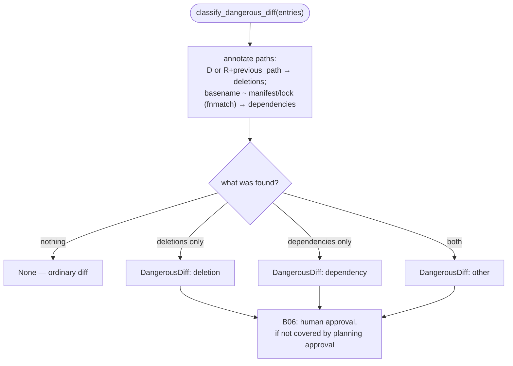

# B14 — Dangerous Diff Classification

## Purpose

A pure classifier for working-tree changes that determines whether the result of an editing stage requires human approval. It identifies two risk classes: file deletions and changes to dependency manifests/lock files. This is the "detector" for the editing-stage guardrail — the guardrail flow itself (approval request) is implemented in [B06](./B06-orchestrator-pipeline.md).

## Responsibility

- Given a list of `ChangedPath` entries, identify deletions and affected dependency files ([dangerous_diff.py:82-109](../../../src/wastech_orchestrator/core/dangerous_diff.py#L82)).
- Classify the risk (`deletion`/`dependency`/`other`) and return exact normalized paths.

## Block Boundaries

### Within this block's responsibility

- Pure diff classification into `DangerousDiff` (or `None` for an ordinary diff).

### Outside this block's responsibility

- **Obtaining the diff** — that is [B22 `changed_code_entries`](./B22-git-manager.md).
- **The approval flow** (HITL request, re-run on rejection, checking planning-approval coverage) — that is [B06 `_run_edit_stage_with_guardrail`](./B06-orchestrator-pipeline.md) together with [B12](./B12-hitl-and-typed-output.md).

## Entry Points

- `classify_dangerous_diff(entries)` → `DangerousDiff | None` ([dangerous_diff.py:82](../../../src/wastech_orchestrator/core/dangerous_diff.py#L82)) — called in [B06](./B06-orchestrator-pipeline.md) after editing stages ([orchestrator.py:1902,1965](../../../src/wastech_orchestrator/core/orchestrator.py#L1902)).
- `DangerousDiff` (risk, paths, deleted_paths, dependency_paths).

## Input Data and State

A tuple of `ChangedPath` (status, path, previous_path) from [B22](./B22-git-manager.md). No state is maintained.

## Main Scenario

1. For each entry: status `D` (or `R` with `previous_path`) → path goes into "deleted"; basename matching a manifest/lock via `fnmatch` → into "dependencies".
2. No deletions and no dependencies → `None` (ordinary diff).
3. Otherwise a risk is assigned: both → `other`; deletions only → `deletion`; dependencies only → `dependency`.
4. Return `DangerousDiff` with a sorted union of paths.

Classification by discovered changes (ordinary diff → guardrail not needed):

## Checks and Constraints

- The dependency pattern list covers many ecosystems (pyproject/locks, package.json, Cargo, go.mod, Gemfile, \*.csproj, gradle, …) ([dangerous_diff.py:10-69](../../../src/wastech_orchestrator/core/dangerous_diff.py#L10)).
- Matching is done on the **basename** of the file via `fnmatch` ([dangerous_diff.py:112-114](../../../src/wastech_orchestrator/core/dangerous_diff.py#L112)).

## Output

`DangerousDiff` (or `None`). Paths are normalized and sorted — [B06](./B06-orchestrator-pipeline.md) compares them against the previously approved set to avoid requesting approval again for the same set.

## Side Effects

None — pure function.

## Errors and Edge Cases

- A rename (`R…`) treats `previous_path` as a deletion of the original path ([dangerous_diff.py:90-91](../../../src/wastech_orchestrator/core/dangerous_diff.py#L90)).

## Relations

### Uses

- [B22 — Git Manager](./B22-git-manager.md) — the `ChangedPath` type (input from `changed_code_entries`).

### Used By

- [B06 — Pipeline](./B06-orchestrator-pipeline.md) — guardrail for editing stages (implementation/fixing).
- [B12 — HITL](./B12-hitl-and-typed-output.md) — risk/paths are included in the approval signal.

## Position in the Overall System

Part of the guardrail: after an editing stage, [B06](./B06-orchestrator-pipeline.md) classifies the diff using this block and, if it is dangerous and not covered by planning approval, requests human approval via [B12](./B12-hitl-and-typed-output.md)/[B26](./B26-notifications-telegram.md); a rejection allows one "safe" rework.

## Code Confirmation

- [core/dangerous_diff.py:82-114](../../../src/wastech_orchestrator/core/dangerous_diff.py#L82) — classification and pattern list.
- Verified via pipeline guardrail tests ([tests/core/test_orchestrator.py](../../../tests/core/test_orchestrator.py)) and HITL tests ([tests/core/test_hitl.py](../../../tests/core/test_hitl.py)).

## Uncertainties

- No dedicated unit test for `dangerous_diff` was found in the suite; behavior is confirmed indirectly through pipeline guardrail scenarios. A direct unit test for the classifier has not been found.
