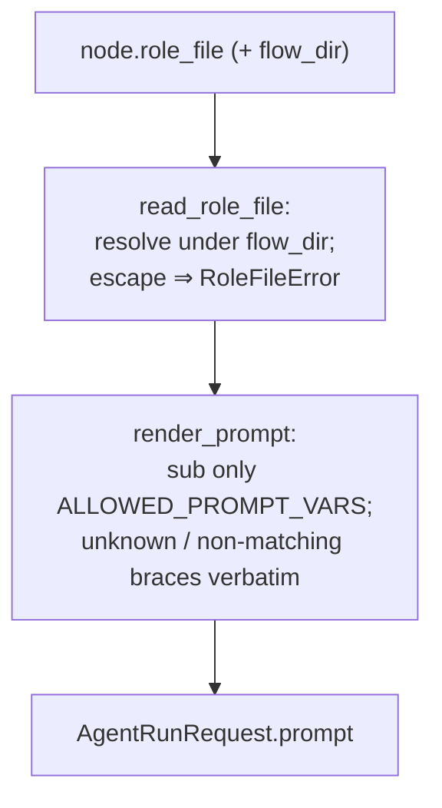

# B15 — Prompt Templates and Rendering

> Reconstructed from code (`core/prompts.py`, `core/flow/prompt.py`) and tests (`tests/core/test_prompts.py`, `tests/core/test_flow_prompt.py`). The code is the only source of truth; this document was rebuilt from the implementation, not from prose or comments. Significant claims carry a `file:line` reference.

**Status:** documented · **Source modules:** `src/wastech_orchestrator/core/prompts.py`, `src/wastech_orchestrator/core/flow/prompt.py`

## Responsibility

Turn a flow node's prompt **template** into the final `AgentRunRequest.prompt` string by substituting an allowlisted set of metadata/artifact _path_ tokens. A node's template is the content of its `role_file` (a `.md` shipped inside the flow directory); the operator-supplied `prompts` config block was removed in config v9 ([upgrade.py:25-36](../../../src/wastech_orchestrator/config/upgrade.py#L25)), so there is no longer any operator-customizable stage-prompt layer — the file _is_ the template.

This block is two thin layers: the security-critical fixed core renderer (`render_prompt` + `ALLOWED_PROMPT_VARS`, [prompts.py](../../../src/wastech_orchestrator/core/prompts.py)) that never injects task bodies, diffs, check logs, env, or secrets; and the flow-node wrapper (`read_role_file` / `render_role_prompt`, [prompt.py](../../../src/wastech_orchestrator/core/flow/prompt.py)) that reads the node's `role_file` from inside the flow dir and calls the core renderer. It produces only stdin prompt _text_; it never touches provider argv, CLI syntax, the sandbox/approvals, denied commands/reads, the env allowlist, or fallback policy ([prompts.py:9-11](../../../src/wastech_orchestrator/core/prompts.py#L9)).

## Public surface

- `render_prompt(template, variables)` ([prompts.py:42](../../../src/wastech_orchestrator/core/prompts.py#L42)) — substitute allowlisted `{name}` tokens in `template`; leave everything else verbatim. Pure (no I/O).
- `ALLOWED_PROMPT_VARS: frozenset[str]` ([prompts.py:21](../../../src/wastech_orchestrator/core/prompts.py#L21)) — the closed set of substitutable names (see below).
- `read_role_file(flow_dir, role_file) -> str` ([prompt.py:26](../../../src/wastech_orchestrator/core/flow/prompt.py#L26)) — read `<flow_dir>/<role_file>`, enforcing flow-dir containment.
- `render_role_prompt(flow_dir, role_file, variables) -> str` ([prompt.py:41](../../../src/wastech_orchestrator/core/flow/prompt.py#L41)) — `read_role_file` then `render_prompt`.
- `RoleFileError(Exception)` ([prompt.py:22](../../../src/wastech_orchestrator/core/flow/prompt.py#L22)) — raised when a `role_file` cannot be read or escapes the flow directory.

## Behavior

### The allowlist

`ALLOWED_PROMPT_VARS` is the exact, closed set of names a template may interpolate ([prompts.py:21-37](../../../src/wastech_orchestrator/core/prompts.py#L21)): `task_id`, `stage`, `repo_path`, `repo` (a flow-engine alias for `repo_path`; one shared allowlist), `task_path`, `plan_path`, `diff_path`, `checks_path`, `review_path`, `subtask_order`, `subtask_count`, `subtask_spec_path`, `skills_path`. Every entry is either a scalar metadata value (`task_id`, `stage`, `subtask_order`, `subtask_count`) or an artifact _path_ — never a large body. The test pins this exact set ([test_prompts.py:25-40](../../../tests/core/test_prompts.py#L25)). `{skills_path}` is the skill-reference paths joined by newline (or `None` when there are none) ([agent.py:399](../../../src/wastech_orchestrator/core/flow/nodes/agent.py#L399)) — see [B13](B13-skill-selection.md).

### The "safe renderer"

`render_prompt` compiles a single regex `_VAR_RE = re.compile(r"\{([a-z_]+)\}")` ([prompts.py:39](../../../src/wastech_orchestrator/core/prompts.py#L39)) and runs it with a replacement callback ([prompts.py:50-57](../../../src/wastech_orchestrator/core/prompts.py#L50)):

- A token whose name is **not** in `ALLOWED_PROMPT_VARS` is returned unchanged (`return match.group(0)`) — no `KeyError`, no exception.
- An allowlisted name whose value is `None` renders as the empty string; any other value renders via `str(value)`.
- Because the pattern only matches `{` + one-or-more `[a-z_]` + `}`, any other brace usage never even matches: literal code/JSON braces like `{"json": 1}` (digits/quotes), `{ }` with spaces, or uppercase `{NAME}` all pass through verbatim. So a template carrying code or JSON renders unchanged ([test_prompts.py:18-22](../../../tests/core/test_prompts.py#L18), [test_flow_prompt.py:21-24](../../../tests/core/test_flow_prompt.py#L21)).

This is the structural injection guarantee: only path/metadata is substituted, so a template can carry **only** path references to artifacts — the actual task body, diff, check logs, env, and secrets stay in the files the provider opens by path ([prompts.py:5-7](../../../src/wastech_orchestrator/core/prompts.py#L5)). That is the property B25's injection scan relies on (see [B16](B16-task-parsing-and-validation-gate.md), [B25](B25-security-policy.md)).

### `role_file` resolution and flow-dir containment

`read_role_file` resolves the role file under the flow directory and enforces that it cannot escape ([prompt.py:31-34](../../../src/wastech_orchestrator/core/flow/prompt.py#L31)): it resolves both `flow_dir` and `(flow_dir / role_file)`, and raises `RoleFileError` unless the target is `flow_dir` itself or has `flow_dir` among its `parents`. A read failure (`OSError`) is also wrapped as `RoleFileError` ([prompt.py:35-38](../../../src/wastech_orchestrator/core/flow/prompt.py#L35)). This is **defense-in-depth**: the flow validator already rejects a `role_file` containing `..` or an absolute path at load time, before any provider launch, in `_check_path` ([validator.py:307-312](../../../src/wastech_orchestrator/core/flow/validator.py#L307), called for every agent/evaluator node at [validator.py:288](../../../src/wastech_orchestrator/core/flow/validator.py#L288) and [302](../../../src/wastech_orchestrator/core/flow/validator.py#L302)) — see [B29](B29-flow-definition-and-validation.md). The runtime resolve in `read_role_file` is a second, symlink-aware guard.

### Callers (variable assembly)

This block does not collect variable values — the node runners do, then call `render_role_prompt(flow_dir, role_file, variables)`:

- `AgentNodeRunner._build_request` ([agent.py:356](../../../src/wastech_orchestrator/core/flow/nodes/agent.py#L356)), with `_prompt_variables` building the full dictionary including the subtask trio when `ctx.subtask_order` is set ([agent.py:388-405](../../../src/wastech_orchestrator/core/flow/nodes/agent.py#L388)).
- `EvaluatorNodeRunner._build_request` ([evaluator.py:161](../../../src/wastech_orchestrator/core/flow/nodes/evaluator.py#L161)), with a smaller `_prompt_variables` (no subtask/skills keys) ([evaluator.py:233-244](../../../src/wastech_orchestrator/core/flow/nodes/evaluator.py#L233)).
- `Supervisor._base_prompt` ([supervisor.py:212](../../../src/wastech_orchestrator/core/supervisor.py#L212)), passing only `{task_id, repo, repo_path}`; a `RoleFileError` is caught and degrades to a minimal hardcoded instruction (the supervisor is best-effort) ([supervisor.py:217-220](../../../src/wastech_orchestrator/core/supervisor.py#L217)) — see [B31](B31-supervisor.md).

`flow_dir` reaches the runners via `NodeInputs.flow_dir` ([base.py:237](../../../src/wastech_orchestrator/core/flow/nodes/base.py#L237)); they are wired by the pipeline ([B06](B06-orchestrator-pipeline.md)) and invoked by the flow engine ([B30](B30-flow-node-runners.md)).

## Invariants & guarantees

- Only names in `ALLOWED_PROMPT_VARS` are substituted; large content is never injected — it reaches the agent only as artifact files referenced by path ([prompts.py:21-37](../../../src/wastech_orchestrator/core/prompts.py#L21), [test_prompts.py:8-12](../../../tests/core/test_prompts.py#L8)).
- The renderer never raises on stray/unknown braces and never throws `KeyError` ([prompts.py:50-57](../../../src/wastech_orchestrator/core/prompts.py#L50), [test_prompts.py:18-22](../../../tests/core/test_prompts.py#L18)).
- A `None` variable renders as the empty string ([prompts.py:55](../../../src/wastech_orchestrator/core/prompts.py#L55), [test_prompts.py:14-15](../../../tests/core/test_prompts.py#L14)).
- A `role_file` resolving outside `flow_dir`, or that cannot be read, is a fatal `RoleFileError` ([prompt.py:33-38](../../../src/wastech_orchestrator/core/flow/prompt.py#L33), [test_flow_prompt.py:27-36](../../../tests/core/test_flow_prompt.py#L27)).
- The renderer touches only prompt _text_; argv, CLI syntax, sandbox/approvals, denied commands/reads, env allowlist, and fallback are out of reach of any template ([prompts.py:9-11](../../../src/wastech_orchestrator/core/prompts.py#L9)).

## Dependencies

- **Uses:** none in `core.prompts` (stdlib `re` only); `core.flow.prompt` uses `pathlib` and re-exports through `render_prompt`. The `role_file` is package data shipped inside the flow (e.g. `packaged/flows/roles/`), not copied to `.worc` by the installer ([B03](B03-installer-and-scaffolding.md)).
- **Used by:** B30 (the agent/evaluator node runners call `render_role_prompt`), B31 (the supervisor layer calls it for its base prompt), B06 (wires `flow_dir`/inputs), B13 (`{skills_path}`), B18 (the renderer outputs `prompt`; the provider then appends a separate paths-only context footer via `build_context_footer`, [codex.py:129](../../../src/wastech_orchestrator/providers/codex.py#L129)). B16/B25 rely on the path-only substitution as the structural anti-injection guarantee. B05 (config v9 removed the `prompts` block; the upgrader strips it, [upgrade.py:31-36](../../../src/wastech_orchestrator/config/upgrade.py#L31)). B29 validates `role_file` traversal at load.

## Audit candidates

- `src/wastech_orchestrator/core/flow/nodes/evaluator.py:42-44` — duplicate/inconsistent severity constants: `_BLOCKING_SEVERITIES` and `_HIGH_SEVERITIES` are identical (`{"blocking","critical","high"}`), yet the docstring on [evaluator.py:43](../../../src/wastech_orchestrator/core/flow/nodes/evaluator.py#L43) says the verdict treats medium/high as blocking — the constant actually omits `medium`/`moderate`. Stale comment + DRY. See [the audit](../../backlog/2026-06-21-audit.md). (Adjacent to this block via the evaluator caller, not in B15's own modules.)

## Tests

- [tests/core/test_prompts.py](../../../tests/core/test_prompts.py) — substitution of only allowlisted names ([:8](../../../tests/core/test_prompts.py#L8)); `None` → empty ([:14](../../../tests/core/test_prompts.py#L14)); unknown name and literal JSON braces pass through with no `KeyError` ([:18](../../../tests/core/test_prompts.py#L18)); the allowlist equals the documented set ([:25](../../../tests/core/test_prompts.py#L25)).
- [tests/core/test_flow_prompt.py](../../../tests/core/test_flow_prompt.py) — `render_role_prompt` reads a `role_file` and substitutes path vars ([:12](../../../tests/core/test_flow_prompt.py#L12)); unknown braces pass through ([:21](../../../tests/core/test_flow_prompt.py#L21)); a `../` traversal `role_file` raises `RoleFileError` ([:27](../../../tests/core/test_flow_prompt.py#L27)); a missing `role_file` raises `RoleFileError` ([:34](../../../tests/core/test_flow_prompt.py#L34)).
