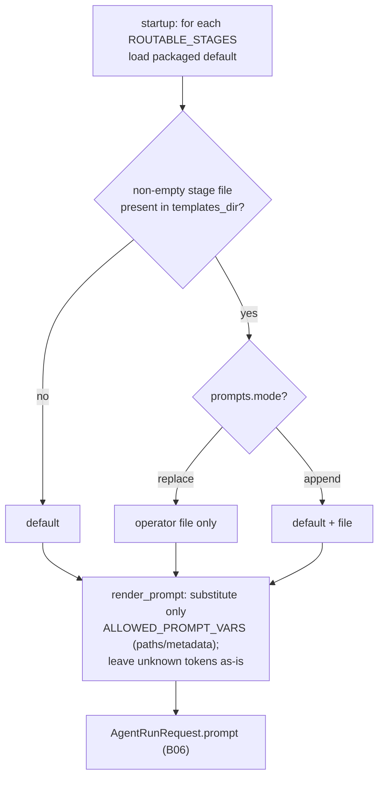

# B15 — Prompt Templates and Rendering

## Purpose

Prepares the prompt text for each agent stage: resolves the template (a packaged default plus an optional operator file override) and substitutes into it an **allowlisted** set of variables (only metadata and artifact paths — never the task body, diffs, logs, env, or secrets). Sits between the stage driver [B06](./B06-orchestrator-pipeline.md) and `AgentRunRequest.prompt`.

## Responsibilities

- Load the packaged default for each routable stage and, when a `<stage>.md` file is present in `templates_dir`, the operator override, combining them according to `prompts.mode` ([prompts.py:83-130](../../../src/wastech_orchestrator/core/prompts.py#L83)).
- Substitute only the allowed `{name}` tokens, leaving everything else unchanged (the "safe renderer") ([prompts.py:57-72](../../../src/wastech_orchestrator/core/prompts.py#L57)).
- Provide the operator override text for skill deduplication ([prompts.py:132-138](../../../src/wastech_orchestrator/core/prompts.py#L132)).

## Block Boundaries

### In scope

- Stage template resolution and safe substitution of path/metadata variables.

### Out of scope

- **Collecting variable values** — that is [B06 `_prompt_variables`](./B06-orchestrator-pipeline.md) (paths/metadata only).
- **The context-path footer in the prompt itself** — that is [B18 `build_context_footer`](./B18-agent-providers.md).
- **argv/CLI syntax, sandbox/approvals, denied commands, env, fallback** — this module does not touch those ([prompts.py:13-15](../../../src/wastech_orchestrator/core/prompts.py#L13)).

## Entry Points

- `PromptTemplateStore(config.prompts)` — constructed in `Orchestrator.__init__` ([orchestrator.py:326](../../../src/wastech_orchestrator/core/orchestrator.py#L326)).
- `PromptTemplateStore.resolved(stage)` / `override_for(stage)` ([prompts.py:118,132](../../../src/wastech_orchestrator/core/prompts.py#L118)) — [B06 `_build_prompt`/`_resolve_and_render_skills`](./B06-orchestrator-pipeline.md).
- `render_prompt(template, variables)` ([prompts.py:57](../../../src/wastech_orchestrator/core/prompts.py#L57)); `ALLOWED_PROMPT_VARS` ([prompts.py:37-52](../../../src/wastech_orchestrator/core/prompts.py#L37)).
- Data: packaged `templates/prompts/<stage>.md`.

## Inputs and State

`PromptsConfig` (`templates_dir`, `mode`); variable dictionary from [B06](./B06-orchestrator-pipeline.md). State — defaults and per-stage overrides loaded at startup.

## Main Scenario

1. At startup: the packaged default is loaded for each `ROUTABLE_STAGES`; if a non-empty `<stage>.md` exists in `templates_dir`, it becomes the override for that stage (file presence = activation signal).
2. `resolved(stage)`: no file → default; `mode=replace` → file only; `mode=append` → default + file.
3. `render_prompt`: only tokens from `ALLOWED_PROMPT_VARS` are substituted (`None` → empty string); unknown `{...}` tokens are left as-is (no `KeyError`; code/JSON with braces is not broken).

Stage template resolution and safe substitution (presence of an override file = activation signal):

## Alternative Scenarios

### Empty `templates_dir`

Explicit opt-out: packaged defaults are used for all stages ([prompts.py:101-102](../../../src/wastech_orchestrator/core/prompts.py#L101)).

### Empty override file

A warning is logged and the default is used ([prompts.py:112-116](../../../src/wastech_orchestrator/core/prompts.py#L112)).

## Checks and Constraints

- Only metadata/paths from `ALLOWED_PROMPT_VARS` are interpolated; large content is never injected ([prompts.py:34-52](../../../src/wastech_orchestrator/core/prompts.py#L34)).
- A missing override file is not an error (no fail-closed-on-missing); packaged defaults are always available ([prompts.py:86-92](../../../src/wastech_orchestrator/core/prompts.py#L86)).

## Output

The stage template text (`resolved`) and the final rendered prompt after substitution (`render_prompt`) — [B06](./B06-orchestrator-pipeline.md) places it in `AgentRunRequest.prompt`.

## Side Effects

- At startup reads override files from `templates_dir` (once). `render_prompt`/`resolved` are pure.

## Errors and Edge Cases

- Any unrecognized `{...}` is preserved verbatim (safe renderer).
- A relative `templates_dir` is already anchored to the config directory by the loader ([B05](./B05-configuration.md)).

## Relationships

### Uses

- [B05 — Configuration](./B05-configuration.md) — `PromptsConfig`, `PromptMode`, `ROUTABLE_STAGES`.
- Packaged templates `templates/prompts/*.md` (package data, supplied by [B03](./B03-installer-and-scaffolding.md)).

### Used by

- [B06 — Pipeline](./B06-orchestrator-pipeline.md) — building the prompt for each agent stage and skill deduplication (`override_for`).

## Role in the Overall System

Converts a "stage" into a concrete text for the agent, allowing the operator to customize prompts via files while preventing the template from weakening security or injecting large/secret content (which remains in artifacts that the agent references by path).

## Code Confirmation

- [core/prompts.py:57-138](../../../src/wastech_orchestrator/core/prompts.py#L57) — safe renderer and `PromptTemplateStore` (resolve/override).
- Test: [tests/core/test_prompts.py](../../../tests/core/test_prompts.py) — variable allowlist, preservation of unknown braces, replace/append modes, file-presence activation.
