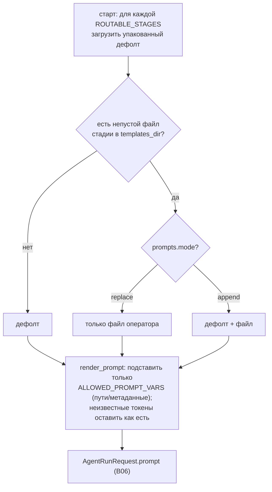

# B15 — Шаблоны промптов и их рендеринг

## Назначение

Готовит текст промпта для каждой агентской стадии: разрешает шаблон (упакованный дефолт + опциональный файл-оверрайд оператора) и подставляет в него **аллой-лист** переменных (только метаданные и пути к артефактам, никогда — тело задачи, диффы, логи, env или секреты). Сидит между драйвером стадии [B06](./B06-orchestrator-pipeline.md) и `AgentRunRequest.prompt`.

## Ответственность

- Загрузить упакованный дефолт для каждой routable-стадии и, при наличии `<stage>.md` в `templates_dir`, оверрайд оператора, скомбинировав по `prompts.mode` ([prompts.py:83-130](../../../src/wastech_orchestrator/core/prompts.py#L83)).
- Подставить только разрешённые `{name}`-токены, оставив всё прочее как есть («безопасный рендерер») ([prompts.py:57-72](../../../src/wastech_orchestrator/core/prompts.py#L57)).
- Дать текст оверрайда оператора для дедупа навыков ([prompts.py:132-138](../../../src/wastech_orchestrator/core/prompts.py#L132)).

## Границы блока

### Входит в ответственность блока

- Разрешение шаблона стадии и безопасная подстановка переменных-путей/метаданных.

### Не входит в ответственность блока

- **Сбор значений переменных** — это [B06 `_prompt_variables`](./B06-orchestrator-pipeline.md) (только пути/метаданные).
- **Футер с путями к контексту** в самом промпте — это [B18 `build_context_footer`](./B18-agent-providers.md).
- **argv/CLI-синтаксис, sandbox/approvals, denied-команды, env, fallback** — модуль их не касается ([prompts.py:13-15](../../../src/wastech_orchestrator/core/prompts.py#L13)).

## Точки входа

- `PromptTemplateStore(config.prompts)` — строится в `Orchestrator.__init__` ([orchestrator.py:326](../../../src/wastech_orchestrator/core/orchestrator.py#L326)).
- `PromptTemplateStore.resolved(stage)` / `override_for(stage)` ([prompts.py:118,132](../../../src/wastech_orchestrator/core/prompts.py#L118)) — [B06 `_build_prompt`/`_resolve_and_render_skills`](./B06-orchestrator-pipeline.md).
- `render_prompt(template, variables)` ([prompts.py:57](../../../src/wastech_orchestrator/core/prompts.py#L57)); `ALLOWED_PROMPT_VARS` ([prompts.py:37-52](../../../src/wastech_orchestrator/core/prompts.py#L37)).
- Данные: упакованные `templates/prompts/<stage>.md`.

## Входные данные и состояние

`PromptsConfig` (`templates_dir`, `mode`); словарь переменных от [B06](./B06-orchestrator-pipeline.md). Состояние — загруженные при старте дефолты и оверрайды по стадиям.

## Основной сценарий

1. На старте: для каждой `ROUTABLE_STAGES` грузится упакованный дефолт; если в `templates_dir` есть непустой `<stage>.md` — он становится оверрайдом этой стадии (наличие файла = сигнал активации).
2. `resolved(stage)`: нет файла → дефолт; `mode=replace` → только файл; `mode=append` → дефолт + файл.
3. `render_prompt`: заменяются только токены из `ALLOWED_PROMPT_VARS` (`None` → пустая строка); неизвестные `{...}` остаются как есть (нет `KeyError`, код/JSON со скобками не ломается).

Разрешение шаблона стадии и безопасная подстановка (наличие файла оверрайда = сигнал активации):

## Альтернативные сценарии

### Пустой `templates_dir`

Явный opt-out: для всех стадий используются упакованные дефолты ([prompts.py:101-102](../../../src/wastech_orchestrator/core/prompts.py#L101)).

### Пустой файл оверрайда

Логируется предупреждение, используется дефолт ([prompts.py:112-116](../../../src/wastech_orchestrator/core/prompts.py#L112)).

## Проверки и ограничения

- Интерполируются только метаданные/пути из `ALLOWED_PROMPT_VARS`; крупный контент не вставляется ([prompts.py:34-52](../../../src/wastech_orchestrator/core/prompts.py#L34)).
- Отсутствующий файл оверрайда не ошибка (нет fail-closed-on-missing); упакованные дефолты всегда доступны ([prompts.py:86-92](../../../src/wastech_orchestrator/core/prompts.py#L86)).

## Результат

Текст шаблона стадии (`resolved`) и итоговый промпт после подстановки (`render_prompt`) — [B06](./B06-orchestrator-pipeline.md) кладёт его в `AgentRunRequest.prompt`.

## Побочные эффекты

- При старте читает файлы оверрайдов из `templates_dir` (один раз). `render_prompt`/`resolved` — чистые.

## Ошибки и граничные случаи

- Любой нераспознанный `{...}` сохраняется дословно (безопасный рендерер).
- Относительный `templates_dir` уже привязан к каталогу конфига загрузчиком ([B05](./B05-configuration.md)).

## Связи

### Использует

- [B05 — Конфигурация](./B05-configuration.md) — `PromptsConfig`, `PromptMode`, `ROUTABLE_STAGES`.
- упакованные шаблоны `templates/prompts/*.md` (данные пакета, поставляются [B03](./B03-installer-and-scaffolding.md)).

### Используется в

- [B06 — Конвейер](./B06-orchestrator-pipeline.md) — построение промпта каждой агентской стадии и дедуп навыков (`override_for`).

## Место в общей системе

Превращает «стадию» в конкретный текст для агента, позволяя оператору кастомизировать промпты файлами, но не давая шаблону ослабить безопасность или вставить крупный/секретный контент (он остаётся в артефактах, на которые агент ссылается по пути).

## Подтверждение в коде

- [core/prompts.py:57-138](../../../src/wastech_orchestrator/core/prompts.py#L57) — безопасный рендерер и `PromptTemplateStore` (resolve/override).
- Тест: [tests/core/test_prompts.py](../../../tests/core/test_prompts.py) — аллой-лист переменных, сохранение неизвестных скобок, режимы replace/append, активация по наличию файла.
