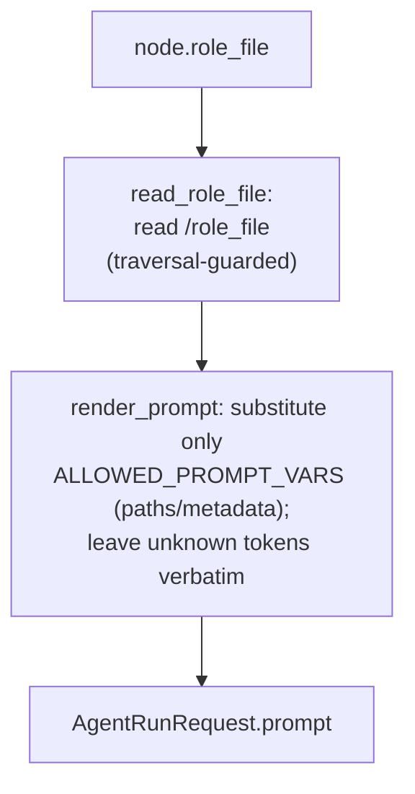

# B15 — Prompt Templates and Rendering

## Purpose

Prepares the prompt text for each flow node. A node's prompt template is the content of its `role_file` (a `.md` next to the flow YAML); this block is the safe renderer (`render_prompt` / `ALLOWED_PROMPT_VARS` in `core/prompts.py`) plus the `role_file` resolution (`read_role_file` / `render_role_prompt` in `core/flow/prompt.py`, with an in-flow-directory traversal guard). It substitutes into the template an **allowlisted** set of variables (only metadata and artifact paths — never the task body, diffs, logs, env, or secrets). Sits between the node runners ([B06](./B06-orchestrator-pipeline.md) flow runtime) and `AgentRunRequest.prompt`.

## Responsibilities

- Read a node's `role_file` from within the flow directory, rejecting any path that escapes it ([prompt.py:26-38](../../../src/wastech_orchestrator/core/flow/prompt.py#L26)).
- Substitute only the allowed `{name}` tokens, leaving everything else unchanged (the "safe renderer") ([prompts.py:42-57](../../../src/wastech_orchestrator/core/prompts.py#L42)).

## Block Boundaries

### In scope

- Reading a node's `role_file` and safe substitution of path/metadata variables.

### Out of scope

- **Collecting variable values** — that is the node runners ([core/flow/nodes/](../../../src/wastech_orchestrator/core/flow/nodes/)), not [B06](./B06-orchestrator-pipeline.md).
- **The context-path footer in the prompt itself** — that is [B18 `build_context_footer`](./B18-agent-providers.md).
- **argv/CLI syntax, sandbox/approvals, denied commands, env, fallback** — this module does not touch those ([prompts.py:9-11](../../../src/wastech_orchestrator/core/prompts.py#L9)).

## Entry Points

- `render_prompt(template, variables)` ([prompts.py:42](../../../src/wastech_orchestrator/core/prompts.py#L42)); `ALLOWED_PROMPT_VARS` ([prompts.py:21](../../../src/wastech_orchestrator/core/prompts.py#L21)).
- `read_role_file(flow_dir, role_file)` / `render_role_prompt(flow_dir, role_file, variables)` ([prompt.py:26,41](../../../src/wastech_orchestrator/core/flow/prompt.py#L26)).
- Data: a node's `role_file` lives next to the flow YAML ([core/flow/packaged/roles/](../../../src/wastech_orchestrator/core/flow/packaged/roles/)).

## Inputs and State

`flow_dir` + the node's `role_file`; a variable dictionary collected by the node runners. The block holds no state of its own.

## Main Scenario

1. `read_role_file`: read `<flow_dir>/<role_file>`, after checking the resolved path stays within `flow_dir` (defense-in-depth on top of the load-time traversal check in the flow validator).
2. `render_prompt`: only tokens from `ALLOWED_PROMPT_VARS` are substituted (`None` → empty string); unknown `{...}` tokens are left as-is (no `KeyError`; code/JSON with braces is not broken).

Read the node's `role_file`, then substitute path/metadata variables:

## Checks and Constraints

- Only metadata/paths from `ALLOWED_PROMPT_VARS` are interpolated; large content is never injected ([prompts.py:21-37](../../../src/wastech_orchestrator/core/prompts.py#L21)).
- A `role_file` resolving outside `flow_dir` is a fatal `RoleFileError` ([prompt.py:33-34](../../../src/wastech_orchestrator/core/flow/prompt.py#L33)).

## Output

The final rendered prompt after substitution (`render_role_prompt` / `render_prompt`) — the node runner places it in `AgentRunRequest.prompt`.

## Side Effects

- `read_role_file` reads the role file from disk; `render_prompt` is pure.

## Errors and Edge Cases

- Any unrecognized `{...}` is preserved verbatim (safe renderer).
- A `role_file` that cannot be read, or that escapes `flow_dir`, raises `RoleFileError`.

## Relationships

### Uses

- The `role_file` is package data shipped inside the flow ([core/flow/packaged/roles/](../../../src/wastech_orchestrator/core/flow/packaged/roles/)); the installer no longer copies a prompt-template tree to `.worc` ([B03](./B03-installer-and-scaffolding.md)).

### Used by

- [B06 — Pipeline](./B06-orchestrator-pipeline.md) — assembles the node services; the `AgentNodeRunner` / `EvaluatorNodeRunner` ([core/flow/nodes/](../../../src/wastech_orchestrator/core/flow/nodes/)) build the prompt for each node.

## Role in the Overall System

Converts a flow node's `role_file` into concrete text for the agent, allowing the flow author to author prompts as files while preventing the template from weakening security or injecting large/secret content (which remains in artifacts that the agent references by path).

## Code Confirmation

- [core/prompts.py:21-57](../../../src/wastech_orchestrator/core/prompts.py#L21) — safe renderer and the variable allowlist.
- [core/flow/prompt.py:22-45](../../../src/wastech_orchestrator/core/flow/prompt.py#L22) — `role_file` read/render and the traversal guard.
- Tests: [tests/core/test_prompts.py](../../../tests/core/test_prompts.py) — variable allowlist, preservation of unknown braces; [tests/core/test_flow_prompt.py](../../../tests/core/test_flow_prompt.py) — `role_file` read + render + traversal guard.
