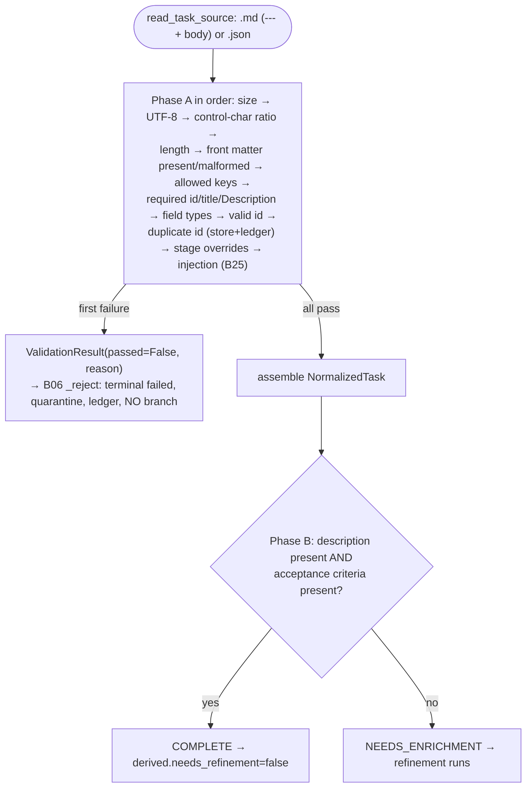

# B16 — Task Model, Parsing, and Validation Gate

> Reconstructed from code (`task/model.py`, `task/parser.py`, `task/validation_gate.py`) and tests (`tests/task/`). The code is the only source of truth; this document was rebuilt from the implementation, not from prose or comments. Significant claims carry a `file:line` reference.

**Status:** documented · **Source modules:** `src/wastech_orchestrator/task/model.py`, `src/wastech_orchestrator/task/parser.py`, `src/wastech_orchestrator/task/validation_gate.py`

## Responsibility

Turn one task file (Markdown with YAML front matter + body, or a JSON object) into a `NormalizedTask`, and decide — deterministically, with no agent — whether the task may enter the pipeline. This is the data entry point: the gate runs first in `run_task`, **before** the processing slot is acquired and before any branch or provider exists ([validation_gate.py:1](../../../src/wastech_orchestrator/task/validation_gate.py#L1)). It is split into two phases: **Phase A** hard-rejects structurally invalid input (the first failure short-circuits), and **Phase B** classifies semantic completeness without ever rejecting.

The module is deliberately layered: `parser.py` is _structural only_ (it splits front matter from body and rejects duplicate keys, but never judges validity), `model.py` fixes the shared shapes and the id regex, and `validation_gate.py` owns every accept/reject decision ([parser.py:1](../../../src/wastech_orchestrator/task/parser.py#L1)). The gate is pure (IO-free); writing the normalized manifest and the validation report are separate functions the pipeline (B06) calls.

## Public surface

- `NormalizedTask` ([model.py](../../../src/wastech_orchestrator/task/model.py)) — the parsed task: `id`, `title`, `description`, plus optional `task_type`, `branch_name`, tri-state `auto_merge`/`prompt_audit`, `contacts`, `depends_on`, `subtasks`, and `node_overrides`.
- `NormalizedTask.disabled_nodes()` ([model.py](../../../src/wastech_orchestrator/task/model.py)) — the flow node ids explicitly disabled via `nodes.<node-id>.enabled: false`.
- `NodeOverride` ([model.py](../../../src/wastech_orchestrator/task/model.py)) — a per-node toggle with the single field `enabled: bool | None`.
- `TASK_ID_PATTERN` / `is_valid_task_id` ([model.py:19](../../../src/wastech_orchestrator/task/model.py#L19), [model.py:43](../../../src/wastech_orchestrator/task/model.py#L43)) — the strict id format, applied with `fullmatch`.
- `is_valid_branch_name` ([model.py](../../../src/wastech_orchestrator/task/model.py)) — pure Git branch-name safety validation for the task-level `branch_name` override.
- `ALLOWED_TASK_KEYS` / `REQUIRED_TASK_FIELDS` ([model.py:28](../../../src/wastech_orchestrator/task/model.py#L28), [model.py:40](../../../src/wastech_orchestrator/task/model.py#L40)) — the clean-task front-matter allowlist and the required subset.
- `read_task_source(path)` ([parser.py:61](../../../src/wastech_orchestrator/task/parser.py#L61)) — read the file as raw bytes + suffix (decoding is the gate's concern).
- `split_frontmatter(text, suffix)` ([parser.py:95](../../../src/wastech_orchestrator/task/parser.py#L95)) — split front matter from body per format.
- `extract_section(body, header)` ([parser.py:173](../../../src/wastech_orchestrator/task/parser.py#L173)) — pull a `## <header>` markdown section, case-insensitive.
- `slugify(value)` ([parser.py:191](../../../src/wastech_orchestrator/task/parser.py#L191)) — fold a title into a branch-safe slug.
- `write_normalized(task, root)` / `load_normalized(root, task_id)` ([parser.py:201](../../../src/wastech_orchestrator/task/parser.py#L201), [parser.py:228](../../../src/wastech_orchestrator/task/parser.py#L228)) — the `task.normalized.json` round-trip (write at registration, read back on resume).
- `ValidationGate.validate(source)` ([validation_gate.py:116](../../../src/wastech_orchestrator/task/validation_gate.py#L116)) — run Phase A then Phase B, returning a `ValidationResult`.
- `ValidationGate.phase_b(task)` ([validation_gate.py:342](../../../src/wastech_orchestrator/task/validation_gate.py#L342)) — completeness classification, also called standalone on resume.
- `ValidationReason` / `Completeness` / `ValidationResult` ([validation_gate.py:52](../../../src/wastech_orchestrator/task/validation_gate.py#L52), [validation_gate.py:71](../../../src/wastech_orchestrator/task/validation_gate.py#L71), [validation_gate.py:78](../../../src/wastech_orchestrator/task/validation_gate.py#L78)).
- `write_validation_report(result, task_id, root)` ([validation_gate.py:368](../../../src/wastech_orchestrator/task/validation_gate.py#L368)) — write `validation_report.json`.

## Behavior

### Task formats and the front-matter split

`read_task_source` records the raw bytes and lowercased suffix only — it never decodes ([parser.py:61](../../../src/wastech_orchestrator/task/parser.py#L61)). `split_frontmatter` dispatches on the suffix ([parser.py:95](../../../src/wastech_orchestrator/task/parser.py#L95)):

- **Markdown** must open with a `---` fence on the very first line (no leading blank lines); the body starts after the matching closing `---`. A missing closing fence, a YAML parse error, a non-mapping document, or a duplicate key all produce `present=True, malformed=True` ([parser.py:102](../../../src/wastech_orchestrator/task/parser.py#L102)). YAML is loaded with `_UniqueKeyLoader`, a hardened `SafeLoader` whose mapping constructor raises on duplicate keys instead of silently keeping the last value ([parser.py:67](../../../src/wastech_orchestrator/task/parser.py#L67)).
- **JSON** is parsed with `object_pairs_hook=_json_no_duplicates`, which raises on a repeated key ([parser.py:86](../../../src/wastech_orchestrator/task/parser.py#L86), [parser.py:149](../../../src/wastech_orchestrator/task/parser.py#L149)). The body lives in the reserved `description` key (`JSON_BODY_KEY`), which is split out so the front-matter key set is uniform across both formats ([parser.py:30](../../../src/wastech_orchestrator/task/parser.py#L30), [parser.py:163](../../../src/wastech_orchestrator/task/parser.py#L163)). Valid JSON that is not an object (e.g. a list) is treated as "front matter absent", not malformed ([parser.py:160](../../../src/wastech_orchestrator/task/parser.py#L160)).

The deterministic duplicate-key rejection lets the gate report `frontmatter_malformed` rather than depend on which value YAML/JSON happened to keep ([parser.py:9](../../../src/wastech_orchestrator/task/parser.py#L9)).

### The clean-task schema

`ALLOWED_TASK_KEYS` is exactly `{id, title, task_type, branch_name, auto_merge, prompt_audit, contacts, depends_on, subtasks, nodes}` ([model.py](../../../src/wastech_orchestrator/task/model.py)); `REQUIRED_TASK_FIELDS` is `{id, title}`. A "clean" task carries identity/dispatch only, plus bounded operational knobs: a full branch-name override, merge dependencies, operator-authored subtask references, per-node disable toggles, prompt audit, and auto-merge. Provider, model, reasoning, and the old `refined` flag are **not** task fields; they live on the flow node or are derived, so they fail-closed as `unknown_top_level_field`.

`task_type` is the dispatch key that selects the flow (`implementation` / `deep_research` / `security_audit` / an operator flow); `None` defers to the registry default. It never affects _how_ a node runs. `branch_name` is a full task-branch override; when absent, the Git Manager uses `repo.branch_prefix/<task-id>-<slug>`. `auto_merge` and `prompt_audit` are tri-state (`True`/`False`/`None`): the task value wins outright, and `None` defers to the global config.

The task id is strict — `^[a-z0-9][a-z0-9._-]{0,63}$` (1–64 chars, lowercase-alnum first char, no leading dot/separator, no whitespace) — and applied with `fullmatch` ([model.py:19](../../../src/wastech_orchestrator/task/model.py#L19), [model.py:45](../../../src/wastech_orchestrator/task/model.py#L45)). Invalid ids are rejected, never sanitized (accept/reject cases: [test_model.py:17](../../../tests/task/test_model.py#L17)).

### Phase A — structural hard reject

`_phase_a` runs the checks in a fixed order and short-circuits on the **first** failure; each failure maps to a `ValidationReason` ([validation_gate.py:127](../../../src/wastech_orchestrator/task/validation_gate.py#L127)). The full ordered list:

1. **`FILE_TOO_LARGE`** — `len(raw_bytes) > validation.max_task_bytes`, measured on raw bytes before decoding ([validation_gate.py:131](../../../src/wastech_orchestrator/task/validation_gate.py#L131)).
2. **`NOT_UTF8`** — strict UTF-8 decode fails ([validation_gate.py:133](../../../src/wastech_orchestrator/task/validation_gate.py#L133)).
3. **`BINARY_OR_CONTROL_CHARS`** — any NUL byte rejects immediately; otherwise the fraction of control chars (anything `< 0x20` or `== 0x7F`, excluding `\t \n \r`) must not exceed `max_control_ratio` ([validation_gate.py:154](../../../src/wastech_orchestrator/task/validation_gate.py#L154)).
4. **`TOO_LONG`** — line count `> max_task_lines`, or any single line's UTF-8 length `> max_line_bytes` ([validation_gate.py:170](../../../src/wastech_orchestrator/task/validation_gate.py#L170)).
5. **`FRONTMATTER_MISSING`** then **`FRONTMATTER_MALFORMED`** — from `split_frontmatter` ([validation_gate.py:146](../../../src/wastech_orchestrator/task/validation_gate.py#L146)).

Once the front matter parses, `_validate_fields` continues the same short-circuiting sequence with the field-level checks, in this order ([validation_gate.py:182](../../../src/wastech_orchestrator/task/validation_gate.py#L182)):

1. **`UNKNOWN_TOP_LEVEL_FIELD`** — fail-closed: any key not in `ALLOWED_TASK_KEYS` ([validation_gate.py:186](../../../src/wastech_orchestrator/task/validation_gate.py#L186)).
2. **`MISSING_REQUIRED_FIELD`** — `id` absent, `title` absent or blank, or the body `Description` section empty. The `## Description` section must be non-empty; if the body has no headings the whole body counts as the description ([validation_gate.py:195](../../../src/wastech_orchestrator/task/validation_gate.py#L195), [validation_gate.py:247](../../../src/wastech_orchestrator/task/validation_gate.py#L247)).
3. **`INVALID_FIELD_TYPE`** — `title` must be a string; `branch_name`/`task_type` must be string-or-null; `auto_merge`/`prompt_audit` must be boolean-or-null; `contacts`/`depends_on`/`subtasks` must be lists of strings (a bare string/bytes is rejected where a list is expected).
4. **`INVALID_TASK_ID`** — `id` not a string or not matching `TASK_ID_PATTERN`.
5. **`INVALID_DEPENDS_ON`** — `depends_on` is malformed or self-referential.
6. **`DUPLICATE_TASK_ID`** — the id already exists in the tasks store **or** the ledger, unless `is_recovery_rerun(id)` exempts it.
7. **`INVALID_NODE_OVERRIDE`** — the `nodes` block is malformed or uses any sub-key besides `enabled`.
8. **`INJECTION_SUSPECTED`** — `scan_frontmatter` finds an argv-shaped token in any front-matter value.
9. **`INVALID_BRANCH_NAME`** — `branch_name`, when present and non-blank, is not a safe Git branch ref or equals `repo.base_branch`.

Only after every check passes is the `NormalizedTask` assembled. `branch_name` and `task_type` are `None` when blank/whitespace; the description is `body.strip()` (the **full** body, not just the Description section).

### Node overrides

`_build_node_overrides` maps the `nodes` block to `{node_id: NodeOverride}`, fail-closed. The whole block may be `null`/`{}` (→ no overrides). Keys are flow node ids; the IO-free gate validates only shape, and flow resolution later verifies that each disabled node exists and can be skipped. Within each node block, `enabled` is the **only** valid sub-key — any other (e.g. `model`, `reasoning`, `temperature`) rejects as `INVALID_NODE_OVERRIDE`. A per-node value of `null`/`{}` means "default (runs)"; `enabled` must be boolean-or-`null`.

### Phase B — completeness (never rejects)

`phase_b` classifies `COMPLETE` vs `NEEDS_ENRICHMENT` and is the **only** input to the deterministic refinement-skip ([validation_gate.py:342](../../../src/wastech_orchestrator/task/validation_gate.py#L342)). A task is `COMPLETE` iff it has a non-empty description **and** a structured `## Acceptance criteria` section ([validation_gate.py:350](../../../src/wastech_orchestrator/task/validation_gate.py#L350)). The old `or "acceptance" in description.lower()` substring fallback was **removed** (audit #26, 2026-06-22): prose like "no acceptance criteria yet" used to classify `COMPLETE` and skip refinement; requiring the section routes such tasks through refinement, the safe direction (refinement never rejects). Anything less is `NEEDS_ENRICHMENT` — refinement will run. Missing acceptance criteria/constraints is never a reject (§19.1). The orchestrator turns this into the `derived.needs_refinement` fact via `completeness is not Completeness.COMPLETE` ([orchestrator.py:1099](../../../src/wastech_orchestrator/core/orchestrator.py#L1099), B06).

### Artifacts and the resume round-trip

`write_normalized` writes `task.normalized.json` under `logs/<task-id>/`, serializing `id`, `title`, `description`, `task_type`, `branch_name`, `auto_merge`, `prompt_audit`, `contacts`, `depends_on`, `subtasks`, and `nodes`. `load_normalized` reads it back on resume; legacy manifests written before a field existed load with its default (`nodes` → `{}`, tri-state fields/`branch_name` → `None`). Persisting `branch_name` keeps a custom branch override from silently reverting to the default branch naming policy across a crash-resume before publish. `write_validation_report` writes `validation_report.json` (`task_id`, `passed`, `reason`, `detail`, `completeness`) for both accepted and rejected tasks.

`slugify` lowercases and collapses runs of non-alphanumerics to a single `-`, trimming leading/trailing dashes, and returns `"task"` for an otherwise-empty result so a branch name is always well-formed ([parser.py:191](../../../src/wastech_orchestrator/task/parser.py#L191)).

## Invariants & guarantees

- **The gate never mutates its input and never raises on invalid content** — an invalid task is a returned `ValidationResult(passed=False, …)`, not an exception. `validate`, `phase_b`, and the parser splitters are pure ([validation_gate.py:116](../../../src/wastech_orchestrator/task/validation_gate.py#L116)).
- **A Phase-A reject creates no branch.** The gate runs before the slot and branch; on reject B06 writes only `validation_report.json`, quarantines the file, records a `failed` ledger row with `branch=None`, and returns terminal `failed` ([orchestrator.py:344](../../../src/wastech_orchestrator/core/orchestrator.py#L344), [orchestrator.py:1678](../../../src/wastech_orchestrator/core/orchestrator.py#L1678)). The quarantine destination is `validation.quarantine_folder`, defaulting to `./.worc/tasks/rejected` ([loader.py:462](../../../src/wastech_orchestrator/config/loader.py#L462)).
- **The first Phase-A failure wins** — checks are ordered and short-circuit, so the reported reason is deterministic for a given input ([validation_gate.py:127](../../../src/wastech_orchestrator/task/validation_gate.py#L127)).
- **Duplicate front-matter keys are an error, never "last value wins"** — both YAML and JSON loaders raise ([parser.py:67](../../../src/wastech_orchestrator/task/parser.py#L67), [parser.py:86](../../../src/wastech_orchestrator/task/parser.py#L86)).
- **Ids are validated, not sanitized** ([model.py:18](../../../src/wastech_orchestrator/task/model.py#L18)).
- **The injection scan is belt-and-braces.** Task content reaches providers only as file paths (§19.5), so a front-matter value can never become a CLI flag regardless; the scan is a second line of defence ([validation_gate.py:14](../../../src/wastech_orchestrator/task/validation_gate.py#L14)).
- **The task does not patch the flow graph.** The only graph-shaping levers are `task_type` (which flow) and per-task `nodes.<node-id>.enabled: false` (a bounded node skip); provider/model/reasoning are never task fields.
- **Recovery-rerun bypasses duplicate-id only for the named id.** `is_recovery_rerun` is scoped to exactly the one id being re-run; a re-run set for a different id does not exempt this duplicate ([test_validation_gate.py:185](../../../tests/task/test_validation_gate.py#L185)).

## Dependencies

- **Uses:** B05 (`SKIPPABLE_STAGES`, `validation.*` thresholds, `agents.allow_review_skip`), B25 (`scan_frontmatter` injection scan), B20 (`task_artifact_dir` for the manifest/report paths), B07 (injected `store_has_task_id` for the duplicate-id check; `load_normalized` is read on resume), B08 (injected `ledger_has_task_id` for the duplicate-id check). The `Stage` enum is from `providers/base.py`.
- **Used by:** B06 (the gate runs first in `run_task`; reject → `_reject`; `phase_b` feeds the fact resolver and runs again on resume; `write_normalized`/`load_normalized` bracket registration and recovery; `slugify` names the branch). B11/B12 consume the resulting `NormalizedTask`.

## Audit candidates

See [the audit](../../backlog/2026-06-21-audit.md).

- [parser.py:231](../../../src/wastech_orchestrator/task/parser.py#L231), [parser.py:237](../../../src/wastech_orchestrator/task/parser.py#L237) — `load_normalized` does an unguarded `json.loads` followed by required-key access `data["id"]`/`data["title"]`; a corrupt or truncated `task.normalized.json` raises `JSONDecodeError`/`KeyError`. This is the parser-side cause of the resume crash (the crash itself surfaces in B06/B10, where `load_normalized` is called at [orchestrator.py:727](../../../src/wastech_orchestrator/core/orchestrator.py#L727)). Contrast `write_validation_report`/`load_normalized`'s tolerant `data.get(...)` for optional fields — only the two required keys are unguarded.
- [validation_gate.py:351](../../../src/wastech_orchestrator/task/validation_gate.py#L351) — Phase-B acceptance detection falls back to `"acceptance" in task.description.lower()` (a bare substring). Any prose mentioning the word — including "no acceptance criteria yet" — classifies the task `COMPLETE` and silently skips refinement, since this classification is the _only_ input to `derived.needs_refinement`.
- [model.py:1](../../../src/wastech_orchestrator/task/model.py#L1) — stale planning prose: the module docstring states "The actual parsing, the §19 validation gate, and duplicate-id detection are P5 … here we fix only the shapes …", and the inline comments reference "P1 and the P5 parser" ([model.py:18](../../../src/wastech_orchestrator/task/model.py#L18)). Parsing and the gate are now implemented in this same package; the P1/P5 phasing is historical.

## Tests

- `tests/task/test_model.py` — id accept/reject matrix, branch-name accept/reject matrix, tri-state `auto_merge`/`prompt_audit`, independent default collections, the exact `ALLOWED_TASK_KEYS`/`REQUIRED_TASK_FIELDS` schema, and `disabled_nodes()` reflecting `enabled: false` only.
- `tests/task/test_parser.py` — `read_task_source`, the front-matter split for `.md`/`.json` (duplicate-key, unterminated, non-mapping, non-object cases), `extract_section`, `slugify`, and the `write_normalized`/`load_normalized` round-trips for `task_type`/`branch_name`/`auto_merge`/`prompt_audit`/`node_overrides` plus legacy-manifest defaulting.
- `tests/task/test_validation_gate.py` — one accept/reject test per `ValidationReason`, the duplicate-id store/ledger/recovery-rerun matrix, the full `nodes` override surface, `branch_name` normalization/injection/type/ref-safety cases, the tri-state field cases, and Phase-B `COMPLETE`/`NEEDS_ENRICHMENT` classification.
