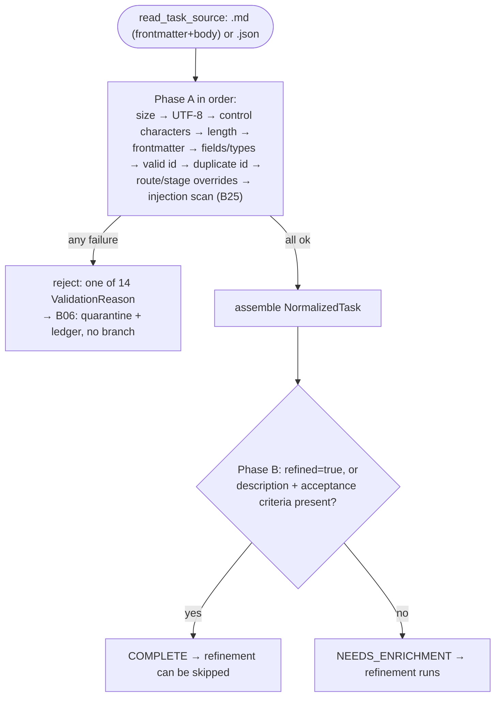

# B16 — Task Model, Parsing, and Validation Gate

## Purpose

Transforms a task file (`.md` with frontmatter + body, or a `.json` object) into a normalized model and applies the acceptance gate §19 — a deterministic check that admits or rejects a task **before** a slot is claimed and a branch is created. This is the data entry point to the system: everything that passes further down the pipeline has already been validated and normalized.

## Responsibilities

- Define the `NormalizedTask` shape, id regex, and frontmatter schema ([model.py](../../../src/wastech_orchestrator/task/model.py)).
- Structurally parse the file into frontmatter + body, rejecting on duplicate keys ([parser.py:95-167](../../../src/wastech_orchestrator/task/parser.py#L95)).
- Apply the gate: Phase A (hard reject, first failure short-circuits) and Phase B (completeness classification, no reject) ([validation_gate.py:121-128](../../../src/wastech_orchestrator/task/validation_gate.py#L121)).
- Write/read `task.normalized.json`; write `validation_report.json`; produce a title slug.

## Block Boundaries

### Within scope

- Structural parsing of `.md`/`.json` and rejection on duplicate keys.
- All Phase A §19 checks (size, encoding, control characters, length, frontmatter, fields, types, id, duplicate id, route/stage overrides, injection scan) and Phase B completeness classification.
- Assembly of `NormalizedTask`; IO for the normalized manifest and validation report; `slugify`.

### Out of scope

- **Moving the file** to quarantine/lifecycle folder — that is [B06](./B06-orchestrator-pipeline.md) (`_quarantine`/`_relocate_task_file`); the gate only writes the report and returns a result.
- **Data source for id dedup** — injected callbacks `store_has_task_id` ([B07](./B07-state-machine-and-store.md)) and `ledger_has_task_id` ([B08](./B08-ledger-and-failure-reports.md)) ([validation_gate.py:108-119](../../../src/wastech_orchestrator/task/validation_gate.py#L108)).
- **Route override validation** is delegated to [B05 `check_task_route_override`](./B05-configuration.md) ([validation_gate.py:315-318](../../../src/wastech_orchestrator/task/validation_gate.py#L315)).
- **Injection scan** is delegated to [B25 `scan_frontmatter`](./B25-security-policy.md) ([validation_gate.py:236](../../../src/wastech_orchestrator/task/validation_gate.py#L236)).
- Slot acquisition, branch creation, provider launch.

## Entry Points

- `read_task_source(path)` ([parser.py:61](../../../src/wastech_orchestrator/task/parser.py#L61)) — `run_task` ([orchestrator.py:352](../../../src/wastech_orchestrator/core/orchestrator.py#L352)).
- `ValidationGate.validate(source)` ([validation_gate.py:121](../../../src/wastech_orchestrator/task/validation_gate.py#L121)) — `run_task` ([orchestrator.py:353](../../../src/wastech_orchestrator/core/orchestrator.py#L353)); constructed in `build_orchestrator` ([orchestrator.py:2631](../../../src/wastech_orchestrator/core/orchestrator.py#L2631)).
- `ValidationGate.phase_b(task)` ([validation_gate.py:399](../../../src/wastech_orchestrator/task/validation_gate.py#L399)) — also on resume ([orchestrator.py:763,768](../../../src/wastech_orchestrator/core/orchestrator.py#L763)).
- `write_normalized` / `load_normalized` ([parser.py:201,235](../../../src/wastech_orchestrator/task/parser.py#L201)) — task registration and recovery ([orchestrator.py:2408,739](../../../src/wastech_orchestrator/core/orchestrator.py#L739)).
- `write_validation_report` ([validation_gate.py:447](../../../src/wastech_orchestrator/task/validation_gate.py#L447)) — registration and `_reject`.
- `slugify(title)` ([parser.py:191](../../../src/wastech_orchestrator/task/parser.py#L191)) — branch name.

## Input Data and State

`ParsedSource` (raw bytes + suffix); limits from `config.validation`; injected dedup callbacks and `is_recovery_rerun`. `validate` itself is IO-free; artifact write/read are performed by separate functions.

## Main Scenario (`validate`)

1. **Phase A**, in order (first failure → reject with a machine reason): size ≤ `max_task_bytes` → strict UTF-8 decode → control characters (NUL → reject; ratio > `max_control_ratio`) → length (`max_task_lines`, `max_line_bytes`) → frontmatter (present? not malformed?) → field validation: unknown key (fail-closed against `ALLOWED_TASK_KEYS`), required id/title/Description, field types, valid id, duplicate id, route override, stage overrides, injection scan → assembly of `NormalizedTask`.
2. **Phase B** (never rejects): `refined: true` → `COMPLETE`; otherwise, if description and acceptance criteria are present → `COMPLETE`, otherwise `NEEDS_ENRICHMENT` ([validation_gate.py:399-413](../../../src/wastech_orchestrator/task/validation_gate.py#L399)).
3. Returns `ValidationResult(passed, reason, detail, normalized, completeness)`.

Two-phase gate §19: Phase A — hard reject with short-circuit on first failure; Phase B — completeness classification (never rejects):

## Alternative Scenarios

### Recovery-rerun bypasses duplicate id

If `is_recovery_rerun(id)` is true, the `DUPLICATE_TASK_ID` check is skipped (the same id is allowed to run again) ([validation_gate.py:219-222](../../../src/wastech_orchestrator/task/validation_gate.py#L219)).

### `.json` vs `.md`

For `.json`, the body is taken from the `description` key; a non-object at the top level is treated as "frontmatter absent" ([parser.py:149-167](../../../src/wastech_orchestrator/task/parser.py#L149)).

## Checks and Constraints

- 14 machine reject reasons (`ValidationReason`): file_too_large, not_utf8, binary_or_control_chars, too_long, frontmatter_missing, frontmatter_malformed, unknown_top_level_field, missing_required_field, invalid_field_type, invalid_task_id, duplicate_task_id, invalid_route_override, invalid_stage_override, review_skip_not_allowed, injection_suspected ([validation_gate.py:56-73](../../../src/wastech_orchestrator/task/validation_gate.py#L56)).
- Duplicate frontmatter keys (YAML and JSON) → `frontmatter_malformed` (not "silently keep last") ([parser.py:67-92](../../../src/wastech_orchestrator/task/parser.py#L67)).
- `id` — strict `^[a-z0-9][a-z0-9._-]{0,63}$`, **reject, do not sanitize** ([model.py:19-42](../../../src/wastech_orchestrator/task/model.py#L19)).
- Tristate `decompose`/`auto_merge`/`prompt_audit` (true/false/None); `model`/`reasoning` are validated (reasoning ∈ {low, medium, high, xhigh, max}) ([validation_gate.py:50,426-444](../../../src/wastech_orchestrator/task/validation_gate.py#L426)).
- `stages.<stage>`: `model`/`reasoning` only for `ROUTABLE_STAGES`, `enabled` only for `SKIPPABLE_STAGES`; `stages.review.enabled: false` requires `agents.allow_review_skip` ([validation_gate.py:321-395](../../../src/wastech_orchestrator/task/validation_gate.py#L321)).

## Output

`ValidationResult`: on `passed` — `NormalizedTask` + `Completeness`. Artifacts (via separate functions called by the pipeline): `task.normalized.json` and `validation_report.json` under `logs/<id>/`.

## Side Effects

- `validate`/`phase_b`/parser splitters — **no** side effects (pure).
- `write_normalized` / `write_validation_report` — write JSON files under `logs/<task-id>/`.
- `read_task_source` — reads the task file.

## Errors and Edge Cases

- An invalid task is a **returned** reject result, not an exception; the gate never "fixes" its input.
- `read_task_source` may raise `OSError` for a missing file (called before the gate).
- Empty slug result → `"task"` (branch is always valid) ([parser.py:197-198](../../../src/wastech_orchestrator/task/parser.py#L197)).

## Relations

### Uses

- [B25 — Security](./B25-security-policy.md) — `scan_frontmatter`.
- [B05 — Configuration](./B05-configuration.md) — `check_task_route_override`, `ROUTABLE_STAGES`/`SKIPPABLE_STAGES`, `validation.*` limits.
- [B07](./B07-state-machine-and-store.md) / [B08](./B08-ledger-and-failure-reports.md) — id dedup callbacks (`task_id_exists` / `has_task_id`).
- [B20](./B20-artifact-layout.md) — `task_artifact_dir` for the normalized manifest and report.

### Used by

- [B06 — Pipeline](./B06-orchestrator-pipeline.md) — `run_task` (validation at entry), resume (`phase_b`, `load_normalized`), registration (`write_normalized`), `slugify` for branches, rerun.

## Position in the Overall System

First gate in the pipeline. On `passed` the orchestrator claims a slot and proceeds to branch/stages; on reject — [B06](./B06-orchestrator-pipeline.md) moves the file to quarantine and writes a record to the [ledger](./B08-ledger-and-failure-reports.md), **without creating a branch** (§19.4). Phase B classification drives the deterministic skip of the refinement stage.

## Code Evidence

- [task/model.py:19-104](../../../src/wastech_orchestrator/task/model.py#L19) — id regex, key schema, `NormalizedTask`, `model_for`/`reasoning_for`/`disabled_stages`.
- [task/parser.py:61-262](../../../src/wastech_orchestrator/task/parser.py#L61) — reading, frontmatter split (reject on duplicates), `extract_section`, `slugify`, normalized manifest.
- [task/validation_gate.py:121-413](../../../src/wastech_orchestrator/task/validation_gate.py#L121) — Phase A/B, reasons, injection and route override delegation.
- Tests: [test_model.py](../../../tests/task/test_model.py), [test_parser.py](../../../tests/task/test_parser.py), [test_validation_gate.py](../../../tests/task/test_validation_gate.py) — admit/reject for each reason, duplicate keys, completeness classification.
